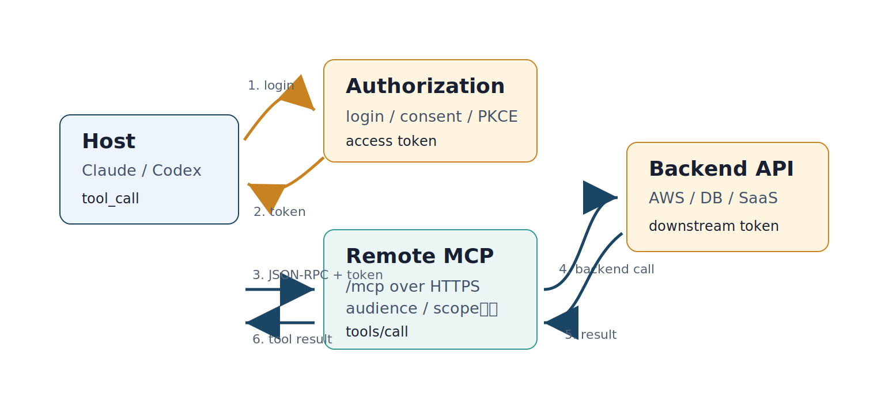
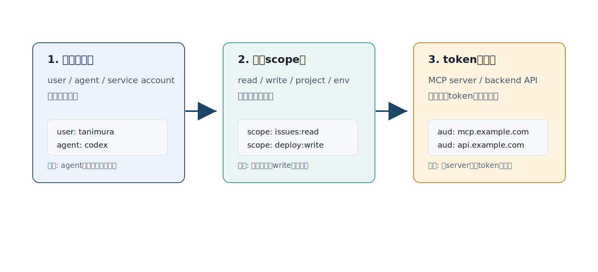
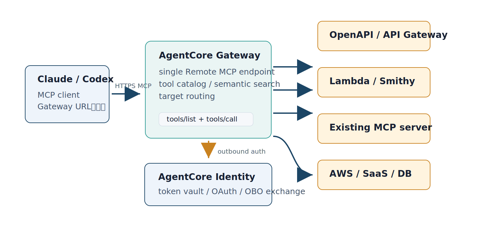
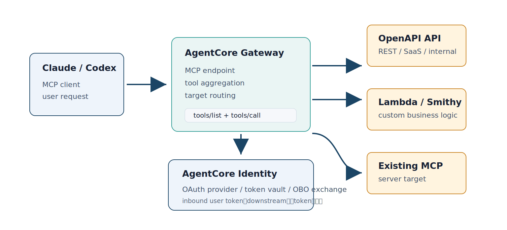
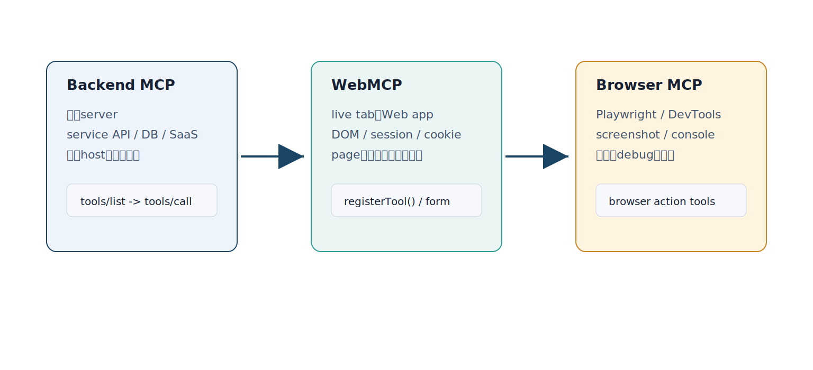
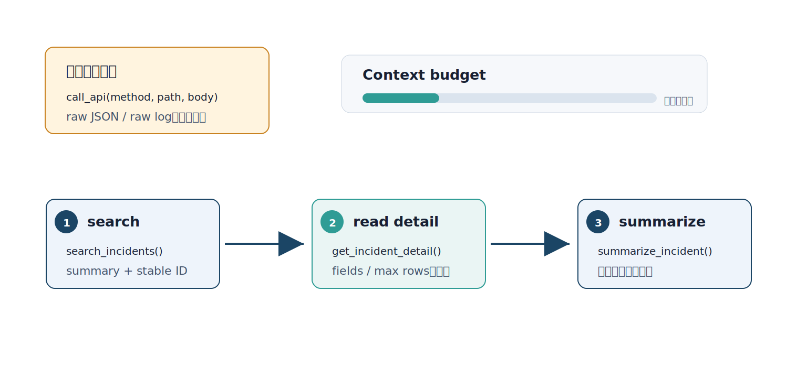

# 後半スライド図解メモ

このページは、後半スライドに追加した説明画像の選定理由と読み方をまとめる。後半はRemote MCP、認証、AWS Gateway、WebMCP、運用設計など、境界と責務が多くなるため、文章や表だけでは初学者が「何を区別しているのか」を見失いやすい。

## 追加箇所の選定

| 対応スライド | 追加画像 | 図解した理由 |
|---|---|---|
| 認証付きRemote MCPの全体構成 | `authenticated-remote-mcp-architecture.svg` | Remote MCPを認証付きで使う前提として、Host、Authorization Server、Remote MCP Server、Backend APIの4者関係を先に見せる。 |
| Remote authで覚える3点 | `remote-auth-boundary.svg` | OAuth、scope、audienceが用語として並ぶだけだと、何を守る仕組みなのかが見えにくい。権限の持ち主、scope、tokenの宛先を3つの境界として見せる。 |
| AWSでRemote MCPを構築する構成 | `aws-agentcore-remote-mcp-architecture.svg` | AWS章の入口として、AgentCore Gateway、AgentCore Identity、targets、backend servicesの接続関係を一枚で示す。 |
| GatewayとIdentityが補うもの | `agentcore-gateway-identity-map.svg` | GatewayとIdentityがどちらも「認証っぽいもの」に見えるため、GatewayはMCP入口とrouting、Identityはcredentialと委任管理と分ける。 |
| WebMCPとは何を読む仕組みか | `webmcp-surface-map.svg` | WebMCPをMCPの置き換えとして誤解しやすい。backend MCP、WebMCP、Browser MCPを横並びにし、読む対象と用途の違いを示す。 |
| コンテキスト効率を意識したMCP設計 | `context-efficiency-pipeline.svg` | 「token-aware」が抽象的に見えるため、raw dumpを避け、search -> detail -> summarizeへ分ける実装上の型として示す。 |

## 認証付きRemote MCPの全体構成

この図は、認証付きRemote MCPを使う前提構成を示す。HostはAuthorization Serverでlogin/consentを経てaccess tokenを取得し、HTTPS上のRemote MCP ServerへJSON-RPC requestを送る。Remote MCP Serverはtokenのaudienceとscopeを検証し、必要に応じてbackend APIやSaaSへdownstream tokenでアクセスする。

初学者向けには、OAuthの細かい用語より先に「誰がtokenを持ち、どのserverへ送り、backendにはどのtokenで入るか」を見る方が理解しやすい。

## Remote authで覚える3点

この図は、Remote MCPの認証を「誰の権限か」「どのscopeか」「tokenの宛先はどこか」の3点へ圧縮する。初学者にとってOAuthやOIDCの用語は先に出すと重いため、先に事故の形を示す。

- 誰の権限か: user、agent、service accountを混ぜない。
- どのscopeか: read/writeや対象projectを絞る。
- tokenの宛先: MCP server向けtokenとbackend API向けtokenを混同しない。

## AWSでRemote MCPを構築する構成

この図は、AWSでRemote MCPを構築する場合の大枠を示す。AgentCore GatewayはRemote MCP endpointを提供し、OpenAPI/API Gateway、Lambda/Smithy、既存MCP server、AWS services/SaaS/DBなどのtargetへroutingする。AgentCore Identityはtoken vault、OAuth、OBO exchangeを担い、Gatewayから各targetへ出るoutbound authを支える。

スライドでは、Gatewayを「MCP endpointを作る入口」、Identityを「credentialと委任tokenを管理する基盤」として分ける。

## GatewayとIdentityが補うもの

この図は、AgentCore GatewayとAgentCore Identityの責務を分ける。GatewayはMCP endpoint、tool aggregation、target routingを担当する。IdentityはOAuth provider、token vault、OBO exchangeなど、credentialと委任境界を扱う。

スライドでは詳細なAWS手順よりも、GatewayがMCP入口を作り、Identityがdownstream tokenを安全に扱うという分担を優先して伝える。

## WebMCPとは何を読む仕組みか

この図は、WebMCPをMCPの代替ではなく、Web UI側の補完として位置づける。backend MCPは永続serverやservice APIを公開する。WebMCPはlive tab内のWeb app、DOM、session、cookie、page-local toolをbrowser agentへ見せる。Browser MCPはPlaywrightやChrome DevToolsのように、実ブラウザを検証・debugするための接続面になる。

## コンテキスト効率を意識したMCP設計

この図は、context効率を抽象論ではなくtool設計の順序として示す。避けたいのは、汎用`call_api(method, path, body)`でraw JSONやraw logをすべて返す設計。代わりに、検索でstable IDを返し、必要なfieldだけ詳細取得し、最後に次の判断に使えるsummaryへ落とす。

MCPでは、tool一覧、description、schema、実行結果、error、logもmodel contextに入る。したがって、結果を小さくするだけでなく、tool catalog自体を増やしすぎないことも設計対象になる。
