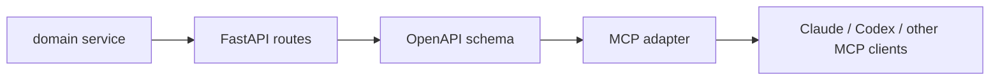
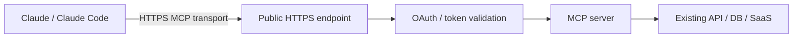
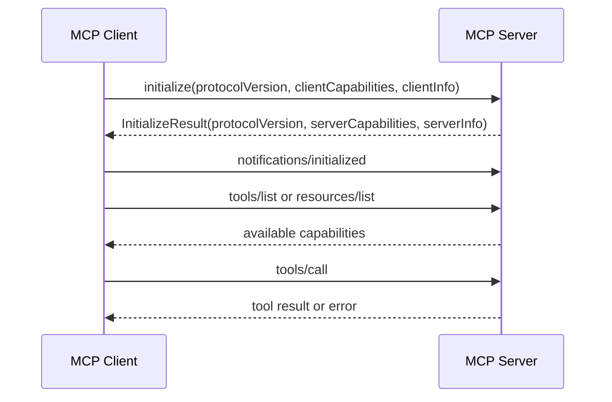
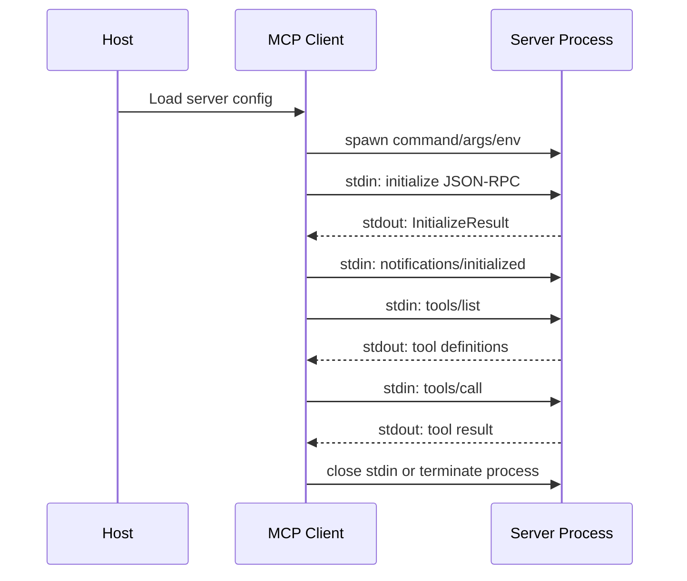
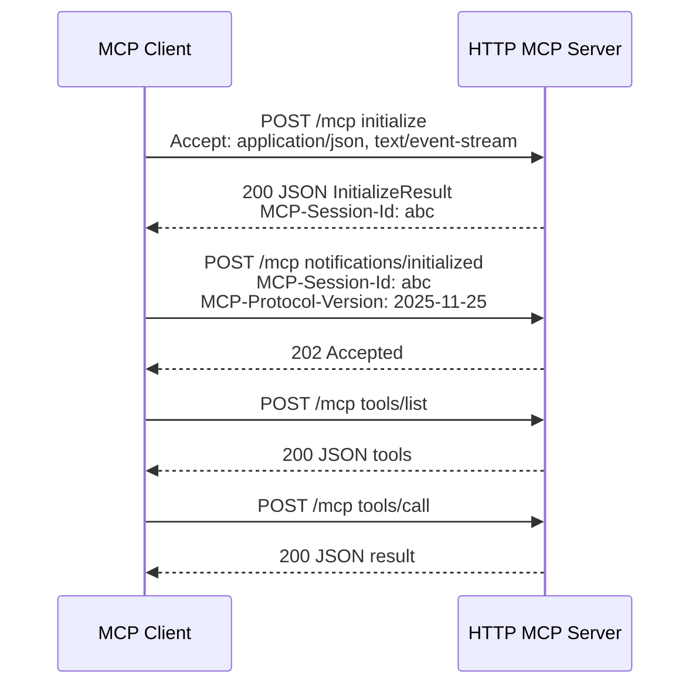
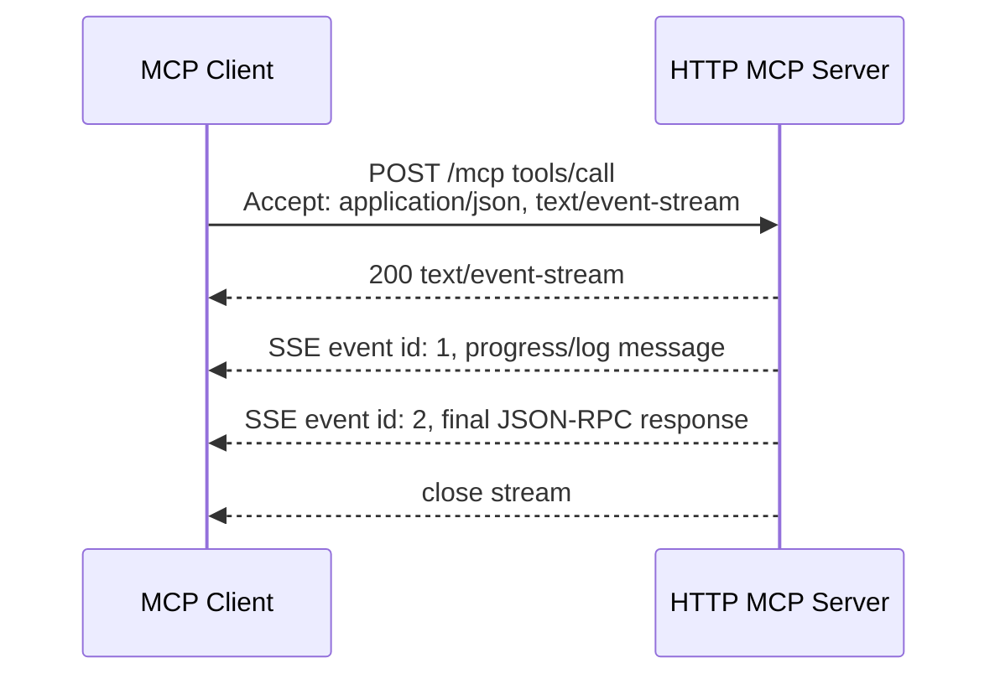
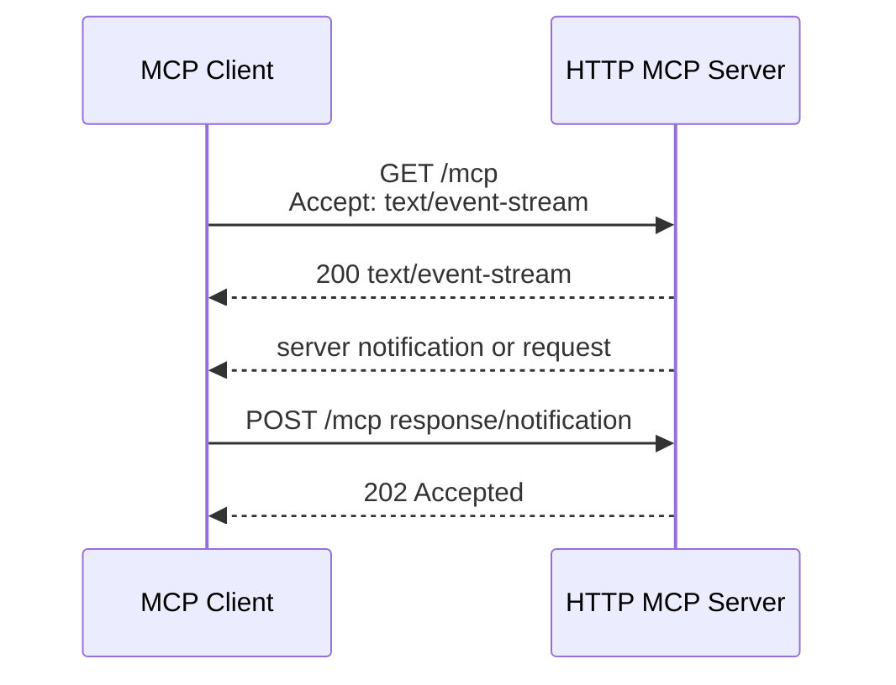
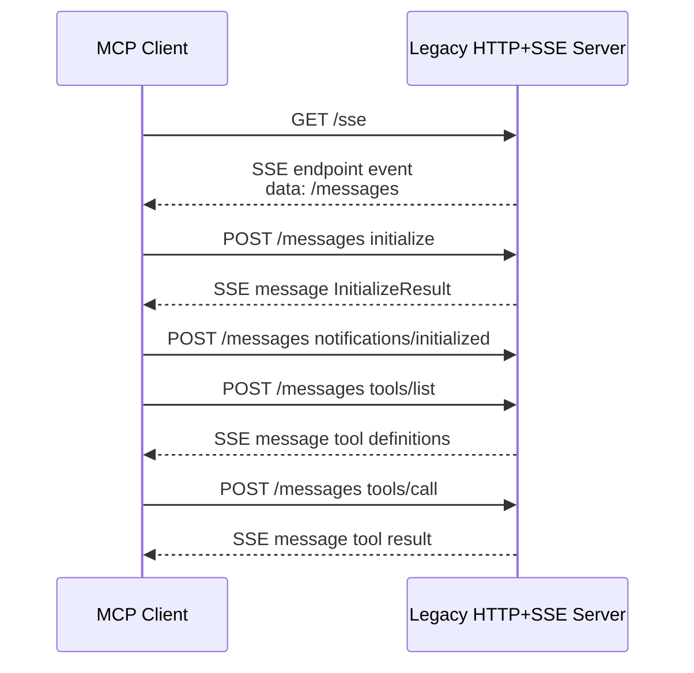
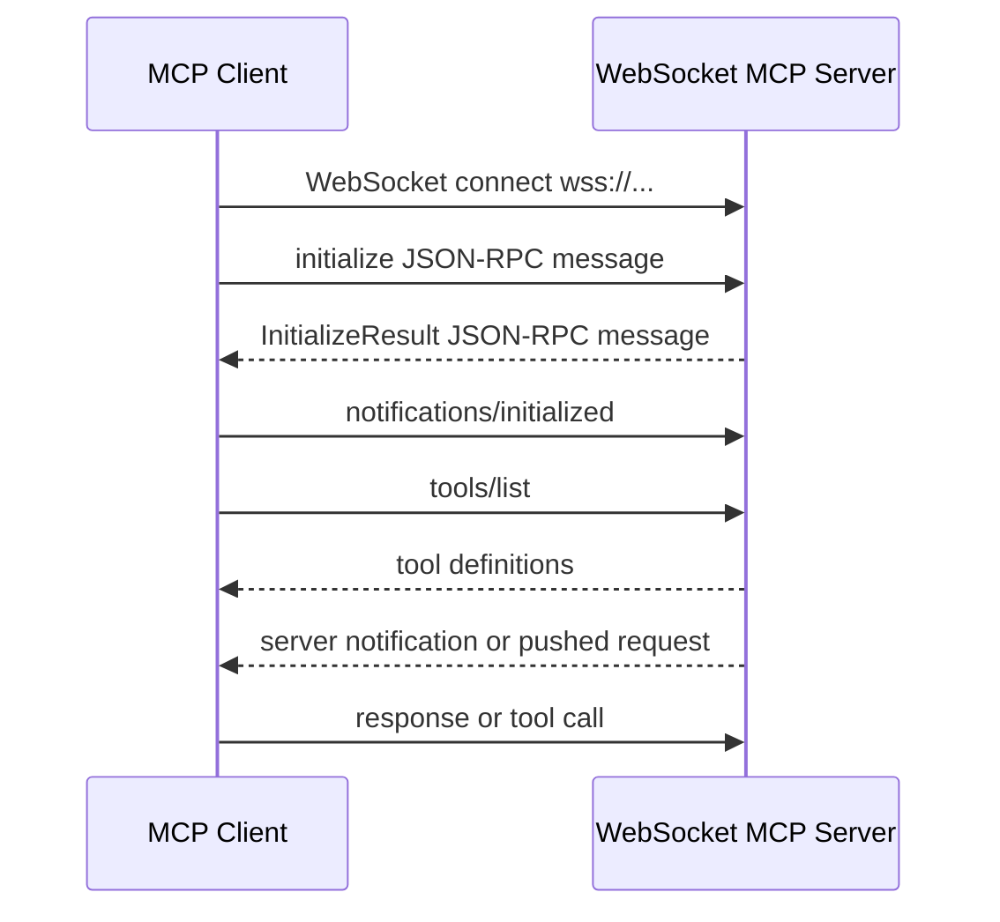

# MCP調査メモ

日付: 2026-06-07
最終整理: 2026-06-09

このメモは日付順ではなく、MCPを理解しやすい順へ再編成している。先に結論と全体像を確認し、その後に基礎概念、比較、実装、仕様詳細、エコシステム、ロードマップへ進む。

## このメモの読み方

- まず「結論と理解の流れ」で、MCPについて何を押さえるべきかを把握する。
- 次に「MCPの基礎理解」で、問題設定、定義、Host / Client / Server、Resources / Prompts / Tools、呼び出しの流れを順番に押さえる。
- その後、「外部操作surface」「server設計」「Protocol/Auth」「Use case」「Roadmap」の順に深掘りする。
- 概念説明は、問題 -> 定義 -> 構成要素 -> primitive -> 呼び出し -> transport/auth -> 設計 -> 比較 -> ecosystemの順に読む。
- 要約に近い内容は前半、裏取りや詳細仕様は中盤以降に置く。


## 調査方針と一次情報

### 調査方針

これは正式なacademic literature reviewではなく、technical specification reviewとecosystem surveyを組み合わせた調査メモ。一次情報を優先した。

- MCP official docs/specification: https://modelcontextprotocol.io/
- Anthropic launch post: https://www.anthropic.com/news/model-context-protocol
- OpenAI API docs for remote MCP/connectors: https://developers.openai.com/api/docs/guides/tools-connectors-mcp
- GitHub MCP docs/repo: https://docs.github.com/en/copilot/how-tos/provide-context/use-mcp-in-your-ide/use-the-github-mcp-server and https://github.com/github/github-mcp-server
- Stripe MCP docs: https://docs.stripe.com/mcp
- MCP reference servers/registry: https://github.com/modelcontextprotocol/servers and https://github.com/modelcontextprotocol/registry
- MCP build server/client guides: https://modelcontextprotocol.io/docs/develop/build-server and https://modelcontextprotocol.io/docs/develop/build-client
- FastMCP documentation: https://github.com/jlowin/fastmcp
- FastAPI OpenAPI documentation: https://fastapi.tiangolo.com/how-to/extending-openapi/
- Claude Remote MCP / custom connectors: https://support.claude.com/en/articles/11175166-get-started-with-custom-connectors-using-remote-mcp and https://code.claude.com/docs/en/mcp
- Chrome WebMCP comparison: https://developer.chrome.com/docs/ai/webmcp/compare-mcp?hl=ja
- Playwright MCP: https://github.com/microsoft/playwright-mcp
- Chrome DevTools MCP: https://github.com/ChromeDevTools/chrome-devtools-mcp
- AWS MCP Server GA / Agent Toolkit: https://aws.amazon.com/blogs/aws/the-aws-mcp-server-is-now-generally-available/ and https://aws.amazon.com/products/developer-tools/agent-toolkit-for-aws/
- AgentCore Gateway / Identity: https://docs.aws.amazon.com/bedrock-agentcore/latest/devguide/gateway-core-concepts.html, https://docs.aws.amazon.com/bedrock-agentcore/latest/devguide/gateway-target-MCPservers.html, and https://docs.aws.amazon.com/bedrock-agentcore/latest/devguide/on-behalf-of-token-exchange.html
- JSON-RPC 2.0 specification: https://www.jsonrpc.org/specification
- MCP lifecycle/tools/transports/sampling specification pages: https://modelcontextprotocol.io/specification/2025-11-25/basic/lifecycle, https://modelcontextprotocol.io/specification/2025-11-25/server/tools, https://modelcontextprotocol.io/specification/2025-11-25/basic/transports, and https://modelcontextprotocol.io/specification/2025-11-25/client/sampling
- Anthropic tool use docs: https://platform.claude.com/docs/en/agents-and-tools/tool-use/overview and https://platform.claude.com/docs/en/agents-and-tools/tool-use/define-tools
- OpenAI function-calling fine-tuning cookbook and RFT guide: https://developers.openai.com/cookbook/examples/fine_tuning_for_function_calling and https://developers.openai.com/api/docs/guides/reinforcement-fine-tuning
- OpenAI function calling, structured outputs, and MCP connectors: https://developers.openai.com/api/docs/guides/function-calling, https://developers.openai.com/api/docs/guides/structured-outputs, https://openai.com/index/introducing-structured-outputs-in-the-api/, https://developers.openai.com/api/docs/guides/tools-connectors-mcp
- MCP authorization and changelog: https://modelcontextprotocol.io/specification/2025-11-25/basic/authorization and https://modelcontextprotocol.io/specification/2025-11-25/changelog
- Hugging Face Agents Course function-calling fine-tuning note: https://huggingface.co/learn/agents-course/en/bonus-unit1/fine-tuning
- GitHub repository star counts: fetched via GitHub REST API on 2026-06-07.


## 結論と理解の流れ

### 1枚で伝える主張

MCPは、AI agentと外部システムの間に入る標準interface layerになりつつある。価値の中心は「toolを増やすこと」ではない。discovery、permission、context交換、tool実行、将来のmulti-client interoperabilityを同じprotocolで扱えることにある。

短い言い換え:

> MCPはAI applicationにとってのUSB-C的connector。ただしUSB-Cにはないsecurity、consent、protocol lifecycleの論点を含む。

### 要点

MCPの要点は6つに圧縮できる。

1. MCPはagentがexternal context/actionへ接続する方法を標準化する。
2. architectureはHost -> isolated Client -> Server。
3. core primitiveはResources、Prompts、Tools。
4. transportはlocal stdioとremote Streamable HTTPに分かれる。
5. production MCPの中心はtrust: OAuth、consent、scope、auditing、server allowlist。
6. 今後はregistry + remote servers + MCP Apps + durable agent tasks。

### 概念説明の推奨順序

MCPを順番に理解するなら、次の順序がよい。

1. LLMは外部システムを知らない、だから接続規約が必要。
2. MCPはAIアプリと外部システムをつなぐ標準protocol。
3. Host / Client / Serverで責務を分ける。
4. Resources / Tools / Promptsで「読む・実行する・作業テンプレート」を分ける。
5. stdio / Streamable HTTPでlocalとremoteを分ける。
6. Authとconsentがproductionの本体。
7. 既存APIはOpenAPIを整えてMCP adapterで公開する。
8. descriptionはモデル向けのUIとして設計する。
9. WebMCPとブラウザ操作MCPでfrontendもagent対応する。
10. AWS MCPやGitHub MCPなど、開発workflowに効くMCPから導入する。
11. 最後にリスク、管理、ロードマップを説明する。

### 推奨理解順序

MCPは、周辺技術の列挙ではなく、問題設定から実装・運用判断へ順に進むと理解しやすい。

1. MCPが必要になる背景: agentにはlive data、tool、workflow、governanceが必要。
2. MCPの定義: open protocol、JSON-RPC、capability negotiation。
3. 基本構造: Host / Client / Server。
4. 基本primitive: Resources / Prompts / Tools。
5. Runtime flow: initialize -> discover -> approve -> call -> return。
6. Transport: local stdioとremote Streamable HTTP。
7. Auth: OAuth 2.1、Protected Resource Metadata、Resource Indicators、PKCE。
8. 設計: 既存APIをagent向けtool surfaceへ絞る。
9. 運用: scope、approval、audit、server allowlist、token効率。
10. Ecosystem: GitHub、Stripe、OpenAI connector、registry、reference server。
11. Skill + MCP: 手順と外部操作を分離し、反復workflowを安定させる。
12. Future points: registry、remote MCP、auth maturity、MCP Apps、durable tasks。

### 初心者視点レビューと構成見直し

対象読者を「LLMやAPIは知っているが、MCPを実装したことはない人」まで広げてレビューした。主要な問題は、MCPそのものの説明より前にAgent Skills、Remote設定、token効率、provider視点などが出て、初学者が何の地図を見ているかを失いやすい点だった。

#### 現行仕様の確認

2026-06-09時点の公式仕様ページでは、MCPのCurrent protocol versionは`2025-11-25`とされている。したがって、既存メモの仕様参照を`2025-11-25`中心に置く前提は維持した。一方で、draftやroadmapには拡張仕様、Tasks、Apps、transport scalabilityなどの情報があるため、基礎理解では詳細を追いすぎず「client supportとfallback確認が必要」という導入上の読み方に圧縮する。

- Current specification/versioning: https://modelcontextprotocol.io/specification
- Current basic overview: https://modelcontextprotocol.io/specification/2025-11-25/basic
- Transports: https://modelcontextprotocol.io/specification/2025-03-26/basic/transports
- 2026 roadmap: https://blog.modelcontextprotocol.io/posts/2026-mcp-roadmap/

#### 初学者レビュー表

| 対象箇所 | Issue | Why it blocks beginners | Suggested fix / reflected change |
|---:|---|---|---|
| 2 | 冒頭に全体像がなく、用語が個別に出てくる | Host、Client、Server、Tool、Transportを別々に覚える話に見える | `MCPの全体地図`を追加し、User -> Host -> MCP Server -> Backendの主線を先に見せる |
| 3 | MCPの一文定義が遅い | 「結局MCPとは何か」が分からないまま比較や周辺概念へ進む | `まず一文でいうと`を追加し、MCPを「AIアプリが外部systemを安全に使うための共通ルール」と定義 |
| 5 | 通し例がない | 抽象概念が続き、後続のCLI/Browser/MCP比較が何を比べているのか弱い | `失敗CIを調べる`例を追加し、以後の比較・tool call・workflowの基準にする |
| 4 | `agent-native`が抽象的 | 初学者には「何がnativeなのか」が分からない | 「AIが迷わず呼べる入口」と言い換え、難語は必要な箇所だけ残す |
| 6 | 章立てが情報の列挙になっていた | 読者が各章で何を得るかを予測できない | 流れを「埋めるピース」と「ここでわかること」の表へ変更 |
| 8 | Agentの定義が薄い | Agentがmodelそのものなのか、実行主体なのか混同する | 「LLMが手順を考え、toolを選び、結果を見て次へ進む実行主体」と明記 |
| 11 | Promptがuser promptと混同される | MCP Promptを通常の入力文と誤解しやすい | 「serverが公開する再利用template」と注記を追加 |
| 12 | ProtocolとTransportの違いが抽象的 | どちらも通信の話に見え、JSON-RPC/Auth章で迷う | 郵便のたとえを追加し、Protocol=書式と手続き、Transport=運び方と説明 |
| 13 | MCP呼び出しの時間順が見えない | tools/list、LLM tool call、tools/callの関係が後半まで分からない | `MCPの1回の呼び出し`を追加し、Hostが接続・承認・実行を仲介することを先に説明 |
| 14 | SkillsがMCPの一部に見える | SkillとMCPの責務境界が曖昧になる | Skills説明を冒頭から基本概念後へ移動し、`Skill = how to proceed / MCP = what to access or execute`を明記 |
| 20 | Token効率の表とグラフが重複 | 数値の多さで主張がぼやける | 詳細表を削除し、グラフと公開例に絞って「MCPでもtool catalog設計を誤ると重い」を残す |
| 34-37 | Remote MCP設定がコマンド集に寄る | 登録手順の暗記になり、Remote MCPの意味が薄れる | CLI設定例、APM、VS Code詳細、組織設定詳細を削り、Remoteの全体像、OAuth、設定レイヤー、client差分に絞る |
| 39-49 | Protocol/Auth/JSON-RPCが深い | 先に実装例を見ていないと、抽象protocolの話が重い | 章位置は構築/Remote後に残し、基本用語は前段で軽く説明する構成にした |
| 56-63 | WebMCP、Figma、Serenaなどが広がりすぎる | MCP理解の本筋から「便利tool紹介」へ逸れやすい | WebMCP実装コードを削除し、MCPとの違い・開発workflowでの位置づけに限定 |
| 64以降 | 最新仕様、Apps、Tasks、ロードマップが情報過多 | 初学者にはMCPの核と将来拡張が混ざる | Apps/UI/Tasks/roadmap詳細を削り、trust boundary、設計ルール、社内導入、まとめに絞る |

#### 推奨フロー

今回のデッキは次の理解順に合わせる。

1. **地図**: User、Host、MCP Client、MCP Server、Backendの主線を見る。
2. **定義**: MCPはAI applicationと外部systemの接続契約だと押さえる。
3. **部品**: Host/Client/Server、Tool/Resource/Prompt、Protocol/Transportを分ける。
4. **責務分離**: Skillは手順、MCPは外部data/actionの契約と分ける。
5. **比較**: CLI、Browser、MCPを同じ作業例で比べ、MCPを選ぶ条件を理解する。
6. **構築**: 既存APIをsource of truthにして、MCP adapterで公開面を絞る。
7. **運用**: Remote、auth、scope、quota、audit、tool catalogを設計対象として見る。
8. **導入**: read-onlyから始め、workflowとガバナンスを小さく固める。

#### Cut candidates moved out of main story

以下は技術的には有用だが、初学者向け中心説明では理解の階段を壊しやすいため削除または研究メモ/参照リンク扱いにした。

- Agent Skillsの`SKILL.md`/`scripts`/`references`/`assets`詳細
- Claude Code登録手順の全コマンド、Claude.ai Connector手順、VS Code具体設定、APM例
- Token効率の詳細レンジ表
- WebMCPのJavaScript/HTML実装コード
- MCP Apps、Tasks、elicitation、sampling、公式ロードマップ詳細
- provider側のtool-calling学習/structured outputs/fine-tuning一覧

#### Phrase rewrites

| Before | After | Reason |
|---|---|---|
| agent-nativeな接続面 | AIが迷わず呼べる入口 | 抽象語を具体化する |
| Skillもscriptで外部接続を伴う処理を実行できる | Skillは手順を持つ。MCPは外部systemの契約を持つ | まず責務を分ける |
| descriptionはmodel input token | descriptionはドキュメントではなく、modelがtoolを選ぶための短い判断材料 | 初学者にtoken消費より先に用途を伝える |
| protocol / transport | protocolは書式と手続き、transportは運び方 | 通信概念を分解する |
| MCPはagent時代のintegration layer | MCPはAI向けの安全な接続メニューを作る標準 | まとめで具体的に覚えられる表現へ寄せる |

#### 反復レビュー記録

| Iteration | Review lens | Finding | Change |
|---:|---|---|---|
| 1 | Overall story | 冒頭で地図がなく、用語列挙に見える | 概念図を冒頭へ追加 |
| 2 | One-sentence definition | MCPの定義が遅い | 一文定義説明を追加 |
| 3 | Flow promise | 「何を順に埋めるか」が弱い | 本日の流れをピース表に変更 |
| 4 | First-principles order | 歴史と周辺エコシステムが基本部品より先に来る | Timeline / AI Agent潮流を中心説明から削除 |
| 5 | Missing premise | Agentがmodelそのものに見える | Agentを実行主体として再定義 |
| 6 | Term collision | MCP Promptとuser promptが混同される | Promptの注記を追加 |
| 7 | Concept split | Protocol / Transportが同じ通信概念に見える | 郵便のたとえを追加 |
| 8 | Skill confusion | SkillsがMCPの一部に見える | Skill/MCPの違いを基本概念後へ移動 |
| 9 | Abstract wording | `agent-native`などが抽象的 | 「AIが迷わず呼べる入口」に言い換え |
| 10 | Token load | Token比較が数値表と公開例で重複 | 公開例を削除し、概念グラフへ集約 |
| 11 | Unstable data | GitHub starsはすぐ古くなる | stars表を削除し、用途別選定表へ変更 |
| 12 | Quota data drift | Figma rate limitの具体値が変わり得る | 具体数値を削除し、quota設計の観点表へ変更 |
| 13 | Command overload | OAuth登録コマンドが多く、何を覚えるべきか不明 | OAuthは「誰の権限・どのserver・どのscope」へ圧縮 |
| 14 | Auth load | auth用語表が3枚続き、初学者には重い | Remote authで覚える3点へ統合 |
| 15 | Code bridge | 実装例がなぜ必要か弱い | 「既存APIをsource of truthにしてMCPで公開面を絞る」流れを明示 |
| 16 | Governance framing | セキュリティが最後の注意事項に見える | trust boundaryを導入判断の中心に置く |
| 17 | Workflow framing | MCPを単体tool紹介に見せやすい | Skillに利用順を書く、という実務導入へ接続 |
| 18 | Beginner density | 最新仕様やApps詳細が核の理解を邪魔する | 中心説明から詳細を削り、client support/fallbackだけ残す |
| 19 | Source stability | Current specが古い可能性を確認する必要 | 公式Current versionを追加確認し、調査メモへ追記 |
| 20 | Layout integrity | 新規概念図とdense化でoverflowが出る可能性 | HTML render + screenshot + DOM overflowで検証 |
| 21 | Final message | まとめが抽象的 | 「AI向けの安全な接続メニューを作る標準」に統一 |
| 22 | Appendix boundary | Referencesは中心理解には不要だが監査に必要 | Referencesは追跡用に残す |
| 23 | Running example | 各章の例がばらけて記憶に残りにくい | 失敗CI調査を冒頭に置き、比較章のCI調査フローへ接続 |
| 24 | Lifecycle clarity | 中級者にはtool callの実行境界が物足りない | `Host -> tools/list -> LLM proposal -> approval -> tools/call -> structured result`を明示 |
| 25 | Design judgment | 中級者には「何を避けるべきか」が足りない | `call_api` mega-tool、raw result、read/write混在などのアンチパターンを追加 |
| 26 | Adapter depth | OpenAPI変換が自動生成だけに見える | MCP serverは公開範囲、description、schema、出力制限を担うadapterだと補強 |

#### 完了確認

| Requirement | Evidence | Status |
|---|---|---|
| 初学者が順番に理解できる | 前半で概念図、一文定義、結論、通し例、流れを提示。基礎理解章で基本用語、1回の呼び出し、Skill/MCPの違いを説明。 | Proved by current memo structure |
| 抽象語や前提が説明されている | `agent`, `Host`, `Client`, `Server`, `Tool`, `Resource`, `Prompt`, `Protocol`, `Transport`, `Auth`を基礎理解章で定義。レビュー表で抽象語の言い換えを記録。 | Proved by 本文とレビュー記録 |
| 中級者にも骨太な理解がある | 設計章でMCP server設計、アンチパターン、route policy、description設計を扱う。Protocol/Auth章でtransport/auth/JSON-RPC/tool-call境界を扱う。運用ルール章でtrust boundary、server設計ルール、context効率を扱う。 | Proved by coverage in current memo |
| 冒頭の概念図からピースを埋める流れ | 概念図と、流れを整理するピース表。各章がHost/Client/Server、Tool/Resource/Prompt、Transport/Auth、Workflow/Governanceへ対応。 | Proved by memo sequence |
| 冗長・変動しやすい情報が整理されている | GitHub stars、Figma rate limit具体値、MCP Apps/Tasks詳細、長いCLI設定例を中心説明から削除し、レビュー記録にcut candidatesを明記。 | Proved by review notes |
| 調査情報が追跡できる | Current specification確認、source links、research memoを保持。 | Proved by research memo and source links |
| レビュー観点が再利用可能 | `.agents/skills/beginner-slide-reviewer/SKILL.md`を追加し、初学者視点のレビュー軸と出力形式を定義。 | Proved by skill file |
| future agentがrepo構成を把握できる | `AGENTS.md`にREADME/docs由来の概要、content architecture、commands、local skillsを集約。 | Proved by AGENTS.md |
| レンダリング品質 | 関連するHTMLとMarkdownの生成確認を維持。 | Proved by command output |
| repo validation | `npm test` passes 4 tests. `npm run build:site` builds 6 pages and generated HTML. | Proved by command output |

### 全体構成レビューと締めの再設計

今回の追加レビューでは、Referencesを除く本編73ページを対象に、各ページの内容抜粋と前後の流れを確認した。問題は前半の概念順ではなく、後半が「開発向けMCPの具体例」から「今後の争点」へ移るときに、何を最終判断として回収するのかが見えにくい点だった。

#### ページ別抜粋レビュー

| Page | 抜粋 | 流れの判定 / 違和感 | 見直し方 |
|---:|---|---|---|
| 1 | MCP概論。外部systemを安全に使う接続面を概念地図から理解する。 | OK。ゴールは明確。 | 維持。 |
| 2 | MCPの全体地図。User -> Host -> MCP Server -> Backendを見る。 | OK。先に全体地図を出す方針に合う。 | 維持。 |
| 3 | LLMが外部systemへ出る入口。 | OK。MCP以外の入口も先に置くことで比較の土台になる。 | 維持。 |
| 4 | MCPはAIアプリが外部システムを安全に使う共通ルール。 | OK。定義が早く、後続の用語説明に入れる。 | 維持。 |
| 5 | 今日の結論。外部操作、安全性、定型化、制限を述べる。 | OK。ただし最後でこの4点を回収しないと散る。 | 締めで「任せる/見せる/守る/運用する」に再集約。 |
| 6 | 失敗CIを調べる通し例。 | OK。抽象概念を比較章へつなぐ役割。 | 維持。 |
| 7 | 本日の流れ。ピースを順に埋める。 | OK。初学者が章の意味を予測できる。 | 維持。 |
| 8-16 | 基本概念。Agent、Host、Client、Server、Tool、Resource、Prompt、Protocol、Transport、Skill/MCPを定義。 | OK。用語が登場する場所と責務を先に揃えている。 | 維持。 |
| 17-26 | CLI / Browser / MCPを比較し、CI調査例で利用フローを見る。 | OK。概念から判断軸へ自然に移る。 | P25の「向かない場面」を後半の導入判断へ回収する。 |
| 27-35 | 既存APIをMCP化する設計、アンチパターン、OpenAPI/FastMCP例、description設計。 | OK。実装例は濃いが、adapterとして公開面を絞る主張に沿う。 | 維持。 |
| 36-40 | Remote MCP、OAuth、複数Agent設定、clientごとの差分。 | P2。具体設定が手順暗記に寄りやすい。 | Remote MCPの意味と設定レイヤーの分離を強調する。 |
| 41-52 | Transport、認証付きRemote構成、JSON-RPC、tools/list、LLM tool call、fine-tuning要否。 | OK。Remote後に中身を見る流れは自然。 | LLMがMCPを直接叩かない境界説明を維持。 |
| 53-57 | AWS MCP / AgentCore Gateway / Identityのケーススタディ。 | OK。Remote MCPを運用構成へ具体化している。 | 維持。 |
| 58-66 | WebMCP、Browser MCP、Figma、Serenaなど開発向けMCP。 | P1。ここで終わると「便利MCP紹介」で終わって見える。 | 次章で「どの業務を任せるか」という導入判断へ橋渡しする。 |
| 67 | ガバナンスと導入。旧: 争点、ロードマップ、社内展開へ広げる。 | P1。具体例の後に急に論点が広がり、締めの焦点がぼやける。 | 「ここまでの概念を、導入判断と運用設計へ回収する」に変更。 |
| 68 | 旧: 今後の争点。server trust、metadata、auth boundary、registry、stdio、large catalogなど。 | P1。争点の羅列から始まるため、聴講者が何を判断すべきか分かりにくい。 | 「導入前に決める5つの判断」へ変更。対象業務、公開面、権限、信頼、workflow予算へ集約。 |
| 69 | 旧: MCP server設計の重要ルール。8項目の箇条書き。 | P1。重要だが、前ページの争点と重なり、最後がチェックリストの羅列に見える。 | 「公開する前に絞る」「結果を小さく返す」「tokenを混ぜない」「運用で止められる」の4分類へ変更。 |
| 70 | コンテキスト効率を意識したMCP設計。 | OK。P69の「結果を小さく返す」を図で補強する。 | 維持。 |
| 71 | 旧: 社内導入の進め方。 | P2。「社内発表」を意識した文脈に見える。 | 「導入の進め方」に変更し、一般的な導入手順へ。 |
| 72 | 最後に残る争点。server trust、tool metadata、auth boundary、tool catalog。 | OK。未来の争点を短く触れる位置として妥当。 | 締めそのものではなく、導入判断後に残る論点として配置。 |
| 73 | 旧: まとめ: MCPで覚えること。接続契約、公開面、権限境界、Workflow化。 | P1。内容は良いが、最終的な判断文脈が弱い。 | 「まとめ: MCPで判断すること」に変更。何を任せるか、何を見せるか、どこで守るか、どう運用するかへ再構成。 |

#### 1ページずつ再レビュー

| Page | そのページの価値 | 前後接続の評価 | 修正判断 |
|---:|---|---|---|
| 1 | deckの主題を「外部systemへの接続面」として置く。 | P2の全体地図に自然につながる。 | 維持。 |
| 2 | User/Host/Server/Backendの大枠を先に見せる。 | P3でMCP以外の外部入口を見ても迷いにくい。 | 維持。 |
| 3 | MCPを単独技術ではなく外部操作surfaceの一種として置く。 | P4の一文定義の前提になる。 | 維持。 |
| 4 | MCPの定義を短く固定する。 | P5の結論を理解するためのanchorになる。 | 維持。 |
| 5 | deck全体の持ち帰りを先に提示する。 | P6の通し例で抽象主張を具体化できる。 | 維持し、最後で回収する。 |
| 6 | 失敗CI調査という共通例を置く。 | P7の章立てが「この例をどう分解するか」に見える。 | 維持。 |
| 7 | どのピースを順に埋めるかを明示する。 | P8の基本概念章へ自然に入れる。 | 維持。 |
| 8 | 基本概念の章扉として責務整理を予告する。 | P9の用語表への入口として必要。 | 維持。 |
| 9 | Agent/Host/Client/Serverの混同を防ぐ。 | P10のMCP定義を構成要素に分解できる。 | 維持。 |
| 10 | MCPの公開面/通信面/保護面を一枚で定義する。 | P11から責務を細分化する準備になる。 | 維持。 |
| 11 | Host/Client/Serverの責務を図で固定する。 | P12の公開面/通信面の説明が理解しやすくなる。 | 維持。 |
| 12 | Tool/Resource/PromptとProtocol/Transportがどこで登場するかを示す。 | P13/P14の細部説明の前提として有効。 | 維持。 |
| 13 | Serverが公開するprimitiveを定義する。 | P14の通信面と対になる。 | 維持。 |
| 14 | Protocol/Transport/Auth/JSON-RPCの違いを分ける。 | P15の1回の呼び出しへ時間順で接続できる。 | 維持。 |
| 15 | Host仲介の実行loopを示す。 | P16のSkill/MCP責務分離が理解しやすい。 | 維持。 |
| 16 | Skillは手順、MCPは外部接続という境界を示す。 | P17から比較章へ移ってもMCP単体論に閉じない。 | 維持。 |
| 17 | 比較章の扉として使い分けを予告する。 | P18の「なぜ必要か」に自然につながる。 | 維持。 |
| 18 | MCPが必要な問題を再定義する。 | P19の比較軸の根拠になる。 | 維持。 |
| 19 | CLI/Browser/MCPを人間向けかagent向けかで分ける。 | P20/P21のQ&Aを読む軸になる。 | 維持。 |
| 20 | CLIの強みと限界を具体化する。 | P21のBrowser比較と並列に読める。 | 維持。 |
| 21 | Browser操作の強みと限界を具体化する。 | P22のtoken/context話に進む前に不安定性を説明できる。 | 維持。 |
| 22 | token使用量はMCP設計にも影響することを示す。 | P23の安定化理由に接続するが、数値が主役化しやすい。 | 主張文を中心に維持。 |
| 23 | 宣言済みcapabilityが安定性を作ると説明する。 | P24のCI利用フローに自然につながる。 | 維持。 |
| 24 | CLI/Browser/MCPを同じCI例で比較する。 | P25の「向かない場面」の判断に効く。 | 維持。 |
| 25 | MCPを選ばない場面を示し、万能感を抑える。 | P26のprovider視点へ進む橋になる。 | 後半で導入判断へ回収。 |
| 26 | provider controlという提供者視点を足す。 | P27のserver構築章へ自然に入れる。 | 維持。 |
| 27 | server構築章の扉。 | P28でadapter設計へ進む。 | 維持。 |
| 28 | 既存APIを壊さずadapterを置く設計を示す。 | P29の流れ図に接続する。 | 維持。 |
| 29 | OpenAPIをsource of truthにし公開面を絞る流れを示す。 | P30のアンチパターンが理解しやすい。 | 維持。 |
| 30 | call_api型やraw結果など避ける設計を明示する。 | P31/P32の実装例の読み方を制限できる。 | 維持。 |
| 31 | FastAPI/OpenAPIから契約を再利用する実装例。 | P32とセットで読む必要がある。 | 維持。ただしコード例は深追いしない。 |
| 32 | FastMCPでtool/resourceとして公開する実装例。 | P33のroute policy注意へ自然につながる。 | 維持。 |
| 33 | OpenAPIをそのまま出しすぎない判断を示す。 | P34のdescription設計へつながる。 | 維持。 |
| 34 | descriptionをagentの行動制約として説明する。 | P35で具体例に落ちる。 | 維持。 |
| 35 | 良いdescriptionの具体例を示す。 | P36のRemote章へ行く前に構築章を閉じられる。 | 維持。 |
| 36 | Remote MCPと複数Agent設定の章扉。 | P37の接続例に入る前提になる。 | 維持。 |
| 37 | Remote MCPはcloud/service側のserverを使う形だと示す。 | P38のOAuth体験順へつながる。 | 維持。ただし手順暗記に寄らないよう意味を先に読む。 |
| 38 | OAuth付きRemote MCPで何が起きるかを順番に示す。 | P39のproject/user/org設定分離へ接続する。 | 維持。 |
| 39 | 共有能力と個人認証を分ける。 | P40のclient差分が落とし穴として理解できる。 | 維持。 |
| 40 | clientごとの設定形式差分を示す。 | P41のprotocol詳細へ行く前に運用差分を閉じる。 | 維持。 |
| 41 | Protocol/Auth/JSON-RPC章の扉。 | P42のtransport選択に入る。 | 維持。 |
| 42 | stdio/Streamable HTTPなどtransport選択を示す。 | P43の認証付きRemote構成へ自然につながる。 | 維持。 |
| 43 | 認証付きRemote MCPの4者関係を図示する。 | P44の接続フローの前提になる。 | 維持。 |
| 44 | Remote MCPの接続フローをstepで示す。 | P45の表とstep番号で対応する。 | 維持。 |
| 45 | 実装時チェックを表で整理する。 | P46のauth要点に入る前の確認表として有効。 | 維持。 |
| 46 | Remote authを権限/scope/audienceへ圧縮する。 | P47のJSON-RPC詳細に進んでも認証境界を忘れにくい。 | 維持。 |
| 47 | JSON-RPC envelopeの実例を示す。 | P48のtools/list文脈の理解に必要。 | 維持。ただし詳細仕様の暗記にはしない。 |
| 48 | tools/listがmodel向け文脈を作ることを示す。 | P49の「LLMは直接叩かない」境界に接続する。 | 維持。 |
| 49 | MCPはLLM出力形式ではなくhostの接続protocolだと示す。 | P50/P51のtool call生成説明に必要。 | 維持。 |
| 50 | tool callテキスト生成を図で説明する。 | P51のlayer表と対応する。 | 維持。 |
| 51 | name + argumentsを出せる理由をlayerで整理する。 | P52のfine-tuning不要判断へつながる。 | 維持。 |
| 52 | MCP用fine-tuningよりtool surface改善が先と示す。 | P53のAWS case studyへ入る前にmodel側論点を閉じる。 | 維持。 |
| 53 | AWSケーススタディ章扉。 | P54のAWS MCP/AgentCore位置づけへ進む。 | 維持。 |
| 54 | AWS MCP/AgentCoreの位置づけを示す。 | P55の構成図の前提になる。 | 維持。 |
| 55 | AWSでRemote MCPを構築する構成を示す。 | P56のGateway/Identity分担へ接続する。 | 維持。 |
| 56 | GatewayとIdentityの責務分担を図示する。 | P57の構築フローに進める。 | 維持。 |
| 57 | AgentCore Gateway構築フローをstepで示す。 | P58の開発workflow章へケーススタディを閉じられる。 | 維持。 |
| 58 | 開発ワークフローで使うMCP章扉。 | P59から具体MCP例に入る。 | 維持。ただし最後に判断軸へ戻す必要がある。 |
| 59 | WebMCPはbackend MCPの代替ではなく補完と示す。 | P60のWebMCP surface図の前提になる。 | 維持。 |
| 60 | WebMCPがlive tab側を読む仕組みを示す。 | P61のBrowser MCPと役割比較できる。 | 維持。 |
| 61 | Playwright/DevTools MCPの価値を示す。 | P62のFigma例と並び、開発workflowの具体例になる。 | 維持。 |
| 62 | Figma MCPのdesign context往復を示す。 | P63の制限説明へつながる。 | 維持。 |
| 63 | Figma MCPにはplan/seat/quota制限があると示す。 | P64の使い方・fallbackへ自然につながる。 | 維持。 |
| 64 | quota付きMCPをworkflow化して使う方法を示す。 | P65の選び方表に接続する。 | 維持。 |
| 65 | 開発向けMCPをボトルネックから選ぶ表。 | P66のSerena例でlocal code理解へ展開する。 | 維持。 |
| 66 | Serena MCPは読む量を制御できるから効くと示す。 | ここで終わると便利tool紹介で終わる。P67で導入判断へ戻す必要。 | P67以降を導入判断へ再設計。 |
| 67 | ガバナンスと導入章扉。 | P66の具体例からP68の判断項目へ戻す橋。 | subtitleを導入判断/運用設計へ変更。 |
| 68 | 導入前に決める5つの判断。 | P66までの具体例を「何を任せるか」に回収する。 | 新規方針として維持。 |
| 69 | MCP server設計で守ること。 | P68の判断をserver設計ルールへ落とす。 | 箇条書き羅列から4分類へ変更済み。 |
| 70 | context効率の設計を図で示す。 | P69の「結果を小さく返す」を具体化する。 | 維持。 |
| 71 | 導入の進め方。 | P68-P70の設計を実行順に落とす。 | 社内文脈を避けて一般化。 |
| 72 | 最後に残る争点。 | 未来論点を短く触れ、P73の判断まとめを邪魔しない。 | 新規追加。 |
| 73 | まとめ: MCPで判断すること。 | deck冒頭の結論を「任せる/見せる/守る/運用する」に回収する。 | 最終締めとして維持。 |

#### 修正後アウトライン

1. **地図と問題設定**: MCPはAIが外部systemへ出る接続面であり、User -> Host -> Server -> Backendの流れを見る。
2. **基本概念**: Host / Client / Server、Tool / Resource / Prompt、Protocol / Transportを順番に分ける。
3. **比較と判断軸**: CLI、Browser、MCPを同じCI調査例で比べ、MCPを選ぶ条件と向かない場面を理解する。
4. **MCP server構築**: 既存APIをsource of truthにし、agent-safeな公開面へ絞る。
5. **Remote / Auth / JSON-RPC**: remote化したときの接続、認証、tool catalog、LLM tool call境界を確認する。
6. **AWSケーススタディ**: Gateway / IdentityでRemote MCPを運用する構成へ具体化する。
7. **開発ワークフロー**: WebMCP、Browser MCP、Figma、Serenaを「どの作業ボトルネックを解くか」で選ぶ。
8. **導入判断と運用設計**: ここまでの具体例を、対象業務、公開面、権限、信頼、workflow予算の判断へ回収する。
9. **残る争点**: trust、metadata、auth boundary、tool catalogを未来の運用論点として短く触れる。
10. **まとめ**: MCPは「何を任せるか」「何を見せるか」「どこで守るか」「どう運用するか」を切り分ける標準として覚える。

#### Critical analysis verdict

- **Central claim**: MCPは便利なtool追加ではなく、AI向けの外部接続面を設計・運用するための標準である。
- **Premise support**: 前半の概念、比較、構築、Remote/Auth、AWS、開発workflowはこの主張を支える。
- **Original weak point**: 終盤が「今後の争点」から入り、最終主張へ戻る論理橋が弱かった。
- **Modification**: 終盤を「導入前に決める判断 -> server設計で守ること -> context効率 -> 導入の進め方 -> 残る争点 -> 判断としてのまとめ」に再編した。
- **Verdict**: Modified. 具体例を列挙して終わる構成から、導入判断へ収束する構成へ改善した。


## MCPの基礎理解

### 1. MCPが解こうとしている問題

LLMは文章を読む・書く・推論する能力を持つが、そのままでは社内システム、GitHub、AWS、ブラウザ、DB、SaaSの「現在の状態」を知らない。モデルの学習時点より後に生まれたAPIや社内仕様も知らない。人間が毎回ログ、Issue、API仕様、画面状態をコピーして貼ると、遅い、漏れる、権限管理が曖昧になる、再現性が低い。

MCPはこの問題を「AIアプリと外部システムをつなぐ標準プロトコル」として解く。各AIアプリがGitHub連携、Slack連携、AWS連携、社内API連携を個別に実装するのではなく、AIアプリ側はMCP clientを実装し、各システム側はMCP serverを実装する。これにより、同じMCP serverをClaude、Codex、Cursor、VS Code系ツールなど複数のhostから使える。

初心者向けの要点:

- MCPはAIモデルそのものではない。
- MCPはAPIそのものでもない。
- MCPは「AIが外部の文脈を読み、必要な操作を安全に呼び出すための接続規約」。
- 既存APIをMCP化すると、モデルはAPI仕様を推測せず、名前・説明・入力schema付きのtoolとして呼び出せる。

### 2. MCPとは何か

公式定義では、MCPはLLM applicationと外部data source/toolの統合を標準化するopen protocol。JSON-RPC 2.0、stateful session、capability negotiationを使う。

> 出典抜粋: "open-source standard for connecting AI applications to external systems"  
> Source: [Model Context Protocol introduction](https://modelcontextprotocol.io/docs/getting-started/intro)

基本アーキテクチャ用語:

- Host: Claude Desktop、ChatGPT、Codex、VS Code、CursorなどのAI application/container。
- Client: host内のconnector instance。1つのclientは1つのserverとの独立sessionを持つ。
- Server: contextとcapabilityを公開するlocal processまたはremote service。

重要な類推:

- Language Server Protocolがeditor横断でprogramming language supportを標準化したように、MCPはAI client横断でtool/context integrationを標準化することを狙う。

### 3. MCPの位置づけ: tool calling、OpenAPI、API Gatewayとの違い

MCPはFunction CallingやTool Callingの代替ではない。Function Callingは「モデルが関数呼び出し形式の出力を返せる」モデル/アプリ内の仕組み。MCPは「その関数群をどこから発見し、どう実行し、どう権限・transport・session・metadataを扱うか」を標準化する仕組み。

OpenAPIはHTTP APIの契約を記述する仕様。MCPはAI clientに対してResources、Tools、Promptsを提供するプロトコル。OpenAPIはMCP serverを作るための良い入力になり得るが、OpenAPIをそのまま全部MCP公開するのは危険。admin、internal、write系endpointは、AIが呼んでよい操作かを別途判断する必要がある。

API Gatewayは人間/アプリケーション向けAPIの入口。MCP serverはAI agent向けの入口。両者は役割が異なる。実運用では、既存API Gatewayの後ろにあるAPIをMCP adapterから呼び出す構成がわかりやすい。


| 仕組み | 主な役割 | MCPとの関係 |
|---|---|---|
| Function Calling | モデルが関数呼び出しを表現する | MCP tool呼び出しの内側で使われることがある |
| OpenAPI | HTTP APIの契約 | MCP server生成の入力になる |
| API Gateway | APIの入口、認証、rate limit | MCP adapterが既存APIを呼ぶ入口になり得る |
| MCP | AI clientと外部tool/contextの接続規約 | 発見、schema、実行、transport、auth、sessionを扱う |

### 4. Host、Client、Serverを誰が担うか

MCPの構成はHost、Client、Serverに分かれる。公式仕様では、Hostは複数のclientを作り、各clientが1つのserverと1対1のsessionを持つ。ServerはResources、Tools、Promptsを公開する。重要なのは、Hostがserver間の境界とユーザー承認を管理する点である。

具体例:

- Claude Desktop、Claude Code、Codex、Cursor、VS Code拡張などがHost。
- Host内でGitHub MCP用、Playwright MCP用、社内API MCP用のClientが別々に動く。
- GitHub MCP Server、Chrome DevTools MCP、社内Inventory MCPなどがServer。

この分離により、GitHub MCP serverはSlack MCP serverのデータを勝手に読めない。各serverは「自分に渡された入力」と「自分が持つ権限」の範囲でだけ動く。これは実装上の都合ではなく、MCPのセキュリティ境界である。

#### MCPを公開面と通信面で見る

初学者には、Tool / Resource / PromptやProtocol / Transportを個別定義で並べる前に、MCPを「公開面」と「通信面」に分けて見せる必要がある。これは用語案内ではなく、MCP全体を理解するための上位概念である。

- 公開面: MCP ServerがHost/Clientへ公開するcapability catalog。何ができるか、何を読めるか、どの手順を再利用できるかを表す。
- 通信面: ClientとServerが共通のmessage手順で会話する面。`initialize`、`tools/list`、`tools/call`などのProtocolと、それを運ぶstdio/Streamable HTTPなどのTransportがここに入る。
- 実行面: 承認やscopeの確認を経て、MCP Serverがbackend API、DB、SaaSなどへ接続する面。

この上位概念を先に置くと、その後のTool / Resource / PromptやProtocol / Transportの説明が、個別用語の暗記ではなく「MCPのどの面を詳しく見ているのか」として理解しやすくなる。

### 5. 主要概念

Server側primitive:

- Resources: file、schema、document、database metadata、business objectなど、読めるcontext/data。
- Prompts: 再利用可能なprompt template/workflow。通常はuserが選ぶ。
- Tools: search、API call、database query、issue作成、browser automation、payment link作成などの呼び出し可能なoperation。基本はmodel-controlled。

Client側primitive:

- Roots: hostが提供するfilesystem/URI boundary。
- Sampling: serverがclient経由で開始するLLM call。
- Elicitation: serverが追加のuser inputを求める仕組み。
- Tasks: 2025-11-25 specに入った、durable request trackingとdeferred result retrievalの実験的機能。

重要な捉え方:

- Resourcesはcontext。
- Promptsはworkflow。
- Toolsはaction。
- Host/client isolationは単なる実装詳細ではなくsecurity boundary。

### 6. Resources、Tools、Promptsの違い

初心者が最初につまずくのは、ResourcesとToolsの違いである。

- Resourceは読むもの。
- Toolは実行するもの。
- Promptは作業テンプレート。

例:

| 種類 | 例 | モデルから見た意味 |
|---|---|---|
| Resource | `file:///README.md`、DB schema、issue本文、API仕様 | 判断材料として読む |
| Tool | `create_pull_request`、`search_docs`、`reserve_inventory` | 外部世界に問い合わせる、または変更する |
| Prompt | `review_pr`、`summarize_incident` | 作業の型を呼び出す |

Toolは特に強力で、外部API実行、ファイル変更、ブラウザ操作、クラウド操作、決済操作まで可能になる。だからToolは「便利な関数」ではなく「権限を持った操作」として扱う。説明文、入力schema、出力schema、承認UI、監査ログが重要になる。

> 出典抜粋: "model-controlled" / "human in the loop"  
> Source: [MCP tools specification](https://modelcontextprotocol.io/specification/2025-11-25/server/tools)

### 7. Capability negotiationとは何か

MCPでは、clientとserverが接続時に「自分が何をサポートしているか」を宣言する。これがcapability negotiationである。

なぜ必要か:

- あるserverはtoolsだけを持つかもしれない。
- 別のserverはresourcesやpromptsも持つかもしれない。
- あるclientはsamplingに対応しているが、別のclientは対応していないかもしれない。
- protocol versionによって利用可能な機能が異なる。

MCPでは、接続後に「このserverはtools capabilityを宣言しているからtools/listできる」「このclientはsamplingを宣言していないからserverからLLM呼び出しを依頼してはいけない」という判断ができる。これはWeb APIでいうfeature negotiationや、LSPでのcapabilities交換に近い。

### 8. 基本フロー

1. HostがMCP serverを設定または発見する。
2. Hostがそのserver向けのMCP clientを作る。
3. Clientとserverがinitializeする。
   - protocol versionを交渉する
   - capabilityを交換する
   - implementation metadataを交換する
4. Clientが必要に応じてresources/prompts/toolsを発見する。
5. Modelまたはuserが関連capabilityを選ぶ。
6. Hostがapproval、permission、context controlを適用する。
7. ClientがserverへJSON-RPC requestを送る。
8. Serverがtool result、resource、prompt、log、progress、errorを返す。
9. Transport経由でshutdownする。

### 9. JSON-RPCで実際に何が送られるか

MCPのmessageはJSON-RPC 2.0のrequest、response、notificationとして表現される。JSON-RPC 2.0自体はtransport-agnosticなRPC仕様で、requestには`jsonrpc: "2.0"`、`method`、必要に応じて`params`、response対応のための`id`が入る。`id`がないrequestはnotificationで、responseを返さない。MCPはこの汎用RPC envelopeの`method`名として`initialize`、`tools/list`、`tools/call`、`resources/read`などを定義している。

MCPの実務理解では、次の4種類を押さえると十分。

| 種類 | 例 | 何のため |
|---|---|---|
| lifecycle | `initialize`, `notifications/initialized` | protocol version、capability、client/server情報を交換する |
| discovery | `tools/list`, `resources/list`, `prompts/list` | LLM/hostが使える能力を発見する |
| invocation | `tools/call`, `resources/read` | 実際にtoolを呼ぶ、resourceを読む |
| control/error | `notifications/cancelled`, JSON-RPC `error` | timeout、cancel、protocol errorを扱う |

##### initialize

接続直後にclientがserverへ送る。ここでprotocol version、client capability、client implementation情報を渡す。

```json
{
  "jsonrpc": "2.0",
  "id": 1,
  "method": "initialize",
  "params": {
    "protocolVersion": "2025-11-25",
    "capabilities": {
      "sampling": {},
      "elicitation": { "form": {} }
    },
    "clientInfo": {
      "name": "claude-code",
      "version": "1.0.0"
    }
  }
}
```

serverは対応version、server capability、server情報、任意のinstructionsを返す。

```json
{
  "jsonrpc": "2.0",
  "id": 1,
  "result": {
    "protocolVersion": "2025-11-25",
    "capabilities": {
      "tools": { "listChanged": true },
      "resources": { "listChanged": true }
    },
    "serverInfo": {
      "name": "inventory-mcp",
      "version": "0.1.0"
    },
    "instructions": "Use read tools before write tools."
  }
}
```

その後、clientは`notifications/initialized`を送って通常運用へ入る。

```json
{
  "jsonrpc": "2.0",
  "method": "notifications/initialized"
}
```

##### tools/list

clientはserverが公開するtoolを取得する。ここで返る`name`、`description`、`inputSchema`、必要なら`outputSchema`が、host側でLLMに渡されるtool定義の材料になる。

```json
{
  "jsonrpc": "2.0",
  "id": 2,
  "method": "tools/list",
  "params": {}
}
```

```json
{
  "jsonrpc": "2.0",
  "id": 2,
  "result": {
    "tools": [
      {
        "name": "inventory.search_items",
        "title": "Search inventory items",
        "description": "Search inventory items by keyword. Use this before reserving stock when the exact SKU is unknown. Returns at most 20 items with stable item IDs.",
        "inputSchema": {
          "type": "object",
          "properties": {
            "query": {
              "type": "string",
              "description": "Keyword, product name, or SKU fragment."
            },
            "limit": {
              "type": "integer",
              "minimum": 1,
              "maximum": 20,
              "default": 10
            }
          },
          "required": ["query"],
          "additionalProperties": false
        },
        "outputSchema": {
          "type": "object",
          "properties": {
            "items": {
              "type": "array",
              "items": {
                "type": "object",
                "properties": {
                  "item_id": { "type": "string" },
                  "name": { "type": "string" },
                  "stock": { "type": "integer" }
                },
                "required": ["item_id", "name", "stock"]
              }
            }
          },
          "required": ["items"]
        }
      }
    ]
  }
}
```

##### tools/call

LLMが「このtoolを使うべき」と判断すると、host/clientはMCP serverへ`tools/call`を送る。LLM自身がHTTP APIを叩くのではない。LLMはtool名とargumentsを生成し、hostが承認、validation、transport、authを処理してserverへ送る。

```json
{
  "jsonrpc": "2.0",
  "id": 3,
  "method": "tools/call",
  "params": {
    "name": "inventory.search_items",
    "arguments": {
      "query": "notebook",
      "limit": 5
    }
  }
}
```

serverはtool resultを返す。自然文の`content`だけでなく、機械処理しやすい`structuredContent`を返せる。`outputSchema`を定義した場合、serverはそれに合うstructured resultを返す必要があり、clientは検証できる。

```json
{
  "jsonrpc": "2.0",
  "id": 3,
  "result": {
    "content": [
      {
        "type": "text",
        "text": "Found 1 item: Notebook A (sku-001), stock 42."
      }
    ],
    "structuredContent": {
      "items": [
        {
          "item_id": "sku-001",
          "name": "Notebook A",
          "stock": 42
        }
      ]
    },
    "isError": false
  }
}
```

##### errors

MCPでは「JSON-RPC protocol error」と「tool execution error」を分ける。protocol errorはmethod名不正、params不正、version不一致のようなRPC構造の問題。tool execution errorは、業務API側のvalidation、rate limit、権限不足など、tool実行上の問題で、`isError: true`のtool resultとして返せる。

Protocol error:

```json
{
  "jsonrpc": "2.0",
  "id": 4,
  "error": {
    "code": -32602,
    "message": "Unknown tool: inventory.delete_everything"
  }
}
```

Tool execution error:

```json
{
  "jsonrpc": "2.0",
  "id": 5,
  "result": {
    "content": [
      {
        "type": "text",
        "text": "Cannot reserve item: requested quantity exceeds available stock. Retry with quantity <= 42."
      }
    ],
    "isError": true
  }
}
```

実装方針:

- protocol errorはclient/server実装やschema不一致の問題として扱う。
- tool execution errorはLLMが自己修正できるよう、原因、制約、retry guidanceを短く返す。
- `structuredContent`と`outputSchema`を使うと、後続tool callやUI表示で壊れにくい。
- `content`へ巨大なraw logを入れず、summary、stable ID、paginationを返す。

### 10. Transport: stdioとStreamable HTTP

MCPのmessageはJSON-RPC 2.0で表現される。そのmessageをどの経路で運ぶかがtransportである。

> 出典抜粋: "MCP uses JSON-RPC to encode messages" / "two standard transport mechanisms"  
> Source: [MCP transports specification](https://modelcontextprotocol.io/specification/2025-11-25/basic/transports)

stdio:

- clientがserverプロセスをローカルで起動する。
- stdin/stdoutでJSON-RPC messageをやり取りする。
- filesystem、local git、local browser、developer toolに向く。
- stdoutはprotocol用なので、ログをstdoutに書くと壊れる。ログはstderrへ出す。

Streamable HTTP:

- serverがHTTP endpointを公開する。
- remote MCP、SaaS、社内共通server、組織管理に向く。
- 2025-03-26以降の方向性としてHTTP+SSEを置き換える標準transport。
- HTTP POST/GET、SSE streaming、session id、protocol version header、Origin validationなどを扱う。

実務上の選び方:

- 個人開発・ローカルツール: stdio。
- 社内共通・Claude custom connector・SaaS連携: Streamable HTTP。
- 旧SSE serverは残っているが、新規ならHTTPを優先する。

### 11. JSON-RPCはtransportでどう運ばれるか

stdio:

- clientがserver processを起動する。
- stdin/stdoutにnewline-delimitedなJSON-RPC messageを流す。
- stdoutはprotocol専用。通常ログをstdoutへ出すとclientがJSON-RPCとして読んで壊れる。
- stderrはログ用途に使える。

Streamable HTTP:

```http
POST /mcp HTTP/1.1
Authorization: Bearer <access_token>
Accept: application/json, text/event-stream
Content-Type: application/json
MCP-Protocol-Version: 2025-11-25
MCP-Session-Id: 1868a90c...
```

```json
{
  "jsonrpc": "2.0",
  "id": 3,
  "method": "tools/call",
  "params": {
    "name": "inventory.search_items",
    "arguments": { "query": "notebook" }
  }
}
```

要点:

- clientからserverへのJSON-RPC messageはPOSTで送る。
- responseは`application/json`の単一JSON、または`text/event-stream`のSSE streamで返る。
- serverが`MCP-Session-Id`を返した場合、clientは後続requestで同じsession headerを付ける。
- HTTP利用時は交渉済みversionを`MCP-Protocol-Version` headerで送る。
- Remote/local HTTP serverはOrigin validation、localhost bind、authを設計する。

### 12. tool説明文はどのようにLLMへ渡るか

MCP serverがLLMへ直接promptを送るわけではない。基本フローは次の通り。

```text
MCP server
  -> tools/listでtool metadataを返す
MCP host/client
  -> tool name / description / inputSchema / outputSchema / annotationsを受け取る
  -> 使用中のmodel provider APIに合うtool/function schemaへ変換する
LLM
  -> user prompt + system prompt + tool definitionsを見て、tool_use/tool_callを生成する
MCP host/client
  -> tool_useをMCP tools/callに変換してserverへ送る
```

公開情報から言えること:

- MCP tools specはtoolを「model-controlled」と説明しており、modelがcontextとuser promptに基づいてtoolを発見・呼び出せる設計である。ただしhuman-in-the-loopや承認UIが推奨される。
- Anthropic docsは、Claude APIに`tools`を渡すと、tool定義、tool設定、user system promptからtool use用のspecial system promptが構築されると説明している。つまりdescriptionとschemaは単なるドキュメントではなく、model input tokenとして扱われる。
- Anthropic docsは、Claudeがuser requestとtool descriptionに基づいてtoolを呼ぶか判断すると説明している。`tool_choice`でauto/any/specific/noneを制御でき、strict tool useでschema一致を強められる。
- OpenAI docsは、tool callを「modelがpromptを見て、使えるtoolが必要だと判断した場合に返す特殊なresponse」と説明している。tool calling flowでも、applicationがtool定義を渡し、modelからtool callを受け取り、application側で実行して、tool outputを再びmodelへ渡す流れが示されている。
- OpenAI MCP docsは、remote MCP serverを`tools` parameterで指定するとResponses APIがtool listを取得し、modelが使うと判断した場合に`mcp_call` output itemが作られると説明している。このitemにはmodelがtool callに使うと決めた`arguments`とserverの`output`が含まれる。
- Gemini docsも、function callingではmodelが必要性を判断してstructured dataでfunctionとparametersを出力し、applicationが実行して結果を戻す、と説明している。

#### Claude Code / Codexも同じ方法でtoolを呼んでいるのか

結論として、**概念的には同じhost-mediated tool callingで説明できる**。ただし公開情報の粒度は製品ごとに違うため、「直接確認できること」と「公開情報からの推論」を分ける。

| 対象 | 公開情報で確認できること | この資料での扱い |
|---|---|---|
| Claude API | Claudeはuser requestとtool descriptionを見てtoolを呼ぶか判断し、client toolでは`tool_use` blockを返す。clientは実行後に`tool_result`を返す。`tools` parameterからtool use用special system promptが構築される。fine-grained streamingでは`input_json_delta.partial_json`としてtool inputが断片的に流れる。 | modelが構造化tool callを生成している直接根拠として扱える。 |
| OpenAI Responses API | function calling docsは、modelがtool callを返し、applicationがその入力でcodeを実行し、tool outputを返すmulti-step flowを説明している。MCP docsは`mcp_list_tools`と`mcp_call` output itemを示し、`arguments`はJSON stringで記録される。 | model tool call + host/API実行loopの直接根拠として扱える。 |
| Claude Code | Claude Code docsは、MCP serverがClaude Codeへtools、database、API accessを与えること、`/mcp`で管理すること、MCP toolsがdeferred loading / Tool Searchで必要時にcontextへ入ること、MCP output token警告やOAuth認証をhost側で扱うことを説明している。 | Claude CodeがhostとしてMCP server/tool/context/approvalを管理する直接根拠。内部でClaude APIのどのserializationを使うかは公開docsからは断定しない。 |
| Codex | Codex manualは、MCPがmodelをtools/contextへ接続し、Codex CLI/IDE extensionがSTDIO/Streamable HTTP server、server instructions、OAuth、tool allow/deny、approval modeを扱うと説明している。Codex config referenceにも`mcp_servers.*`とper-tool approvalがある。 | CodexがhostとしてMCP server/tool/context/approvalを管理する直接根拠。内部のmodel入出力形式は、OpenAI tool calling / MCP docsと整合するhost-mediated patternとして説明する。 |

「tool callのテキスト生成」という言い方は、自然文のcommandをそのまま実行するという意味ではない。より正確には、modelがtoken列として`name`と`arguments`を含む構造化出力を生成し、host/runtimeがそれをparse、validate、approve、executeする。Claudeのfine-grained streamingではtool inputが`partial_json`文字列として流れるため、この境界が見えやすい。OpenAI MCP docsでも`mcp_call.arguments`がJSON stringとして示されている。

したがってMCP server開発者が「チューニング」する対象は、まずLLM model本体ではなく、tool surfaceである。

1. tool名: service/resource/actionがわかる名前にする。
2. description: 何をするか、いつ使うか、いつ使わないか、返すもの、制約を書く。
3. schema: required、enum、format、minimum/maximum、additionalPropertiesを使い曖昧さを減らす。
4. output: structuredContent、stable IDs、summary、paginationで次の判断を助ける。
5. error: retry可能な制約とmissing scopeを短く返す。

### 13. なぜLLMはMCP tool callを出せるのか

MCPを初めて見ると、「なぜLLMが`tools/call`のJSON-RPCを正しく書けるのか」と見えがちである。しかし実際には、LLMがMCP protocolを直接喋っているとは限らない。多くのhostでは、LLMはprovider固有のtool call形式で`name`と`arguments`を出し、host/clientがそれをMCP `tools/call`へ変換する。


Mermaid source: [`mcp-tool-call-generation-flow.mmd`](../slides/diagrams/mcp-tool-call-generation-flow.mmd)

この仕組みを踏まえると、「MCP接続にLLM専用fine-tuningは必要か」への答えは次のようになる。

**結論: 通常は不要。** MCP接続に必要なのは、MCP client/hostがtool metadataをmodel providerのtool/function calling形式へ渡し、modelがtool callを生成し、hostがMCP `tools/call`へ変換すること。公開情報上、MCP専用のLLM fine-tuning要件はない。

ただし、tool/function calling自体の精度を高めるfine-tuningや学習は存在する。つまり、問題は「MCPに接続するためのfine-tuning」ではなく、「多数のtoolから正しく選び、schemaに沿った引数を出す能力をどう高めるか」である。

| レイヤー | 誰が担うか | MCP server開発者の設計対象 |
|---|---|---|
| MCP protocol | host/client/server SDK | JSON-RPC lifecycle、transport、auth、schema validation |
| tool metadata | MCP server | name、description、inputSchema、outputSchema、annotations |
| tool call generation | LLM + host/model API | provider固有のtool/function calling能力 |
| model tuning | model providerまたはmodel owner | tool選択精度、schema遵守、multi-tool planning |

社内APIをMCP化する場合、最初にやるべきことはmodel fine-tuningではなく、既存APIをagent-friendlyなtool catalogへ再設計すること。toolが曖昧、過大、危険、出力が巨大な場合、fine-tuningより先にinterface設計を直す方が効果が高い。

実務上の順序は次の通り。

1. MCP serverを正しく実装する。
2. tool名、description、schema、output、errorを設計する。
3. tool数が増えすぎる場合は、server分割、tool search、deferred loading、gateway routingを使う。
4. evalで誤選択、引数ミス、不要なwrite操作、巨大出力を測る。
5. それでも改善しない場合だけ、function/tool calling向けfine-tuningやRFTを検討する。

ここでは「MCPのために社内LLMをfine-tuneする」ではなく、「MCPによってLLMに渡されるtool surfaceが明示化されるため、評価・改善・権限制御がしやすくなる」と整理するのが正確である。

### 14. Authorization: なぜOAuth 2.1とaudienceが重要か

Remote MCPでは、serverが誰に何を許可するかを明確にする必要がある。MCP authorization specはOAuth 2.1をベースにしている。Protected Resource Metadata、Authorization Server Metadata / OIDC Discovery、PKCE、Resource Indicators、Client ID Metadata Documentsなどが関係する。

> 出典抜粋: "Authorization is OPTIONAL" / "HTTP-based transport SHOULD conform"  
> Source: [MCP authorization specification](https://modelcontextprotocol.io/specification/2025-11-25/basic/authorization)


初心者向けに言うと、Remote MCPの認証で避けたい事故は3つ。

1. 他のサービス向けtokenをMCP serverが受け入れてしまう。
2. MCP serverが受け取ったtokenを下流APIへそのまま渡してしまう。
3. どのserver向けに発行されたtokenかを検証しない。

MCP specはtoken passthroughを禁じ、Resource Indicatorsでtokenの対象resourceを明示する方向を強めている。productionのRemote MCPでは、単にBearer tokenを受け取るだけでは足りない。誰のtokenか、どのserver向けか、どのscopeか、いつ失効するか、どの操作に使えるかを検証する。

##### 7.1 Auth前提用語

OAuth関連の用語は多く見えるが、Remote MCPで必要なのは「tokenを安全に得る」「tokenの宛先を間違えない」「必要な権限だけを渡す」の3点である。

| 用語 | 初学者向けの意味 | Remote MCPでの意味 |
|---|---|---|
| Authentication | 誰かを確認すること。例: login。 | userまたはagent/clientが誰かを確認する。 |
| Authorization | 何を許可するかを決めること。 | toolやresourceをどのscopeで使えるかを決める。 |
| OAuth 2.1 | passwordを相手に渡さず、認可serverからtokenを得る枠組み。 | HTTP Remote MCPの認可flowの基礎。 |
| Authorization Server | login、consent、token発行を担当するserver。 | Cognito/Auth0/Okta/社内IdPなど。 |
| Resource Server | tokenを受け取り、保護されたresourceを提供するserver。 | Protected MCP server。 |
| OAuth Client | userに代わってtokenを取得し、resource serverへrequestするapp。 | MCP client/host。 |
| Access Token | APIを呼ぶための短命な鍵。 | MCP requestの`Authorization: Bearer`で送る。 |
| Refresh Token | access tokenを再発行するための長めの鍵。 | host側のsecure storageで扱う。serverへ雑に渡さない。 |
| Scope | tokenで許可される操作範囲。 | `files:read`、`tickets:write`のようにtool権限を絞る。 |
| Audience / Resource | tokenの宛先。 | tokenが特定MCP server向けに発行されたことを検証する。 |
| PKCE | authorization codeを盗まれてもtoken交換されにくくする仕組み。 | public clientであるMCP clientのauthorization code flowを守る。 |
| OIDC Discovery | issuer URLからauthorization/token/JWKS endpointなどを自動発見する仕組み。 | clientがIdP設定を手書きせず発見する。 |

##### 7.2 MCP authorizationで特殊に見える概念

| 概念 | なぜ必要か | 実装上のポイント |
|---|---|---|
| Protected Resource Metadata | clientが「このMCP serverを守るauthorization serverはどこか」を発見する。 | MCP serverは`.well-known/oauth-protected-resource`または`WWW-Authenticate`でmetadataを示す。 |
| Authorization Server Metadata / OIDC Discovery | clientがauthorization endpoint、token endpoint、PKCE対応などを知る。 | auth serverはRFC 8414 metadataまたはOIDC Discoveryを提供する。 |
| Resource Indicators | token request時に対象resourceを明示し、audience-bound tokenを得る。 | clientはauth/token requestに`resource`を含め、serverはtoken audienceを検証する。 |
| Client ID Metadata Document | URL形式のclient_idでclient metadataを公開し、事前登録なしの接続をしやすくする。 | 2025-11-25 specで推奨方向になった。SSRF対策が必要。 |
| Dynamic Client Registration | unknown clientがauthorization serverにclient登録する。 | 互換/fallbackとして扱い、誰でも登録できる状態にしない。 |
| Step-up authorization | scope不足時に必要scopeだけ追加同意してretryする。 | 403 + `WWW-Authenticate` + `insufficient_scope`を読み、再認可する。 |
| Token passthrough禁止 | inbound tokenをdownstream APIに流用すると権限境界が壊れる。 | GatewayやserverはOBO/token exchangeなどで別tokenを取得する。 |

2025-11-25のMCP changelogでは、OIDC discovery support、Client ID Metadata Documents、incremental scope consentが認証まわりの重要変更として入っている。これはRemote MCPが「ローカル開発便利ツール」から「enterpriseで接続・同意・委任を管理するprotocol」へ進んでいることを示す。

### 15. MCPのリスクを初学者にどう説明するか

MCP serverは便利な連携部品である一方、外部データを読み、外部操作を実行できる。したがって「installして終わり」ではない。

主要リスク:

- Supply chain risk: npm/pipで入れるserver自体が信頼できるか。
- Permission risk: tokenやIAM roleが広すぎないか。
- Prompt injection: external contentがmodelの判断を誘導しないか。
- Tool confusion: 似たtoolが多すぎてmodelが誤選択しないか。
- Data leakage: serverに渡したcontextが外部へ流れないか。
- Local execution risk: stdio serverがlocal filesystemやshellへアクセスできるか。
- Audit gap: 誰が何を実行したか追えないか。

対策:

- official/vendor-maintained serverを優先。
- read-onlyから始める。
- allowed tools / route allowlistでtool surfaceを絞る。
- write toolはuser confirmation、server-side auth、idempotency、audit logを必須にする。
- secretはenv/secret managerから渡し、repoに置かない。
- outputはbounded structured JSONにし、巨大な生データを返さない。
- Remote MCPはOAuth/audience/scope/expiryを確認する。
- ローカルstdio serverは実行commandと権限をレビューする。


## 外部操作surfaceとしての位置づけ

### MCPを含むLLM action surfaceの広がり

このメモではMCPを主題にするが、MCPだけが「LLMが外部世界を扱う方法」ではない。2026年時点では、function calling、built-in tools、connectors、Remote MCP、ChatGPT Apps / Apps SDK、Codex plugins/apps、browser use、computer use、WebMCP、Agent2Agentのように、LLMが情報を取得し、構造化された指示を出し、実アクションへつなげる選択肢が増えている。

#### 根拠matrix

| 選択肢 | 一次情報で確認した内容 | このメモでの扱い |
|---|---|---|
| OpenAI tools / function calling | OpenAIのtools guideはbuilt-in tools、function calling、tool search、remote MCP serversでmodel capabilityを拡張できると説明している。function callingはcustom codeを呼び、追加data/capabilityにアクセスさせる仕組み。 | MCPをtool callingの代替ではなく、tool discovery/execution/authを含む接続面として説明する。 |
| OpenAI Apps SDK | Apps SDK quickstartは、ChatGPT appにはMCP serverでcapability/toolsを公開し、任意でChatGPT内iframeにweb component UIを表示すると説明している。 | MCP Apps / UI-bearing surfaceの流れと、MCPがアプリ体験にも広がる文脈で扱う。 |
| OpenAI / Anthropic computer use | OpenAI computer useはmodelがscreenshotでUIを観察し、click/type/scrollなどのactionsを返し、code側が実行して次のscreenshotを返すloop。Anthropicもscreenshot、mouse、keyboard、desktop automationを説明している。 | browser/computer useは「UIを見て操作する」選択肢として、MCPのstructured tool callと比較する。 |
| Codex App / Agent Skills | Codex manualではCodex Appがparallel threads、worktrees、automations、Git操作、terminal、in-app browser、browser use、computer use、skills、plugins、MCP supportを持つと説明されている。Agent Skillsは再利用可能なworkflowを持ち、progressive disclosureで必要時に読み込まれる。Pluginsはskills、apps、MCP serversをbundleできる。 | Codex AppはMCPだけでなく、terminal/browser/computer/pluginsを組み合わせるagent execution environmentとして紹介する。さらにSkillは手順、MCPは外部操作という分担を冒頭で示す。 |
| MCP公式 | MCP公式introは、MCPをAI applicationとexternal systemsを接続するopen-source standardとし、data sources、tools、workflowsにアクセスする仕組みと説明している。 | MCPの中心定義として扱う。 |
| Chrome WebMCP | Chromeの比較ページは、MCPはbackend向け、WebMCPはfrontend向けで、JavaScriptやHTML annotationsによりbrowser内agentがweb UIを理解・操作するための標準案と説明している。 | Frontend上のcapability宣言として、MCPとは別の広がりとして扱う。 |
| Google Agent2Agent | GoogleのA2A発表は、agent同士が情報交換しactionをcoordinationするopen protocolと説明し、MCPを補完するものと位置づける。 | MCPはagent-to-tool、A2Aはagent-to-agentの補完関係として短く整理する。 |
| Anthropic advanced tool use | Anthropicは、MCP tool definitionsは重要なcontextだが、多数serverを接続するとtokensが増えると説明。5 server / 58 toolsでrequest前に約55K tokens、Jira追加でさらに約17K、100K超overheadになり得る例を示す。Tool searchは約77K -> 約8.7K、programmatic tool callingは43,588 -> 27,297 tokensの削減例を示す。 | token比較グラフの公開値として使う。ただし「MCPなら常に少ない」ではなく「tool surfaceの設計がtoken効率を決める」と説明する。 |

#### なぜ冒頭で広い地図を出すか

MCPだけを突然説明すると、「function callingやCLIと何が違うのか」「Codex Appやbrowser操作とどう使い分けるのか」が見えにくい。実務上は、agentが外部世界へ出る経路を次のように整理すると理解しやすい。

1. **Model output format**: function calling / tool calling。modelが`name + arguments`を出す。
2. **Provider tools**: web search、file search、computer useなど、providerが用意するbuilt-in capability。
3. **Connector / Remote MCP**: SaaSや社内APIを認証付きtool catalogとして使う。
4. **Agent environment**: Codex Appのようにterminal、browser、computer use、plugins、MCP、skillsを束ねる実行環境。
5. **Frontend capability**: WebMCPのようにweb page側がbrowser agent向けcapabilityを宣言する。
6. **Agent-to-agent**: A2Aのようにagent間でtaskやmessageをやり取りする。

このメモは、その中でも **「既存APIや業務systemをagent-nativeな接続面として公開するにはどう設計するか」** に焦点を置く。そのため、MCP server構築、Remote MCP、description/schema、auth、token効率、provider controlを中心に扱う。

#### Agent Skills + MCP: 手順と操作面を分離する

Agent SkillsとMCPを組み合わせると、AI Agentが支援できる範囲を「助言」から「調査、実行、検証、報告」へ広げやすい。重要なのは、SkillとMCPを同じものとして扱わず、次のように責務を分けること。

| レイヤー | 何を持つか | なぜ効くか |
|---|---|---|
| Agent Skill | workflow、判断基準、検証手順、出力形式、参考資料、必要ならhelper script | agentが毎回ゼロから手順を推測せず、チームの実務手順に沿って動ける。 |
| MCP server | 外部systemのtool/resource/prompt、schema、auth、scope、structured result、承認境界 | agentがUIやCLIを推測せず、宣言済みcapabilityとして外部systemを扱える。 |
| Plugin/App | skill、app integration、MCP server config、assetを配布する単位 | 個人の暗黙知ではなく、team workflow packageとして再利用できる。 |

Codex manualでは、SkillsはCLI、IDE extension、Codex appで利用でき、必要時に`SKILL.md`を読むprogressive disclosureでcontextを抑えると説明されている。また、MCPは外部tools/shared systemsへの接続面であり、実務上はSkillと組み合わせると有効だと説明されている。Pluginsはskills、apps、MCP serversをbundleできるため、チーム内で「PR review skill + GitHub/Sentry MCP」「incident triage skill + CloudWatch/Sentry/Slack MCP」のような支援パッケージを配布できる。

注意点として、Agent Skillsは単なるMarkdown手順ではない。Agent Skills仕様では、必須の`SKILL.md`に加えて、実行可能コードを置く`scripts/`、詳細資料を置く`references/`、templateやschemaを置く`assets/`を任意で含められる。さらに`allowed-tools`でpre-approved toolsを宣言できるが、これはexperimentalでclient実装差がある。OpenAI Codex Skillsの説明でも、Skillsは「workflowをより可靠に実行するためのinstructions、resources、optional scripts」を含む仕組みとして扱われている。

そのため、SkillとMCPの違いは「外部接続できるかどうか」ではない。Skillのscriptも、shell権限、環境変数、network access、secretが与えられれば外部APIを呼び出せる。違いは、再利用する接続契約、権限境界、監査、schema、transportをどこに置くかである。

選び分けは次のように考えるとよい。

- **Agent Skillを選ぶ場合**: repo/team固有の手順、判断基準、検証、変換、local build/test、deterministic helper script、複数toolをまたぐorchestrationを型化したいとき。
- **MCP serverを選ぶ場合**: SaaS、DB、社内APIなどを複数clientや複数agentから使う、権限付きwrite操作を公開する、OAuth/scope/approval/audit/rate limitをserver境界で管理したいとき。
- **組み合わせる場合**: Skillに「いつ、どの順序で、どのMCP toolを呼び、何を検証するか」を書き、MCP側に認証済みのdata/action contractを置く。実務ではこの形が最も説明しやすい。

scriptをSkillに入れる場合は、agentic useに向くinterfaceにする必要がある。非対話で動くこと、`--help`を持つこと、入力と出力が明確なこと、structured outputを返すこと、dry-runやidempotencyを考慮すること、secretをログに出さないことが重要になる。外部systemへの長期的な接続面をscriptに閉じ込めると、認証更新、監査、rate limit、複数client対応が各Skillに散らばるため、共有性が必要になった時点でMCP化を検討する。

設計上の示唆:

- Skill descriptionには「いつ起動すべきか」「対象外は何か」「使うMCPや確認手順」を短く前方に書く。descriptionが長すぎると初期context上で短縮される可能性がある。
- MCP側のtool descriptionには、agentが選択を誤らないように、入力条件、権限境界、副作用、返却粒度、失敗時の扱いを書く。
- 複数Agentで使う場合は、Skillをworkflowのsource of truthにし、MCP設定はproject/user/orgの管理単位で分ける。社内標準の支援手順はrepo-scoped skillやplugin、個人作業の好みはuser skillに置く。
- MCPが使える外部操作はMCPを前提にし、browser/computer useはUI確認やMCP未対応の例外経路として位置づける。

#### Token比較の扱い

Token使用量はmodel、client、tool定義、result size、retrieval strategy、screenshot解像度、ログ量、承認UI、会話履歴で大きく変わる。したがってCLI/Browser/MCP token rangeは、厳密なベンチマークではなく「同じ作業をagentにさせるときにcontextへ入りやすい情報量」の概念比較である。

ただし、次の定性的傾向は複数の一次情報と実務経験に整合する。

- Browser/computer useはscreenshot、DOM、UI state、待機、再試行が入りやすく、視覚検証には強いがtoken/latencyが増えやすい。
- CLIはstdout/stderr、help、stack trace、raw logが入りやすく、local executionには強いがservice操作では出力制御が必要。
- MCPはtool名、description、schema、structured result、pagination/output capを設計できるため、反復service/data/actionではcontextを小さく保ちやすい。
- ただしMCPも、巨大なtool catalogを全部model contextへ入れるとtoken overheadが大きい。Anthropicの公開例はこのリスクを定量的に示している。

### WebMCPはMCPの置き換えではない

ChromeのWebMCP docsは、WebMCPとMCPを「競合ではなく補完」と位置づけている。MCPはbackend/service layer向けで、どのplatformからでも利用できる永続的なserver。WebMCPはfrontend/live web UI向けで、ユーザーが開いているtabに紐づくエフェメラルな仕組みである。

使い分け:

- MCP: core business logic、API操作、DB検索、バックグラウンド処理、社内システム連携。
- WebMCP: ユーザーが開いているWeb画面上の操作、DOMやCookieやlive sessionに紐づく機能。
- Playwright MCP / Chrome DevTools MCP: 開発時に実際のブラウザを操作・検査するためのbridge。

WebアプリをAI agent対応にする場合、「backendはMCP」「frontendはWebMCP」「開発・検証はPlaywright MCP / Chrome DevTools MCP」という三層で考えると整理しやすい。

### CLI / MCP / browser operation比較

このsectionでは、適切なMCP serverがある場合にengineering teamがMCPを優先すべき理由を説明する。ただしCLIとbrowser automationもtoolboxには残す。

#### 何を比較しているか

比較対象は「どのinterfaceが常に最良か」ではない。「AI coding agentにとって、外部systemへ最も信頼性が高く、無駄の少ないpathを与えるinterfaceはどれか」である。

- CLI:
  - agentがshell commandを書き、stdout/stderrを読む。
  - 例: `gh pr view`、`aws logs filter-log-events`、`curl`、`jq`、`grep`、`npm test`。
  - 強み: deterministic local execution、scriptability、成熟したecosystem。
  - 弱み: flagとoutput formatがhuman/terminal向け。outputが非常に大きくなり得る。auth/environmentがmachineごとに変わる。
- browser operation:
  - agentがscreenshot、accessibility tree、DOM snapshot、selector、DevTools、Playwright-style controlを使ってUIをnavigateする。
  - 例: GitHub checks pageを開く、SaaS admin screenをclickする、live appのconsole/networkをinspectする。
  - 強み: UI自体がproductである場合、またはweb UIしかinterfaceがない場合に最適。
  - 弱み: layout、selector、viewport、loading state、auth state、modal、animationによりflowが脆くtoken-heavyになる。
- MCP:
  - agentがJSON-RPCとsupported transportを通じてserverが公開するtyped tools/resources/promptsを呼ぶ。
  - 例: GitHub issue/PR tool、Sentry error tool、Context7 docs lookup、Playwright MCP、AWS MCP、internal API MCP。
  - 強み: schema-based discovery、bounded input/output、service-side validation、auth boundary、明示的capability metadata。
  - 弱み: serverが存在し正しく運用されている必要がある。設計の悪いtoolはdata leakやoversized resultを起こし得る。

#### token-count model（token数の考え方）

正確なtoken countはmodel、client、tool result、prompt historyに依存する。以下の数値はbenchmark resultではなくengineering estimateとして提示する。mental modelとしては、command、page snapshot、tool schema、raw log、JSON response、retry、説明messageのすべてがcontextを消費する。

| task | CLIの典型的context cost | browserの典型的context cost | MCPの典型的context cost |
|---|---:|---:|---:|
| PR statusを確認し、failing CIを調べる | 3k-20k tokens | 5k-30k tokens | 800-4k tokens |
| 最新library/API docsを検索する | 2k-15k tokens | 5k-25k tokens | 500-3k tokens |
| issue/PRを作成または更新する | 1k-8k tokens | 5k-20k tokens | 500-2k tokens |
| UI console/network/performanceを調べる | 3k-20k tokens | 4k-25k tokens | Chrome DevTools MCPで1k-8k tokens |
| filter付きでoperational dataをqueryする | 2k-30k tokens | 5k-30k tokens | 800-5k tokens |

CLIが高コストになり得る理由:

- raw stdout/stderrは通常agentではなくhuman向けに最適化されている。
- logやtest outputには、repeated context、stack trace、progress bar、無関係なlineが含まれがち。
- agentはflagの判断/修正、text parsing、follow-up grep/jq commandにtokenを使う。
- command failure時はauth、config、region、profile、path stateを調べるために別commandが必要になりがち。

browser operationが高コストになり得る理由:

- browser agentはpage stateを必要とする。accessibility tree、DOM structure、screenshot context、network log、console log、またはそれらすべて。
- UI actionはsequentialかつstateful: navigate、wait、inspect、click、wait、再inspect。
- UIはstable machine contractではないため、同じsemantic actionでも多数のlow-level operationが必要になることがある。
- screenshotはvisual verificationには有用だが、taskがdata/action-orientedな場合、structured dataの代替にはならない。

MCPが低コストになり得る理由:

- tool searchにより、必要になるまでfull tool definitionを遅延できる。Claude Codeの現行docsでは、tool search有効時、session開始時に読み込まれるのはtool nameとserver instructionだけで、toolはon demandにdiscoverされる。
- tool descriptionとinput schemaにより、正しいcallを選びやすくなる。
- resultはserver側でstructured、summarized、paginated、cappedにできる。
- serverはagentにraw logのnavigate/parseを強いる代わりに、`get_failing_check_log(pr_number)`のようなtask-level operationを公開できる。

#### flow stability比較

| dimension | CLI | browser operation | MCP |
|---|---|---|---|
| interface contract | command syntaxとtext output | UI layout、DOM、visual state | tool/resource schema |
| auth boundary | local env、credential file、CLI login | browser session/cookie | server auth/OAuth/scope |
| failure mode | wrong flag、env drift、巨大output | selector drift、modal/loading/viewport問題 | schema error、permission error、server error |
| human approval | clientがwrapしない限りprotocol外 | 通常はmanualまたはclient-specific | tool callのhost UXで期待される |
| output control | callerがpipe/filterする必要がある | snapshot sizeが変動する | server側でpaginate/summarize/capできる |
| best use | local build/test/devops command | UIとvisual validation | repeatable data/action workflow |

実務上の違いは、MCPがintentを「正しいlow-level actionを推測する」から「宣言済みcapabilityを呼ぶ」へ移す点。これにより、よくある2つのfailure classを減らせる。

1. agentがCLI flag、selector、URL path、page flowを捏造または誤記憶する。
2. agentが大量の未整理outputを受け取り、summary/filteringに追加turnを使う。

#### 同じtask例: failing CI investigation

CLI flow（CLIでの流れ）:

```text
gh pr view --json statusCheckRollup
gh run list --branch <branch>
gh run view <run-id> --log-failed
grep/sed/awk/jqでlogを絞り込む
必要なら別flagで再実行
```

これは強力で、多くの場合localでは正しい選択だが、raw failed logがcontext windowを占有しやすい。

browser flow（browserでの流れ）:

```text
PR pageを開く
checks areaを確認する
failing checkをclickする
log pageを待つ
UI内で検索する
必要ならtab/viewを切り替える
```

UI stateが重要な場合には有用だが、pure data extractionでは通常最も不安定なpath。

MCP flow（MCPでの流れ）:

```text
github.get_pull_request(owner, repo, number)
github.list_check_runs(ref)
github.get_failed_check_log(run_id, max_lines=200)
```

MCP serverがfocused toolを提供していれば、agentは少ないnavigationと少ないraw outputで必要なdata shapeを受け取れる。

#### 利用可能ならMCPを優先する理由

taskがservice、API、repository、database、operational systemとのrepeatable interactionである場合、まずMCPを使う。

- modelはcommandやUI pathを推測する代わりにtyped capabilityを見る。
- hostはどのtoolが呼ばれるかuserに示し、sensitive operationではapprovalを求められる。
- serverはleast privilege、rate limit、tenant boundary、audit loggingをenforceできる。
- service providerはagentにCLI flagやUI flowを再学習させず、implementation detailを更新できる。
- responseをboundedかつstructuredにでき、token wasteを減らしfollow-up automationを安全にする。

#### CLIがまだ優れている場合

- local filesystem work、package script、compilation、test、one-off shell inspection、low-level debugging。
- CLIがすでにcanonical interfaceであり、flagでoutputを制限できるoperation。
- 任意のshell compositionまたはlocal process stateへの直接accessが必要なtask。
- trustworthy MCP serverが存在しない場合。

#### browser operationがまだ優れている場合

- visual QA、layout inspection、screenshot verification、accessibility check、performance tracing、live UI debugging。
- APIやMCP surfaceが存在しないworkflow。
- userのactive browser session、cookie、tab-specific stateに依存するtask。
- WebMCPがlive siteに紐づくpage-level capabilityを宣言できるfrontend agent experience。

#### service provider視点

service providerにとって問いは「CLI/API/browser UI/MCPのどれを出すべきか」ではない。成熟したproductは多くの場合すべて必要になる。問いは、どのinterfaceをagent-nativeにすべきかである。

| provider surface | primary user | agent effectiveness | provider control |
|---|---|---|---|
| Browser UI | human | low to medium。agentにはfrictionが高い | visual controlは高いがmachine predictabilityは低い |
| CLI | developer/operator | medium。local automationでは強い | medium。任意output/useを制約しにくい |
| REST/OpenAPI | application | softwareにはhigh、agentにはmedium | high。ただしagentにはdescriptionとworkflowが必要 |
| MCP | AI client/agent | toolがcuratedされていればhigh | high。scope、audit、consent、output cap、task-level toolを持てる |

MCPがproviderにとって特に有効な場合:

- productに、agentがuserの代わりに実行できるworkflowが多い。
- public APIは広いが、agent-safe surfaceは狭くしたい。
- providerがauth、policy、audit boundaryを保ちたい。
- agent-driven screen scrapingや脆いbrowser automationを減らしたい。
- providerがraw CRUDだけでなく、`summarize_incident`、`create_release_note`、`get_customer_health_snapshot`のようなhigher-level toolを公開できる。

> 出典抜粋: "Pick official servers hosted by the service providers themselves"  
> Source: [OpenAI MCP and Connectors guide](https://developers.openai.com/api/docs/guides/tools-connectors-mcp)

#### コンテキスト効率を意識したMCP server設計

「Token-aware」は、単にtoken料金を下げるという意味ではない。MCP serverが公開するtool定義、tool description、input schema、実行結果、error、log、resource本文は、agentが判断するためのcontextとして扱われる。したがって、MCP server設計では「人間向けAPIの全機能をそのまま見せる」のではなく、agentが少ないcontextで正しいtoolを選び、次の判断に十分な最小情報を受け取れるようにする必要がある。

言い換えると、最良のMCP serverはtool数が最も多いserverではない。agentが迷わず使えるtool catalogと、boundedでstructuredなresultを返すserverである。

参考情報源:

- Anthropic advanced tool use記事は、大量tool定義のcontext overhead、tool search、programmatic tool callingによるtoken削減例を示している。
- MCP tools specificationは、tool resultを`structuredContent`、`content`、`_meta`に分け、`outputSchema`でstructured outputを宣言できることを示している。
- MCP resources specificationは、大きなread-only contextをtool callではなくresourceとして公開する設計面を示している。
- Atlassian EngineeringのMCP compression記事は、SRE agent systemでtool responseを圧縮しtoken使用量を抑える実務上の工夫を示している。
- Semantic Tool DiscoveryやRAG-MCPは、大量tool catalogをすべてpromptへ入れるのではなく、retrievalで必要toolだけを選ぶ研究方向を示している。

- まずsearch/list toolを提供し、次にdetail/read toolを提供する。
- defaultではlog/document全体ではなく、summary + stable IDを返す。
- pagination、cursor、`limit`、`since`、`severity`、`status`、`fields` parameterを使う。
- agentがreasoningする必要のあるdataには、`structuredContent`またはschema-shaped JSONを含める。
- large read-only contextにはresource、actionにはtoolを使う。
- tool descriptionは簡潔に保つ。一部clientは長いdescriptionを切り詰めるため、critical ruleを冒頭に置く。
- dangerous writeとsafe readを分け、state changeにはexplicit confirmationを要求する。
- strict allowlistでgateしない限り、`call_api(method, path, body)`のようなmega-toolを避ける。
- max lines、max rows、max bytes、safe timeoutなどprovider-side defaultを追加する。
- error messageはactionableにする。missing scope、invalid parameter、rate limit、retry guidanceを含める。

#### 推奨interface選択

interface選択ではこのdecision ruleを使う。

1. taskがrepeatableなservice/API/data actionで、trusted MCPが存在するならMCPを使う。
2. taskがlocal build/test/debuggingまたはshell-nativeならCLIを使う。
3. taskがvisual、UI-stateful、browser-session-specificならbrowser operationまたはWebMCPを使う。
4. providerがserviceを所有しagent adoptionを望むなら、APIの上にMCPを作り、browser UIはhuman向けに保つ。

security/trust（安全性と信頼）:

- MCP serverをcode/data trust boundaryとして扱う。
- service providerがhostするofficial serverを優先する。
- sensitive tool callにはapprovalを要求する。
- `allowed_tools`または同等のfilteringでtool surfaceを減らす。
- policyが許す範囲で、third-party MCP serverへ送るdataをlog/reviewする。
- toolがsensitive dataを読める、またはactionを取れる場合は特にprompt injectionを考慮する。
- domain trust checkなしにMCP output内の任意URLをembed/fetchしない。
- defaultで広いall-access scopeを使わない。
- token passthroughを避け、audience validationをenforceする。
- local MCPでは実行前にexact commandを表示し、可能ならsandboxする。

protocol/design（protocolと設計）:

- serverはfocusedかつcomposableに保つ。
- capabilityを正確にdeclareする。
- negotiation前に別clientがcapabilityをsupportすると仮定しない。
- input/outputをvalidateする。
- protocol errorとtool execution errorを分ける。
- downstream automationが重要な場合はstructured output/schemaを使う。
- long-running operationにはtimeout、cancellation、progressを使う。

operational（運用）:

- remote serverにはauth、lifecycle、rate limit、auditabilityが必要。
- local stdio serverは強力だがlocal process privilegeを継承する。
- large tool catalogはcost/latencyを増やす。tool loadingをdefer/filterする。
- server description/tool metadataはmodel inputなのでcurateする。

### Frontend: WebMCPとbrowser-operation MCP

ChromeのWebMCP documentationでは、WebMCPとMCPをcomplementaryなものとして説明している。

- MCPはbackend/service logic向け。agentは任意の場所からdata/actionを使える。
- WebMCPはfrontend/live web UI向け。browser agentがuserのcurrent tab内のcapabilityを理解する。
- MCPはpersistentなlocal/remote server lifecycleを持つ。WebMCPはephemeralでpage visitに紐づく。
- MCP discoveryはagent/client configuration経由。WebMCP discoveryはuserがtoolを宣言したpageを訪れたときに起きる。

設計上の含意:

- core API actionとdata retrievalにはMCPを使う。
- frontend actionとpage-specific affordanceの宣言にはWebMCPを使う。
- 実UIのinspect/test/debugには、開発中にPlaywright MCPとChrome DevTools MCPを使う。

Playwright MCP:

- `microsoft/playwright-mcp`にあるMicrosoft公式server。
- AI coding assistantにlive browser sessionへの直接accessを与える。
- DOM inspection、click、navigation、test generation、user flow再現に有用。
- 典型的なconfiguration:

```json
{
  "mcpServers": {
    "playwright": {
      "command": "npx",
      "args": ["@playwright/mcp@latest"]
    }
  }
}
```

Chrome DevTools MCP:

- `ChromeDevTools/chrome-devtools-mcp`にあるChrome DevTools公式server。
- tool categoryにはinput automation、navigation、emulation、performance、network、debugging、memory、extensions、third-party developer tools、WebMCP toolsが含まれる。
- console/network inspection、Lighthouse、performance trace、screenshot、heap snapshot、running Chromeへの接続に有用。
- 典型的なconfiguration:

```json
{
  "mcpServers": {
    "chrome-devtools": {
      "command": "npx",
      "args": [
        "chrome-devtools-mcp@latest",
        "--headless=true",
        "--isolated=true"
      ]
    }
  }
}
```

重要なChrome DevTools MCP option:

- `--autoConnect`: remote debuggingが有効なlocal Chrome instanceへ接続する。
- `--browserUrl=http://127.0.0.1:9222`: debug可能な実行中Chrome instanceへ接続する。
- `--isolated=true`: sessionごとにtemporary Chrome profileを使う。
- `--slim`: 小さなnavigation/script/screenshot tool setだけを公開する。
- `--category-experimental-webmcp`: WebMCP debugging toolを有効化する。Chrome flagが必要。


## MCP server設計と実装

### 既存APIをMCP化するときの設計原則

既存APIをMCP対応させる最短路は、API本体を書き換えることではない。APIはそのまま残し、MCP adapterを追加する。


推奨構成:

```text
FastAPI app -> OpenAPI schema -> MCP adapter -> MCP client
                         |
                         +-> route policy / description policy / auth policy
```

設計原則:

- 既存APIをsource of truthにする。
- OpenAPIをAI向け契約として整える。
- MCP adapterは公開面を絞る場所にする。
- API handlerを直接importして呼ぶより、まずはHTTP clientで既存APIを呼ぶほうが安全。
- direct service-layer callは高速だが、auth、middleware、logging、validationを再実装する必要がある。

FastMCPはOpenAPI specからMCP serverを作れる。FastMCP v2.8以降のdefault mappingは「全routeをtool化」する方向なので、productionではRouteMapで明示的に除外・allowlist化するのが重要である。admin/internal/debug endpointを除外し、write系endpointを特別扱いする。

### Tool descriptionはAPI docsではなくモデル向けUIである

Tool descriptionは人間向けのAPI説明ではない。モデルが「このtoolを使うべきか」「どの入力で呼ぶべきか」「呼ぶと外部世界が変わるか」を判断するためのUIである。

良いdescriptionに含めるもの:

- このtoolが何をするか。
- いつ使うべきか。
- いつ使ってはいけないか。
- 入力の形式、単位、制約。
- read-onlyか、状態変更があるか。
- ユーザー確認が必要か。
- 返すstructured outputの形。
- 似たtoolとの使い分け。

悪いdescription:

```text
在庫endpoint。
```

良いdescription:

```text
userの明示確認後にinventory itemのstockをreserveする。
available stockを減らす。正確なSKUと正のquantityが必要。
reserved quantityとremaining stockを返す。price quoteやorder creationには使わない。
```

descriptionに「必ず確認する」と書くだけでは不十分である。server側でもwrite操作のauth、idempotency、audit log、rate limitを実装する。

### MCP server構築: engineer向けpattern

社内向けに有用なのは「MCPとは何か」だけではなく、「既存システムをmodelが使えるtoolとして安全に公開するにはどうするか」。実用上は3つのpatternがある。

1. 価値の高い少数operationを中心に、小さなMCP serverを手書きする。
2. 既存OpenAPI specからMCP surfaceを生成し、その後filter/hardeningする。
3. HTTPS上のRemote MCP serverとしてdeployし、Claude、Claude Code、その他MCP clientから接続できるようにする。

#### Pattern A: FastMCPでtoolを手書きする

これは小さくcuratedされたtool surfaceに向く。型hintとdocstringが、modelから見えるschemaとdescriptionになる。

```python
from mcp.server.fastmcp import FastMCP

mcp = FastMCP("inventory")

@mcp.tool()
async def get_stock(item_id: str) -> dict:
    """Return current inventory stock for one item."""
    # Replace with DB/API call.
    return {"item_id": item_id, "stock": 42}

@mcp.tool()
async def reserve_stock(item_id: str, quantity: int) -> dict:
    """Reserve inventory for an order. Use only after user confirmation."""
    if quantity <= 0:
        raise ValueError("quantity must be positive")
    return {"item_id": item_id, "reserved": quantity}

if __name__ == "__main__":
    # Local MCP for desktop clients.
    mcp.run(transport="stdio")
```

stdio serverでは、stdoutがprotocol channelなので通常logをstdoutへ出してはいけない。stderrかstructured loggingを使う。

#### Pattern B: 既存FastAPI + OpenAPIをMCP化する

FastAPIは`/openapi.json`でOpenAPIを自動公開し、`app.openapi()`でも同じschemaをprocess内で取得できる。そのため、FastAPIはMCP wrapperの元にしやすい。

既存API:

```python
# inventory_api.py
from fastapi import FastAPI, HTTPException
from pydantic import BaseModel

app = FastAPI(title="Inventory API", version="1.0.0")

class Item(BaseModel):
    id: str
    name: str
    stock: int

ITEMS = {
    "sku-001": Item(id="sku-001", name="Notebook", stock=42),
}

@app.get("/items/{item_id}", tags=["items"])
async def get_item(item_id: str) -> Item:
    """Get a single item by SKU."""
    item = ITEMS.get(item_id)
    if item is None:
        raise HTTPException(status_code=404, detail="item not found")
    return item

@app.post("/items/{item_id}/reserve", tags=["inventory"])
async def reserve_item(item_id: str, quantity: int) -> dict[str, int]:
    """Reserve stock for an item."""
    item = ITEMS.get(item_id)
    if item is None:
        raise HTTPException(status_code=404, detail="item not found")
    if quantity <= 0 or quantity > item.stock:
        raise HTTPException(status_code=400, detail="invalid quantity")
    item.stock -= quantity
    return {"reserved": quantity, "remaining": item.stock}
```

OpenAPI schemaから作るMCP wrapper:

```python
# inventory_mcp.py
import httpx
from fastmcp import FastMCP
from inventory_api import app

openapi_spec = app.openapi()
api_client = httpx.AsyncClient(base_url="http://127.0.0.1:9000")

mcp = FastMCP.from_openapi(
    openapi_spec=openapi_spec,
    client=api_client,
    name="Inventory MCP",
)

if __name__ == "__main__":
    # Remote-capable HTTP transport. Put HTTPS/auth in front for production.
    mcp.run(transport="http", host="0.0.0.0", port=8000)
```

local実行:

```bash
uvicorn inventory_api:app --host 127.0.0.1 --port 9000
python inventory_mcp.py
```

OpenAPI生成は出発点にすぎない。production MCP serverでは、すべてのendpointを無差別に公開してはいけない。model-facing tool surfaceをcurateする必要がある。

#### Pattern C: 生成されたtoolを公開前にfilterする

route mappingを使い、internalまたはdangerousなendpointを除外し、各routeをtool/resource/resource templateのどれとして公開するかを決める。

```python
from fastmcp import FastMCP
from fastmcp.server.providers.openapi import MCPType
from fastmcp.utilities.openapi import HTTPRoute

def route_map_fn(route: HTTPRoute, mcp_type: MCPType) -> MCPType | None:
    if route.path.startswith("/admin/"):
        return MCPType.EXCLUDE
    if "internal" in set(route.tags or []):
        return MCPType.EXCLUDE
    if route.method in {"POST", "PUT", "PATCH", "DELETE"}:
        return MCPType.TOOL
    if route.path.startswith("/items/"):
        return MCPType.RESOURCE_TEMPLATE
    return None

mcp = FastMCP.from_openapi(
    openapi_spec=openapi_spec,
    client=api_client,
    name="Inventory MCP",
    route_map_fn=route_map_fn,
)
```

internal APIでは、このfiltering layerにengineering judgmentが最も表れる。

- AI assistantが実際に呼ぶべきoperationだけを残す。
- まずread-only toolを優先し、write toolはconfirmationとauthorizationの後ろに置く。
- すべてのoperationに安定した`operationId`、明確なtag、正確なrequest/response schema、簡潔なdescriptionを付ける。
- side effectが曖昧なendpointを公開しない。
- paginationとoutput capを入れる。巨大な生API responseはmodel contextとして質が低い。

### engineer向けMCP server設計ルール

重要な設計ルール:

- Tool surfaceは単なるAPI wrappingではなくproduct design。modelはname、description、parameter、resultを見るため、意図して設計する。
- OpenAPI qualityはMCP qualityを直接決める。悪い`operationId`、弱いschema、曖昧なdescription、巨大なresponse bodyは悪いtoolになる。
- read-onlyから始め、その後explicit confirmation、authorization、audit付きでwrite actionを追加する。
- internal/admin endpointをdefaultで公開しない。
- 長文proseではなくstructured JSON resultを返す。
- tool execution errorとprotocol errorを分ける。business/API validation failureは、壊れたMCP sessionではなくtool resultまたはtool execution errorとして返す。
- pagination、filter、summarizable fieldでresultをboundedに保つ。
- prompt、tool description、resource content、API outputをprompt-injection surfaceとして扱う。
- stdio serverではstdoutをMCP message専用にする。
- remote serverではHTTPS、OAuth/token handling、rate limit、observability、key rotationはoptional extraではなくserverの一部。

### 既存API serverをadaptする推奨設計

既存API serverでは、rewriteではなくadapter layerとして設計するのが推奨。既存APIをsource of truthに保ち、OpenAPIをcontractとして使い、curatedされたMCP surfaceだけを公開する。

#### 推奨layer構造

```text
app/
  api/
    main.py              # Existing FastAPI app
    routers/
      inventory.py       # HTTP routes, response_model, operation_id, tags
  domain/
    inventory_service.py # Business logic shared by API and jobs
  mcp/
    server.py            # MCP adapter
    route_policy.py      # OpenAPI route filtering / mapping
    descriptions.py      # Tool/server description text
  tests/
    test_openapi_contract.py
    test_mcp_tools.py
```

推奨dependency direction:



MCPを2つ目のbusiness-logic実装にしてはいけない。選択肢は次のどちらか。

- `httpx.AsyncClient`で既存public APIを呼ぶ。これによりauth、validation、rate limit、observabilityを保てる。
- MCP serverが同じtrusted service boundaryで動く場合は、shared domain/service layerを直接呼ぶ。

多くのteamでは、初期版は既存APIをHTTP経由で呼ぶべき。reasoningとtestがしやすいからである。direct service-layer callは後から魅力的に見えるが、慎重に再現しない限りAPI middlewareをbypassしてしまう。

#### import policy

1つのserver内ではMCP SDK styleを一貫させる。

```python
# 手書きtool向けのofficial MCP SDK quickstart style。
from mcp.server.fastmcp import FastMCP
```

```python
# OpenAPI/FastAPI adaptation向けのFastMCP v2 style。
from fastmcp import FastMCP
```

既存FastAPI APIではimportを明示的で退屈な形に保つ。

```python
# app/mcp/server.py
import httpx
from fastmcp import FastMCP
from app.api.main import app as fastapi_app
from app.config import settings
from app.mcp.route_policy import route_map_fn

openapi_spec = fastapi_app.openapi()

api_client = httpx.AsyncClient(
    base_url="http://127.0.0.1:9000",
    timeout=30.0,
    headers={"Authorization": f"Bearer {settings.api_token}"},
)

mcp = FastMCP.from_openapi(
    openapi_spec=openapi_spec,
    client=api_client,
    name="Inventory MCP",
    route_map_fn=route_map_fn,
)
```

設計guidance:

- FastAPI `app`はOpenAPI schema取得のためだけにimportする。
- outbound API clientをintegration boundaryとして保つ。
- route filteringは別moduleに置き、security reviewしやすくする。
- serviceが意図的にMCP-firstでない限り、既存HTTP route fileにMCP decoratorを散らさない。
- private route handlerをimportして通常functionとして呼ばない。request validation、auth dependency、middleware、tracing、error handlingをskipしがちである。

#### AI-ready OpenAPIのためのFastAPI route設計

OpenAPI qualityは生成されるMCP tool qualityへ直接影響する。routeには明示的なmetadataを設計する。

```python
from fastapi import APIRouter, HTTPException
from pydantic import BaseModel, Field

router = APIRouter(prefix="/items", tags=["inventory"])

class ReserveRequest(BaseModel):
    quantity: int = Field(..., gt=0, description="Number of units to reserve.")

class ReserveResponse(BaseModel):
    item_id: str
    reserved: int
    remaining: int

@router.post(
    "/{item_id}/reserve",
    operation_id="reserve_inventory_item",
    summary="Reserve inventory for an item",
    description=(
        "Reserve stock for a known inventory item. "
        "This changes inventory state and should be called only after explicit user confirmation."
    ),
    response_model=ReserveResponse,
)
async def reserve_inventory_item(item_id: str, request: ReserveRequest) -> ReserveResponse:
    ...
```

推奨route metadata:

- `operation_id`: 安定・一意・verb-first・model-readable。例: `post_items_item_id_reserve`ではなく`reserve_inventory_item`。
- `summary`: 1行のaction name。
- `description`: いつ使うか、side effect、constraint、confirmation requirement。
- `tags`: MCP filteringに使うroute grouping。
- `response_model`: 具体的なstructured output。
- Pydantic `Field(description=...)`: parameter semantics、unit、allowed value、example。
- `include_in_schema=False`: internal routeをOpenAPIから隠し、生成MCPからも隠す。

#### route公開policy

tagとpath conventionを使い、MCP exposureをreview可能にする。

```python
# app/mcp/route_policy.py
from fastmcp.server.providers.openapi import MCPType
from fastmcp.utilities.openapi import HTTPRoute

BLOCKED_TAGS = {"internal", "admin", "debug"}
WRITE_METHODS = {"POST", "PUT", "PATCH", "DELETE"}

def route_map_fn(route: HTTPRoute, default_type: MCPType) -> MCPType | None:
    tags = set(route.tags or [])
    if tags.intersection(BLOCKED_TAGS):
        return MCPType.EXCLUDE
    if route.path.startswith(("/admin", "/debug", "/internal")):
        return MCPType.EXCLUDE
    if route.method in WRITE_METHODS:
        return MCPType.TOOL
    if route.method == "GET" and "catalog" in tags:
        return MCPType.RESOURCE_TEMPLATE
    return MCPType.TOOL
```

推奨policy:

- GET/search/list routeはclient supportに応じてtoolまたはresourceにできる。
- Write routeは明示的なactionなのでtoolのままにする。
- Admin/debug/internal routeは2段階で除外する。まず`include_in_schema=False`でOpenAPIから除外し、次にMCP route policyで除外する。
- APIが大きい、またはsensitiveな場合、productionではallowlistから始める。

#### description設計policy

Descriptionは通常のAPI docsではない。model-facing decision aidである。よいdescriptionは次に答える。

1. このtoolはどんなactionを実行するか。
2. modelはいつ使うべきか。
3. どんなinputが必要で、format/unitは何か。
4. dataを読むだけか、stateを変更するか。
5. どんなuser confirmationまたはpermissionが必要か。
6. modelはどんなoutput shapeを期待すべきか。
7. modelはいつ使うべきでないか。

よいread-only例:

```text
既知SKUに対応する在庫itemを1件読む。userが現在stock、item name、
item statusを知りたい場合に使う。副作用はない。id、name、stock、
statusを含むJSONを返す。
```

よいwrite-action例:

```text
userの明示確認後にinventory itemのstockをreserveする。available stockを減らす。
正確なSKUと正のquantityが必要。reserved quantityとremaining stockを返す。
price quoteやorder creationには使わない。
```

悪いdescription:

```text
在庫endpoint。
```

理由: action、timing、side effect、input expectation、outputを説明していない。

description rule:

- 最重要instructionを先頭に置く。Claude Codeはtool description/server instructionをdocumented limitで切り詰めるため、後ろの注意書きは消える可能性がある。
- concrete verbを優先する: `read`、`search`、`reserve`、`create`、`cancel`、`summarize`。
- side effectを明示する: `No side effects`、`Creates a ticket`、`Deletes a draft`、`Sends an email`。
- internal table/API nameだけでなく、userが知っているbusiness nameを使う。
- 似たtoolのdisambiguationを含める: 「現在stockにはこれを使い、SKUが不明なら`search_inventory_items`を使う」。
- write toolではauthとconfirmation requirementをdescriptionに残す。
- "gets data"、"handles inventory"、"does the operation"のような曖昧な約束を避ける。
- secret、internal URL、server-side enforcementに置くべきpolicy textを埋め込まない。

#### server instruction設計

Server instructionは、特にtool searchが有効なときに、clientがいつtoolをsearch/loadするか判断する助けになる。

推奨shape:

```text
このserverはinternal commerce platform向けのinventory lookup/reservation toolを提供する。
userがitem stock、SKU availability、inventory reservationについて質問した場合に使う。
reservation toolの前にread-only lookup toolを優先する。reservation toolはinventory stateを
変更するため、userの明示確認が必要。
```

server instructionは短く、重要情報を前に置く。

- taskのdomain/category
- いつこれらのtoolをsearchするか
- 主要capability
- write toolのsafety rule

#### API-to-MCP adaptationのtest plan

最小test:

- OpenAPI contract test: 公開routeすべてに`operationId`、`summary`、`description`、tag、response schemaがある。
- Route policy test: admin/internal/debug routeが除外される。
- Tool list smoke test: 生成MCP serverが期待したtool nameだけを公開する。
- Tool execution test: 代表的なGET/write endpointがAPIを呼び、structured resultを返す。
- Auth test: unauthenticated remote callが失敗する。
- Output-size test: list/search toolがpaginationまたはresult capを持つ。

contract test例:

```python
def test_mcp_exposed_routes_have_ai_ready_metadata():
    spec = fastapi_app.openapi()
    for path, methods in spec["paths"].items():
        for method, operation in methods.items():
            if "internal" in operation.get("tags", []):
                continue
            assert operation.get("operationId")
            assert operation.get("summary")
            assert operation.get("description")
            assert operation.get("responses")
```

### Claude、Codex、OpenAIでのRemote MCPの考え方

Claude Codeではremote HTTP serverが推奨され、`claude mcp add --transport http <name> <url>` で追加できる。SSEはdeprecated扱いで、可能ならHTTPを使う。stdio serverはローカルプロセスとして起動され、filesystemやlocal browserのような手元環境に強い。

Claude.ai custom connectorsではRemote MCP server URLを設定し、必要に応じてOAuth client情報を入れる。Team/Enterpriseでは管理者がconnectorを組織に追加し、メンバーが個別に接続する。Remote MCP serverはAnthropic cloud infrastructureから到達可能である必要があるため、VPN内やprivate networkだけに置いたserverはそのままでは使えない。

OpenAIのResponses APIやDeep Research系docsでもMCP connectorsが使われる。ここで重要なのは、MCPは特定vendorの閉じた機能ではなく、複数clientが採用するintegration layerになっていること。ただし、各clientのsupported transport、tool search、output limit、OAuth実装、approval UXは異なる。社内MCP serverを作るなら、公式spec準拠を軸にしつつ、主要clientごとの差分をテストする。

### Claude向けRemote MCP: 構築と利用

Claudeはlocal stdio MCP serverにもRemote MCP serverにも接続できる。Claude.ai custom connectorやteam-wide利用では、Remote MCPが該当するarchitectureになる。

最小deploy構成:



Production要件:

- MCP endpointをpublic HTTPSで公開する。userがClaude DesktopやCoworkを使っていても、ClaudeはAnthropic cloud infrastructureから接続する。
- Private network、VPN-only host、firewall内のinternal serviceは、Anthropic IP rangeからのaccessを許可するか、approved gatewayを使わない限り動かない。
- Claude custom connectorでは、OAuthがuser-scoped authorization modelとして望ましい。Claude Code開発ではstatic headerが便利なこともあるが、production defaultとしては弱い。
- 必要に応じて`Origin`を検証し、すべてのrequestでauthを強制し、rate limitを入れ、audit用にtool callを記録する。
- Server instructionとtool descriptionは短く正確に保つ。Claude Codeはdocumented size limit付近でserver instruction/tool descriptionを切り詰める。

Claude CodeのRemote MCP例:

```bash
claude mcp add --transport http inventory https://mcp.example.com/mcp

claude mcp add --transport http inventory https://mcp.example.com/mcp \
  --header "Authorization: Bearer $MCP_TOKEN"

claude mcp list
claude mcp get inventory
```

Claude Code登録checklist:

1. 到達可能なRemote MCP endpointを用意する。
   - remote service向けの推奨transport: HTTP / Streamable HTTP。
   - endpoint例: `https://mcp.example.com/mcp`。
   - Claude Codeではuser environmentから到達可能である必要がある。同じserverをClaude.ai custom connectorとして使う場合は、Anthropic cloud infrastructureからも到達可能である必要がある。
2. configuration scopeを決める。
   - `--scope local`: 現在のproject/userだけで利用可能。commitすべきでないprivate experimentやcredentialに向く。
   - `--scope project`: projectの`.mcp.json`に保存。team-shared server定義に向くが、利用前にtrust/approvalが必要。
   - `--scope user`: 現在userの複数projectで利用可能。
3. serverを登録する。
   - 基本的なremote HTTP:
     ```bash
     claude mcp add --transport http inventory https://mcp.example.com/mcp
     ```
   - user-wide（user横断）:
     ```bash
     claude mcp add --transport http inventory --scope user https://mcp.example.com/mcp
     ```
   - project-shared（project共有）:
     ```bash
     claude mcp add --transport http inventory --scope project https://mcp.example.com/mcp
     ```
4. authを追加する。
   - 開発用static bearer token:
     ```bash
     claude mcp add --transport http inventory https://mcp.example.com/mcp \
       --header "Authorization: Bearer $INVENTORY_MCP_TOKEN"
     ```
   - OAuth-backed server（OAuth対応server）:
     ```bash
     claude mcp add --transport http inventory https://mcp.example.com/mcp
     ```
     その後Claude Code内で`/mcp`を実行し、browser login flowを完了する。
5. 登録を確認する。
   - `claude mcp list`
   - `claude mcp get inventory`
   - Claude Code内の`/mcp`でconnection/auth stateを確認する。
6. low-riskなread-only promptでtestする。
   - 例: 「inventory MCP serverで利用可能なtoolを一覧し、catalog itemを最初の5件だけ表示して」
   - tool名、description、auth error、output sizeが妥当か確認する。
7. production configurationをlock downする。
   - long-lived static bearer tokenよりOAuthを優先する。
   - 可能な範囲でscopeを固定する。
   - write-capable toolはexplicit approvalの後ろに置く。
   - 短いoutput limitとpaginationを使う。
   - project-scoped `.mcp.json`はcommit前にreviewする。

Claude Code内でOAuth-backed serverを認証する:

```text
/mcp
```

Claude CodeのOAuth関連メモ:

- 一部のOAuth serverはDynamic Client Registrationをsupportする。その場合、`claude mcp add --transport http <name> <url>`の後に`/mcp`を実行すればよい。
- serverがpre-registered redirect URIを要求する場合、固定callback portを追加する。
  ```bash
  claude mcp add --transport http \
    --callback-port 8080 \
    inventory https://mcp.example.com/mcp
  ```
- serverが事前作成済みOAuth clientを要求する場合、client IDを渡し、client secretを安全に入力する。
  ```bash
  claude mcp add --transport http \
    --client-id "$MCP_CLIENT_ID" --client-secret --callback-port 8080 \
    inventory https://mcp.example.com/mcp
  ```
- JSON configを使う場合、secretはJSON外に置き、`--client-secret`で渡す。
  ```bash
  claude mcp add-json inventory \
    '{"type":"http","url":"https://mcp.example.com/mcp","oauth":{"clientId":"your-client-id","callbackPort":8080}}' \
    --client-secret
  ```
- security reviewで狭いscope setが必要な場合、`.mcp.json`でOAuth scopeを固定する。
  ```json
  {
    "mcpServers": {
      "inventory": {
        "type": "http",
        "url": "https://mcp.example.com/mcp",
        "oauth": {
          "scopes": "inventory:read inventory:reserve"
        }
      }
    }
  }
  ```
- internal SSOやshort-lived non-OAuth tokenでは、connection時にrequest headerを生成する`headersHelper`を使う。helperはstring headerのJSON objectをstdoutへ出力する必要がある。

Project-shared `.mcp.json`例:

```json
{
  "mcpServers": {
    "inventory": {
      "type": "http",
      "url": "${INVENTORY_MCP_URL:-https://mcp.example.com/mcp}",
      "headers": {
        "Authorization": "Bearer ${INVENTORY_MCP_TOKEN}"
      },
      "timeout": 60000
    }
  }
}
```

Claude.ai custom connector利用:

- Pro/Max userはClaude settingsからRemote MCP server URLと任意のOAuth client情報を入力してcustom connectorを追加できる。
- Team/Enterprise ownerはorganization settingsからcustom connectorを追加し、memberは個別に接続する。
- Claude.ai accountでClaude Codeにloginしている場合、Claude.ai connectorがClaude Codeにも現れることがある。`/mcp`で確認・認証する。
- connectorがClaude Codeに出ない場合は`/status`を確認する。API-key、Bedrock、Vertex、third-party auth modeではClaude.ai connectorが読み込まれないことがある。
- すべてのconnectorをprivileged integrationとして扱う。scopeをreviewし、不要なtoolを無効化し、write-capable toolの"always allow"挙動には注意する。

### 複数agent向けMCP configuration戦略

複数のagentやIDEが同じMCP serverを使う場合、主な設計問題は「このJSONをどこに貼るか」ではない。「どの設定をproduct policyとして共有し、どの設定を個人に残すか」である。実務上のルールは次の通り。

- Project configは共有capabilityを定義する。server名、URL/command、transport、許可するenvironment名、tool allowlist、version pinなど。
- User configは個人accessを定義する。OAuth login state、API token、local path、任意のpersonal server、userごとのdeny判断など。
- Organization configはpolicyを定義する。固定approved server set、allowlist/denylist、sandbox rule、audit/telemetry要件、userが任意serverを追加できるかどうかなど。
- team-wide serviceではRemote MCPまたはgatewayを優先する。local `stdio`はlocal file、Git、1人用toolには便利だが、machine横断で一貫してgovernするのが難しい。

重要なのは、MCP clientのconfiguration formatがまだtool間で統一されていない点。Claude CodeとCursorは`mcpServers`、VS Codeは`servers`、Codex CLIはTOMLを使う。Microsoft APMは、dependencyを一度宣言し、runtimeごとのconfig fileを書き出すことで、この問題を部分的に解くために存在する。

#### client別のproject/user/org scope

| client / runtime | project scope | user scope | organization / managed scope | config key |
|---|---|---|---|---|
| Claude Code | repo rootの`.mcp.json`。team-shared server向けにVCSへcommitする | `~/.claude.json`。そのuserのproject横断で利用可能 | `managed-mcp.json`、`allowedMcpServers`、`deniedMcpServers`、managed settings | `mcpServers` |
| VS Code / GitHub Copilot | `.vscode/mcp.json`。projectで共有 | user profileの`mcp.json`。Settings Syncで同期可能 | `chat.mcp.access`、enterprise policy、sandbox、discovery control | `servers` |
| Cursor | `.cursor/mcp.json`。project-specific | `~/.cursor/mcp.json`。global | extension API / enterprise automationで動的登録可能 | `mcpServers` |
| Codex CLI | supportされる場合はprojectの`.codex/config.toml` | `~/.codex/config.toml` | repo policyまたはpackage managerで配布 | `[mcp_servers.*]` |
| Claude.ai custom connectors | repo fileではなくconnector設定 | userがconnectorへ接続/認証する | Team/Enterprise adminがconnectorを追加し、userが個別認証する | connector settings |
| AWS AgentCore Gateway / Azure API Management | clientが登録するcentral remote endpoint | userまたはagentがendpointへ認証する | gateway/API management policy、OAuth/OIDC、rate limit、audit | client-specific wrapper |

判断guide:

- serverがrepo workflowの一部である場合はproject scopeを使う。例: frontend testing用Playwright MCP、このservice向けinternal API MCP、projectに紐づくdocs MCP。
- serverが個人用、または多くのprojectをまたぐ場合はuser scopeを使う。例: Sentry、personal GitHub、browser automation、local note/search server。
- serverがproduction system、customer data、広範なsource control、billing、cloud infrastructure、privileged write operationに触れる場合はorganization scopeを使う。
- shared SaaS/internal APIにはRemote MCPを使う。`stdio`はserverがlocalで動く必要がある場合、またはlocal fileへ直接accessする必要がある場合に限定する。

#### 短いcommand/config例

これらは短い例として扱う。意図的に短くしているため、実際のproduction configではversion pin、scope、policy、observability、secret handlingを追加する。

Claude Code command例:

```bash
# Remote MCP、project共有
claude mcp add --transport http inventory --scope project https://mcp.example.com/mcp

# project横断のpersonal Remote MCP tool
claude mcp add --transport http sentry --scope user https://mcp.sentry.dev/mcp

# project-local tool向けlocal stdio MCP
claude mcp add --transport stdio api-tools --scope project -- python tools/mcp_server.py

# OAuth対応Remote MCP。loginはClaude Code内で完了する
claude mcp add --transport http inventory https://mcp.example.com/mcp
claude
/mcp

# 確認と削除
claude mcp list
claude mcp get inventory
claude mcp remove inventory
```

Claude Code project `.mcp.json`:

```json
{
  "mcpServers": {
    "inventory": {
      "type": "http",
      "url": "${INVENTORY_MCP_URL:-https://mcp.example.com/mcp}",
      "oauth": {
        "scopes": "inventory:read inventory:reserve"
      }
    },
    "api-tools": {
      "type": "stdio",
      "command": "python",
      "args": ["tools/mcp_server.py"]
    }
  }
}
```

VS Code workspace `.vscode/mcp.json`:

```json
{
  "inputs": [
    { "type": "promptString", "id": "token", "password": true }
  ],
  "servers": {
    "inventory": {
      "type": "http",
      "url": "https://mcp.example.com/mcp",
      "headers": { "Authorization": "Bearer ${input:token}" }
    },
    "playwright": {
      "command": "npx",
      "args": ["-y", "@playwright/mcp"],
      "sandboxEnabled": true
    }
  }
}
```

Cursor project `.cursor/mcp.json`:

```json
{
  "mcpServers": {
    "inventory": {
      "url": "https://mcp.example.com/mcp",
      "headers": {
        "Authorization": "Bearer ${env:INVENTORY_MCP_TOKEN}"
      }
    }
  }
}
```

Codex CLI project `.codex/config.toml`例:

```toml
[mcp_servers.inventory]
transport = "http"
url = "https://mcp.example.com/mcp"

[mcp_servers.playwright]
command = "npx"
args = ["-y", "@playwright/mcp"]
```

Microsoft APM `apm.yml`:

```yaml
name: internal-agent-context
dependencies:
  mcp:
    - io.github.microsoft/playwright-mcp
    - name: inventory
      registry: false
      transport: http
      url: https://mcp.example.com/mcp
```

APM command例:

```bash
apm install --mcp io.github.microsoft/playwright-mcp
apm install --mcp inventory --transport http --url https://mcp.example.com/mcp
apm install
apm mcp list
```

Claude Code managed policy snippet（managed policy断片）:

```json
{
  "mcpServers": {
    "inventory": {
      "type": "http",
      "url": "https://mcp.internal.example.com/mcp"
    }
  }
}
```

```json
{
  "allowManagedMcpServersOnly": true,
  "allowedMcpServers": [
    { "serverUrl": "https://mcp.internal.example.com/*" }
  ],
  "deniedMcpServers": [
    { "serverCommand": ["npx", "-y", "unapproved-package"] }
  ]
}
```

#### Claude Code例

Project-shared `.mcp.json`ではraw secretを避け、安定したserver nameを使う。

```json
{
  "mcpServers": {
    "inventory": {
      "type": "http",
      "url": "${INVENTORY_MCP_URL:-https://mcp.example.com/mcp}",
      "oauth": {
        "scopes": "inventory:read inventory:reserve"
      },
      "timeout": 60000
    },
    "playwright": {
      "type": "stdio",
      "command": "npx",
      "args": ["-y", "@playwright/mcp@0.0.41"]
    }
  }
}
```

scopeは意図して使い分ける。

```bash
# team共有repo定義
claude mcp add --transport http inventory --scope project https://mcp.example.com/mcp

# project横断で使えるpersonal server
claude mcp add --transport http sentry --scope user https://mcp.sentry.dev/mcp

# このproject pathだけのprivate experiment
claude mcp add --transport stdio scratch --scope local -- node tools/mcp-dev.js
```

Claude Codeではprecedenceが重要。同じserver nameが複数scopeに出る場合、Claude Codeは一度だけ接続し、最も優先度の高いentryを使う。優先順はlocal、project、user、plugin-provided、Claude.ai connector。entryはfield-mergeされない。つまり「同じ名前で一部だけoverride」は悪いpatternであり、意図したscopeに完全なserver entryを定義する。

managed organization controlでは、Claude Codeはsystem path上の`managed-mcp.json`をsupportする。固定server setを強制したり、MCPを完全に無効化したり、固定serverとallowlist/denylistを組み合わせたりできる。system-level fileはmachine上のuserから読めるため、このfileにcredentialを保存してはいけない。per-user OAuth、environment expansion、`headersHelper`を使う。

Managed Claude Code例:

```json
{
  "mcpServers": {
    "github": {
      "type": "http",
      "url": "https://api.githubcopilot.com/mcp/"
    },
    "company-internal": {
      "type": "http",
      "url": "https://mcp.internal.example.com/mcp",
      "oauth": {
        "scopes": "tools:read tickets:write"
      }
    }
  }
}
```

Policy例:

```json
{
  "allowManagedMcpServersOnly": true,
  "allowedMcpServers": [
    { "serverUrl": "https://api.githubcopilot.com/*" },
    { "serverUrl": "https://mcp.internal.example.com/*" }
  ],
  "deniedMcpServers": [
    { "serverCommand": ["npx", "-y", "unapproved-package"] }
  ]
}
```

enforcementにはURLまたはcommandのallowlist entryを使う。server nameだけのallowlistは、labelをuserが選べるため弱い。

#### VS Code / GitHub Copilot設定

VS CodeはMCP configurationを`mcp.json`に保存するが、schemaは`mcpServers`ではなくtop-levelの`servers` objectを使う。

`.vscode/mcp.json`のworkspace例:

```json
{
  "inputs": [
    {
      "type": "promptString",
      "id": "inventory-token",
      "description": "Inventory MCP token",
      "password": true
    }
  ],
  "servers": {
    "inventory": {
      "type": "http",
      "url": "https://mcp.example.com/mcp",
      "headers": {
        "Authorization": "Bearer ${input:inventory-token}"
      }
    },
    "playwright": {
      "type": "stdio",
      "command": "npx",
      "args": ["-y", "@playwright/mcp"],
      "sandboxEnabled": true
    }
  },
  "sandbox": {
    "filesystem": {
      "allowWrite": ["${workspaceFolder}"],
      "denyRead": ["${userHome}/.ssh"]
    },
    "network": {
      "allowedDomains": ["mcp.example.com"]
    }
  }
}
```

VS Code docsからの運用メモ:

- `.vscode/mcp.json`はteam-shared project serverに向く。
- `MCP: Open User Configuration`はuser profileの`mcp.json`を開く。personal global serverにはこれを使う。
- `MCP: Add Server`はWorkspaceまたはGlobalへ書き込める。
- Dev Containersは`customizations.vscode.mcp.servers`でMCP serverを宣言できる。serverをhostではなくcontainer内で動かしたい場合に有用。
- `chat.mcp.discovery.enabled`が有効なら、VS Codeは他applicationのMCP configを発見できる。
- SandboxはmacOS/Linuxでlocal stdio serverに使え、file/network accessを制限できる。Windowsでは利用不可。
- enable/disable stateは`mcp.json`とは別に保存されるため、shared fileを安定させつつ、各developerがlocalでtoolをtoggleできる。

#### Cursor設定

Cursorはproject-specific toolに`.cursor/mcp.json`、global toolに`~/.cursor/mcp.json`を使う。JSON shapeはClaude Codeに近い。

```json
{
  "mcpServers": {
    "inventory": {
      "url": "https://mcp.example.com/mcp",
      "headers": {
        "Authorization": "Bearer ${env:INVENTORY_MCP_TOKEN}"
      }
    },
    "local-server": {
      "command": "python",
      "args": ["${workspaceFolder}/tools/mcp_server.py"],
      "env": {
        "API_KEY": "${env:API_KEY}"
      }
    }
  }
}
```

Cursorは`stdio`、SSE、Streamable HTTPをsupportする。CLIは設定済みMCP serverを再利用でき、`cursor-agent mcp list`で設定済みserverとsourceがproject/globalのどちらかを確認できる。Cursorは`mcp.json`を直接編集せずprogrammatic registrationできるextension APIも公開しており、enterprise setup automationに向く。

#### multi-agent config layerとしてのMicrosoft APM

Microsoft Agent Package Manager (APM)は、それ自体がMCP clientではない。agent context向けのdependency managerである。この整理で有用なのは、`apm.yml`をskills、prompts、instructions、plugins、MCP serversのsingle source of truthにでき、`apm install`がGitHub Copilot、Claude Code、Cursor、Codex、Gemini、OpenCode、Windsurf向けのruntime-specific fileを書き出す、という点。

最小`apm.yml` pattern:

```yaml
name: internal-agent-context
version: 1.0.0

dependencies:
  mcp:
    - io.github.github/github-mcp-server
    - io.github.microsoft/playwright-mcp
    - name: inventory
      registry: false
      transport: http
      url: https://mcp.example.com/mcp
      headers:
        Authorization: "Bearer ${INVENTORY_MCP_TOKEN}"
```

APMはharnessごとにschemaが違うため、異なるtarget fileを書き出す。

| harness | file | shape |
|---|---|---|
| VS Code / Copilot | `.vscode/mcp.json` | JSON `servers` |
| Claude Code | `.mcp.json` or `~/.claude.json` | JSON `mcpServers` |
| Cursor | `.cursor/mcp.json` | JSON `mcpServers` |
| Codex CLI | `.codex/config.toml` or `~/.codex/config.toml` | TOML `[mcp_servers.*]` |
| Gemini CLI | `.gemini/settings.json` or `~/.gemini/settings.json` | JSON `mcpServers` |

これは、teamが複数agentに同じcurated server setを見せたいが、5種類のconfig syntaxを手で保守したくない場合に向く。tradeoffとしてAPM自体がもう1つのsupply-chain dependencyになるため、lockfile、policy file、CI checkも導入に含めるべき。

#### Azure API Management / API Centerの観点

Microsoft Azure API Management (APIM)はAPMとは別概念。APIMはAPI Managementで管理されているREST APIをremote MCP serverとして公開でき、既存MCP-compatible serverのfrontにもなれる。service-provider governanceに有用。

- 既存REST operationをMCP toolにできる。
- APIMでauthentication、authorization、rate limit、quota、IP filtering、caching、monitoringを集中管理できる。
- Azure API Centerはprivate enterprise registryとしてMCP serverを登録・発見できる。
- 現在のMicrosoft docsでは、APIMのMCP supportはtool中心で、MCP resources/promptsはsupportしないとされている。

enterprise providerでは次のpatternになる。

```text
Agent/IDE -> Remote MCP endpoint in APIM -> policy/auth/rate limit/audit -> existing API or MCP backend
```

これはAWS AgentCore Gatewayと発想が近い。governed remote endpointは、多数のlocal stdio processより、多くのagentから利用しやすい。

#### 共有MCP設定の保守checklist

- internal registryを維持する: server name、owner、purpose、transport、auth model、data classification、write capability、production impact、approved clients。
- `stdio` serverはpackage versionをpinする。project-shared configでversionなしの`npx -y package`を避ける。
- remote serverでは安定したHTTPS URLとOAuthを優先する。bearer tokenをcommitしない。
- server upgrade時は`tools/list` outputをreviewする。tool name、description、schemaはmodelから見えるcontractである。
- server descriptionは短くし、safety-critical constraintを先頭に置く。
- configとenablementを分ける。clientがsupportする場合、shared fileを変えずにdeveloperがlocalでnoisy toolをdisableできるようにする。
- arbitrary packageを実行するlocal stdio serverにはsandboxまたはcontainerを使う。
- tool callはuser、server、tool、argument class、result status、correlation IDとともにlogする。secretや完全なsensitive payloadはlogしない。
- MCP server updateはdependency updateとして扱う。release note、CVE、tool-surface diff、auth change、approval UXを確認する。
- organization rolloutではread-only toolと狭いallowlistから始め、その後explicit user confirmationとaudit付きでwrite toolを追加する。


## Protocol、Transport、Auth、Governance

### 接続protocol / transport

MCPには1つのprotocol message formatと、そのmessageを運ぶ複数の方法がある。message formatはJSON-RPC 2.0。transportは「clientとserverがJSON-RPC messageを物理的にどう交換するか」に答えるもの。

基礎理解向けの整理:

- Protocol message: `initialize`、`tools/list`、`tools/call`、result、error、notification。
- Transport: stdio、HTTP、SSE stream、その他bidirectional channel。
- Lifecycle: どのtransportでも同じMCP lifecycleに従う。initialize -> initialized -> normal operation -> shutdown。

#### 全transport共通のlifecycle

initialization phaseはoptionalではない。clientが`initialize`を開始し、serverがprotocol version、capability、server infoを返し、その後clientが`notifications/initialized`を送る。



重要ルール:

- 両者は交渉済みprotocol versionとcapabilityを尊重する必要がある。
- serverがtool capabilityを宣言していない限り、clientは`tools/list`を呼ぶべきではない。
- clientがsupportを宣言していない限り、serverはsamplingのようなclient-side featureを使うべきではない。

#### transport比較

- stdio:
  - clientがserverをsubprocessとして起動する。
  - local toolやdeveloper workflowに向く。
  - credentialは通常OAuth flowではなくenvironment/configから渡す。
  - stdoutにはvalid MCP messageだけを出す。stderrはlog用。
  - filesystem、local git、local browser、local script、developer-only toolに最適。

- Streamable HTTP:
  - serverがHTTP POST/GETを使う単一MCP endpointを公開する。
  - JSON responseまたはSSE streamingをsupportする。
  - 2024-11-05 specの古いHTTP+SSE transportを置き換える。
  - remote server、hosted service、organization-wide deploymentに向く。
  - SaaS、internal platform MCP、Claude custom connector、shared team serverに最適。

- HTTP+SSE, legacy:
  - protocol version 2024-11-05の古いtransport。
  - 新規serverではdeprecatedだが、clientはbackward compatibilityを維持することがある。
  - GETで確立したSSE streamと、serverが通知するPOST endpointを使う。

- WebSocket / custom transports:
  - 現行MCP specの2つの標準transportには含まれない。
  - JSON-RPC message formatとlifecycle requirementを保つなら、specはcustom transportを許容する。
  - Claude Codeはremote WebSocket server configurationをsupportするが、CLI flowでOAuth supportがより良いため、request/response型remote serverにはHTTPを推奨している。

| transport | 標準状態 | connection ownership | 向いている用途 | 主な注意点 |
|---|---|---|---|---|
| stdio | 現行標準 | clientがlocal processを起動 | local tool、developer workflow | stdoutはprotocol専用。local process privilegeが強い |
| Streamable HTTP | 現行標準 | serverがHTTP endpointを公開 | remote/shared server | auth、Origin検証、session handling |
| HTTP+SSE | deprecated legacy | SSE stream + POST endpoint | 古いserver | compatibility用途に限定する |
| WebSocket/custom | implementation-specific | persistent bidirectional socket | event-heavyなcustom client | portabilityが低い。handshakeとauthを明確にdocumentする |

#### stdio概要と接続flow

stdioは最も単純なlocal transport。hostがMCP server commandをsubprocessとして起動し、stdin/stdoutで通信する。各JSON-RPC messageはnewline-delimited。serverはstderrにlogを出してよいが、stdoutにnon-protocol textを書いてはいけない。

典型的なconfig shape:

```json
{
  "mcpServers": {
    "filesystem": {
      "command": "npx",
      "args": ["-y", "@modelcontextprotocol/server-filesystem", "/path/to/project"]
    }
  }
}
```

流れ:



向いている用途:

- local filesystemとgit access。
- local Chromeが必要なbrowser automation。
- 小さなcustom script。
- remote hostingがoverheadになるdeveloper-only tool。

避ける用途:

- shared enterprise service。
- multi-user SaaS connector。
- OAuth、audit、rate limiting、centralized lifecycleが必要な長寿命org-wide tool。

security notes（安全上の注意）:

- commandはlocal programを実行するのと同じ重みで扱う。
- package sourceとcommand argumentをreviewする。
- credentialにはenv varまたはsecret managerを使い、secretを`.mcp.json`へcommitしない。
- stdioでは、`print()` / `console.log()`がstdoutへ書くとprotocolを壊すことがある。

#### Streamable HTTP概要と接続flow

Streamable HTTPは現行のremote-friendlyな標準。serverは通常`https://example.com/mcp`のような単一MCP endpointを公開し、POSTと任意でGETをsupportする。POSTはclientからserverへのJSON-RPC messageを運ぶ。requestは通常のJSON responseを返すことも、streaming response用にSSE streamを開くこともできる。GETはnotificationやserver-initiated message用のserver-to-client SSE streamを開くために使える。

典型的なClaude Code config:

```bash
claude mcp add --transport http inventory https://mcp.example.com/mcp
```

典型的なJSON config:

```json
{
  "mcpServers": {
    "inventory": {
      "type": "http",
      "url": "https://mcp.example.com/mcp",
      "headers": {
        "Authorization": "Bearer ${INVENTORY_MCP_TOKEN}"
      }
    }
  }
}
```

基本request/response flow:



streaming flow（streaming時の流れ）:



任意のserver-to-client stream:



session/recovery details（sessionと復旧の詳細）:

- serverはinitialization中に`MCP-Session-Id`を返すことがある。
- serverが`MCP-Session-Id`を返した場合、clientは以後のHTTP requestにそれを含める必要がある。
- clientは以後のHTTP requestに`MCP-Protocol-Version`を含める必要がある。
- SSE eventはIDを含むことがあり、clientは`Last-Event-ID`でdisconnect後にresumeできる。
- serverがsupportする場合、clientは`MCP-Session-Id`付きHTTP DELETEでsessionを明示終了できる。

security notes（安全上の注意）:

- incoming HTTP connectionでは`Origin`を検証し、DNS rebinding riskを下げる。
- local HTTP MCP serverは、意図的に公開する場合を除き、`0.0.0.0`ではなく`127.0.0.1`にbindする。
- remote serverはauthenticationとauthorizationを実装する。
- productionではstatic shared tokenより、OAuth 2.1-compatible flowとaudience-bound tokenを優先する。

#### HTTP+SSE legacy概要とflow

HTTP+SSEは2024-11-05 protocolで使われていた古いremote transport。新規開発ではdeprecatedだが、既存server/clientがまだ使っている可能性があるためcompatibilityは重要。

大きな違い:

- 古いHTTP+SSE: clientがまずSSE streamを開き、`endpoint` eventを受け取る。clientは通知されたPOST endpointへJSON-RPC messageを送り、serverはSSE stream上でreplyする。
- Streamable HTTP: clientは1つのMCP endpointへPOSTでJSON-RPC messageを送る。serverはJSONまたはSSEでrespondできる。同じendpointへのGETはserver-to-client streaming用の任意機能。

legacy flow（legacy transportの流れ）:



compatibility detection（互換性検出）:

- clientは与えられたserver URLへPOST initializeを試せる。
- 400、404、405など想定されるstatus codeで失敗した場合、clientはGETを試し、古いSSE `endpoint` eventを探せる。
- 新しいserverはStreamable HTTPを優先すべき。古いserverはmigration中にold/new endpointを両方hostしてもよい。

#### WebSocketとcustom transport

最新MCP specificationは2つの標準transport以外についてtransport-agnosticである。JSON-RPC message formatとMCP lifecycleを保つならcustom transportは許可される。WebSocketはpersistent bidirectional channelを提供するため、よくあるcustom optionの1つ。

Claude CodeはJSON経由でremote WebSocket configurationをsupportする。例:

```json
{
  "mcpServers": {
    "events-server": {
      "type": "ws",
      "url": "wss://mcp.example.com/socket",
      "headers": {
        "Authorization": "Bearer ${EVENTS_TOKEN}"
      }
    }
  }
}
```

generic custom WebSocket flow（汎用custom WebSocketの流れ）:



検討してよい場合:

- serverがcontinuous push eventを必要とする。
- clientがcustom transportを明示supportする。
- client/serverの両方をcontrolしている、またはconnection contractを明確にdocumentできる。

選ぶべきでない場合:

- 幅広いMCP client compatibilityが必要。
- 既存MCP client command経由の標準OAuth setupが必要。
- request/response HTTPで十分。

#### WebMCPはMCP transportではない

WebMCPをstdio、Streamable HTTP、WebSocketと同列に分類してはいけない。WebMCPはweb page capabilityをbrowser-based agentへ公開するbrowser-side API proposalである。MCPから着想を得ているが、MCPの直接的なJavaScript実装でも、MCP JSON-RPC messageのtransportでもない。

実務上のmental model:

- MCP transport: MCP clientがMCP serverとどう通信するか。
- WebMCP: live web pageがbrowser agentへfrontend capabilityをどう宣言するか。
- Playwright MCPやChrome DevTools MCPのようなbrowser-operation MCP: 開発中にagentがbrowserをinspect/controlするためのMCP server。

HTTPのsecurity point:

- DNS rebinding riskを下げるためOrigin headerを検証する。
- local HTTP serverは`0.0.0.0`ではなくlocalhostにbindする。
- remoteまたはsensitiveなserverではauthenticationを使う。
- negotiation後のHTTP requestにはMCP-Protocol-Versionを含める。

### 認証仕様

MCP authorizationは全体としてoptionalだが、HTTP-based protected serverはMCP authorization specに従うべき。

現在の方向性:

- OAuth 2.1 based flow。
- MCP serverはOAuth resource serverとして振る舞う。
- MCP clientはOAuth clientとして振る舞う。
- Authorization serverがaccess tokenを発行する。
- server authorization discoveryにはProtected Resource Metadata (RFC 9728) が必要。
- auth server側にはAuthorization Server Metadata (RFC 8414) またはOpenID Connect Discovery 1.0が必要。
- Resource Indicators (RFC 8707) がtokenを意図したMCP serverへbindする。
- authorization code保護にはPKCEが必要。
- no-prior-relationship client registration向けに、2025-11-25でClient ID Metadata Documentsが追加/推奨された。
- Dynamic Client Registrationも可能だが、latest specでは主な推奨pathではなくなっている。

強調すべきルール:

- bearer tokenはquery stringではなくAuthorization headerで送る。
- すべてのHTTP requestにauthorizationを含める。
- MCP server向けに発行されていないtokenをaccept/forwardしない。
- token passthroughは禁止。
- scopeはleast-privilegeとして扱い、可能ならincremental/step-up authorizationをsupportする。

### 保守と仕様governance

MCPはIETF RFCとして保守されているわけではない。normative sourceは`modelcontextprotocol/modelcontextprotocol` GitHub organization内のModel Context Protocol specification/schemaと、`modelcontextprotocol.io`上の公開documentation。

現在のgovernance picture:

- MCPは"Model Context Protocol, a Series of LF Projects, LLC"として設立されている。
- Anthropicは2025-12-09に、MCPをAgentic AI Foundation (AAIF)へ寄贈すると発表した。AAIFはLinux Foundation配下のdirected fundで、Anthropic、Block、OpenAIが共同設立し、Google、Microsoft、AWS、Cloudflare、Bloombergがsupportしている。
- governance documentでは、projectで承認されたgovernance changeもLF Projects, LLCの承認が必要とされている。
- technical governanceはcompany seatではなくindividual maintainer basis。
- Lead Maintainers、Core Maintainers、MaintainersがMCP Steering Groupを構成する。
- Core MaintainersがMCP specificationとproject全体の方向性をsteerする。Lead Maintainersはfinal decision authorityを持つ。
- major specification changeの提案にはSpecification Enhancement Proposals (SEPs)を使う。
- Working GroupsはSEP、reference implementation、SDK work、registry work、toolingなど具体的deliverableを作る。Interest Groupsはproblem、use case、recommendationを集める。

"RFC"であるもの/ないもの:

- MCP自体はRFCではない。MCP projectが保守するopen protocol specificationである。
- MCPはmessage envelopeにJSON-RPC 2.0を使う。JSON-RPC 2.0はstandalone specificationであり、IETF RFCではない。
- MCP specificationはrequirement levelを表すためにRFC 2119 / RFC 8174用語 (`MUST`, `SHOULD`, `MAY`) を使う。
- MCP authorizationはRFC 9728 Protected Resource Metadata、RFC 8414 Authorization Server Metadata、RFC 8707 Resource Indicators、PKCE、OIDC Discoveryなど、標準OAuth/OIDCとRFC documentに基づく。
- したがって正確な言い方は「MCPはLF Projects/AAIF配下のMCP projectによりgovernされ、auth/security designの一部が確立済みRFC/OIDC standardを参照している」。

MCPを採用するteamの保守責任:

- serverがtargetするspec versionを追跡する。現在docsには`2025-06-18`、`2025-11-25`のようなversioned specと、`latest`、`draft`がある。
- schema changeをprotocol changeとして扱う。official repoではTypeScript schemaがsource of truthであり、JSON Schemaはcompatibilityのために生成されるとされている。
- operationに影響するfeatureについてspec changelogとSEP activityを購読する。特にauthorization、transport、server identity、tool filtering、tasks、registry metadata。
- supportするprotocol revisionにSDK versionを揃える。すべてのclientが最新optional featureを実装していると仮定しない。
- `initialize`、`tools/list`、`tools/call`、auth challenge handling、cancellation/error behaviorを中心にcompatibility testを作る。
- serverがsupportするfeatureをdocumentする。tools、resources、prompts、elicitation、sampling、roots、transport/auth combination。

### 歴史

- 2024-11-25: AnthropicがMCPを発表し、spec/SDK、Claude Desktopでのlocal MCP support、prebuilt server repositoryをopen-source化した。
- 初期例にはGoogle Drive、Slack、GitHub、Git、Postgres、Puppeteerが含まれていた。
- Anthropicが挙げた初期adopter/participantにはBlock、Apollo、Zed、Replit、Codeium、Sourcegraphが含まれる。
- 初期transportにはHTTP+SSEが含まれていた。
- その後のspecでStreamable HTTP、より強いauth、security guidance、rich capabilityが追加された。
- 2025-11-25 latest spec changeにはOIDC discovery support、Client ID Metadata Documents、incremental scope consent、icon metadata、URL elicitation、samplingでのtool calling support、experimental tasks、SDK tiering、governance、working/interest groupsが含まれる。
- 2025-12-09: AnthropicはMCP governance modelをcommunity-drivenのまま維持しつつ、MCPをLinux FoundationのAgentic AI Foundationへ寄贈すると発表した。
- `modelcontextprotocol/servers`の古いthird-party server listは、MCP Registry優先へ移行してretiredされた。
- MCP Registry previewは2025-09-08にlaunchし、registry repoによればv0.1 APIは2025-10-24にfreezeへ入った。


## Use caseと主要ecosystem

### 主なuse case

Engineering領域:

- GitHub MCPによるrepo/issue/PR operation。
- Filesystem/Git reference serverによるlocal file/Git context。
- Fetch/Puppeteer-like serverによるbrowser/web fetch automation。
- OpenAI docs、Context7、DeepWikiなどdocs MCPによるdocumentation lookup。
- Figma MCPによるdesign-to-code workflow。
- Sentry MCPによるobservability triage。

Enterprise knowledge領域:

- Google Drive、Notion、SharePoint、Slack、Gmailなどからprivate docsをsearch/fetchする。
- database schema、project artifact、customer-support contextをagentへ持ち込む。
- promptへ手でdataをcopyするのではなく、controlled context layerとしてMCPを使う。

Business operations領域:

- Stripe MCPによるpayment/billing operation。
- Google/Microsoft connectorによるcalendar/email workflow。
- company-owned MCP serverによるCRM/BI/internal tool workflow。

Agent platform領域:

- agentがexternal toolを発見する方法を標準化する。
- cross-client reuseを可能にする。
- prompt-only automationからgoverned action executionへ移行する。

Frontend / browser agent領域:

- WebMCPはfrontend capabilityをbrowser-based agentへ公開するためのChrome proposal。
- WebMCPはMCPのreplacementではない。ChromeはMCPをbackend/service-layer integration、WebMCPをfrontend/live-tab integrationと位置づけている。
- WebMCPはtab-boundでephemeral。一方、MCP serverはpersistentなlocal/remote service。
- Playwright MCPやChrome DevTools MCPのようなbrowser automation MCPは現在のgapを埋める。agentがDOM inspect、click、navigate、screenshot取得、network/console log inspect、test generationをできるようにする。
- Chrome DevTools MCPはtool catalog内にWebMCP関連toolも公開しているため、WebMCP採用pageのdebugにも関係する。

### よく知られたMCP server / surface

officialまたはhigh-signalな例:

- GitHub MCP Server: repository、issue、PR、search、security alert、Copilot関連tool向けのGitHub公式server。
- Stripe MCP: Stripe API operationとStripe knowledge search向けのpublic preview Remote MCP server。
- OpenAI connectors / remote MCP: Responses APIはremote serverとbuilt-in connector向けに`type: "mcp"`をsupportする。
- MCP reference servers: Everything、Fetch、Filesystem、Git、Memory、Sequential Thinking、Time。
- MCP Registry: server discovery/publishing infrastructureとして立ち上がりつつある「app store」的仕組み。

OpenAI connector例:

- Dropbox
- Gmail
- Google Calendar
- Google Drive
- Microsoft Teams
- Outlook Calendar
- Outlook Email
- SharePoint

このCodex環境で開発に役立つMCP:

- GitHub: repo、issue、PR、CI/PR workflow。
- Figma: design context、screenshot、design-to-code、diagram workflow。
- Google Drive/Docs/Sheets/Slides: private docsとcollaborative artifact。
- Slack: message/thread/channel contextとdrafting。
- Notion: knowledge base、spec、docs、task/project context。
- Sentry: issue/error context。
- Firecrawl: web search/scraping/crawling。
- Context7: 最新library/framework docs。
- OpenAI Developer Docs: 最新のofficial OpenAI API/Codex docs。
- 1Password: environment/secrets workflows.
- Node REPL: runtime-backedなJS実行。
- AWS knowledge / AWS plugins: cloud/agent infrastructure guidance。

GitHub/community signalから見た開発に役立つMCP:

以下のstar数は2026-06-07にGitHub APIから取得した。quality保証ではなくpopularity signalとして扱う。

| MCP / repo | Stars | 実用的な開発価値 |
|---|---:|---|
| `mendableai/firecrawl` | 129,668 | researchとdocs ingestion向けのweb search/scrape/crawl。MCP serverだけでなくproduct repoのstar数。 |
| `modelcontextprotocol/servers` | 86,854 | filesystem、git、memory、fetch、time、protocol exampleのreference server。 |
| `upstash/context7` | 56,903 | coding agent向けの最新library/framework docs。 |
| `ChromeDevTools/chrome-devtools-mcp` | 43,029 | browser debugging、performance trace、network/console inspection、screenshot、Lighthouse、WebMCP tool。 |
| `microsoft/playwright-mcp` | 33,574 | live DOM/app stateからのbrowser operationとE2E test generation。 |
| `github/github-mcp-server` | 30,495 | repository、issue、PR、code search、workflow operation。 |
| `oraios/serena` | 25,034 | 大規模codebase向けのsemantic code retrieval/editing。 |
| `awslabs/mcp` | 9,224 | AWS service-specificなopen-source MCP server群。現在の推奨managed pathはAgent Toolkit for AWS。 |
| `mendableai/firecrawl-mcp-server` | 6,509 | Firecrawl公式MCP server package。 |
| `modelcontextprotocol/registry` | 6,896 | MCP server discovery/publishing infrastructure。 |
| `browserbase/mcp-server-browserbase` | 3,365 | Browserbase/Stagehandを使うmanaged browser automation。 |
| `supabase-community/supabase-mcp` | 2,723 | AI assistant向けのSupabase database/project access。 |
| `figma/mcp-server-guide` | 1,554 | Figma公式MCP usage guide。Figmaはhosted/desktop MCP optionも提供する。 |
| `getsentry/sentry-mcp` | 720 | coding assistant向けのSentry issue/error context。 |

development team向けの推奨導入順:

1. repository operation向けにGitHub MCP。
2. 最新docs取得向けにContext7。
3. UI operationとE2E test generation向けにPlaywright MCP。
4. frontend debugging、network、console、performance、screenshot、WebMCP inspection向けにChrome DevTools MCP。
5. semantic code understanding/editing向けにSerena。
6. web researchとdocumentation ingestion向けにFirecrawl MCP。
7. cloud documentation、API call、metrics、audit-friendly operation向けにAWS MCP / Agent Toolkit for AWS。
8. design-to-codeまたはruntime triageがworkflowの中心ならFigma/Sentry MCP。

### 開発向けMCPの現状ランキング

GitHub API / `gh api` で2026-06-07に再取得したstar数。star数は人気・認知のsignalであり、品質や安全性の保証ではない。大規模product repoとMCP専用repoが混ざるため、採用判断ではmaintainer、release頻度、security posture、client互換性を見る。

| Repo | Stars | Notes |
|---|---:|---|
| `mendableai/firecrawl` | 129,670 | Web search/scrape/crawl product repo。MCP server単体ではない。 |
| `modelcontextprotocol/servers` | 86,854 | reference servers集。公式/参考実装の入口。 |
| `upstash/context7` | 56,904 | current docs lookup。coding agent向けdocs contextで強い。 |
| `ChromeDevTools/chrome-devtools-mcp` | 43,030 | Chrome DevTools for coding agents。frontend debug/perfに強い。 |
| `microsoft/playwright-mcp` | 33,574 | live browser操作、E2E生成、UI再現に強い。 |
| `github/github-mcp-server` | 30,495 | official GitHub MCP server。repo/issue/PR/search。 |
| `oraios/serena` | 25,036 | semantic code retrieval/editing。大規模repo向け。 |
| `GLips/Figma-Context-MCP` | 15,012 | Figma layout contextをcoding agentへ渡す。 |
| `awslabs/mcp` | 9,224 | AWS service-specific open-source MCP servers。 |
| `modelcontextprotocol/registry` | 6,896 | MCP server discovery/publishing基盤。 |
| `firecrawl/firecrawl-mcp-server` | 6,510 | Firecrawl official MCP server。 |
| `browserbase/mcp-server-browserbase` | 3,365 | managed browser automation。 |
| `supabase/mcp` | 2,723 | Supabase project/database連携。 |
| `stripe/ai` | 1,591 | Stripe AI/agent toolkit。 |
| `mongodb-js/mongodb-mcp-server` | 1,044 | MongoDB/Atlas連携。 |
| `getsentry/sentry-mcp` | 720 | Sentry issues/errors。 |

初期導入のおすすめ:

1. GitHub MCP: PR/issue/code search/CI。
2. Context7: 依存ライブラリの最新docs。
3. Playwright MCP: UI操作、E2E生成、回帰再現。
4. Chrome DevTools MCP: console/network/performance/Lighthouse。
5. Serena: 大規模repoのsemantic retrieval/editing。
6. Firecrawl MCP: web調査、公式docs取り込み。
7. AWS MCP / Agent Toolkit: AWS docs/API/CloudWatch/CloudTrail。
8. Figma/Sentry/Supabase/MongoDB/Stripe: チームの業務領域に合わせて追加。

### AWS MCP / Agent Toolkit for AWSの意味

AWS MCP Serverは2026-05-06にGAし、Agent Toolkit for AWSの中核になった。AWSの発表では、managed remote MCP serverとして、coding agentがAWSへ安全にアクセスするための小さな固定tool setを提供すると説明されている。

主なtool:

- `call_aws`: 15,000+ AWS API operationをIAM credentialsで実行。
- `search_documentation`: 最新AWS documentationを検索。
- `read_documentation`: AWS docs/best practicesを読む。
- `run_script`: sandboxed server-side Pythonで複数API呼び出しや集計を1 round-tripにまとめる。

運用上の価値:

- 最新docsをその場で引けるため、modelのknowledge cutoffを補える。
- IAM context keys、IAM/SCP、CloudWatch `AWS-MCP` metrics、CloudTrailでagent操作を人間操作と分けて管理できる。
- read-onlyから始め、write権限は明示的に分離できる。

AWS MCPは単なる便利なAWS操作toolではなく、agentにAWS権限を渡すときの監査・権限制御モデルとして捉えるのが重要。

### AWS MCPとAgent Toolkit for AWS

AWSは2026-05-06にAWS MCP Serverのgeneral availabilityを発表した。現在はAgent Toolkit for AWSの一部。

要点:

- managed remote MCP server。
- 小さな固定tool setを通じてAWS serviceへのsecure authenticated accessをsupportする。
- `call_aws`はIAM credentialを使ってAWS API operationを実行できる。
- `search_documentation`と`read_documentation`は現在のAWS documentationを取得する。
- `run_script`はsandboxed environmentでPythonをserver-side実行する。
- CloudWatch metricsは`AWS-MCP` namespaceにpublishされる。
- CloudTrailはaudit用にAPI callをcaptureする。
- IAM context keyによりagent-initiated actionを区別し、read-onlyまたはblocked action policyをsupportできる。
- Agent Toolkit for AWSはAWS Labs MCP servers/plugins/skillsの推奨後継だが、AWS Labsも引き続き動作しcontributionを受け付ける。

AWSによるClaude Code setup例:

```bash
claude mcp add-json aws-mcp --scope user \
  '{"command":"uvx","args":["mcp-proxy-for-aws@latest","https://aws-mcp.us-east-1.api.aws/mcp","--metadata","AWS_REGION=us-west-2"]}'
```

汎用MCP configuration:

```json
{
  "mcpServers": {
    "aws-mcp": {
      "command": "uvx",
      "timeout": 100000,
      "transport": "stdio",
      "args": [
        "mcp-proxy-for-aws@latest",
        "https://aws-mcp.us-east-1.api.aws/mcp",
        "--metadata", "AWS_REGION=us-west-2"
      ]
    }
  }
}
```

運用上の推奨:

- read-onlyから始める。
- human permissionとagent permissionを分ける。
- 利用可能ならIAM/SCP controlとAWS MCP context keyを使う。
- `AWS-MCP` CloudWatch metricsをmonitorする。
- agent-initiated changeをCloudTrailでreviewする。
- managed enterprise rolloutにはAgent Toolkit for AWSを優先し、service-specific local workflowやexperimentにはAWS Labs MCPを残す。

### AgentCore Gateway and IdentityでAWS上にRemote MCPを構築する

このsectionは、internal/product API向けのRemote MCP surfaceをAWS上に構築する話。AWS MCP Serverを使う話とは異なる。AWS MCP ServerはagentにAWS APIとAWS documentationへのaccessを与える。一方、AgentCore Gatewayはteamが自分たちのtool/APIをmanaged MCP-compatible gateway経由で公開するためのもの。

#### mental model（考え方）

AgentCore Gatewayはagent-to-tool connectivity layer:

```text
Claude / Codex / app agent
  -> AgentCore Gateway MCP endpoint
  -> Gateway targets
  -> existing APIs, Lambda functions, external MCP servers, AWS services, SaaS
```

方向性が重要:

- "my agent needs to call my API"なら、AgentCore Gatewayをtool gatewayとして使う。
- "my app needs to invoke my agent"なら、GatewayではなくAgentCore Runtimeを直接invokeする。
- "my agent needs to call an existing MCP server"なら、そのMCP serverをGateway targetとして追加する。

AWS documentationでは、Gatewayはagentがtool/serviceをdiscoverし操作するためのsingle access pointと説明されている。aggregation modeでは、Gatewayがvirtual MCP serverとして振る舞い、複数MCP targetのcapabilityを1つのconsolidated catalogへまとめる。

#### GatewayがMCP toolとして公開できるもの

target option（target選択肢）:

| target type | 使う場面 | notes |
|---|---|---|
| OpenAPI specification | 既存REST/FastAPI service | GatewayがMCP callをREST callへ変換する。既存API serverに向く。 |
| Lambda function | custom tool logic | toolが小さい場合、またはIAM execution role controlを使いたい場合に向く。 |
| MCP server | third-partyまたはinternal Remote MCP server | Gatewayがtools/prompts/resourcesをdiscoverし、統一catalog経由で公開する。 |
| API Gateway REST API | 既存API Gateway-backed service | APIがすでにAWS API Gatewayのfrontにある場合に有用。 |
| Smithy model | AWS/custom service model | 強く記述されたservice interfaceに有用。 |
| Built-in integration provider templates | 標準SaaS/tool integration | AWSがmanaged templateを提供している場合に使う。 |

既存FastAPI/OpenAPI APIでは、custom FastMCP adapterを書いて運用する代わりにmanaged alternativeになる。trade-offとして、Gatewayがcentral policy/auth/catalog layerになり、既存APIはbusiness-logic source of truthとして残る。

#### GatewayとMCP protocol behavior

Gatewayには大きく2つのtarget categoryがある。

- MCP target:
  - aggregation modeで動く。
  - Gatewayがcapabilityを単一virtual MCP serverにまとめる。
  - clientには1つの`tools/list` responseとして見える。
  - capability synchronization、semantic tool search、target-level 3-legged OAuthをsupportする。
- HTTP target:
  - Gatewayがrequestを直接proxyする。
  - MCP aggregation/protocol translationはない。
  - AgentCore Runtime agentなどHTTP serviceに使う。

MCP server targetについて、AWS docsは次を明示している。

- toolsは必須。prompts/resourcesはoptional。
- supported MCP protocol versionには`2025-06-18`、`2025-03-26`、`2025-11-25`が含まれる。
- DEFAULT listing modeは`SynchronizeGatewayTargets`でcapabilityをdiscoverし、catalogをcache/indexする。
- DYNAMIC listing modeはinvocation時にcapabilityをdiscoverするが、現時点ではsemantic searchやoutbound 3-legged OAuthとinteroperableではない。
- DEFAULT targetのtool/prompt/resourceが変わったら、`SynchronizeGatewayTargets`を呼ぶ。
- target MCP serverがAgentCore Runtime上でhostされる場合、MCP sessionを有効化するか`Mcp-Session-Id` request/response headerを許可すると、repeated initializationを避けlatencyを下げられる。

#### AgentCore Identityの役割

AgentCore Identityは、agentとtool accessのidentity/credential managementを扱うことでGatewayを補完する。

- Workload identity:
  - 各agent/workloadにdistinct identityを与える。
  - Gatewayとtoolが「どのagentがactingしているか」を判断できる。
- Token vault:
  - OAuth access/refresh token、API key、OAuth client secretを保存する。
  - AWS KMS encryptionとaccess controlを使う。
- OAuth flow orchestration:
  - OAuth 2.0 Client Credentials (2LO) とAuthorization Code (3LO)をsupportする。
  - user migrationを強制せず、既存identity providerとintegrateする。
- OIDC/user context:
  - inbound user tokenをvalidateし、user contextをagent/workloadへ渡せる。
  - access tokenに完全なuser contextがない場合、agentはOIDC userinfo endpointを呼べる。
- On-Behalf-Of token exchange:
  - inbound user access tokenを新しいdownstream-scoped tokenへ交換する。
  - agent identityとoriginal user identityの両方を保ち、downstream systemがfine-grained authorizationをenforceできる。

#### inbound/outbound authorization（入口と出口の認可）

AgentCore Gatewayは「2つのauth boundary」として説明するとわかりやすい。

1. Inbound authorization: 誰がGateway MCP endpointを呼べるか。
2. Outbound authorization: Gatewayがtarget serviceをどう呼ぶか。

AWSが説明するinbound option:

- OAuth JWT: Cognito、Auth0、その他OIDC-compatible providerのtokenを検証する。
- IAM SigV4: AWS identity-based access。
- Authenticate-only: tokenは検証するが、authorizationはdownstream targetへ委譲する。
- No authorization: development/testing専用。

outbound optionはtarget typeにより異なるが、次を含む。

- Gateway service roleを使うIAM-based outbound authorization。
- downstream targetがoriginal callerに基づいてauthorizeするuse case向けのcaller IAM credentials。
- OAuth client credentials grant (2LO)。
- OAuth authorization code grant (3LO)。
- OAuth token exchange / On-Behalf-Of (OBO)。
- inbound authorizationがauthenticate-onlyの場合に限るtoken passthrough。
- API key。
- No authorization。推奨しない。

#### OAuth/OIDC pattern

Pattern 1: machine-to-machine API（機械間API）

```text
Agent -> Gateway -> target API
Gateway outbound auth: OAuth client credentials or IAM service role
Identity stores client secret / manages provider
```

特定のhuman userではなく、agentがapplicationとして振る舞う場合に使う。

Pattern 2: user-delegated SaaSまたはMCP server

```text
Agent user -> Gateway
Gateway target -> OAuth authorization code flow
Identity token vault stores user-scoped access/refresh token
Gateway calls target on behalf of that user
```

toolがGitHub、Slack、Googleなどuser-scoped serviceへaccessする必要がある場合に使う。

Pattern 3: On-Behalf-Of / zero-trust downstream（下流zero-trust）

```text
Inbound OIDC user token
  -> AgentCore Identity OBO token exchange
  -> downstream-scoped access token
  -> target API validates user + agent context
```

original user identityを保ちながら、downstream serviceがGatewayではなく自serviceをaudienceとするtokenを必要とする場合に使う。

Pattern 4: token passthrough（tokenの通過転送）

```text
Inbound token validated by Gateway authenticate-only
  -> same token forwarded to target
  -> target validates and authorizes
```

慎重に使う。単純ではあるがauthorization responsibilityをtargetへ移し、OBO token exchangeとは異なる。

#### OAuth-protected MCP server target（OAuth保護MCP server target）

GatewayがOAuth-protected MCP server targetへ接続する場合、AWSはAuthorization Code flow向けに2つのtarget creation approachをdocumentしている。

1. target creation/update/synchronization中のimplicit sync:
   - adminがAuthorization Code flowを完了する。
   - Gatewayが取得したaccess tokenを使い、MCP serverからtoolをlistする。
   - 返されたtool definitionはcache/indexされる。
2. target creation/update時にschemaを事前提供する:
   - adminがtool schemaを直接提供する。
   - Gatewayはcreation時にtoolをdynamic fetchする必要がない。
   - create/update中のhuman interventionを避け、teamがcurated subsetのtoolを公開できる。
   - static schema targetはstatic schemaを削除するまでsynchronizeできない。

invocation時、Gateway userがprotected toolを呼ぶと、そのMCP server向けAuthorization Code flowがtriggerされることがある。AgentCore IdentityはURL session bindingを使い、auth flowを開始したuserとconsentを完了したuserが同一であることを検証する。session URIとauthorization URLの有効時間は短い。

#### 推奨AWS build pattern

Pattern A: 既存FastAPI/OpenAPI service

```text
FastAPI /openapi.json
  -> AgentCore Gateway OpenAPI target
  -> inbound OAuth JWT or IAM
  -> outbound OAuth/API key/IAM depending on API auth
  -> Claude/Codex registers Gateway MCP endpoint
```

設計guidance:

- OpenAPI operation IDは安定かつagent-readableに保つ。
- response schemaとpaginationを使う。
- target公開前にadmin/debug/internal endpointを除外する。
- user-scoped operationではOAuth/OIDCを優先する。

Pattern B: Lambdaによるcustom internal tool

```text
Lambda function
  -> AgentCore Gateway Lambda target
  -> IAM service role outbound auth
  -> Gateway exposes Lambda as MCP-compatible tool
```

設計guidance:

- 小さくscopeが明確なtoolに向く。
- operationにはIAM execution roleとCloudWatch/CloudTrailを使う。
- compactなstructured resultを返す。

Pattern C: 既存MCP server

```text
Remote MCP server
  -> AgentCore Gateway MCP server target
  -> capability sync / semantic search
  -> Gateway virtual MCP server
```

設計guidance:

- stable catalogにはDEFAULT listing modeと`SynchronizeGatewayTargets`を使う。
- DYNAMIC modeは、semantic search/3LO compatibilityを失ってもlive discoveryに価値がある場合だけ使う。
- MCP server targetでは、supportされるならOAuthまたはIAMを優先し、productionではno-authを避ける。
- third-party MCP serverがAPI-key style authしかsupportしない場合、このpathを選ぶ前に現在のGateway supportを確認する。難しければOpenAPI/Lambdaでwrapするか、Gateway外で扱う。

Pattern D: Enterprise OIDC/OAuth delegation（enterprise委任）

```text
Enterprise IdP / OIDC user token
  -> Gateway inbound OAuth JWT
  -> AgentCore Identity workload token
  -> OBO or 3LO downstream token
  -> target API / SaaS / MCP server
```

設計guidance:

- downstream serviceが自分自身をaudienceとするtokenを必要とする場合はOBOを使う。
- 明示的なuser consentが必要な場合はAuthorization Codeを使う。
- scope setは狭く、audit可能に保つ。

#### operational control（運用control）

AWS上のproduction Remote MCPでは:

- Gateway endpointにinbound authを要求する。
- Gateway target definitionをproduction integration contractとして扱う。
- Gateway execution roleをleast-privilegedに保つ。
- API key/OAuth credentialはcodeではなくAgentCore Identity/Secrets Managerへ保存する。
- API-level auditにはCloudTrail、operational metricsにはCloudWatchを使う。
- Gateway catalogが大きい場合はsemantic tool searchを有効化する。
- tool outputはboundedかつpaginatedに保つ。
- MCP serverのtool/prompt/resourceが変わったらGateway targetを再synchronizeする。
- write toolでは、AI client側のuser approvalとGateway/target側のIAM/OAuth scope enforcementを組み合わせる。
- auth boundaryごとのownerを明示documentする: client -> Gateway、Gateway -> target、target -> backend。


## 現状、論争、ロードマップ

### 現状、ロードマップ、論争、非developer領域への拡大

#### 要約

MCPはもはやdeveloper tool protocolだけではない。信頼できる現在像は次の通り。

- **高確度**: MCPはAnthropic由来のexperimentからmulti-vendor infrastructureへ移行した。Anthropicは2024-11-25に、AI assistantをdata system/toolへ接続するopen standardとしてMCPをlaunchした。2025-12-09には、Anthropic、Block、OpenAI、Google、Microsoft、AWS、Cloudflare、Bloombergの支援のもと、AnthropicがMCPをLinux Foundation配下のAgentic AI Foundationへ寄贈した。公式roadmap/governance pageでは、WG、IG、SEP、maintainer、enterprise-readiness workが説明されている。
- **高確度**: 現在のproduction上の圧力は「JSON-RPCをどう送るか」ではなく、**trust、authorization、discovery、observability、enterprise administration**。公式roadmapにはtransport/session work、agent communication、governance maturation、enterprise readiness、triggers、streamed/reference results、security/authorization、extension ecosystem、conformance tests、SDK tiers、reference implementationsが並ぶ。
- **高確度**: authenticationはHTTP-based OAuth/OIDC patternへ収束しているが、implementation maturityはまだ均一ではない。最新authorization specでは、authorizationは全体としてoptional、HTTP transportはspecに従うべき、stdioはenvironmentからcredentialを取得すべき、HTTP authorizationはOAuth 2.1、RFC 8414 authorization server metadata、RFC 7591 dynamic client registration、RFC 9728 protected resource metadata、RFC 8707 resource indicators、PKCE、audience validation、no token passthroughに基づく。
- **中〜高確度**: 最大の論争はsyntaxではなくsecurity semantics。公開security research/guidanceはtool poisoning/line jumping、tool description/resource/result経由のprompt injection、malicious/compromised MCP server、過剰に広いscope、token passthrough、confused deputy、registry/marketplace trust、local stdio command execution、弱いuser approval UXに集中している。
- **高確度**: 非developer use caseはCRM、finance、sales、service、enterprise knowledge、calendar/email/docs、analytics、industry dataへ広がっている。例として、org data/flows/Apex/actionsをAI clientへ公開するSalesforce hosted MCP servers、FactSet/MSCI/LSEG/S&P Global向けClaude finance connector、Gmail/Calendar/Drive/Teams/Outlook/SharePoint/Dropbox向けOpenAI connector、finance/inventory/analytics/role-based business access向けNetSuite MCP/AI Connector workflowがある。

#### timelineと論争の経緯


| 期間 | 起きたこと | なぜ重要か |
|---|---|---|
| 2024-11 | AnthropicがAI assistantをcontent repository、business tool、development environmentへ接続するopen standardとしてMCPを発表。 | 断片化したcustom AI integrationへの答えとしてMCPを位置づけた。 |
| 2025年前半 | local stdio serverとdeveloper toolがadoptionを牽引。 | MCPはすぐ有用性を示したが、local process privilegeとtool-description trust issueを引き継いだ。 |
| 2025-04 | Invariant LabsとTrail of Bitsがtool poisoning / line jumpingの懸念を広めた。 | 論点が「MCPは便利」から「tool metadataはmodel inputであり、tool call前からadversarialになり得る」へ移った。 |
| 2025-03〜2025-06 | Remote MCPとStreamable HTTPが成熟し、OAuth-based authorizationが中心になった。 | production deploymentにはinternet-reachable server、session、auth、enterprise policyが必要になった。 |
| 2025-11 | 1周年spec releaseでtasks、authorization improvement、extensions、enterprise/security featureなど主要capabilityが追加/明確化された。 | MCPはlocal connector protocolからproduction agent infrastructureへ移行した。 |
| 2025-12 | AnthropicがLinux Foundation配下のAAIFへMCPを寄贈。 | vendor-neutrality懸念に対応し、multi-company governanceの方向性をformalizeした。 |
| 2026 | NSAなどsecurity groupがMCP security guidanceを公開し、enterprise vendorのMCP supportが拡大。 | 現在の状態は「採用する。ただし強くgovernする」。 |

この議論には正当な2つの側面がある。

- Pro-MCP側: 各AI productが独自connector、screen scraping、plugin format、tool schemaを発明するより、common protocolの方がよい。provider-owned MCP serverならscope、audit、consent、output cap、domain-specific workflowをenforceできる。
- Skeptical側: hostがtool descriptionをmodel contextへ無批判にinjectしたり、userがuntrusted serverへ接続したり、local stdio commandが広い権限で動いたり、remote serverがOAuthを誤実装したりすると、MCPはtrust boundaryを崩し得る。protocol自体はtool intentを証明したりdownstream contentをsanitizeしたりできない。

Balanced position:

> MCPはagentic systemの標準integration layerになりつつある。ただしproduction利用はconnector installationではなくsecurity engineeringである。

#### 認証/認可方式

| method | 向く場所 | 主なrisk / 設計point |
|---|---|---|
| stdio + environment credentials | local developer tool、local filesystem/git/browser server | local user privilegeを継承する。secretをstdout/logへ漏らさない |
| HTTP Bearer token | simple remote/internal server | controlled systemでは許容されるが、audience/scope validationがないと弱い |
| OAuth 2.1 authorization code + PKCE | user-delegated Remote MCP | user consentとpublic client向けの一般的な最良pattern |
| Dynamic Client Registration | unknown MCP clientがnew auth serverへ接続する場合 | manual registration frictionを減らすが、policyとvalidationが必要 |
| Protected Resource Metadata / Authorization Server Metadata | clientがprotected MCP resourceのauth serverをdiscoverする場合 | hardcoded auth assumptionを避ける |
| Resource Indicators / audience binding | tokenを特定MCP server向けにmintする場合 | service間token replayを防ぐうえで重要 |
| Step-up authorization / incremental scopes | 必要になった時点で強いscopeをrequestする場合 | least privilegeを実際のtool callに合わせる |
| Token exchange / OBO | gateway/agentがuser/agentとしてdownstream APIをinvokeする場合 | 禁止されるtoken passthroughを避け、delegation chainを保つ |
| Workload identity / DPoP / mTLS-like sender constraints | server-to-serverとenterprise environment | 強いproof-of-possessionとmachine identityのroadmap/extension領域 |

実装ルール:

- MCP serverは自分自身向けのinbound tokenをvalidateすべき。
- MCP serverはbackend API向けに別のdownstream credentialを取得すべき。
- MCP serverはMCP clientのtokenをそのままdownstream APIへforwardすべきではない。
- hostはsensitive callのapprovalを表示し、remote serverへ送られるdataをlogすべき。

#### 今後の主な争点

| 争点 | 問い | 方向性 |
|---|---|---|
| trust and attestation | hostはserver/toolが名乗る通りのものだとどう知るか | registry metadata、server card、signature、enterprise allowlist、conformance test |
| tool metadata as prompt | descriptionはmodelへの実行的影響を持つのか | tool-description review、pinning、diff alert、tool annotation、policy scanner |
| auth boundary | principalはuser、client、host、server、downstream APIのどれか | resource indicator、OBO token exchange、workload identity、enterprise SSO |
| local stdio power | local MCPは任意code実行として扱うべきか | explicit command display、sandboxing、trusted project config、org policy |
| marketplace/registry safety | public MCP serverを誰がvetするか | official provider server、trust tier、vulnerability disclosure、private registry |
| large tool catalogs | modelは数千toolからどう選ぶか | tool search、programmatic tool calling、deferred loading、semantic routing |
| UI-bearing MCP | MCPはtext/dataだけでなくinteractive UIを返すべきか | MCP Apps/extensions、sandboxed iframe、auditable postMessage JSON-RPC |
| event-driven agents | serverはchangeやlong-running resultをどう安全にpushするか | triggers、tasks、streamed/reference results、resumption protocols |

#### 非developer use caseの拡大

MCPの初期adoptionはdeveloper-heavyだった。GitHub、filesystem、browser、database、cloud operationはdemoしやすかったからである。現在のenterprise expansionはより広い。

| domain | MCPの価値 | public source上の例 |
|---|---|---|
| Sales / CRM | AI assistant内でaccount history、opportunity、case activity、stakeholderを取得 | Salesforce hosted MCP servers |
| Finance | trusted market data、index data、DCF/morning note、accounting workflow | FactSet/MSCI/LSEG/S&P Global向けClaude finance connector、NetSuite AI Connector |
| Customer support | ticket、CRM、order status、external systemへagentを接続 | Salesforce Agentforce、Zendesk系agent interoperability |
| Enterprise knowledge | Drive、SharePoint、Teams、Outlook、Dropbox、docs、internal knowledgeをquery | OpenAI connector、Claude connector |
| Operations / analytics | trend発見、dashboard生成、data warehouse query、incident summary | NetSuite analytics workflow、internal ops MCP servers |
| Life sciences / healthcare | research platformとregulated data contextへ接続 | Claude connector directoryのlife sciences/healthcare category |
| Retail / inventory | multimodal intake、inventory logging、sales order creation | NetSuite inventory、MCP Apps examples |
| Low-code agents | business userがcustom integrationなしにexternal toolをattach | Copilot Studio MCP GA、Agentforce MCP client/server support |

patternは「全員がdeveloperになる」ではない。「business userはassistant内に留まり、providerがMCP経由でgoverned workflowを公開する」である。

#### 統合theme

この整理では、MCPをstandaloneのdeveloper convenienceではなくgoverned external-action layerとして位置づける。最も強いsynthesisは次の通り。

1. **MCPはaction surfaceを宣言する**: tools、resources、prompts、transport、auth、approval、bounded results。
2. **Agent Skillsはoperating procedureを宣言する**: どのMCP serverをいつ呼ぶか、resultをどう解釈するか、どのcheckを走らせるか、どのoutput formatを生成するか。
3. **組み合わせると反復業務の後半がreusable processになる**: discovery、action、verification、reportingのstepをskillへencodeすると、agentはad hoc decisionを減らしてworkflowを繰り返せる。
4. **production利用ではconsumption limitも設計に入れる**: remote MCPは無限無料のcontext sourceではない。Figma MCPは、official developer docsがplan/seat別のdaily/monthly/per-minute limitを公開しているため、最も明確な具体例になる。

「Skill = how to proceed / MCP = what to access or execute」というframeは維持しつつ、operationに落とす。PR repairやdesign-to-code workが有用な例になる。

- Skill: workflowを定義する。source確認、focused context取得、patch、test、verify、report。
- MCP: live operationを提供する。GitHub review comment、Figma frame context、Sentry issue data、Slack thread context、browser state、codebase symbols。
- Guardrails: approval point、`allowed_tools`、rate limit、cache/reuse rule、connector unavailable/quota-limited時のfallback pathを定義する。

このframingは2つのoverclaimも避けられる。

- "MCP replaces the browser/CLI": false。visual stateとUI debuggingにはbrowser operationが最適であり続ける。local deterministic commandにはCLIが最適であり続ける。
- "Connecting an MCP server creates a workflow": incomplete。MCPはtool availabilityを作る。反復作業を安定させるのはskill/workflow layerである。

#### quotaの具体例としてのFigma MCP

Figmaの現行public documentationでは、remote Figma MCPはseat/plan横断で利用可能、一方desktop MCPはpaid planのDevまたはFull seatが必要とされている。developer documentationでは、accessはplanとseat typeに依存し、daily/monthly tool-call limitに加えてper-minute limitも適用されるとされている。

Figmaをより広い設計原則の例として使う。

- quotaはbillingだけでなくagent workflowに影響する。
- 広すぎるframe selectionはcallとcontextを浪費する。
- skillはagentに、まずnode/frameを絞るよう指示すべき。
- 繰り返し使うdesign contextはmemoizeするかlocal artifactへ変換する。
- rate-limit fallbackを明示する。次のMCP callの前にscreenshot/export/local HTML/browser verificationを使う。

Figmaはrate limitを変更する権利を留保しているため、数値は「執筆時点のofficial docs」としてのみ使う。

| seat / plan例 | Figma docs上のlimit pattern | 意味 |
|---|---|---|
| ViewまたはCollab | 最大6/month | occasional inspection専用として扱う |
| StarterのDevまたはFull | 最大200/day、10/min | workflowを絞れば実用的 |
| ProfessionalのDevまたはFull | 最大200/day、15/min | team design-to-code loopに向く |
| OrganizationのDevまたはFull | 最大600/day、20/min | 高頻度workflow向け。ただし有限 |

source note: public docs tableはcompactで、crawled textではEnterprise row detailの一部が省略される可能性がある。網羅的なpricing tableを再掲するより、official rate-limit pageをciteする。

#### MCP Appsと最新feature specification

最新情報は、区別のない「new MCP」bucketとしてではなく、3層stackとして提示する。

1. **Stable core specification: MCP 2025-11-25.** 公式specification pageでは2025-11-25がlatest core versionとされている。ここで重要な追加点は、URL mode elicitation、sampling with tools、JSON Schema 2020-12 default、icons/metadata、structured output/resource links、authorization discovery improvement、experimental tasks。
2. **Stable official extension: MCP Apps 2026-01-26.** `modelcontextprotocol/ext-apps` repositoryでは2026-01-26 Apps specificationがStableとされている。extension identifierは`io.modelcontextprotocol/ui`。`ui://` schemeによるUI resource、metadataによるtool-to-UI linkage、`text/html;profile=mcp-app`のHTML resource、hostとのbidirectional JSON-RPC communication、mandatory sandboxing/security metadataを定義する。
3. **Experimentalまたはactiveに進化中のsurface.** Tasksはdurable/long-running executionに有用だが、2025-11-25 core pageでは明示的にexperimentalとされている。後続のextension materialでもtask supportはopt-inかつclient/server-dependentと説明されている。Tasksは、すべての現行MCP clientが依存できるcapabilityではなく、planすべきdesign directionとして扱う。

"MCP now supports UI everywhere"とは言わない。正確なclaimは次の通り。

- MCP AppsはStable official extensionであり、minimum core conformance surfaceの一部ではない。
- host supportは異なり、extension supportはnegotiationが必要。
- serverはUI extensionをsupportしないclient向けに、意味のあるtextまたはstructured fallbackを提供すべき。
- UI-bearing MCPはtrust boundaryを変える。serverがHTML/JavaScript resourceを提供し、hostがsandboxed iframeでrenderし、UI-initiated tool callもhost-side approval/audit pathを通る必要がある。

これはAgent Skills themeにもつながる。skillは、Apps-capable MCP outputをいつ使い、いつscreenshot、structured JSON、local artifactへfallbackするかを明記すべき。Figmaのようなquota-limited MCPでは、同じskillが、design context取得前にtarget frame/nodeを絞ること、可能なら抽出済みcontextをcacheすること、広すぎる探索でcallを浪費しないことをagentへ指示すべき。

##### latest feature matrix

| feature | specification status | 扱い |
|---|---|---|
| MCP Apps | Stable official extension, `io.modelcontextprotocol/ui` | tool resultはinteractive UIを持てる。ただしhost/client supportがある場合に限る。 |
| URL elicitation | Core 2025-11-25 | sensitiveまたはthird-party interactionを、明確なuser consent付きでexternal URLへ移す。 |
| Sampling with tools | Core 2025-11-25 | serverはtool付きclient-side model workをrequestできる。ただしuser approvalとvisibilityが重要。 |
| Resource links and structured output | Core 2025-11-25 tools surface | raw dumpよりbounded structured resultとresource URIを優先する。 |
| Tasks | 2025-11-25ではexperimental、extension方向 | supportとlifecycle semanticsを確認した後、long-running jobに使う。 |
| Extensions | Final SEP process | optional/composable capability。すべてのMCP clientがすべてのextensionを実装するわけではない。 |

#### roadmapの読み方

official roadmapの文言は意図的にnon-committalであり、itemは約束ではなくpriorityである。それでも方向性は明確。

1. **Transport scalability**: HTTP/session/resumptionを単純化し、official transportの乱立を避ける。
2. **Agent communication**: tasks、retry、expiry、long-running operations、call-now/fetch-later semantics。
3. **Governance maturation**: contributor ladder、WG delegation、public charters、SEP process。
4. **Enterprise readiness**: audit trails、observability、SSO-integrated auth、gateway/proxy behavior、config portability。
5. **On the horizon**: triggers、event-driven updates、streamed/reference results、security/authorization extensions、MCP Apps、skills-like composed capabilities、registry extension support。
6. **Validation**: conformance tests、SDK tiers、reference implementations。

internal adoptionでは、roadmapをoperating checklistとして読む。

- 可能ならofficial/provider-hosted Remote MCPを優先する。
- local stdioはtrusted code executionとして扱う。
- remote serverではOAuth/OIDC、audience validation、scope minimization、no token passthroughを要求する。
- approved server catalogを維持する。
- tool changeとtool-call audit logをmonitorする。
- read-only、write、destructive toolを分ける。
- security reviewの時間を確保する。MCPを「ただのAPI wrapper」と扱わない。

#### slide画像生成promptと文字入り図解の扱い

MCP説明スライドの概念図は、生成画像をそのまま使うより、slide-nativeな図解として設計し、重要な文字は最終画像内へ決定的に入れる方がよい。理由は、OpenAI Image API docsが、GPT Image modelsは改善されている一方で、precise text placement/clarityとlayout-sensitive compositionにはまだ失敗し得ると明記しているため。Marp上で画像に文字を重ねられない場合でも、SVGまたはHTML-to-PNGで文字を画像ファイル内に焼き込めば、読みやすさと再現性を保てる。

今回のprompt/制作方針は次の通り。

- promptは「illustration」ではなく「presentation slide diagram」「workflow diagram」「editorial explainer graphic」として書く。OpenAI cookbookは、slides/charts/diagram-heavy assetsではcanvas、hierarchy、real text/data、visual language、readable typography、spacing、generic stock-photo treatment回避を指定することを勧めている。
- Google CloudのGemini guidanceとMicrosoft Copilot guidanceは、specificity、context/intent、step-by-step、style、scene/setting、colors/detailsを明示することを共通して勧めている。これはAIっぽい曖昧な絵を避けるため、subjectだけでなく用途・読者・構図・制約をpromptに入れる根拠になる。
- Adobe Firefly guidanceもdescriptive、specific、originalなpromptを推奨している。スライドでは「AI」「future」「network」などの抽象語だけにせず、何を比較し、どの順で読むかを明示する。
- 避ける表現: glowing brain、robot、neon circuitry、bokeh、gradient blob、glassmorphism、generic stock-photo people、fake UI text、意味のないicon collage。
- 採用する表現: white background、flat geometric zones、clear arrows、large label areas、limited palette、high contrast typography、repo theme colors。

このため、今回の3枚の画像はGPT Images風のbitmapではなく、文字入りSVG図解として置き換えた。画像内に含める文言は、`LLMだけでは外部systemへ直接触れない`、`MCP connection contract`、`MCP Serverはbackendそのものではない`、`Skill = how to proceed / MCP = what to access or execute`のように、スライドの理解を支える最小限の言葉に絞った。

Sources:

- [OpenAI Image generation docs: limitations](https://developers.openai.com/api/docs/guides/image-generation#limitations)
- [OpenAI Cookbook: GPT Image Generation Models Prompting Guide](https://developers.openai.com/cookbook/examples/multimodal/image-gen-models-prompting-guide)
- [Google Cloud: Gemini image generation best practices](https://docs.cloud.google.com/gemini-enterprise-agent-platform/models/capabilities/gemini-image-generation-best-practices)
- [Adobe Firefly: Writing effective text prompts](https://helpx.adobe.com/firefly/web/generate-images-with-text-to-image/generate-images-using-text-prompts/writing-effective-text-prompts.html)
- [Microsoft Copilot: Image prompting 101](https://www.microsoft.com/en-us/microsoft-copilot/for-individuals/do-more-with-ai/ai-art-prompting-guide/image-prompting-101)

#### sourceの信頼性メモ

- Official MCP docs/spec/roadmap/governance: normative requirementとroadmap intentのprimary source。
- Anthropic launch/donation posts: history、origin、governance transitionのprimary source。ただし当然pro-MCP。
- Microsoft/Google/Salesforce/OpenAI/Claude/Cloudflare docs/blogs: ecosystem adoptionの強いevidence。product-specificかつpromotionalなので、「vendorが何をしているか」の根拠として使い、中立的risk assessmentには使いすぎない。
- NSA、OWASP、Trail of Bits、Semgrep、Invariant/Snyk、academic/security papers: threat categoryのより強いevidence。ただし一部claimはattack-labまたはmeasurement-specificであり、contextなしに一般化しない。

### 今後の重要点

戦略上の見込み:

- organizationがSaaS/internal toolへのagent accessを標準化するほど、local-only MCPよりRemote MCPが重要になる。
- production MCPで最も難しいのはJSON-RPCではなくauthとconsent。
- tool registry/discoveryとtrust/reputationがcriticalになる。
- enterprise policyでは次を区別する必要がある。
  - approved official MCP server
  - internally developed MCP server
  - experimental/community server
  - blocked/untrusted server
- MCP AppsとUI-bearing resourcesにより、MCPは"tools only"からapp-like agent interfaceへ広がる可能性がある。
- durable tasksはlong-running workflow、async operation、agent handoffに重要。
- governance/SDK tieringは、MCPがexperimental ecosystemからよりformal infrastructureへ移行していることを示す。

### roadmapの主題

現行official materialに基づき、roadmapはguaranteed product promiseではなく「direction of travel」として提示する。

- Standardization: governance、working group、SDK tiering、formal registry。
- Remote production deployment: Streamable HTTP、OAuth/OIDC discovery、protected resource metadata。
- Better trust UX: approval、incremental scope、least privilege、explicit consent。
- Larger tool ecosystems: registryとconnector。
- Richer agent workflows: elicitation、sampling with tool calling、task/durable execution。
- MCP Apps / UI resources: AI client内のinteractive component。
- Enterprise controls: policy、audit log、server allowlist、ZDR/data-residency boundary awareness。
