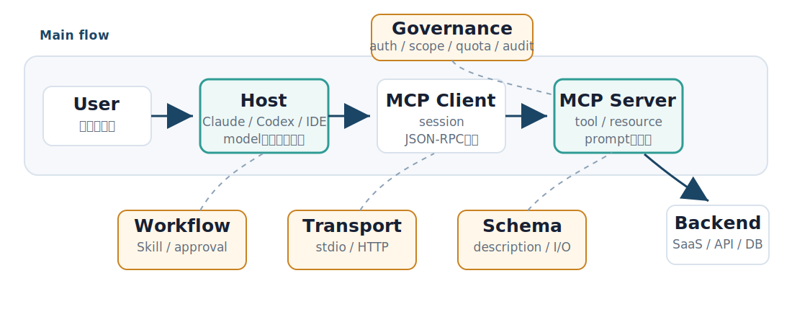
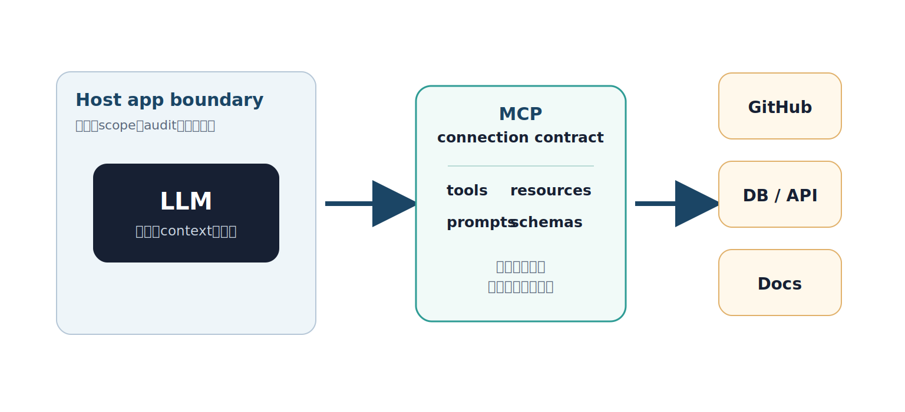
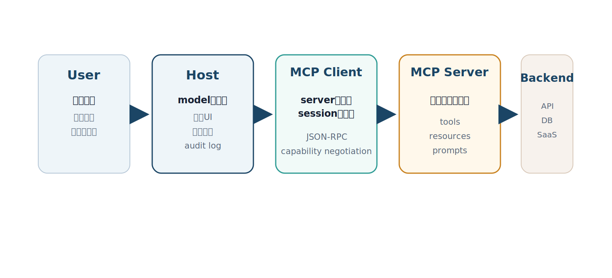
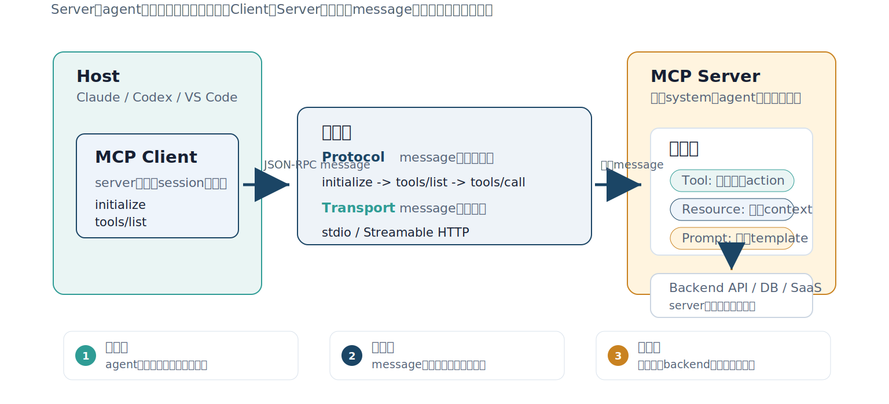
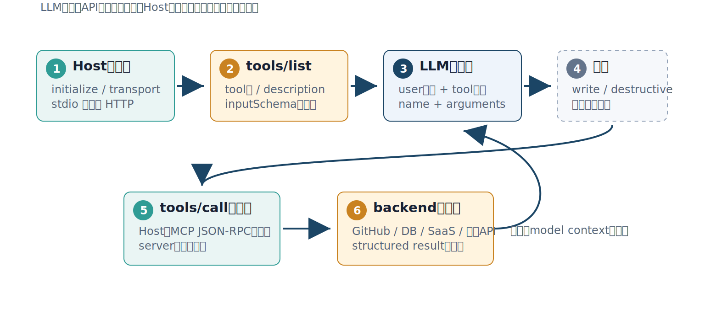
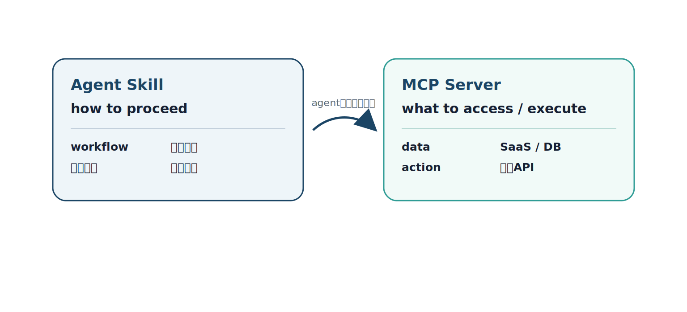
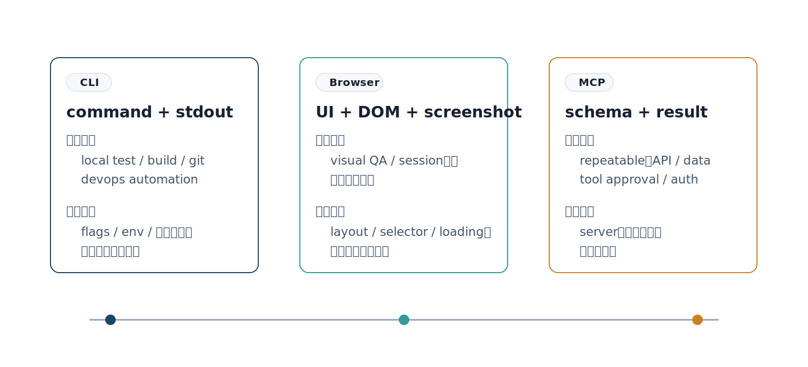
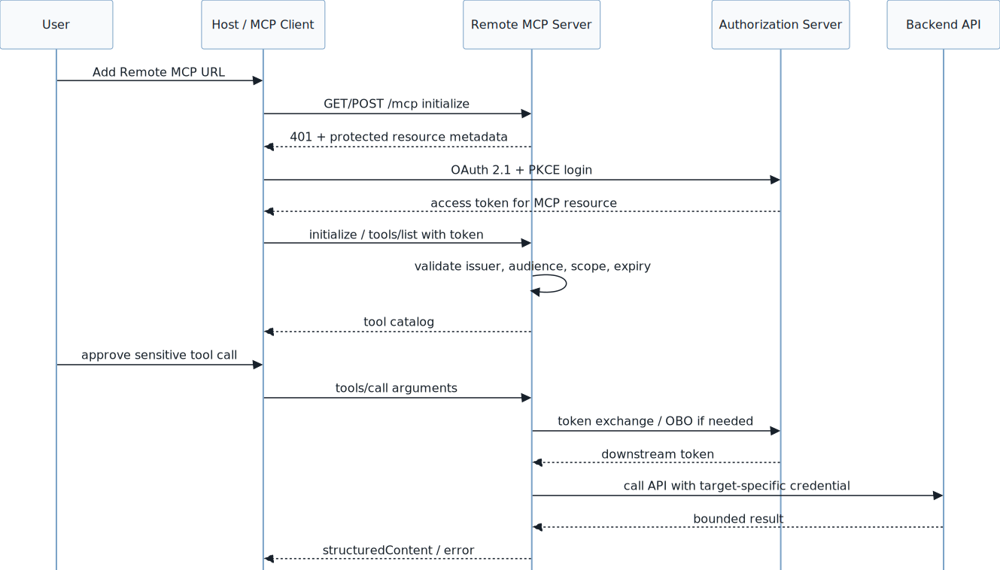
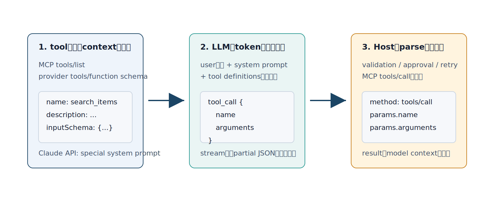

<!--
_class: lead
-->

# MCP概論 :<br />開発現場でどう使うべきか

AI Agentが外部systemを安全に使うための接続面を、全体地図から順に理解する。

2026-06-09

<p class="source-note">出典: <a href="../../../research/mcp-slide-research/">調査メモ</a>; <a href="../../../sources/mcp-source-links/">参照リンク</a></p>

---

<!--
_class: compact map ch00
-->

<p class="chapter-label">00 / 全体像</p>

## MCPの全体地図



最初は細部を読まない。まず **User -> Host -> MCP Server -> Backend** の左から右の流れだけを見る。

この資料は、この地図のピースを順番に埋める。

<p class="source-note">出典: <a href="../../../research/mcp-slide-research/">調査メモ</a>; <a href="../../../sources/mcp-source-links/">参照リンク</a></p>

---

<!--
_class: compact ch00
-->

<p class="chapter-label">00 / 全体像</p>

## 地図の主線

MCPは、model単体ではなく **Hostの中の接続機構** と **外部system側のserver** の話。

<div class="grid three">
  <div class="panel strong"><h3>1. Host</h3><p>user、model、接続、承認を束ねる実行環境。</p></div>
  <div class="panel teal"><h3>2. MCP Server</h3><p>外部systemのdata/actionをagent向けに公開する入口。</p></div>
  <div class="panel amber"><h3>3. Backend</h3><p>既存API、SaaS、DB、repositoryなどの実体。</p></div>
</div>

まず押さえるのは、**MCP Serverはbackendそのものではなく、agentに見せる接続面**だということ。

<p class="source-note">出典: <a href="https://modelcontextprotocol.io/specification/2025-11-25">MCP spec</a>; <a href="../../../research/mcp-slide-research/">調査メモ</a></p>

---

<!--
_class: compact ch00
-->

<p class="chapter-label">00 / 全体像</p>

## MCPは接続契約

MCPは、ClaudeやCodexのようなAIアプリが、GitHubや社内DBのような外部システムを安全に使うための共通ルール。

正式には、AI applicationが外部システムのdata / action / workflowへ接続するための標準protocol。

- Hostがuser、model、接続、承認を束ねる
- MCP ClientがserverごとのsessionとJSON-RPC通信を持つ
- MCP Serverがtool / resource / promptを宣言する
- Backendは既存API、SaaS、DB、社内systemのまま活かす

つまりMCPは、**LLMが外部世界へ出るときの接続契約**。

<p class="source-note">出典: <a href="https://modelcontextprotocol.io/specification/2025-11-25">MCP spec</a>; <a href="../../../research/mcp-slide-research/">調査メモ</a></p>

---

<!--
_class: compact visual ch00
-->

<p class="chapter-label">00 / 全体像</p>

## 外部systemへ出る入口

<p class="lead">LLMはHostの境界内で判断し、外部systemには接続面を通じて届く。</p>

<div class="visual-hero">
  
</div>

<p class="caption">CLIやBrowserでも外部へ出られる。MCPは、その入口をagent向けの契約として設計する。</p>

<p class="source-note">画像: CodexでSVG化; 出典: <a href="https://modelcontextprotocol.io/specification/2025-11-25">MCP spec</a>; <a href="../../../research/mcp-slide-research/">調査メモ</a></p>

---

<!--
_class: dense ch00 table-narrow-first
-->

<p class="chapter-label">00 / 全体像</p>

## 全体の流れ

| 順番 | 見るもの | ここでわかること |
|---:|---|---|
| 1 | 全体地図 | MCPがどの境界にあるか |
| 2 | Host / Client / Server | 誰が接続と承認を持つか |
| 3 | Tool / Resource / Prompt | MCP serverが何を公開するか |
| 4 | CLI / Browser / APIとの比較 | いつMCPを選ぶべきか |
| 5 | MCP server構築 | 既存APIをどうadapter化するか |
| 6 | Remote / Protocol / Auth | どう通信し、どう守るか |
| 7 | Workflow / Governance | チームでどう運用するか |

3つの問いに分けると追いやすい。**誰がつなぐか、何を公開するか、どう安全に運用するか。**

<p class="source-note">出典: <a href="../../../research/mcp-slide-research/">調査メモ</a>; <a href="../../../sources/mcp-source-links/">参照リンク</a></p>

---

<!--
_class: section ch01
-->

<p class="kicker">Chapter 01</p>

# 基本概念

接続契約を構成する言葉と責務を揃える

<p class="source-note">出典: <a href="https://modelcontextprotocol.io/specification/2025-11-25">MCP spec</a>; <a href="https://www.anthropic.com/news/model-context-protocol">Anthropic MCP launch</a>; <a href="../../../research/mcp-slide-research/">調査メモ</a></p>

---

<!--
_class: dense ch01
-->

<p class="chapter-label">01 / 基本概念</p>

## まず押さえる用語

| 用語 | 何を指すか | この資料での見方 |
|---|---|---|
| Agent | LLMが手順を考え、toolを選び、結果を見て次へ進む実行主体 | 判断し、toolを選ぶ側 |
| Host | Claude / Cursor / VS Codeなどの実行環境 | MCP接続と承認を管理する側 |
| MCP Client | Host内でserverと通信する部品 | JSON-RPCを送受信する側 |
| MCP Server | 外部機能をtool/resourceとして公開する部品 | 既存APIをagent向けに整える側 |

最初に分けるべきは「賢いmodel」ではなく、**modelを囲む実行境界**。

<p class="source-note">出典: <a href="https://modelcontextprotocol.io/specification/2025-11-25">MCP spec</a>; <a href="https://www.anthropic.com/news/model-context-protocol">Anthropic MCP launch</a>; <a href="../../../research/mcp-slide-research/">調査メモ</a></p>

---

<!--
_class: dense ch01
-->

<p class="chapter-label">01 / 基本概念</p>

## MCPを3つの面で見る

<div class="logo-split">
<div class="logo-copy">

接続契約としてのMCPは、3つの面に分けると追いやすい。

- 公開面: tool、resource、prompt
- 説明面: name、description、input schema、output schema
- 通信/保護面: transport、auth、scope、approval、audit、rate limit

個別要素を暗記するのではなく、**どの責務を支える部品か**として読む。

</div>
<div class="logo-panel">
  <div class="logo-hero">
    
    <strong>Model Context Protocol</strong>
    <span>agentが外部systemを扱うための接続契約</span>
  </div>
  <div class="concept-stack">
    <div class="concept-card"><div class="concept-mark">1</div><div><strong>Catalog</strong><br /><span>tool / resource / promptを列挙する</span></div></div>
    <div class="concept-card"><div class="concept-mark">2</div><div><strong>Call</strong><br /><span>schemaに沿って安全に実行する</span></div></div>
    <div class="concept-card"><div class="concept-mark">3</div><div><strong>Audit</strong><br /><span>auth、scope、approvalを境界に置く</span></div></div>
  </div>
</div>
</div>

<p class="source-note">出典: <a href="https://modelcontextprotocol.io/specification/2025-11-25">MCP spec</a>; <a href="https://www.anthropic.com/news/model-context-protocol">Anthropic MCP launch</a>; <a href="../../../research/mcp-slide-research/">調査メモ</a></p>

---

<!--
_class: compact ch01
-->

<p class="chapter-label">01 / 基本概念</p>

## Host / Client / Serverとは？

<p class="lead">Host、MCP Client、MCP Server、Backendは同じものではなく、責務の境界が違う。</p>

<div class="visual-hero">
  
</div>

<p class="source-note">出典: <a href="https://modelcontextprotocol.io/specification/2025-11-25">MCP spec</a>; <a href="https://www.anthropic.com/news/model-context-protocol">Anthropic MCP launch</a>; <a href="../../../research/mcp-slide-research/">調査メモ</a></p>

---

<!--
_class: compact visual ch01
-->

<p class="chapter-label">01 / 基本概念</p>

## MCPの公開面と通信面

<p class="lead">Tool、Resource、Promptはserverが公開する面に、Protocol、Transportはclient/serverが会話する面に出てくる。</p>

<div class="visual-hero">
  
</div>

<p class="caption">MCPは「serverが何を公開するか」と「client/serverがどう会話するか」を分けて見ると追いやすい。</p>

<p class="source-note">画像: CodexでSVG化; 出典: <a href="https://modelcontextprotocol.io/specification/2025-11-25">MCP spec</a>; <a href="https://modelcontextprotocol.io/specification/2025-11-25/basic/lifecycle">MCP lifecycle</a>; <a href="https://modelcontextprotocol.io/specification/2025-11-25/basic/transports">MCP transports</a>; <a href="../../../research/mcp-slide-research/">調査メモ</a></p>

---

<!--
_class: compact ch01
-->

<p class="chapter-label">01 / 基本概念</p>

## Tool / Resource / Promptとは？

ここでは、MCP ServerがHostへ見せる**公開面の細部**を見る。

<div class="logo-split">
<div class="logo-copy">

| 種類 | 役割 | 例 |
|---|---|---|
| Tool | agentが実行できるaction | `search`, `create`, `deploy` |
| Resource | agentが読めるcontext/data | log、issue、schema |
| Prompt | 再利用できる作業template | incident調査、PR review |

開発で最初に使うのは多くの場合tool。

ただし良いMCP serverは、actionだけでなく**判断材料となるresource**も一緒に設計する。

<p class="caption">ここでのPromptは「userが入力するprompt」ではなく、serverが公開する再利用template。</p>

</div>
<div class="logo-panel">
  <div class="concept-stack">
    <div class="concept-card"><div class="concept-mark">T</div><div><strong>Tool</strong><br /><span>状態を変える。副作用があるので承認とscopeが重要。</span></div></div>
    <div class="concept-card"><div class="concept-mark">R</div><div><strong>Resource</strong><br /><span>判断材料を読む。ログ、issue、schema、document。</span></div></div>
    <div class="concept-card"><div class="concept-mark">P</div><div><strong>Prompt</strong><br /><span>反復する手順やレビュー観点を再利用する。</span></div></div>
  </div>
</div>
</div>

<p class="source-note">出典: <a href="https://modelcontextprotocol.io/specification/2025-11-25">MCP spec</a>; <a href="https://www.anthropic.com/news/model-context-protocol">Anthropic MCP launch</a>; <a href="../../../research/mcp-slide-research/">調査メモ</a></p>

---

<!--
_class: compact ch01
-->

<p class="chapter-label">01 / 基本概念</p>

## Protocol / Transportとは？

ここでは、MCP ClientとServerが会話する**通信面の細部**を見る。

- Protocol: どんなmessageを、どんな順序でやり取りするか
- Transport: そのmessageをどう運ぶか
- JSON-RPC: MCP messageの基本的なenvelope
- Auth: 誰が、どのscopeで、どのserver/toolを使えるか

```text
MCP protocol message
  initialize -> tools/list -> tools/call

Transport
  stdio: local processのstdin/stdout
  Streamable HTTP: remote endpoint over HTTPS
```

後半のJSON-RPCやRemote MCPは、この用語の上に乗る。

<p class="caption">郵便で言えば、protocolは封筒の書式と手続き、transportは郵便・宅配・手渡しのような運び方。</p>

<p class="source-note">出典: <a href="https://modelcontextprotocol.io/specification/2025-11-25">MCP spec</a>; <a href="https://www.anthropic.com/news/model-context-protocol">Anthropic MCP launch</a>; <a href="../../../research/mcp-slide-research/">調査メモ</a></p>

---

<!--
_class: dense ch01
-->

<p class="chapter-label">01 / 基本概念</p>

## MCPの1回の呼び出し

<div class="visual-hero">
  
</div>

ポイントは、LLMが勝手に外部APIを叩くのではなく、**Hostが接続・承認・実行を仲介する**こと。

<p class="source-note">出典: <a href="https://modelcontextprotocol.io/specification/2025-11-25">MCP spec</a>; <a href="https://modelcontextprotocol.io/specification/2025-11-25/basic/lifecycle">MCP lifecycle</a>; <a href="https://modelcontextprotocol.io/specification/2025-11-25/server/tools">MCP tools</a>; <a href="../../../research/mcp-slide-research/">調査メモ</a></p>

---

<!--
_class: dense ch01
-->

<p class="chapter-label">01 / 基本概念</p>

## SkillsとMCPの違い

<p class="lead">Skillはagentの進め方を固定し、MCPは外部data/actionへの入口を渡す。</p>

<div class="visual-hero">
  
</div>

<p class="source-note">出典: <a href="https://agentskills.io/specification">Agent Skills spec</a>; <a href="https://developers.openai.com/codex/skills">OpenAI Codex Skills</a>; <a href="https://modelcontextprotocol.io/specification/2025-11-25">MCP spec</a>; <a href="../../../research/mcp-slide-research/">調査メモ</a></p>

---

<!--
_class: section ch02
-->

<p class="kicker">Chapter 02</p>

# 比較と判断軸

CLI、Browser、API、MCPを使い分ける

<p class="source-note">出典: <a href="https://www.anthropic.com/engineering/advanced-tool-use">Anthropic advanced tool use</a>; <a href="https://modelcontextprotocol.io/specification/2025-11-25/server/tools">MCP tools</a>; <a href="../../../research/mcp-slide-research/">調査メモ</a></p>

---

<!--
_class: compact ch02
-->

<p class="chapter-label">02 / 比較と判断軸</p>

## なぜMCPが必要なのか

AIエージェントが外部システムを安全に使うための標準インターフェースを作る。

- 外部システム: GitHub、AWS、Sentry、DB、社内API、ブラウザ、Docs
- できること: context取得、tool実行、workflowの再利用
- 重要点: tool名、description、schema、auth、transport、approvalをプロトコルで扱う

MCPは「AIに便利ツールを足す」ではなく、**AIが迷わず呼べるAPI境界**。

<p class="source-note">出典: <a href="https://www.anthropic.com/engineering/advanced-tool-use">Anthropic advanced tool use</a>; <a href="https://modelcontextprotocol.io/specification/2025-11-25/server/tools">MCP tools</a>; <a href="../../../research/mcp-slide-research/">調査メモ</a></p>

---

<!--
_class: compact ch02
-->

<p class="chapter-label">02 / 比較と判断軸</p>

## CLI / Browser / MCPの違い

<div class="visual-hero">
  
</div>

判断軸は「人間向けインターフェースか、agent向け契約か」。

<p class="source-note">出典: <a href="https://www.anthropic.com/engineering/advanced-tool-use">Anthropic advanced tool use</a>; <a href="https://modelcontextprotocol.io/specification/2025-11-25/server/tools">MCP tools</a>; <a href="../../../research/mcp-slide-research/">調査メモ</a></p>

---

<!--
_class: compact ch02
-->

<p class="chapter-label">02 / 比較と判断軸</p>

## Q. CLIで叩けばよくない？

**A. CLIは今でも強い。ただしagentには余計な推測と出力が多い。**

- command syntax、flags、profile、region、envをagentが推測する
- stdout/stderrは人間向けで、ログやstack traceが巨大になりやすい
- エラー原因の切り分けに追加commandが増える
- 出力を絞るには`jq`、`grep`、`--json`などを毎回設計する必要がある

CLIはlocal executionに最適。外部サービスの反復操作はMCPの方が安定しやすい。

<p class="source-note">出典: <a href="https://www.anthropic.com/engineering/advanced-tool-use">Anthropic advanced tool use</a>; <a href="https://modelcontextprotocol.io/specification/2025-11-25/server/tools">MCP tools</a>; <a href="../../../research/mcp-slide-research/">調査メモ</a></p>

---

<!--
_class: compact ch02
-->

<p class="chapter-label">02 / 比較と判断軸</p>

## Q. ブラウザ操作で十分では？

**A. UIそのものを見るなら必須。データ取得や操作の主経路にすると不安定。**

- page遷移、modal、loading、viewport、selector変更に弱い
- screenshotやaccessibility treeはcontextを消費しやすい
- UIから意図を推測するため、操作ミスや待機ミスが起きやすい
- ただしvisual QA、console/network、performance、実ブラウザ再現には強い

ブラウザ操作は「UIの検証」、MCPは「宣言された機能の実行」と分ける。

<p class="source-note">出典: <a href="https://www.anthropic.com/engineering/advanced-tool-use">Anthropic advanced tool use</a>; <a href="https://modelcontextprotocol.io/specification/2025-11-25/server/tools">MCP tools</a>; <a href="../../../research/mcp-slide-research/">調査メモ</a></p>

---

<!--
_class: dense graph ch02
-->

<p class="chapter-label">02 / 比較と判断軸</p>

## Token使用量の比較イメージ

<div class="token-bars" aria-label="Token usage comparison">
  <div class="bar-row"><span>MCP: focused tool + bounded result</span><div class="bar"><b style="width: 18%">0.5-5k</b></div></div>
  <div class="bar-row"><span>CLI: command + raw logs</span><div class="bar"><b style="width: 58%">2-20k</b></div></div>
  <div class="bar-row"><span>Browser: screenshot / DOM / UI state</span><div class="bar"><b style="width: 72%">4-25k</b></div></div>
  <div class="bar-row"><span>MCP tool catalog all upfront</span><div class="bar warn"><b style="width: 88%">55k+</b></div></div>
</div>

- 上3つは同一タスクを行うときの代表レンジ。client/model/result設計で変わる。
- 最下段はAnthropic公開例: 5 MCP servers / 58 toolsでrequest前に約55K tokens。
- 重要なのは「MCPなら常に少ない」ではなく、**tool surfaceを絞る、検索する、結果をboundedにする**こと。

<p class="source-note">出典: <a href="https://www.anthropic.com/engineering/advanced-tool-use">Anthropic advanced tool use</a>; <a href="https://modelcontextprotocol.io/specification/2025-11-25/server/tools">MCP tools</a>; <a href="../../../research/mcp-slide-research/">調査メモ</a></p>

---

<!--
_class: compact ch02
-->

<p class="chapter-label">02 / 比較と判断軸</p>

## MCPがフローを安定させる理由

agentが低レベル操作を推測せず、宣言済みcapabilityを呼べるから。

- `tools/list`: 何ができるかを発見する
- `inputSchema`: 必要な引数と型がわかる
- `description`: いつ使うべきか、制約は何かがわかる
- `structuredContent`: 返り値を機械的に扱える
- host UI: sensitive tool callを承認フローに載せられる

「画面を見て推測」や「CLI flagsを思い出す」から「定義済みtoolを呼ぶ」へ移る。

<p class="source-note">出典: <a href="https://www.anthropic.com/engineering/advanced-tool-use">Anthropic advanced tool use</a>; <a href="https://modelcontextprotocol.io/specification/2025-11-25/server/tools">MCP tools</a>; <a href="../../../research/mcp-slide-research/">調査メモ</a></p>

---

<!--
_class: dense ch02
-->

<p class="chapter-label">02 / 比較と判断軸</p>

## CI調査で見る利用フロー

```text
CLI:
  gh pr view --json statusCheckRollup
  gh run list --branch <branch>
  gh run view <run-id> --log-failed
  grep / jq / sedで絞り込み

Browser:
  PR pageを開く -> Checksを探す -> failing checkを開く
  log UIで検索 -> tabや表示状態を調整

MCP:
  github.get_pull_request(number)
  github.list_check_runs(ref)
  github.get_failed_check_log(run_id, max_lines=200)
```

MCPの価値は、サービス側が「agentに必要な粒度」でtoolを切れること。

<p class="source-note">出典: <a href="../../../research/mcp-slide-research/">調査メモ</a>; <a href="../../../sources/mcp-source-links/">参照リンク</a></p>

---

<!--
_class: compact ch02
-->

<p class="chapter-label">02 / 比較と判断軸</p>

## Q. MCPが向かない場面は？

- local build/test、package scripts、任意shell調査
- UIの見た目、layout、accessibility、performance確認
- 一度だけのadhoc作業でserver化する価値が薄いもの
- 信頼できるMCP serverがないサービス
- 広すぎる権限や雑なdescriptionで、agent-safeではないserver

MCPは万能ではない。**反復的なservice/data/action境界**を標準化するもの。

<p class="source-note">出典: <a href="https://www.anthropic.com/engineering/advanced-tool-use">Anthropic advanced tool use</a>; <a href="https://modelcontextprotocol.io/specification/2025-11-25/server/tools">MCP tools</a>; <a href="../../../research/mcp-slide-research/">調査メモ</a></p>

---

<!--
_class: dense ch02
-->

<p class="chapter-label">02 / 比較と判断軸</p>

## 提供者から見たMCP

| 提供面 | 主な利用者 | agent適性 | provider control |
|---|---|---|---|
| Browser UI | 人間 | 低-中 | 見た目は制御、machine契約は弱い |
| CLI | 開発者/運用者 | 中 | 出力・権限が広がりやすい |
| REST/OpenAPI | アプリ | 中-高 | 契約は強いがagent用説明が不足しがち |
| MCP | AI client/agent | 高 | scope、audit、consent、output capを設計できる |

提供者視点では、MCPは **AI向けの安全な入口** を作る選択肢。

<p class="source-note">出典: <a href="https://www.anthropic.com/engineering/advanced-tool-use">Anthropic advanced tool use</a>; <a href="https://modelcontextprotocol.io/specification/2025-11-25/server/tools">MCP tools</a>; <a href="../../../research/mcp-slide-research/">調査メモ</a></p>

---

<!--
_class: section ch03
-->

<p class="kicker">Chapter 03</p>

# MCP server構築

既存APIをagent向けadapterにする

<p class="source-note">出典: <a href="https://modelcontextprotocol.io/specification/2025-11-25/server/tools">MCP tools</a>; <a href="https://gofastmcp.com/servers/openapi">FastMCP</a>; <a href="https://fastapi.tiangolo.com/how-to/extending-openapi/">FastAPI OpenAPI</a>; <a href="../../../research/mcp-slide-research/">調査メモ</a></p>

---

<!--
_class: compact ch03
-->

<p class="chapter-label">03 / MCP server構築</p>

## 既存APIをMCP化する基本設計

<div class="logo-split">
<div class="logo-copy">

API本体を書き換えず、adapter layerを追加する。

```text
app/
  api/
    main.py              # existing FastAPI app
    routers/
      inventory.py       # operation_id, tags, response_model
  domain/
    inventory_service.py # business logic
  mcp/
    server.py            # MCP adapter
    route_policy.py      # expose / exclude policy
    descriptions.py      # model-facing descriptions
```

OpenAPIを契約として使い、MCPでは公開面を絞る。

</div>
<div class="logo-panel">
  <div class="adapter-strip">
    <div class="brand-card"><strong>FastAPI</strong><span>既存API</span></div>
    <div class="adapter-arrow">→</div>
    <div class="brand-card"><strong>OpenAPI</strong><span>契約</span></div>
    <div class="adapter-arrow">→</div>
    <div class="brand-card"><strong>MCP</strong><span>agent向け公開面</span></div>
  </div>
  <div class="callout">既存APIはsource of truthにし、MCP側は説明・制限・承認の境界を担う。</div>
</div>
</div>

<p class="source-note">出典: <a href="https://modelcontextprotocol.io/specification/2025-11-25/server/tools">MCP tools</a>; <a href="https://gofastmcp.com/servers/openapi">FastMCP</a>; <a href="https://fastapi.tiangolo.com/how-to/extending-openapi/">FastAPI OpenAPI</a>; <a href="../../../research/mcp-slide-research/">調査メモ</a></p>

---

<!--
_class: compact ch03
-->

<p class="chapter-label">03 / MCP server構築</p>

## 既存APIをMCP化する流れ



既存APIをsource of truthにし、MCP serverは公開範囲、description、schema、出力制限を担うadapterにする。

<p class="source-note">出典: <a href="https://modelcontextprotocol.io/specification/2025-11-25/server/tools">MCP tools</a>; <a href="https://gofastmcp.com/servers/openapi">FastMCP</a>; <a href="https://fastapi.tiangolo.com/how-to/extending-openapi/">FastAPI OpenAPI</a>; <a href="../../../research/mcp-slide-research/">調査メモ</a></p>

---

<!--
_class: dense ch03
-->

<p class="chapter-label">03 / MCP server構築</p>

## 避けたいMCP server設計

MCP化は「既存APIを全部toolにする」ことではない。

| 避けたい設計 | なぜ危ないか | 良い設計 |
|---|---|---|
| `call_api(method, path, body)` | agentがpath、method、payload、権限を推測する | 業務目的ごとのtoolへ分ける |
| admin/debug/internal endpointも公開 | modelから見える攻撃面と誤操作が増える | allowlist + route policyで絞る |
| raw log / full JSONを返す | contextが増え、次の判断がぶれる | summary + stable ID + pagination |
| read/writeが同じtool | 参照のつもりで副作用が起きる | search -> read detail -> actに分ける |
| descriptionがAPI docsのまま | いつ使うべきか、危険性、返り値が伝わらない | 条件、制約、副作用、失敗時の扱いを書く |

良いMCP serverはtool数が多いserverではなく、**agentが迷わず安全に次の一手へ進めるserver**。

<p class="source-note">出典: <a href="https://www.anthropic.com/engineering/advanced-tool-use">Anthropic advanced tool use</a>; <a href="https://modelcontextprotocol.io/specification/2025-11-25/server/tools">MCP tools</a>; <a href="https://modelcontextprotocol.io/specification/2025-11-25/server/resources">MCP resources</a>; <a href="../../../research/mcp-slide-research/">調査メモ</a></p>

---

<!--
_class: dense ch03
-->

<p class="chapter-label">03 / MCP server構築</p>

## FastAPI + OpenAPIの実装例: 契約とclient

```python
# app/mcp/server.py
import httpx
from app.api.main import app as fastapi_app  # OpenAPI契約だけ再利用
from app.config import settings

openapi_spec = fastapi_app.openapi()  # paths/schemas/operation_idのsource of truth

# 既存APIをHTTPで呼び、auth/middleware/log/validationを保つ。
api_client = httpx.AsyncClient(
    base_url="http://127.0.0.1:9000",
    timeout=30.0,
    headers={"Authorization": f"Bearer {settings.api_token}"},
)
```

handlerを直接importせず、既存APIの境界を保つ。

<p class="source-note">出典: <a href="https://www.anthropic.com/engineering/advanced-tool-use">Anthropic advanced tool use</a>; <a href="https://modelcontextprotocol.io/specification/2025-11-25/server/tools">MCP tools</a>; <a href="../../../research/mcp-slide-research/">調査メモ</a></p>

---

<!--
_class: dense ch03
-->

<p class="chapter-label">03 / MCP server構築</p>

## FastMCPでtool/resourceとして公開する

```python
from fastmcp import FastMCP
from app.mcp.route_policy import route_map_fn  # 公開範囲のpolicy

# 前ページで作ったapi_client / openapi_specを渡す。
# policyを通ったendpointだけをMCP tool/resourceとして公開する。
mcp = FastMCP.from_openapi(
    openapi_spec=openapi_spec,
    client=api_client,
    name="Inventory MCP",
    route_map_fn=route_map_fn,
)
```

<p class="source-note">出典: <a href="https://modelcontextprotocol.io/specification/2025-11-25/server/tools">MCP tools</a>; <a href="https://gofastmcp.com/servers/openapi">FastMCP</a>; <a href="https://fastapi.tiangolo.com/how-to/extending-openapi/">FastAPI OpenAPI</a>; <a href="../../../research/mcp-slide-research/">調査メモ</a></p>

---

<!--
_class: dense ch03
-->

<p class="chapter-label">03 / MCP server構築</p>

## Q. OpenAPIをそのまま出してよい？

**A. 原則は出し過ぎない。route policyでagent-safeな面だけ公開する。**

```python
from fastmcp.server.providers.openapi import MCPType
from fastmcp.utilities.openapi import HTTPRoute

BLOCKED_TAGS = {"internal", "admin", "debug"}
WRITE_METHODS = {"POST", "PUT", "PATCH", "DELETE"}

def route_map_fn(route: HTTPRoute, default_type: MCPType) -> MCPType | None:
    # まずtag/pathで内部用途のendpointを除外する。
    if set(route.tags or []).intersection(BLOCKED_TAGS):
        return MCPType.EXCLUDE
    if route.path.startswith(("/admin", "/debug", "/internal")):
        return MCPType.EXCLUDE

    # side effectのある操作はtoolにする。承認・監査の対象にしやすい。
    if route.method in WRITE_METHODS:
        return MCPType.TOOL

    # 参照専用のcatalogはresource templateとして文脈提供に使える。
    if route.method == "GET" and "catalog" in (route.tags or []):
        return MCPType.RESOURCE_TEMPLATE

    # 本番ではallowlist化し、意図しない新規endpoint公開を防ぐ。
    return MCPType.TOOL
```

<p class="source-note">出典: <a href="https://modelcontextprotocol.io/specification/2025-11-25/server/tools">MCP tools</a>; <a href="https://gofastmcp.com/servers/openapi">FastMCP</a>; <a href="https://fastapi.tiangolo.com/how-to/extending-openapi/">FastAPI OpenAPI</a>; <a href="../../../research/mcp-slide-research/">調査メモ</a></p>

---

<!--
_class: compact ch03
-->

<p class="chapter-label">03 / MCP server構築</p>

## Q. descriptionは何を書くべき？

**A. agentが誤用しないための実行契約を書く。**

- 何をするtoolか
- いつ使うべきか、いつ使うべきでないか
- 副作用があるか
- 実行前にユーザー確認が必要か
- 必須引数の意味、IDの取得元
- 返り値の見方、失敗時の次アクション

良いdescriptionは説明文ではなく、**agentの行動制約**。

<p class="source-note">出典: <a href="https://modelcontextprotocol.io/specification/2025-11-25/server/tools">MCP tools</a>; <a href="https://gofastmcp.com/servers/openapi">FastMCP</a>; <a href="https://fastapi.tiangolo.com/how-to/extending-openapi/">FastAPI OpenAPI</a>; <a href="../../../research/mcp-slide-research/">調査メモ</a></p>

---

<!--
_class: dense ch03
-->

<p class="chapter-label">03 / MCP server構築</p>

## Q. 良いdescriptionの例は？

```python
@router.post(
    "/{item_id}/reserve",
    # operation_idはtool名の元になる。自動生成名に任せない。
    operation_id="reserve_inventory_item",
    summary="Reserve inventory for an item",
    # 副作用と事前確認条件を先頭に置く。modelが誤用しにくくなる。
    description=(
        "Reserve stock for a known inventory item. "
        "This changes inventory state. Call only after the user "
        "explicitly confirms item_id, quantity, and expiration time. "
        "Use search_inventory_items first if item_id is unknown."
    ),
    # structured outputにして、後続tool callやUI表示で扱いやすくする。
    response_model=ReserveResponse,
)
async def reserve_inventory_item(
    # IDが不明ならsearch toolで取得させ、ユーザー入力の曖昧さを減らす。
    item_id: str,
    request: ReserveRequest,
) -> ReserveResponse:
    ...
```

critical ruleは先頭に置く。長すぎる説明はclient側で切られる可能性がある。

<p class="source-note">出典: <a href="https://modelcontextprotocol.io/specification/2025-11-25/server/tools">MCP tools</a>; <a href="https://gofastmcp.com/servers/openapi">FastMCP</a>; <a href="https://fastapi.tiangolo.com/how-to/extending-openapi/">FastAPI OpenAPI</a>; <a href="../../../research/mcp-slide-research/">調査メモ</a></p>

---

<!--
_class: section ch04
-->

<p class="kicker">Chapter 04</p>

# Remote MCPと複数Agent設定

localの便利ツールから、チームで共有する接続面へ進む

<p class="source-note">出典: <a href="https://code.claude.com/docs/en/mcp">Claude Code MCP</a>; <a href="https://code.visualstudio.com/docs/agent-customization/mcp-servers">VS Code MCP</a>; <a href="https://docs.cursor.com/context/model-context-protocol">Cursor MCP</a>; <a href="https://microsoft.github.io/apm/">Microsoft APM</a>; <a href="../../../research/mcp-slide-research/">調査メモ</a></p>

---

<!--
_class: compact ch04
-->

<p class="chapter-label">04 / Remote MCPと複数Agent設定</p>

## Remote MCPで何が変わる？

local MCPは「手元のtoolをagentに渡す」形。Remote MCPは「共有serviceを認証付きでagentに渡す」形。

| 観点 | local stdio | Remote MCP |
|---|---|---|
| 置き場所 | userのmachineでprocess起動 | cloud / service側でserver運用 |
| 主な用途 | local file、git、script、個人tool | SaaS、社内API、team共有tool |
| 認証 | local credentialやprofileに寄りやすい | OAuth/token/scopeを明示して扱う |
| 運用 | 個人設定が中心 | project/user/org設定を分ける |

ここから見るべきものは接続コマンドではなく、**誰の権限で共有serviceへ入るか**。

<p class="source-note">出典: <a href="https://code.claude.com/docs/en/mcp">Claude Code MCP</a>; <a href="https://code.visualstudio.com/docs/agent-customization/mcp-servers">VS Code MCP</a>; <a href="https://docs.cursor.com/context/model-context-protocol">Cursor MCP</a>; <a href="https://microsoft.github.io/apm/">Microsoft APM</a>; <a href="../../../research/mcp-slide-research/">調査メモ</a></p>

---

<!--
_class: dense ch04
-->

<p class="chapter-label">04 / Remote MCPと複数Agent設定</p>

## OAuth付きRemote MCPで起きること

OAuthは「AIアプリにpasswordを渡さず、必要なscopeのtokenだけ渡す」ための仕組み。

```text
1. HostがRemote MCP serverへ接続する
2. Serverが「この認可serverでloginして」と返す
3. Userがbrowserで同意する
4. Hostはtokenを得て、MCP serverへ再接続する
5. MCP serverはscopeとtokenの宛先を検証してtoolを実行する
```

覚える点はコマンドではなく、**誰の権限で、どのserverに、どの範囲で入るか**。

<p class="source-note">出典: <a href="https://code.claude.com/docs/en/mcp">Claude Code MCP</a>; <a href="https://code.visualstudio.com/docs/agent-customization/mcp-servers">VS Code MCP</a>; <a href="https://docs.cursor.com/context/model-context-protocol">Cursor MCP</a>; <a href="https://microsoft.github.io/apm/">Microsoft APM</a>; <a href="../../../research/mcp-slide-research/">調査メモ</a></p>

---

<!--
_class: dense ch04
-->

<p class="chapter-label">04 / Remote MCPと複数Agent設定</p>

## 複数Agentで使う設定設計

設定を1つのJSONとして考えない。**共有する能力**と**個人の認証**を分ける。

| layer | 置くもの | 例 |
|---|---|---|
| project | teamで使うserver定義、URL、version、tool allowlist | `.mcp.json`, `.vscode/mcp.json`, `.cursor/mcp.json` |
| user | 個人token、OAuth login、local path、個人tool | `~/.claude.json`, user profile `mcp.json`, `~/.cursor/mcp.json` |
| org | approved server、allow/deny、audit、sandbox | `managed-mcp.json`, enterprise policy, Gateway/APIM |

共有serviceはRemote MCP。local file/Git/browserなど手元依存は`stdio`。

<p class="source-note">出典: <a href="https://code.claude.com/docs/en/mcp">Claude Code MCP</a>; <a href="https://code.visualstudio.com/docs/agent-customization/mcp-servers">VS Code MCP</a>; <a href="https://docs.cursor.com/context/model-context-protocol">Cursor MCP</a>; <a href="https://microsoft.github.io/apm/">Microsoft APM</a>; <a href="../../../research/mcp-slide-research/">調査メモ</a></p>

---

<!--
_class: dense ch04
-->

<p class="chapter-label">04 / Remote MCPと複数Agent設定</p>

## Q. clientごとの設定形式は同じ？

同じではない。ここが複数Agent運用の落とし穴。

| client | project config | user config | key |
|---|---|---|---|
| Claude Code | `.mcp.json` | `~/.claude.json` | `mcpServers` |
| VS Code / Copilot | `.vscode/mcp.json` | user profile `mcp.json` | `servers` |
| Cursor | `.cursor/mcp.json` | `~/.cursor/mcp.json` | `mcpServers` |
| Codex CLI | `.codex/config.toml` | `~/.codex/config.toml` | `[mcp_servers.*]` |
| Claude.ai | connector settings | user OAuth | connector |

同名serverの上書き・precedenceもclientごとに確認する。

<p class="source-note">出典: <a href="https://www.anthropic.com/engineering/advanced-tool-use">Anthropic advanced tool use</a>; <a href="https://modelcontextprotocol.io/specification/2025-11-25/server/tools">MCP tools</a>; <a href="../../../research/mcp-slide-research/">調査メモ</a></p>

---

<!--
_class: section ch05
-->

<p class="kicker">Chapter 05</p>

# Protocol / Auth / JSON-RPC

接続フローとtool callの中身を見る

<p class="source-note">出典: <a href="https://modelcontextprotocol.io/specification/2025-11-25">MCP spec</a>; <a href="https://modelcontextprotocol.io/specification/2025-11-25/basic/authorization">MCP authorization</a>; <a href="https://www.jsonrpc.org/specification">JSON-RPC 2.0</a>; <a href="https://datatracker.ietf.org/doc/html/draft-ietf-oauth-v2-1-13">OAuth 2.1</a>; <a href="https://developers.openai.com/api/docs/guides/function-calling">OpenAI function calling</a>; <a href="../../../research/mcp-slide-research/">調査メモ</a></p>

---

<!--
_class: dense ch05
-->

<p class="chapter-label">05 / Protocol / Auth / JSON-RPC</p>

## 接続protocolの選び方

| transport | 向く用途 | 接続フロー |
|---|---|---|
| stdio | local filesystem、git、script、developer-only tool | hostがserver process起動 -> stdin/stdoutでJSON-RPC |
| Streamable HTTP | remote service、team共有、SaaS、社内API | clientがHTTPS endpointへPOST/GET -> session/authで継続 |
| HTTP+SSE | 旧remote互換 | 新規では避け、HTTPへ移行 |
| WebSocket/custom | push-heavy、特殊要件 | client/server対応が前提 |

MCP message自体はJSON-RPC。transportはその運び方。

<p class="source-note">出典: <a href="https://modelcontextprotocol.io/specification/2025-11-25">MCP spec</a>; <a href="https://modelcontextprotocol.io/specification/2025-11-25/basic/authorization">MCP authorization</a>; <a href="https://www.jsonrpc.org/specification">JSON-RPC 2.0</a>; <a href="https://datatracker.ietf.org/doc/html/draft-ietf-oauth-v2-1-13">OAuth 2.1</a>; <a href="https://developers.openai.com/api/docs/guides/function-calling">OpenAI function calling</a>; <a href="../../../research/mcp-slide-research/">調査メモ</a></p>

---

<!--
_class: compact visual ch05
-->

<p class="chapter-label">05 / Protocol / Auth / JSON-RPC</p>

## 認証付きRemote MCPの全体構成

<p class="lead">OAuth tokenでRemote MCP serverへ入り、backend APIは別の実行境界として扱う。</p>

<div class="visual-hero">
  
</div>

<p class="source-note">画像: CodexでSVG化; 出典: <a href="https://modelcontextprotocol.io/specification/2025-11-25/basic/authorization">MCP authorization</a>; <a href="https://modelcontextprotocol.io/specification/2025-11-25/basic/transports">MCP transports</a>; <a href="../../../research/mcp-late-slide-diagrams/">図解メモ</a>; <a href="../../../research/mcp-slide-research/">調査メモ</a></p>

---

<!--
_class: dense ch05
-->

<p class="chapter-label">05 / Protocol / Auth / JSON-RPC</p>

## Remote MCPの接続フロー



<p class="source-note">出典: <a href="https://code.claude.com/docs/en/mcp">Claude Code MCP</a>; <a href="https://code.visualstudio.com/docs/agent-customization/mcp-servers">VS Code MCP</a>; <a href="https://docs.cursor.com/context/model-context-protocol">Cursor MCP</a>; <a href="https://microsoft.github.io/apm/">Microsoft APM</a>; <a href="../../../research/mcp-slide-research/">調査メモ</a></p>

---

<!--
_class: dense ch05 table-narrow-first
-->

<p class="chapter-label">05 / Protocol / Auth / JSON-RPC</p>

## Remote MCPの実装時チェック

| step | client / server interaction | 実装上の要点 |
|---:|---|---|
| 1 | client -> server: `initialize` | protocol version、capability negotiation |
| 2 | server -> client: `InitializeResult` | `MCP-Session-Id`を返す場合がある |
| 3 | client -> server: `tools/list` | tool schemaとdescriptionを取得 |
| 4 | client -> server: `tools/call` | session header、auth header、input validation |
| 5 | server -> backend | token/scope検証、domain API実行 |
| 6 | server -> client | structured result、error、resource link |

Streamable HTTPではsession、protocol version header、Origin validation、authが運用上の要点。

<p class="source-note">出典: <a href="https://code.claude.com/docs/en/mcp">Claude Code MCP</a>; <a href="https://code.visualstudio.com/docs/agent-customization/mcp-servers">VS Code MCP</a>; <a href="https://docs.cursor.com/context/model-context-protocol">Cursor MCP</a>; <a href="https://microsoft.github.io/apm/">Microsoft APM</a>; <a href="../../../research/mcp-slide-research/">調査メモ</a></p>

---
<!--
_class: compact visual ch05
-->

<p class="chapter-label">05 / Protocol / Auth / JSON-RPC</p>

## Remote authで覚える3点

<p class="lead">難所はJSON-RPCではなく、権限の持ち主、scope、tokenの宛先を壊さないこと。</p>

<div class="visual-hero">
  
</div>

<p class="source-note">画像: CodexでSVG化; 出典: <a href="https://modelcontextprotocol.io/specification/2025-11-25/basic/authorization">MCP authorization</a>; <a href="../../../research/mcp-late-slide-diagrams/">図解メモ</a>; <a href="../../../research/mcp-slide-research/">調査メモ</a></p>

---

<!--
_class: dense ch05
-->

<p class="chapter-label">05 / Protocol / Auth / JSON-RPC</p>

## JSON-RPCで流れるmessage

MCP messageはJSON-RPC 2.0 envelopeで流れる。

```jsonc
// 1. protocol versionとclient capabilityを交渉する。
{"jsonrpc":"2.0","id":1,"method":"initialize","params":{...}}

// 2. serverが公開するtool名・description・schemaを取得する。
{"jsonrpc":"2.0","id":2,"method":"tools/list","params":{}}

// 3. hostがLLMのtool callをMCPの実行requestへ変換する。
{"jsonrpc":"2.0","id":3,"method":"tools/call","params":{...}}
```

- `method`: `initialize`, `tools/list`, `tools/call`など
- `params`: methodごとの入力
- `id`: request/response対応。ない場合はnotification
- `result` / `error`: 成功応答またはprotocol error

LLMが直接APIを叩くのではなく、hostがtool callをMCP JSON-RPCへ変換する。

<p class="source-note">出典: <a href="https://modelcontextprotocol.io/specification/2025-11-25">MCP spec</a>; <a href="https://modelcontextprotocol.io/specification/2025-11-25/basic/authorization">MCP authorization</a>; <a href="https://www.jsonrpc.org/specification">JSON-RPC 2.0</a>; <a href="https://datatracker.ietf.org/doc/html/draft-ietf-oauth-v2-1-13">OAuth 2.1</a>; <a href="https://developers.openai.com/api/docs/guides/function-calling">OpenAI function calling</a>; <a href="../../../research/mcp-slide-research/">調査メモ</a></p>

---

<!--
_class: dense ch05
-->

<p class="chapter-label">05 / Protocol / Auth / JSON-RPC</p>

## `tools/list`が作るmodel向け文脈

```jsonc
{
  // modelが選択する安定ID。operation_id由来にすると追跡しやすい。
  "name": "inventory.search_items",
  // いつ使うかを短く書く。これはmodel input tokenとして消費される。
  "description": "Search inventory by keyword. Use before reserving stock when SKU is unknown.",
  "inputSchema": {
    "type": "object",
    "properties": {
      "query": {"type": "string"},
      // 結果数をschemaで制限し、token増大と曖昧な結果を抑える。
      "limit": {"type": "integer", "minimum": 1, "maximum": 20}
    },
    "required": ["query"]
  }
}
```

- `name`: modelが選ぶtool ID
- `description`: いつ使うか、制約、返すもの
- `inputSchema`: argumentsを生成する型情報
- `outputSchema` / `structuredContent`: 返り値を後続処理しやすくする

descriptionはドキュメントではなく、**model input token**。

<p class="source-note">出典: <a href="https://modelcontextprotocol.io/specification/2025-11-25">MCP spec</a>; <a href="https://modelcontextprotocol.io/specification/2025-11-25/basic/authorization">MCP authorization</a>; <a href="https://www.jsonrpc.org/specification">JSON-RPC 2.0</a>; <a href="https://datatracker.ietf.org/doc/html/draft-ietf-oauth-v2-1-13">OAuth 2.1</a>; <a href="https://developers.openai.com/api/docs/guides/function-calling">OpenAI function calling</a>; <a href="../../../research/mcp-slide-research/">調査メモ</a></p>

---

<!--
_class: dense ch05
-->

<p class="chapter-label">05 / Protocol / Auth / JSON-RPC</p>

## LLMはMCPを直接叩いていない


MCPはLLMの出力形式ではなく、hostがtool catalogと実行を安定して扱うための接続protocol。

<p class="source-note">出典: <a href="https://modelcontextprotocol.io/specification/2025-11-25">MCP spec</a>; <a href="https://modelcontextprotocol.io/specification/2025-11-25/basic/authorization">MCP authorization</a>; <a href="https://www.jsonrpc.org/specification">JSON-RPC 2.0</a>; <a href="https://datatracker.ietf.org/doc/html/draft-ietf-oauth-v2-1-13">OAuth 2.1</a>; <a href="https://developers.openai.com/api/docs/guides/function-calling">OpenAI function calling</a>; <a href="../../../research/mcp-slide-research/">調査メモ</a></p>

---

<!--
_class: dense ch05
-->

<p class="chapter-label">05 / Protocol / Auth / JSON-RPC</p>

## Q. tool callのテキストはどう生成される？

<p class="lead">tool callは自然文ではなく、modelが生成した構造化出力をHostが解釈して実行する。</p>

<div class="visual-hero">
  
</div>

<p class="source-note">出典: <a href="https://modelcontextprotocol.io/specification/2025-11-25">MCP spec</a>; <a href="https://platform.claude.com/docs/en/agents-and-tools/tool-use/overview">Anthropic tool use</a>; <a href="https://platform.claude.com/docs/en/agents-and-tools/tool-use/define-tools">Anthropic define tools</a>; <a href="https://developers.openai.com/api/docs/guides/function-calling">OpenAI function calling</a>; <a href="https://developers.openai.com/api/docs/guides/tools-connectors-mcp">OpenAI MCP</a>; <a href="../../../research/mcp-slide-research/">調査メモ</a></p>

---

<!--
_class: dense ch05
-->

<p class="chapter-label">05 / Protocol / Auth / JSON-RPC</p>

## なぜ`name + arguments`を出せるのか

| レイヤー | 公開情報から見える工夫 |
|---|---|
| Prompt/context | tool definitionをmodelが読める形式で注入する |
| Training/post-training | tool call形式、schema、拒否、複数stepを学習する |
| Runtime constraints | strict schema / Structured Outputs / constrained decoding |
| Host loop | validation、approval、retry、MCP JSON-RPC変換 |

MCP固有の魔法ではなく、tool calling能力 + host adapter + protocol実装の組み合わせ。

<p class="source-note">出典: <a href="https://modelcontextprotocol.io/specification/2025-11-25">MCP spec</a>; <a href="https://modelcontextprotocol.io/specification/2025-11-25/basic/authorization">MCP authorization</a>; <a href="https://www.jsonrpc.org/specification">JSON-RPC 2.0</a>; <a href="https://datatracker.ietf.org/doc/html/draft-ietf-oauth-v2-1-13">OAuth 2.1</a>; <a href="https://developers.openai.com/api/docs/guides/function-calling">OpenAI function calling</a>; <a href="../../../research/mcp-slide-research/">調査メモ</a></p>

---

<!--
_class: dense ch05
-->

<p class="chapter-label">05 / Protocol / Auth / JSON-RPC</p>

## Q. MCP用にLLMをfine-tuningする必要がある？

**A. 通常は不要。最初に直すべきものはmodelではなくtool surface。**

- MCP接続に必要なのはmodel専用trainingではなく、host/client/serverのprotocol実装
- modelはtool/function calling能力で`name + arguments`を生成する
- まず調整する順番: tool名 -> description -> schema -> result size -> error
- tool数が多い場合はtool search、defer loading、gateway側routingを検討する
- 公開情報にはfunction calling向けfine-tuning例があるが、MCP専用fine-tuning要件ではない

大量・類似・複雑なtoolで精度が足りない場合に、tool-use evalやfine-tuningを検討する。

<p class="source-note">出典: <a href="https://modelcontextprotocol.io/specification/2025-11-25">MCP spec</a>; <a href="https://modelcontextprotocol.io/specification/2025-11-25/basic/authorization">MCP authorization</a>; <a href="https://www.jsonrpc.org/specification">JSON-RPC 2.0</a>; <a href="https://datatracker.ietf.org/doc/html/draft-ietf-oauth-v2-1-13">OAuth 2.1</a>; <a href="https://developers.openai.com/api/docs/guides/function-calling">OpenAI function calling</a>; <a href="../../../research/mcp-slide-research/">調査メモ</a></p>

---

<!--
_class: section ch06
-->

<p class="kicker">Chapter 06</p>

# AWSケーススタディ

Remote MCPの運用責務を、Gateway/Identityで具体化する

<p class="source-note">出典: <a href="https://docs.aws.amazon.com/bedrock-agentcore/latest/devguide/gateway-core-concepts.html">AgentCore Gateway</a>; <a href="https://docs.aws.amazon.com/bedrock-agentcore/latest/devguide/on-behalf-of-token-exchange.html">AgentCore Identity</a>; <a href="../../../research/mcp-slide-research/">調査メモ</a></p>

---

<!--
_class: compact ch06
-->

<p class="chapter-label">06 / AWSケーススタディ</p>

## なぜAWSを例に見るのか

ここはAWS製品紹介ではなく、Remote MCPをproductionで使うと増える責務を見る章。

- **Gateway**: MCP endpoint、tool catalog、target routingをまとめる
- **Identity**: user委任、token、credential境界を扱う
- **Target**: OpenAPI、Lambda、既存MCP server、AWS serviceへつなぐ
- **Operation**: IAM、region、least privilege、audit、monitoringを入れる

AWSの例で覚えることは、特定サービス名ではなく、**Remote MCPを運用単位へ分解する見方**。

<p class="source-note">出典: <a href="https://docs.aws.amazon.com/bedrock-agentcore/latest/devguide/gateway-core-concepts.html">AgentCore Gateway</a>; <a href="https://docs.aws.amazon.com/bedrock-agentcore/latest/devguide/on-behalf-of-token-exchange.html">AgentCore Identity</a>; <a href="../../../research/mcp-slide-research/">調査メモ</a></p>

---

<!--
_class: compact ch06
-->

<p class="chapter-label">06 / AWSケーススタディ</p>

## AWSでRemote MCPを構築する構成

<p class="lead">AgentCore GatewayをRemote MCP入口にし、Identityで委任tokenとcredential境界を扱う。</p>

<div class="visual-hero">
  
</div>

<p class="source-note">画像: CodexでSVG化; 出典: <a href="https://docs.aws.amazon.com/bedrock-agentcore/latest/devguide/gateway-core-concepts.html">AgentCore Gateway</a>; <a href="https://docs.aws.amazon.com/bedrock-agentcore/latest/devguide/on-behalf-of-token-exchange.html">AgentCore Identity</a>; <a href="../../../research/mcp-late-slide-diagrams/">図解メモ</a>; <a href="../../../research/mcp-slide-research/">調査メモ</a></p>

---
<!--
_class: compact visual ch06
-->

<p class="chapter-label">06 / AWSケーススタディ</p>

## GatewayとIdentityが補うもの

<p class="lead">GatewayはMCPとして見せる入口、Identityはdownstreamへ渡すcredentialを補う。</p>

<div class="visual-hero">
  
</div>

<p class="source-note">画像: CodexでSVG化; 出典: <a href="https://docs.aws.amazon.com/bedrock-agentcore/latest/devguide/gateway-core-concepts.html">AgentCore Gateway</a>; <a href="https://docs.aws.amazon.com/bedrock-agentcore/latest/devguide/on-behalf-of-token-exchange.html">AgentCore Identity</a>; <a href="../../../research/mcp-late-slide-diagrams/">図解メモ</a>; <a href="../../../research/mcp-slide-research/">調査メモ</a></p>

---

<!--
_class: dense ch06 table-narrow-first
-->

<p class="chapter-label">06 / AWSケーススタディ</p>

## AgentCore Gatewayでの構築フロー

| step | 設計/作業 | 実装上の判断 |
|---:|---|---|
| 1 | toolを定義 | OpenAPI、Lambda schema、既存MCP server |
| 2 | Gatewayを作成 | inbound auth: OAuth JWT / IAM / none for dev |
| 3 | targetを追加 | OpenAPI、Lambda、MCP server、API Gateway、Smithy |
| 4 | outbound authを設定 | IAM SigV4、OAuth 2LO/3LO/OBO、API key |
| 5 | capability sync | `SynchronizeGatewayTargets`でtool catalog更新 |
| 6 | client接続 | Claude CodeなどからGateway MCP URLを登録 |
| 7 | 運用 | CloudTrail、CloudWatch、least privilege、policy |

既存FastAPIならOpenAPI target、独自処理ならLambda target、既存MCPならMCP server targetが自然。

<p class="source-note">出典: <a href="https://docs.aws.amazon.com/bedrock-agentcore/latest/devguide/gateway-core-concepts.html">AgentCore Gateway</a>; <a href="https://docs.aws.amazon.com/bedrock-agentcore/latest/devguide/on-behalf-of-token-exchange.html">AgentCore Identity</a>; <a href="../../../research/mcp-slide-research/">調査メモ</a></p>

---

<!--
_class: section ch07
-->

<p class="kicker">Chapter 07</p>

# 開発ワークフローで使うMCP

具体ツール名ではなく、開発タスクごとの接続面として見る

<p class="source-note">出典: <a href="../../../research/mcp-slide-research/">調査メモ</a>; <a href="../../../sources/mcp-source-links/">参照リンク</a></p>

---

<!--
_class: compact ch07
-->

<p class="chapter-label">07 / 開発ワークフローで使うMCP</p>

## 具体MCPは3分類で見る

ここからはtool名の暗記ではなく、**どの作業面をagentに渡すか**で分類する。

| 作業面 | 見たいもの | 代表例 |
|---|---|---|
| backend / service | issue、CI、docs、AWS、DB、社内API | GitHub MCP、AWS MCP、Context7 |
| live browser / frontend | DOM、session、console、network、実ブラウザ状態 | WebMCP、Playwright MCP、Chrome DevTools MCP |
| design / code context | design node、component、symbol、references | Figma MCP、Serena |

細かいMCPは、分類してから必要なものだけ選ぶ。

<p class="source-note">出典: <a href="../../../research/mcp-slide-research/">調査メモ</a>; <a href="../../../sources/mcp-source-links/">参照リンク</a></p>

---

<!--
_class: compact ch07
-->

<p class="chapter-label">07 / 開発ワークフローで使うMCP</p>

## Q. WebMCPはMCPの代わり？

**A. 代替ではない。frontend/live tab向けの補完。**

- MCP: backend/service layer。永続server、どのplatformからでも使う
- WebMCP: web pageがbrowser agentへ能力を宣言する仕組み
- Browser操作MCP: PlaywrightやChrome DevToolsをagentから使う開発用bridge

設計としては、**backendはMCP、frontendはWebMCP、検証はbrowser MCP**が整理しやすい。

<p class="source-note">出典: <a href="https://developer.chrome.com/docs/ai/webmcp">Chrome WebMCP</a>; <a href="https://developer.chrome.com/docs/ai/webmcp/compare-mcp">WebMCP comparison</a>; <a href="../../../sources/mcp-source-links/">参照リンク</a></p>

---
<!--
_class: compact visual ch07
-->

<p class="chapter-label">07 / 開発ワークフローで使うMCP</p>

## WebMCPとは何を読む仕組みか

<p class="lead">Backend MCPではなく、いま開いているWeb UIのDOMやsessionをagent-readableにする接続面。</p>

<div class="visual-hero">
  
</div>

<p class="source-note">画像: CodexでSVG化; 出典: <a href="https://developer.chrome.com/docs/ai/webmcp">Chrome WebMCP</a>; <a href="https://developer.chrome.com/docs/ai/webmcp/compare-mcp">WebMCP comparison</a>; <a href="../../../research/mcp-late-slide-diagrams/">図解メモ</a>; <a href="../../../research/mcp-slide-research/">調査メモ</a></p>

---

<!--
_class: compact ch07
-->

<p class="chapter-label">07 / 開発ワークフローで使うMCP</p>

## Frontend操作に効くMCP

- Playwright MCP
  - live browser操作、E2E生成、UI再現、フォーム操作
  - appが動いている状態でagentに試行させる
- Chrome DevTools MCP
  - console、network、performance、screenshot、Lighthouse
  - Chrome DevTools Protocol由来の調査に強い
  - WebMCP debugging toolsも扱える

どちらも「ブラウザ操作をMCP tool化する」ので、通常の手動UI操作より再現性を上げやすい。

<p class="source-note">出典: <a href="https://github.com/microsoft/playwright-mcp">Playwright MCP</a>; <a href="https://github.com/ChromeDevTools/chrome-devtools-mcp">Chrome DevTools MCP</a>; <a href="../../../sources/mcp-source-links/">参照リンク</a></p>

---

<!--
_class: compact ch07
-->

<p class="chapter-label">07 / 開発ワークフローで使うMCP</p>

## Figma MCPは何に効く？

Figma MCPは、agentにdesign contextを渡し、必要に応じてcanvasへ書き戻すための接続面。

- design context: selected frame、variables、components、layout情報を読む
- code generation: 既存design systemに沿って実装の精度を上げる
- write to canvas: remote server経由でnative Figma contentを作成/更新する
- code to canvas: localhostやstagingのUIをeditable layerとして戻す

Figmaの例は、MCPが「データ取得」だけでなく**設計成果物を往復させる操作面**になり得ることを示す。

<p class="source-note">出典: <a href="https://help.figma.com/hc/en-us/articles/32132100833559-Guide-to-the-Figma-MCP-server">Figma MCP</a>; <a href="https://developers.figma.com/docs/figma-mcp-server/rate-limits-access/">Figma rate limits</a>; <a href="../../../sources/mcp-source-links/">参照リンク</a></p>

---

<!--
_class: dense ch07
-->

<p class="chapter-label">07 / 開発ワークフローで使うMCP</p>

## Figma MCPの制限

Figma MCPは、plan、seat、権限、rate limitの影響を受ける。呼び出し予算を無視すると、作業途中で止まる。

| 設計対象 | 見ること |
|---|---|
| 権限 | そのfile / team / orgを読めるseatか |
| quota | 1日・1分・月ごとの呼び出し制限に余裕があるか |
| 対象範囲 | frame / nodeを絞って、巨大canvasを読ませないか |
| fallback | screenshot、export、local artifactで代替できるか |

制限値は変わり得る。スライドで覚えるべきことは、**MCPにも呼び出し予算がある**という点。

<p class="source-note">出典: <a href="https://help.figma.com/hc/en-us/articles/32132100833559-Guide-to-the-Figma-MCP-server">Figma MCP</a>; <a href="https://developers.figma.com/docs/figma-mcp-server/rate-limits-access/">Figma rate limits</a>; <a href="../../../sources/mcp-source-links/">参照リンク</a></p>

---

<!--
_class: compact ch07
-->

<p class="chapter-label">07 / 開発ワークフローで使うMCP</p>

## 制限があるMCPをどう使うか

Figma MCPのようなquota付きMCPは、agent任せに連続探索させない。

1. 先に対象frame/nodeを人間が絞る
2. Skillに「大きいframeを避ける」「必要なtoolだけ呼ぶ」を書く
3. 1回の取得結果をmemo化し、同じcontextを何度も読まない
4. MCPで読む、localで実装、browserで検証、必要な時だけFigmaへ戻す
5. rate limit時はscreenshot、export、local artifactへfallbackする

MCPは無限に叩くものではない。**tool callを予算化したworkflow**にする。

<p class="source-note">出典: <a href="../../../research/mcp-slide-research/">調査メモ</a>; <a href="../../../sources/mcp-source-links/">参照リンク</a></p>

---

<!--
_class: dense rank ch07
-->

<p class="chapter-label">07 / 開発ワークフローで使うMCP</p>

## 開発向けMCPの選び方

starsではなく、作業のボトルネックから選ぶ。

| 困りごと | 最初に見る候補 | 判断基準 |
|---|---|---|
| PR / issue / CIを扱う | GitHub MCP | read/write scope、audit、organization policy |
| 最新docsを調べる | Context7 / Firecrawl | source quality、result size、引用しやすさ |
| UIを実ブラウザで検証する | Playwright / Chrome DevTools MCP | screenshot、console、network、再現性 |
| design contextを読む | Figma MCP | seat、quota、対象frameの粒度 |
| large repoを読む | Serena | symbol単位で読めるか、編集が安全か |
| AWS操作を扱う | AWS MCP / Gateway | IAM、region、least privilege、承認 |

導入判断は、official性、権限、保守状況、出力の粒度、チームの監査要件で決める。

<p class="source-note">出典: <a href="../../../sources/mcp-source-links/">参照リンク</a>; <a href="../../../research/mcp-slide-research/">調査メモ</a></p>

---

<!--
_class: compact ch07
-->

<p class="chapter-label">07 / 開発ワークフローで使うMCP</p>

## Q. Serena MCPはなぜ効く？

**A. コードを全部読ませず、symbol単位で探索・編集できるから。**

- symbol overviewで構造を把握する
- 必要な関数・classだけ読む
- referencesを追って影響範囲を確認する
- file全体貼り付けよりcontext効率が良い
- large repoで「読む量」を制御しやすい

MCPの価値は外部APIだけではない。local code understandingにも効く。

<p class="source-note">出典: <a href="../../../sources/mcp-source-links/">参照リンク</a>; GitHub repository metadata snapshot</p>

---

<!--
_class: section ch08
-->

<p class="kicker">Chapter 08</p>

# ガバナンスと導入

ここまでの概念を、導入判断と運用設計へ回収する

<p class="source-note">出典: <a href="https://modelcontextprotocol.io/development/roadmap">MCP roadmap</a>; <a href="https://modelcontextprotocol.io/community/governance">MCP governance</a>; <a href="https://www.nsa.gov/Press-Room/Press-Releases-Statements/Press-Release-View/Article/4496698/nsa-releases-security-design-considerations-for-ai-driven-automation-leveraging/">NSA MCP guidance</a>; <a href="https://blog.trailofbits.com/2025/04/21/jumping-the-line-how-mcp-servers-can-attack-you-before-you-ever-use-them/">Trail of Bits</a>; <a href="https://owasp.org/www-project-mcp-top-10/2025/MCP03-2025%E2%80%93Tool-Poisoning">OWASP MCP Top 10</a>; <a href="../../../research/mcp-slide-research/">調査メモ</a></p>

---

<!--
_class: compact ch08
-->

<p class="chapter-label">08 / ガバナンスと導入</p>

## 導入前に決める5つの判断

<p class="lead">ここまでの話は「MCPを入れるか」ではなく、「agentにどこまで任せるか」を決める話に収束する。</p>

<div class="grid two">
  <div class="panel strong"><h3>1. 対象業務</h3><p>反復するservice/data/action境界か。一度きりのshell作業ならMCP化しない。</p></div>
  <div class="panel teal"><h3>2. 公開面</h3><p>tool名、description、schema、result sizeをagentが迷わない粒度へ絞る。</p></div>
  <div class="panel amber"><h3>3. 権限</h3><p>user / host / server / backendのどこでscope、approval、auditを持つか決める。</p></div>
  <div class="panel"><h3>4. 信頼</h3><p>trusted server、allowlist、metadata検査、local stdioの実行リスクを扱う。</p></div>
</div>

**5. 運用予算:** quota、rate limit、timeout、fallbackをworkflowとして設計する。

<p class="source-note">出典: <a href="https://modelcontextprotocol.io/development/roadmap">MCP roadmap</a>; <a href="https://modelcontextprotocol.io/community/governance">MCP governance</a>; <a href="https://www.nsa.gov/Press-Room/Press-Releases-Statements/Press-Release-View/Article/4496698/nsa-releases-security-design-considerations-for-ai-driven-automation-leveraging/">NSA MCP guidance</a>; <a href="https://blog.trailofbits.com/2025/04/21/jumping-the-line-how-mcp-servers-can-attack-you-before-you-ever-use-them/">Trail of Bits</a>; <a href="https://owasp.org/www-project-mcp-top-10/2025/MCP03-2025%E2%80%93Tool-Poisoning">OWASP MCP Top 10</a>; <a href="../../../research/mcp-slide-research/">調査メモ</a></p>

---

<!--
_class: compact ch08
-->

<p class="chapter-label">08 / ガバナンスと導入</p>

## MCP server設計で守ること

<div class="grid two">
  <div class="panel strong"><h3>公開する前に絞る</h3><p>admin/debug/internal endpointは出さない。read/writeを分け、writeは承認を要求する。</p></div>
  <div class="panel teal"><h3>結果を小さく返す</h3><p>huge logやfull documentを避け、summary + stable ID + paginationにする。</p></div>
  <div class="panel amber"><h3>tokenを混ぜない</h3><p>token passthroughに頼らず、audience、scope、downstream authを検証する。</p></div>
  <div class="panel"><h3>運用で止められる</h3><p>audit log、rate limit、timeout、cancellation、dangerous tool表示を入れる。</p></div>
</div>

最重要は「便利にする」より、**誤用しにくい接続面にする**こと。

<p class="source-note">出典: <a href="https://modelcontextprotocol.io/development/roadmap">MCP roadmap</a>; <a href="https://modelcontextprotocol.io/community/governance">MCP governance</a>; <a href="https://www.nsa.gov/Press-Room/Press-Releases-Statements/Press-Release-View/Article/4496698/nsa-releases-security-design-considerations-for-ai-driven-automation-leveraging/">NSA MCP guidance</a>; <a href="https://blog.trailofbits.com/2025/04/21/jumping-the-line-how-mcp-servers-can-attack-you-before-you-ever-use-them/">Trail of Bits</a>; <a href="https://owasp.org/www-project-mcp-top-10/2025/MCP03-2025%E2%80%93Tool-Poisoning">OWASP MCP Top 10</a>; <a href="../../../research/mcp-slide-research/">調査メモ</a></p>

---
<!--
_class: compact visual ch08
-->

<p class="chapter-label">08 / ガバナンスと導入</p>

## コンテキスト効率を意識したMCP設計

<p class="lead">agentに必要なのは全データではなく、次の判断に十分な最小context。</p>

<div class="visual-hero">
  
</div>

<p class="source-note">画像: CodexでSVG化; 出典: <a href="https://www.anthropic.com/engineering/advanced-tool-use">Anthropic advanced tool use</a>; <a href="https://modelcontextprotocol.io/specification/2025-11-25/server/tools">MCP tools</a>; <a href="https://modelcontextprotocol.io/specification/2025-11-25/server/resources">MCP resources</a>; <a href="../../../research/mcp-late-slide-diagrams/">図解メモ</a>; <a href="../../../research/mcp-slide-research/">調査メモ</a></p>

---

<!--
_class: compact ch08
-->

<p class="chapter-label">08 / ガバナンスと導入</p>

## 導入の進め方

1. まずread-only MCPを作る
2. OpenAPIからcandidate toolを生成する
3. route policyで公開面を絞る
4. descriptionとschemaをagent向けに整える
5. Claude/Codex/Cursorで実タスク検証する
6. output cap、audit、rate limit、auth、quotaを入れる
7. Skillに「どの順序でMCPを使うか」を明文化する
8. write toolは承認とscopeを分けて追加する

最初から巨大serverを作らず、1つの業務フローを安定化させる。

<p class="source-note">出典: <a href="https://modelcontextprotocol.io/development/roadmap">MCP roadmap</a>; <a href="https://modelcontextprotocol.io/community/governance">MCP governance</a>; <a href="https://www.nsa.gov/Press-Room/Press-Releases-Statements/Press-Release-View/Article/4496698/nsa-releases-security-design-considerations-for-ai-driven-automation-leveraging/">NSA MCP guidance</a>; <a href="https://blog.trailofbits.com/2025/04/21/jumping-the-line-how-mcp-servers-can-attack-you-before-you-ever-use-them/">Trail of Bits</a>; <a href="https://owasp.org/www-project-mcp-top-10/2025/MCP03-2025%E2%80%93Tool-Poisoning">OWASP MCP Top 10</a>; <a href="../../../research/mcp-slide-research/">調査メモ</a></p>

---

<!--
_class: dense ch08
-->

<p class="chapter-label">08 / ガバナンスと導入</p>

## 最後に残る争点

| 争点 | 何を決め続けるか |
|---|---|
| server trust | trusted server / allowlist / registry審査をどう更新するか |
| tool metadata | descriptionやhidden instructionをどう検査するか |
| auth boundary | user / host / server / backendの権限をどう分離するか |
| tool catalog | large catalog、UI / Apps、auditをどう運用に載せるか |

未来の争点は、MCPを使うかどうかではなく、**信頼境界を更新し続けられるか**に集まる。

<p class="source-note">出典: <a href="https://modelcontextprotocol.io/development/roadmap">MCP roadmap</a>; <a href="https://modelcontextprotocol.io/community/governance">MCP governance</a>; <a href="https://blog.trailofbits.com/2025/04/21/jumping-the-line-how-mcp-servers-can-attack-you-before-you-ever-use-them/">Trail of Bits</a>; <a href="https://owasp.org/www-project-mcp-top-10/2025/MCP03-2025%E2%80%93Tool-Poisoning">OWASP MCP Top 10</a>; <a href="../../../research/mcp-slide-research/">調査メモ</a></p>

---

<!--
_class: compact ch08
-->

<p class="chapter-label">08 / ガバナンスと導入</p>

## まとめ: MCPで判断すること

<div class="grid two">
  <div class="panel strong"><h3>1. 何を任せるか</h3><p>反復するdata/action/workflowだけをMCPの対象にする。</p></div>
  <div class="panel teal"><h3>2. 何を見せるか</h3><p>tool/resource/promptをagentが選べる粒度で公開する。</p></div>
  <div class="panel amber"><h3>3. どこで守るか</h3><p>auth、scope、approval、audit、quotaを境界ごとに置く。</p></div>
  <div class="panel"><h3>4. どう運用するか</h3><p>Skillに利用順、検証、fallbackを書き、実タスクで小さく育てる。</p></div>
</div>

**MCPは、AI向けの安全な接続メニューを作り、運用できる単位に切り出す標準。**

<p class="source-note">出典: <a href="../../../research/mcp-slide-research/">調査メモ</a>; <a href="../../../sources/mcp-source-links/">参照リンク</a></p>

---

<!--
_class: section ch09
-->

<p class="kicker">Chapter 09</p>

# References

仕様、実装、セキュリティ、運用の参照元

<p class="source-note">出典: <a href="../../../sources/mcp-source-links/">参照リンク</a></p>

---

<!--
_class: dense ch09
-->

<p class="chapter-label">09 / References</p>

## 主な参照 1

- Model Context Protocol specification: https://modelcontextprotocol.io/specification/2025-11-25
- MCP transports: https://modelcontextprotocol.io/specification/2025-11-25/basic/transports
- MCP tools: https://modelcontextprotocol.io/specification/2025-11-25/server/tools
- Claude Code MCP docs: https://code.claude.com/docs/en/mcp
- FastMCP OpenAPI docs: https://gofastmcp.com/servers/openapi
- Chrome WebMCP overview: https://developer.chrome.com/docs/ai/webmcp
- Chrome WebMCP comparison: https://developer.chrome.com/docs/ai/webmcp/compare-mcp?hl=ja
- Chrome WebMCP Imperative API: https://developer.chrome.com/docs/ai/webmcp/imperative-api
- Chrome WebMCP Declarative API: https://developer.chrome.com/docs/ai/webmcp/declarative-api
- Zenn WebMCP overview: https://zenn.dev/844/articles/64233a8dd6a1fd

<p class="source-note">出典: <a href="../../../sources/mcp-source-links/">参照リンク</a></p>

---

<!--
_class: dense ch09
-->

<p class="chapter-label">09 / References</p>

## 主な参照 2

- AWS MCP Server GA: https://aws.amazon.com/blogs/aws/the-aws-mcp-server-is-now-generally-available/
- AgentCore Gateway concepts: https://docs.aws.amazon.com/bedrock-agentcore/latest/devguide/gateway-core-concepts.html
- AgentCore Gateway MCP targets: https://docs.aws.amazon.com/bedrock-agentcore/latest/devguide/gateway-target-MCPservers.html
- AgentCore Identity OBO: https://docs.aws.amazon.com/bedrock-agentcore/latest/devguide/on-behalf-of-token-exchange.html
- Playwright MCP: https://github.com/microsoft/playwright-mcp
- Chrome DevTools MCP: https://github.com/ChromeDevTools/chrome-devtools-mcp
- Serena: https://github.com/oraios/serena
- Figma MCP guide: https://help.figma.com/hc/en-us/articles/32132100833559-Guide-to-the-Figma-MCP-server
- Figma MCP rate limits: https://developers.figma.com/docs/figma-mcp-server/rate-limits-access/

<p class="source-note">出典: <a href="../../../sources/mcp-source-links/">参照リンク</a></p>

---

<!--
_class: dense ch09
-->

<p class="chapter-label">09 / References</p>

## 主な参照 3

- JSON-RPC 2.0 specification: https://www.jsonrpc.org/specification
- MCP lifecycle: https://modelcontextprotocol.io/specification/2025-11-25/basic/lifecycle
- MCP sampling: https://modelcontextprotocol.io/specification/2025-11-25/client/sampling
- MCP elicitation: https://modelcontextprotocol.io/specification/2025-11-25/client/elicitation
- MCP tasks: https://modelcontextprotocol.io/specification/2025-11-25/basic/utilities/tasks
- MCP authorization: https://modelcontextprotocol.io/specification/2025-11-25/basic/authorization
- MCP changelog: https://modelcontextprotocol.io/specification/2025-11-25/changelog
- MCP Extensions SEP-2133: https://modelcontextprotocol.io/seps/2133-extensions
- MCP Apps docs: https://modelcontextprotocol.io/extensions/apps
- Anthropic tool use overview: https://platform.claude.com/docs/en/agents-and-tools/tool-use/overview
- Anthropic define tools: https://platform.claude.com/docs/en/agents-and-tools/tool-use/define-tools
- OpenAI function calling fine-tuning: https://developers.openai.com/cookbook/examples/fine_tuning_for_function_calling

<p class="source-note">出典: <a href="../../../sources/mcp-source-links/">参照リンク</a></p>

---

<!--
_class: dense ch09
-->

<p class="chapter-label">09 / References</p>

## 主な参照 4

- OpenAI function calling: https://developers.openai.com/api/docs/guides/function-calling
- OpenAI Structured Outputs: https://developers.openai.com/api/docs/guides/structured-outputs
- OpenAI Structured Outputs announcement: https://openai.com/index/introducing-structured-outputs-in-the-api/
- OpenAI MCP and connectors: https://developers.openai.com/api/docs/guides/tools-connectors-mcp
- Agent Skills specification: https://agentskills.io/specification
- MCP governance: https://modelcontextprotocol.io/community/governance
- MCP roadmap: https://modelcontextprotocol.io/development/roadmap
- MCP authorization: https://modelcontextprotocol.io/specification/2025-11-25/basic/authorization
- Anthropic MCP donation / AAIF: https://www.anthropic.com/news/donating-the-model-context-protocol-and-establishing-of-the-agentic-ai-foundation
- Claude Code managed MCP: https://code.claude.com/docs/en/managed-mcp
- VS Code MCP servers: https://code.visualstudio.com/docs/agent-customization/mcp-servers
- VS Code MCP config reference: https://code.visualstudio.com/docs/agents/reference/mcp-configuration
- Cursor MCP: https://docs.cursor.com/context/model-context-protocol
- Microsoft APM: https://microsoft.github.io/apm/

<p class="source-note">出典: <a href="../../../sources/mcp-source-links/">参照リンク</a></p>

---

<!--
_class: dense ch09
-->

<p class="chapter-label">09 / References</p>

## 主な参照 5

- NSA MCP security guidance: https://www.nsa.gov/Portals/75/documents/Cybersecurity/CSI_MCP_SECURITY.pdf
- Trail of Bits line jumping: https://blog.trailofbits.com/2025/04/21/jumping-the-line-how-mcp-servers-can-attack-you-before-you-ever-use-them/
- Semgrep MCP security guide: https://semgrep.dev/blog/2025/a-security-engineers-guide-to-mcp
- OpenAI MCP connectors: https://developers.openai.com/api/docs/guides/tools-connectors-mcp
- Microsoft Copilot Studio MCP GA: https://www.microsoft.com/en-us/microsoft-copilot/blog/copilot-studio/model-context-protocol-mcp-is-now-generally-available-in-microsoft-copilot-studio/
- Salesforce Hosted MCP Servers GA: https://developer.salesforce.com/blogs/2026/04/salesforce-hosted-mcp-servers-are-now-generally-available

<p class="source-note">出典: <a href="../../../sources/mcp-source-links/">参照リンク</a></p>

---

<!--
_class: dense ch09
-->

<p class="chapter-label">09 / References</p>

## 主な参照 6

- MCP Apps stable specification: https://github.com/modelcontextprotocol/ext-apps/blob/main/specification/2026-01-26/apps.mdx
- MCP Apps official repository: https://github.com/modelcontextprotocol/ext-apps
- MCP Apps announcement: https://blog.modelcontextprotocol.io/posts/2026-01-26-mcp-apps/
- MCP extension support matrix: https://modelcontextprotocol.io/extensions/client-matrix
- MCP Tasks extension overview: https://modelcontextprotocol.io/extensions/tasks/overview
- SEP-1865 MCP Apps: https://modelcontextprotocol.io/seps/1865-mcp-apps-interactive-user-interfaces-for-mcp
- SEP-2663 Tasks Extension: https://modelcontextprotocol.io/seps/2663-tasks-extension

<p class="source-note">出典: <a href="../../../sources/mcp-source-links/">参照リンク</a></p>
