# MCP internal presentation research notes

Date: 2026-06-07

## Research stance

This is a technical specification review plus ecosystem survey, not a formal academic literature review. Primary sources were prioritized:

- MCP official docs/specification: https://modelcontextprotocol.io/
- Anthropic launch post: https://www.anthropic.com/news/model-context-protocol
- OpenAI API docs for remote MCP/connectors: https://developers.openai.com/api/docs/guides/tools-connectors-mcp
- GitHub MCP docs/repo: https://docs.github.com/en/copilot/how-tos/provide-context/use-mcp-in-your-ide/use-the-github-mcp-server and https://github.com/github/github-mcp-server
- Stripe MCP docs: https://docs.stripe.com/mcp
- MCP reference servers/registry: https://github.com/modelcontextprotocol/servers and https://github.com/modelcontextprotocol/registry
- MCP build server/client guides: https://modelcontextprotocol.io/docs/develop/build-server and https://modelcontextprotocol.io/docs/develop/build-client
- FastMCP documentation: https://github.com/jlowin/fastmcp
- FastAPI OpenAPI documentation: https://fastapi.tiangolo.com/how-to/extending-openapi/
- Claude Remote MCP / custom connectors: https://support.claude.com/en/articles/11175166-get-started-with-custom-connectors-using-remote-mcp and https://code.claude.com/docs/en/mcp
- Chrome WebMCP comparison: https://developer.chrome.com/docs/ai/webmcp/compare-mcp?hl=ja
- Playwright MCP: https://github.com/microsoft/playwright-mcp
- Chrome DevTools MCP: https://github.com/ChromeDevTools/chrome-devtools-mcp
- AWS MCP Server GA / Agent Toolkit: https://aws.amazon.com/blogs/aws/the-aws-mcp-server-is-now-generally-available/ and https://aws.amazon.com/products/developer-tools/agent-toolkit-for-aws/
- AgentCore Gateway / Identity: https://docs.aws.amazon.com/bedrock-agentcore/latest/devguide/gateway-core-concepts.html, https://docs.aws.amazon.com/bedrock-agentcore/latest/devguide/gateway-target-MCPservers.html, and https://docs.aws.amazon.com/bedrock-agentcore/latest/devguide/on-behalf-of-token-exchange.html
- JSON-RPC 2.0 specification: https://www.jsonrpc.org/specification
- MCP lifecycle/tools/transports/sampling specification pages: https://modelcontextprotocol.io/specification/2025-11-25/basic/lifecycle, https://modelcontextprotocol.io/specification/2025-11-25/server/tools, https://modelcontextprotocol.io/specification/2025-11-25/basic/transports, and https://modelcontextprotocol.io/specification/2025-11-25/client/sampling
- Anthropic tool use docs: https://platform.claude.com/docs/en/agents-and-tools/tool-use/overview and https://platform.claude.com/docs/en/agents-and-tools/tool-use/define-tools
- OpenAI function-calling fine-tuning cookbook and RFT guide: https://developers.openai.com/cookbook/examples/fine_tuning_for_function_calling and https://developers.openai.com/api/docs/guides/reinforcement-fine-tuning
- OpenAI function calling, structured outputs, and MCP connectors: https://developers.openai.com/api/docs/guides/function-calling, https://developers.openai.com/api/docs/guides/structured-outputs, https://openai.com/index/introducing-structured-outputs-in-the-api/, https://developers.openai.com/api/docs/guides/tools-connectors-mcp
- MCP authorization and changelog: https://modelcontextprotocol.io/specification/2025-11-25/basic/authorization and https://modelcontextprotocol.io/specification/2025-11-25/changelog
- Hugging Face Agents Course function-calling fine-tuning note: https://huggingface.co/learn/agents-course/en/bonus-unit1/fine-tuning
- GitHub repository star counts: fetched via GitHub REST API on 2026-06-07.

## 2026-06-08追加調査: MCPを含むLLM action surfaceの広がり

この発表ではMCPを主題にするが、MCPだけが「LLMが外部世界を扱う方法」ではない。2026年時点では、function calling、built-in tools、connectors、Remote MCP、ChatGPT Apps / Apps SDK、Codex plugins/apps、browser use、computer use、WebMCP、Agent2Agentのように、LLMが情報を取得し、構造化された指示を出し、実アクションへつなげる選択肢が増えている。

### Evidence matrix

| 選択肢 | 一次情報で確認した内容 | スライド上の扱い |
|---|---|---|
| OpenAI tools / function calling | OpenAIのtools guideはbuilt-in tools、function calling、tool search、remote MCP serversでmodel capabilityを拡張できると説明している。function callingはcustom codeを呼び、追加data/capabilityにアクセスさせる仕組み。 | MCPをtool callingの代替ではなく、tool discovery/execution/authを含む接続面として説明する。 |
| OpenAI Apps SDK | Apps SDK quickstartは、ChatGPT appにはMCP serverでcapability/toolsを公開し、任意でChatGPT内iframeにweb component UIを表示すると説明している。 | MCP Apps / UI-bearing surfaceの流れと、MCPがアプリ体験にも広がる文脈で扱う。 |
| OpenAI / Anthropic computer use | OpenAI computer useはmodelがscreenshotでUIを観察し、click/type/scrollなどのactionsを返し、code側が実行して次のscreenshotを返すloop。Anthropicもscreenshot、mouse、keyboard、desktop automationを説明している。 | browser/computer useは「UIを見て操作する」選択肢として、MCPのstructured tool callと比較する。 |
| Codex App / Agent Skills | Codex manualではCodex Appがparallel threads、worktrees、automations、Git操作、terminal、in-app browser、browser use、computer use、skills、plugins、MCP supportを持つと説明されている。Agent Skillsは再利用可能なworkflowを持ち、progressive disclosureで必要時に読み込まれる。Pluginsはskills、apps、MCP serversをbundleできる。 | Codex AppはMCPだけでなく、terminal/browser/computer/pluginsを組み合わせるagent execution environmentとして紹介する。さらにSkillは手順、MCPは外部操作という分担を冒頭で示す。 |
| MCP公式 | MCP公式introは、MCPをAI applicationとexternal systemsを接続するopen-source standardとし、data sources、tools、workflowsにアクセスする仕組みと説明している。 | MCPの中心定義として扱う。 |
| Chrome WebMCP | Chromeの比較ページは、MCPはbackend向け、WebMCPはfrontend向けで、JavaScriptやHTML annotationsによりbrowser内agentがweb UIを理解・操作するための標準案と説明している。 | Frontend上のcapability宣言として、MCPとは別の広がりとして扱う。 |
| Google Agent2Agent | GoogleのA2A発表は、agent同士が情報交換しactionをcoordinationするopen protocolと説明し、MCPを補完するものと位置づける。 | MCPはagent-to-tool、A2Aはagent-to-agentの補完関係として短く紹介する。 |
| Anthropic advanced tool use | Anthropicは、MCP tool definitionsは重要なcontextだが、多数serverを接続するとtokensが増えると説明。5 server / 58 toolsでrequest前に約55K tokens、Jira追加でさらに約17K、100K超overheadになり得る例を示す。Tool searchは約77K -> 約8.7K、programmatic tool callingは43,588 -> 27,297 tokensの削減例を示す。 | token比較グラフの公開値として使う。ただし「MCPなら常に少ない」ではなく「tool surfaceの設計がtoken効率を決める」と説明する。 |

### なぜ冒頭で広い地図を出すか

MCPだけを突然説明すると、「function callingやCLIと何が違うのか」「Codex Appやbrowser操作とどう使い分けるのか」が見えにくい。実務上は、agentが外部世界へ出る経路を次のように整理すると理解しやすい。

1. **Model output format**: function calling / tool calling。modelが`name + arguments`を出す。
2. **Provider tools**: web search、file search、computer useなど、providerが用意するbuilt-in capability。
3. **Connector / Remote MCP**: SaaSや社内APIを認証付きtool catalogとして使う。
4. **Agent environment**: Codex Appのようにterminal、browser、computer use、plugins、MCP、skillsを束ねる実行環境。
5. **Frontend capability**: WebMCPのようにweb page側がbrowser agent向けcapabilityを宣言する。
6. **Agent-to-agent**: A2Aのようにagent間でtaskやmessageをやり取りする。

このスライドは、その中でも **「既存APIや業務systemをagent-nativeな接続面として公開するにはどう設計するか」** に焦点を置く。そのため、MCP server構築、Remote MCP、description/schema、auth、token効率、provider controlを中心に扱う。

### Agent Skills + MCP: 手順と操作面を分離する

Agent SkillsとMCPを組み合わせると、AI Agentが支援できる範囲を「助言」から「調査、実行、検証、報告」へ広げやすい。重要なのは、SkillとMCPを同じものとして扱わず、次のように責務を分けること。

| レイヤー | 何を持つか | なぜ効くか |
|---|---|---|
| Agent Skill | workflow、判断基準、検証手順、出力形式、参考資料、必要ならhelper script | agentが毎回ゼロから手順を推測せず、チームの実務手順に沿って動ける。 |
| MCP server | 外部systemのtool/resource/prompt、schema、auth、scope、structured result、承認境界 | agentがUIやCLIを推測せず、宣言済みcapabilityとして外部systemを扱える。 |
| Plugin/App | skill、app integration、MCP server config、assetを配布する単位 | 個人の暗黙知ではなく、team workflow packageとして再利用できる。 |

Codex manualでは、SkillsはCLI、IDE extension、Codex appで利用でき、必要時に`SKILL.md`を読むprogressive disclosureでcontextを抑えると説明されている。また、MCPは外部tools/shared systemsへの接続面であり、実務上はSkillと組み合わせると有効だと説明されている。Pluginsはskills、apps、MCP serversをbundleできるため、チーム内で「PR review skill + GitHub/Sentry MCP」「incident triage skill + CloudWatch/Sentry/Slack MCP」のような支援パッケージを配布できる。

設計上の示唆:

- Skill descriptionには「いつ起動すべきか」「対象外は何か」「使うMCPや確認手順」を短く前方に書く。descriptionが長すぎると初期context上で短縮される可能性がある。
- MCP側のtool descriptionには、agentが選択を誤らないように、入力条件、権限境界、副作用、返却粒度、失敗時の扱いを書く。
- 複数Agentで使う場合は、Skillをworkflowのsource of truthにし、MCP設定はproject/user/orgの管理単位で分ける。社内標準の支援手順はrepo-scoped skillやplugin、個人作業の好みはuser skillに置く。
- MCPが使える外部操作はMCPを前提にし、browser/computer useはUI確認やMCP未対応の例外経路として位置づける。

### Token比較の扱い

Token使用量はmodel、client、tool定義、result size、retrieval strategy、screenshot解像度、ログ量、承認UI、会話履歴で大きく変わる。したがってスライドのCLI/Browser/MCP token rangeは、厳密なベンチマークではなく「同じ作業をagentにさせるときにcontextへ入りやすい情報量」の概念比較である。

ただし、次の定性的傾向は複数の一次情報と実務経験に整合する。

- Browser/computer useはscreenshot、DOM、UI state、待機、再試行が入りやすく、視覚検証には強いがtoken/latencyが増えやすい。
- CLIはstdout/stderr、help、stack trace、raw logが入りやすく、local executionには強いがservice操作では出力制御が必要。
- MCPはtool名、description、schema、structured result、pagination/output capを設計できるため、反復service/data/actionではcontextを小さく保ちやすい。
- ただしMCPも、巨大なtool catalogを全部model contextへ入れるとtoken overheadが大きい。Anthropicの公開例はこのリスクを定量的に示している。

## Expanded beginner-friendly notes, 2026-06-07

This section is the beginner-oriented source material for the final talk. It intentionally explains the concepts underneath MCP before moving into implementation details.

### 1. MCPが解こうとしている問題

LLMは文章を読む・書く・推論する能力を持つが、そのままでは社内システム、GitHub、AWS、ブラウザ、DB、SaaSの「現在の状態」を知らない。モデルの学習時点より後に生まれたAPIや社内仕様も知らない。人間が毎回ログ、Issue、API仕様、画面状態をコピーして貼ると、遅い、漏れる、権限管理が曖昧になる、再現性が低い。

MCPはこの問題を「AIアプリと外部システムをつなぐ標準プロトコル」として解く。各AIアプリがGitHub連携、Slack連携、AWS連携、社内API連携を個別に実装するのではなく、AIアプリ側はMCP clientを実装し、各システム側はMCP serverを実装する。これにより、同じMCP serverをClaude、Codex、Cursor、VS Code系ツールなど複数のhostから使える。

初心者向けの要点:

- MCPはAIモデルそのものではない。
- MCPはAPIそのものでもない。
- MCPは「AIが外部の文脈を読み、必要な操作を安全に呼び出すための接続規約」。
- 既存APIをMCP化すると、モデルはAPI仕様を推測せず、名前・説明・入力schema付きのtoolとして呼び出せる。

### 2. MCPの位置づけ: tool calling、OpenAPI、API Gatewayとの違い

MCPはFunction CallingやTool Callingの代替ではない。Function Callingは「モデルが関数呼び出し形式の出力を返せる」モデル/アプリ内の仕組み。MCPは「その関数群をどこから発見し、どう実行し、どう権限・transport・session・metadataを扱うか」を標準化する仕組み。

OpenAPIはHTTP APIの契約を記述する仕様。MCPはAI clientに対してResources、Tools、Promptsを提供するプロトコル。OpenAPIはMCP serverを作るための良い入力になり得るが、OpenAPIをそのまま全部MCP公開するのは危険。admin、internal、write系endpointは、AIが呼んでよい操作かを別途判断する必要がある。

API Gatewayは人間/アプリケーション向けAPIの入口。MCP serverはAI agent向けの入口。両者は役割が異なる。実運用では、既存API Gatewayの後ろにあるAPIをMCP adapterから呼び出す構成がわかりやすい。


| 仕組み | 主な役割 | MCPとの関係 |
|---|---|---|
| Function Calling | モデルが関数呼び出しを表現する | MCP tool呼び出しの内側で使われることがある |
| OpenAPI | HTTP APIの契約 | MCP server生成の入力になる |
| API Gateway | APIの入口、認証、rate limit | MCP adapterが既存APIを呼ぶ入口になり得る |
| MCP | AI clientと外部tool/contextの接続規約 | 発見、schema、実行、transport、auth、sessionを扱う |

### 3. Host、Client、Serverを誰が担うか

MCPの構成はHost、Client、Serverに分かれる。公式仕様では、Hostは複数のclientを作り、各clientが1つのserverと1対1のsessionを持つ。ServerはResources、Tools、Promptsを公開する。重要なのは、Hostがserver間の境界とユーザー承認を管理する点である。

具体例:

- Claude Desktop、Claude Code、Codex、Cursor、VS Code拡張などがHost。
- Host内でGitHub MCP用、Playwright MCP用、社内API MCP用のClientが別々に動く。
- GitHub MCP Server、Chrome DevTools MCP、社内Inventory MCPなどがServer。

この分離により、GitHub MCP serverはSlack MCP serverのデータを勝手に読めない。各serverは「自分に渡された入力」と「自分が持つ権限」の範囲でだけ動く。これは実装上の都合ではなく、MCPのセキュリティ境界である。

### 4. Resources、Tools、Promptsの違い

初心者が最初につまずくのは、ResourcesとToolsの違いである。

- Resourceは読むもの。
- Toolは実行するもの。
- Promptは作業テンプレート。

例:

| 種類 | 例 | モデルから見た意味 |
|---|---|---|
| Resource | `file:///README.md`、DB schema、issue本文、API仕様 | 判断材料として読む |
| Tool | `create_pull_request`、`search_docs`、`reserve_inventory` | 外部世界に問い合わせる、または変更する |
| Prompt | `review_pr`、`summarize_incident` | 作業の型を呼び出す |

Toolは特に強力で、外部API実行、ファイル変更、ブラウザ操作、クラウド操作、決済操作まで可能になる。だからToolは「便利な関数」ではなく「権限を持った操作」として扱う。説明文、入力schema、出力schema、承認UI、監査ログが重要になる。

### 5. Capability negotiationとは何か

MCPでは、clientとserverが接続時に「自分が何をサポートしているか」を宣言する。これがcapability negotiationである。

なぜ必要か:

- あるserverはtoolsだけを持つかもしれない。
- 別のserverはresourcesやpromptsも持つかもしれない。
- あるclientはsamplingに対応しているが、別のclientは対応していないかもしれない。
- protocol versionによって利用可能な機能が異なる。

MCPでは、接続後に「このserverはtools capabilityを宣言しているからtools/listできる」「このclientはsamplingを宣言していないからserverからLLM呼び出しを依頼してはいけない」という判断ができる。これはWeb APIでいうfeature negotiationや、LSPでのcapabilities交換に近い。

### 6. Transport: stdioとStreamable HTTP

MCPのmessageはJSON-RPC 2.0で表現される。そのmessageをどの経路で運ぶかがtransportである。

stdio:

- clientがserverプロセスをローカルで起動する。
- stdin/stdoutでJSON-RPC messageをやり取りする。
- filesystem、local git、local browser、developer toolに向く。
- stdoutはprotocol用なので、ログをstdoutに書くと壊れる。ログはstderrへ出す。

Streamable HTTP:

- serverがHTTP endpointを公開する。
- remote MCP、SaaS、社内共通server、組織管理に向く。
- 2025-03-26以降の方向性としてHTTP+SSEを置き換える標準transport。
- HTTP POST/GET、SSE streaming、session id、protocol version header、Origin validationなどを扱う。

実務上の選び方:

- 個人開発・ローカルツール: stdio。
- 社内共通・Claude custom connector・SaaS連携: Streamable HTTP。
- 旧SSE serverは残っているが、新規ならHTTPを優先する。

### 6.1 JSON-RPCで実際に何が送られるか

MCPのmessageはJSON-RPC 2.0のrequest、response、notificationとして表現される。JSON-RPC 2.0自体はtransport-agnosticなRPC仕様で、requestには`jsonrpc: "2.0"`、`method`、必要に応じて`params`、response対応のための`id`が入る。`id`がないrequestはnotificationで、responseを返さない。MCPはこの汎用RPC envelopeの`method`名として`initialize`、`tools/list`、`tools/call`、`resources/read`などを定義している。

MCPの実務理解では、次の4種類を押さえると十分。

| 種類 | 例 | 何のため |
|---|---|---|
| lifecycle | `initialize`, `notifications/initialized` | protocol version、capability、client/server情報を交換する |
| discovery | `tools/list`, `resources/list`, `prompts/list` | LLM/hostが使える能力を発見する |
| invocation | `tools/call`, `resources/read` | 実際にtoolを呼ぶ、resourceを読む |
| control/error | `notifications/cancelled`, JSON-RPC `error` | timeout、cancel、protocol errorを扱う |

#### initialize

接続直後にclientがserverへ送る。ここでprotocol version、client capability、client implementation情報を渡す。

```json
{
  "jsonrpc": "2.0",
  "id": 1,
  "method": "initialize",
  "params": {
    "protocolVersion": "2025-11-25",
    "capabilities": {
      "sampling": {},
      "elicitation": { "form": {} }
    },
    "clientInfo": {
      "name": "claude-code",
      "version": "1.0.0"
    }
  }
}
```

serverは対応version、server capability、server情報、任意のinstructionsを返す。

```json
{
  "jsonrpc": "2.0",
  "id": 1,
  "result": {
    "protocolVersion": "2025-11-25",
    "capabilities": {
      "tools": { "listChanged": true },
      "resources": { "listChanged": true }
    },
    "serverInfo": {
      "name": "inventory-mcp",
      "version": "0.1.0"
    },
    "instructions": "Use read tools before write tools."
  }
}
```

その後、clientは`notifications/initialized`を送って通常運用へ入る。

```json
{
  "jsonrpc": "2.0",
  "method": "notifications/initialized"
}
```

#### tools/list

clientはserverが公開するtoolを取得する。ここで返る`name`、`description`、`inputSchema`、必要なら`outputSchema`が、host側でLLMに渡されるtool定義の材料になる。

```json
{
  "jsonrpc": "2.0",
  "id": 2,
  "method": "tools/list",
  "params": {}
}
```

```json
{
  "jsonrpc": "2.0",
  "id": 2,
  "result": {
    "tools": [
      {
        "name": "inventory.search_items",
        "title": "Search inventory items",
        "description": "Search inventory items by keyword. Use this before reserving stock when the exact SKU is unknown. Returns at most 20 items with stable item IDs.",
        "inputSchema": {
          "type": "object",
          "properties": {
            "query": {
              "type": "string",
              "description": "Keyword, product name, or SKU fragment."
            },
            "limit": {
              "type": "integer",
              "minimum": 1,
              "maximum": 20,
              "default": 10
            }
          },
          "required": ["query"],
          "additionalProperties": false
        },
        "outputSchema": {
          "type": "object",
          "properties": {
            "items": {
              "type": "array",
              "items": {
                "type": "object",
                "properties": {
                  "item_id": { "type": "string" },
                  "name": { "type": "string" },
                  "stock": { "type": "integer" }
                },
                "required": ["item_id", "name", "stock"]
              }
            }
          },
          "required": ["items"]
        }
      }
    ]
  }
}
```

#### tools/call

LLMが「このtoolを使うべき」と判断すると、host/clientはMCP serverへ`tools/call`を送る。LLM自身がHTTP APIを叩くのではない。LLMはtool名とargumentsを生成し、hostが承認、validation、transport、authを処理してserverへ送る。

```json
{
  "jsonrpc": "2.0",
  "id": 3,
  "method": "tools/call",
  "params": {
    "name": "inventory.search_items",
    "arguments": {
      "query": "notebook",
      "limit": 5
    }
  }
}
```

serverはtool resultを返す。自然文の`content`だけでなく、機械処理しやすい`structuredContent`を返せる。`outputSchema`を定義した場合、serverはそれに合うstructured resultを返す必要があり、clientは検証できる。

```json
{
  "jsonrpc": "2.0",
  "id": 3,
  "result": {
    "content": [
      {
        "type": "text",
        "text": "Found 1 item: Notebook A (sku-001), stock 42."
      }
    ],
    "structuredContent": {
      "items": [
        {
          "item_id": "sku-001",
          "name": "Notebook A",
          "stock": 42
        }
      ]
    },
    "isError": false
  }
}
```

#### errors

MCPでは「JSON-RPC protocol error」と「tool execution error」を分ける。protocol errorはmethod名不正、params不正、version不一致のようなRPC構造の問題。tool execution errorは、業務API側のvalidation、rate limit、権限不足など、tool実行上の問題で、`isError: true`のtool resultとして返せる。

Protocol error:

```json
{
  "jsonrpc": "2.0",
  "id": 4,
  "error": {
    "code": -32602,
    "message": "Unknown tool: inventory.delete_everything"
  }
}
```

Tool execution error:

```json
{
  "jsonrpc": "2.0",
  "id": 5,
  "result": {
    "content": [
      {
        "type": "text",
        "text": "Cannot reserve item: requested quantity exceeds available stock. Retry with quantity <= 42."
      }
    ],
    "isError": true
  }
}
```

実装方針:

- protocol errorはclient/server実装やschema不一致の問題として扱う。
- tool execution errorはLLMが自己修正できるよう、原因、制約、retry guidanceを短く返す。
- `structuredContent`と`outputSchema`を使うと、後続tool callやUI表示で壊れにくい。
- `content`へ巨大なraw logを入れず、summary、stable ID、paginationを返す。

### 6.2 JSON-RPCはtransportでどう運ばれるか

stdio:

- clientがserver processを起動する。
- stdin/stdoutにnewline-delimitedなJSON-RPC messageを流す。
- stdoutはprotocol専用。通常ログをstdoutへ出すとclientがJSON-RPCとして読んで壊れる。
- stderrはログ用途に使える。

Streamable HTTP:

```http
POST /mcp HTTP/1.1
Authorization: Bearer <access_token>
Accept: application/json, text/event-stream
Content-Type: application/json
MCP-Protocol-Version: 2025-11-25
MCP-Session-Id: 1868a90c...
```

```json
{
  "jsonrpc": "2.0",
  "id": 3,
  "method": "tools/call",
  "params": {
    "name": "inventory.search_items",
    "arguments": { "query": "notebook" }
  }
}
```

要点:

- clientからserverへのJSON-RPC messageはPOSTで送る。
- responseは`application/json`の単一JSON、または`text/event-stream`のSSE streamで返る。
- serverが`MCP-Session-Id`を返した場合、clientは後続requestで同じsession headerを付ける。
- HTTP利用時は交渉済みversionを`MCP-Protocol-Version` headerで送る。
- Remote/local HTTP serverはOrigin validation、localhost bind、authを設計する。

### 6.3 tool説明文はどのようにLLMへ渡るか

MCP serverがLLMへ直接promptを送るわけではない。基本フローは次の通り。

```text
MCP server
  -> tools/listでtool metadataを返す
MCP host/client
  -> tool name / description / inputSchema / outputSchema / annotationsを受け取る
  -> 使用中のmodel provider APIに合うtool/function schemaへ変換する
LLM
  -> user prompt + system prompt + tool definitionsを見て、tool_use/tool_callを生成する
MCP host/client
  -> tool_useをMCP tools/callに変換してserverへ送る
```

公開情報から言えること:

- MCP tools specはtoolを「model-controlled」と説明しており、modelがcontextとuser promptに基づいてtoolを発見・呼び出せる設計である。ただしhuman-in-the-loopや承認UIが推奨される。
- Anthropic docsは、Claude APIに`tools`を渡すと、tool定義、tool設定、user system promptからtool use用のspecial system promptが構築されると説明している。つまりdescriptionとschemaは単なるドキュメントではなく、model input tokenとして扱われる。
- Anthropic docsは、Claudeがuser requestとtool descriptionに基づいてtoolを呼ぶか判断すると説明している。`tool_choice`でauto/any/specific/noneを制御でき、strict tool useでschema一致を強められる。
- OpenAI Cookbookは、`tools` parameterがfunction仕様をmodelへ渡し、modelが仕様に沿ったargumentsを生成できるようにするためのものだと説明している。APIやmodelは関数を実行せず、実行はapplication側の責任である。
- Gemini docsも、function callingではmodelが必要性を判断してstructured dataでfunctionとparametersを出力し、applicationが実行して結果を戻す、と説明している。

したがってMCP server開発者が「チューニング」する対象は、まずLLM model本体ではなく、tool surfaceである。

1. tool名: service/resource/actionがわかる名前にする。
2. description: 何をするか、いつ使うか、いつ使わないか、返すもの、制約を書く。
3. schema: required、enum、format、minimum/maximum、additionalPropertiesを使い曖昧さを減らす。
4. output: structuredContent、stable IDs、summary、paginationで次の判断を助ける。
5. error: retry可能な制約とmissing scopeを短く返す。

### 6.4 MCP接続にLLM専用fine-tuningは必要か

結論: 通常は不要。MCP接続に必要なのは、MCP client/hostがtool metadataをmodel providerのtool/function calling形式へ正しく渡し、modelがtool callを生成し、hostがMCP `tools/call`へ変換すること。公開情報上、MCP専用のLLM fine-tuning要件はない。

ただし、tool/function calling自体の精度を高めるfine-tuningや学習は公開情報として存在する。

- OpenAI function calling guideは、function定義がmodelの入力tokenとしてsystem messageに注入され、modelが訓練された形式で解釈すると説明している。つまり「MCP serverがmodelを直接操作する」のではなく、hostがtool定義をprovider APIに渡す。
- OpenAI Structured Outputsの公開記事は、schema adherenceを高めるために、model trainingで複雑なschema理解を改善し、さらにJSON Schemaから有効なnext tokenだけを許可するconstrained decodingを組み合わせたと説明している。これは「modelが賢い」だけでなく、runtime側でも形式違反を抑える設計である。
- OpenAI Cookbookは、function数が増える、taskが複雑になると誤ったtool invocationやhallucinated invocationが増えることがあり、まずfunction定義とprompt engineeringを改善し、それでも不十分ならfunction calling向けfine-tuningを検討する、という順序を示している。
- OpenAIのreinforcement fine-tuning docsは、tool callsを行うmodelを訓練する場合、各datapointに利用可能tool setを提供し、graderがtool call内容に基づいてrewardを付ける必要があると説明している。
- Anthropic define tools docsは、tool定義、tool設定、user system promptからspecial system promptを構築すると説明している。また、descriptionがtool use性能に最も強く効く要素だと説明し、複雑なtoolではinput examplesの追加を推奨している。
- Anthropic advanced tool use記事は、大量toolをそのままcontextに入れるとtoken overheadが大きくなるため、tool search、programmatic tool calling、tool use examplesで精度とtoken効率を改善できると説明している。
- Hugging Face Agents Courseは、open modelをfunction-calling向けにfine-tuneするにはdataが必要で、base modelから始めるとinstruction following、chat、function-callingを学ばせる必要が増えるため、instruction-tuned modelを出発点にするのが実用的だと説明している。

この情報をMCP文脈へ翻訳すると、次のようになる。

| レイヤー | 誰が担うか | MCP server開発者の設計対象 |
|---|---|---|
| MCP protocol | host/client/server SDK | JSON-RPC lifecycle、transport、auth、schema validation |
| tool metadata | MCP server | name、description、inputSchema、outputSchema、annotations |
| tool call generation | LLM + host/model API | provider固有のtool/function calling能力 |
| model tuning | model providerまたはmodel owner | tool選択精度、schema遵守、multi-tool planning |

社内APIをMCP化する場合、最初にやるべきことはmodel fine-tuningではなく、既存APIをagent-friendlyなtool catalogへ再設計すること。toolが曖昧、過大、危険、出力が巨大な場合、fine-tuningより先にinterface設計を直す方が効果が高い。逆に、大量の類似toolから正しいtoolを選ぶ必要があり、十分なeval dataがあるプロダクトでは、tool-use向けfine-tuningやtool-use evalが検討対象になる。

### 6.5 なぜLLMはMCP tool callを出せるのか

MCPを初めて見ると、「なぜLLMが`tools/call`のJSON-RPCを正しく書けるのか」と見えがちである。しかし実際には、LLMがMCP protocolを直接喋っているとは限らない。多くのhostでは、LLMはprovider固有のtool call形式で`name`と`arguments`を出し、host/clientがそれをMCP `tools/call`へ変換する。

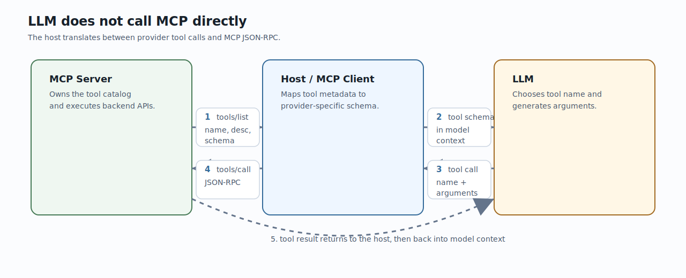

Mermaid source: [`mcp-tool-call-generation-flow.mmd`](../slides/diagrams/mcp-tool-call-generation-flow.mmd)

この仕組みは4つの層に分けると理解しやすい。

| 層 | 役割 | 開発者が設計するもの |
|---|---|---|
| Protocol layer | MCPの`initialize`、`tools/list`、`tools/call`、transport、auth | server SDK、JSON-RPC lifecycle、HTTP/stdio、auth |
| Host adapter layer | MCP tool metadataをOpenAI/Anthropic/Geminiなどのtool schemaへ変換する | client互換性、tool allowlist、approval、retry |
| Model behavior layer | user requestとtool定義を読み、使うtoolとargumentsを生成する | name、description、inputSchema、examples、result設計 |
| Runtime enforcement layer | schema違反や危険操作を抑える | strict schema、validation、human approval、policy |

公開情報から見えるprovider側の工夫:

| 工夫 | 何をしているか | MCP設計への示唆 |
|---|---|---|
| Tool定義のcontext注入 | OpenAIはfunction定義がmodel入力tokenに入り、Anthropicはtool定義からspecial system promptを構築すると説明している。 | tool descriptionはdocsではなくmodel向けUIとして書く。 |
| Tool-use training / post-training | modelがtool call形式、schema、複数step、拒否を学ぶ。Open modelではfunction calling dataでfine-tuningする例がある。 | 自社MCP server側はprovider modelの学習を前提にしすぎず、既存のtool calling能力で扱いやすいsurfaceにする。 |
| Structured Outputs / strict tools | schema遵守を高める。OpenAIはschema理解のtrainingとconstrained decodingの組み合わせを説明している。 | `inputSchema`と`outputSchema`を曖昧にしない。`enum`、範囲、`additionalProperties: false`を使う。 |
| Tool search / deferred loading | 全toolを常時contextに入れず、必要なtoolだけを探して読み込む。 | 大量toolを1 serverに詰め込む場合、catalog分割、semantic routing、tool searchを検討する。 |
| Programmatic tool calling | modelがcodeでtool orchestrationを書き、途中結果をmodel contextへ戻しすぎない。 | 大量データ処理はtool内部またはsandboxed runtimeで集約し、LLMには要約とstable IDを返す。 |
| Tool-use examples | JSON Schemaだけでは使い方の慣習が伝わらないため、examplesで複雑な引数関係を示す。 | 複雑な社内APIではdescriptionだけでなく例、失敗条件、使い分けを書く。 |

したがって「fine-tuningが必要か」という問いへの実務的な答えは、次の順になる。

1. MCP serverを正しく実装する。
2. tool名、description、schema、output、errorを設計する。
3. tool数が増えすぎる場合は、server分割、tool search、deferred loading、gateway routingを使う。
4. evalで誤選択、引数ミス、不要なwrite操作、巨大出力を測る。
5. それでも改善しない場合だけ、function/tool calling向けfine-tuningやRFTを検討する。

社内発表では「MCPのために社内LLMをfine-tuneする」ではなく、「MCPによってLLMに渡されるtool surfaceが明示化されるため、評価・改善・権限制御がしやすくなる」と説明するのが正確である。

### 7. Authorization: なぜOAuth 2.1とaudienceが重要か

Remote MCPでは、serverが誰に何を許可するかを明確にする必要がある。MCP authorization specはOAuth 2.1をベースにしている。Protected Resource Metadata、Authorization Server Metadata / OIDC Discovery、PKCE、Resource Indicators、Client ID Metadata Documentsなどが関係する。


初心者向けに言うと、Remote MCPの認証で避けたい事故は3つ。

1. 他のサービス向けtokenをMCP serverが受け入れてしまう。
2. MCP serverが受け取ったtokenを下流APIへそのまま渡してしまう。
3. どのserver向けに発行されたtokenかを検証しない。

MCP specはtoken passthroughを禁じ、Resource Indicatorsでtokenの対象resourceを明示する方向を強めている。productionのRemote MCPでは、単にBearer tokenを受け取るだけでは足りない。誰のtokenか、どのserver向けか、どのscopeか、いつ失効するか、どの操作に使えるかを検証する。

#### 7.1 Auth前提用語

OAuth関連の用語は多く見えるが、Remote MCPで必要なのは「tokenを安全に得る」「tokenの宛先を間違えない」「必要な権限だけを渡す」の3点である。

| 用語 | 初学者向けの意味 | Remote MCPでの意味 |
|---|---|---|
| Authentication | 誰かを確認すること。例: login。 | userまたはagent/clientが誰かを確認する。 |
| Authorization | 何を許可するかを決めること。 | toolやresourceをどのscopeで使えるかを決める。 |
| OAuth 2.1 | passwordを相手に渡さず、認可serverからtokenを得る枠組み。 | HTTP Remote MCPの認可flowの基礎。 |
| Authorization Server | login、consent、token発行を担当するserver。 | Cognito/Auth0/Okta/社内IdPなど。 |
| Resource Server | tokenを受け取り、保護されたresourceを提供するserver。 | Protected MCP server。 |
| OAuth Client | userに代わってtokenを取得し、resource serverへrequestするapp。 | MCP client/host。 |
| Access Token | APIを呼ぶための短命な鍵。 | MCP requestの`Authorization: Bearer`で送る。 |
| Refresh Token | access tokenを再発行するための長めの鍵。 | host側のsecure storageで扱う。serverへ雑に渡さない。 |
| Scope | tokenで許可される操作範囲。 | `files:read`、`tickets:write`のようにtool権限を絞る。 |
| Audience / Resource | tokenの宛先。 | tokenが特定MCP server向けに発行されたことを検証する。 |
| PKCE | authorization codeを盗まれてもtoken交換されにくくする仕組み。 | public clientであるMCP clientのauthorization code flowを守る。 |
| OIDC Discovery | issuer URLからauthorization/token/JWKS endpointなどを自動発見する仕組み。 | clientがIdP設定を手書きせず発見する。 |

#### 7.2 MCP authorizationで特殊に見える概念

| 概念 | なぜ必要か | 実装上のポイント |
|---|---|---|
| Protected Resource Metadata | clientが「このMCP serverを守るauthorization serverはどこか」を発見する。 | MCP serverは`.well-known/oauth-protected-resource`または`WWW-Authenticate`でmetadataを示す。 |
| Authorization Server Metadata / OIDC Discovery | clientがauthorization endpoint、token endpoint、PKCE対応などを知る。 | auth serverはRFC 8414 metadataまたはOIDC Discoveryを提供する。 |
| Resource Indicators | token request時に対象resourceを明示し、audience-bound tokenを得る。 | clientはauth/token requestに`resource`を含め、serverはtoken audienceを検証する。 |
| Client ID Metadata Document | URL形式のclient_idでclient metadataを公開し、事前登録なしの接続をしやすくする。 | 2025-11-25 specで推奨方向になった。SSRF対策が必要。 |
| Dynamic Client Registration | unknown clientがauthorization serverにclient登録する。 | 互換/fallbackとして扱い、誰でも登録できる状態にしない。 |
| Step-up authorization | scope不足時に必要scopeだけ追加同意してretryする。 | 403 + `WWW-Authenticate` + `insufficient_scope`を読み、再認可する。 |
| Token passthrough禁止 | inbound tokenをdownstream APIに流用すると権限境界が壊れる。 | GatewayやserverはOBO/token exchangeなどで別tokenを取得する。 |

2025-11-25のMCP changelogでは、OIDC discovery support、Client ID Metadata Documents、incremental scope consentが認証まわりの重要変更として入っている。これはRemote MCPが「ローカル開発便利ツール」から「enterpriseで接続・同意・委任を管理するprotocol」へ進んでいることを示す。

### 8. 既存APIをMCP化するときの設計原則

既存APIをMCP対応させる最短路は、API本体を書き換えることではない。APIはそのまま残し、MCP adapterを追加する。


推奨構成:

```text
FastAPI app -> OpenAPI schema -> MCP adapter -> MCP client
                         |
                         +-> route policy / description policy / auth policy
```

設計原則:

- 既存APIをsource of truthにする。
- OpenAPIをAI向け契約として整える。
- MCP adapterは公開面を絞る場所にする。
- API handlerを直接importして呼ぶより、まずはHTTP clientで既存APIを呼ぶほうが安全。
- direct service-layer callは高速だが、auth、middleware、logging、validationを再実装する必要がある。

FastMCPはOpenAPI specからMCP serverを作れる。FastMCP v2.8以降のdefault mappingは「全routeをtool化」する方向なので、productionではRouteMapで明示的に除外・allowlist化するのが重要である。admin/internal/debug endpointを除外し、write系endpointを特別扱いする。

### 9. Tool descriptionはAPI docsではなくモデル向けUIである

Tool descriptionは人間向けのAPI説明ではない。モデルが「このtoolを使うべきか」「どの入力で呼ぶべきか」「呼ぶと外部世界が変わるか」を判断するためのUIである。

良いdescriptionに含めるもの:

- このtoolが何をするか。
- いつ使うべきか。
- いつ使ってはいけないか。
- 入力の形式、単位、制約。
- read-onlyか、状態変更があるか。
- ユーザー確認が必要か。
- 返すstructured outputの形。
- 似たtoolとの使い分け。

悪いdescription:

```text
Inventory endpoint.
```

良いdescription:

```text
Reserve stock for an inventory item after explicit user confirmation.
This decreases available stock. Requires exact SKU and positive quantity.
Returns reserved quantity and remaining stock. Do not use for price quotes
or order creation.
```

descriptionに「必ず確認する」と書くだけでは不十分である。server側でもwrite操作のauth、idempotency、audit log、rate limitを実装する。

### 10. WebMCPはMCPの置き換えではない

ChromeのWebMCP docsは、WebMCPとMCPを「競合ではなく補完」と位置づけている。MCPはbackend/service layer向けで、どのplatformからでも利用できる永続的なserver。WebMCPはfrontend/live web UI向けで、ユーザーが開いているtabに紐づくエフェメラルな仕組みである。

使い分け:

- MCP: core business logic、API操作、DB検索、バックグラウンド処理、社内システム連携。
- WebMCP: ユーザーが開いているWeb画面上の操作、DOMやCookieやlive sessionに紐づく機能。
- Playwright MCP / Chrome DevTools MCP: 開発時に実際のブラウザを操作・検査するためのbridge。

WebアプリをAI agent対応にする場合、「backendはMCP」「frontendはWebMCP」「開発・検証はPlaywright MCP / Chrome DevTools MCP」という三層で考えると整理しやすい。

### 11. Claude、Codex、OpenAIでのRemote MCPの考え方

Claude Codeではremote HTTP serverが推奨され、`claude mcp add --transport http <name> <url>` で追加できる。SSEはdeprecated扱いで、可能ならHTTPを使う。stdio serverはローカルプロセスとして起動され、filesystemやlocal browserのような手元環境に強い。

Claude.ai custom connectorsではRemote MCP server URLを設定し、必要に応じてOAuth client情報を入れる。Team/Enterpriseでは管理者がconnectorを組織に追加し、メンバーが個別に接続する。Remote MCP serverはAnthropic cloud infrastructureから到達可能である必要があるため、VPN内やprivate networkだけに置いたserverはそのままでは使えない。

OpenAIのResponses APIやDeep Research系docsでもMCP connectorsが使われる。ここで重要なのは、MCPは特定vendorの閉じた機能ではなく、複数clientが採用するintegration layerになっていること。ただし、各clientのsupported transport、tool search、output limit、OAuth実装、approval UXは異なる。社内MCP serverを作るなら、公式spec準拠を軸にしつつ、主要clientごとの差分をテストする。

### 12. AWS MCP / Agent Toolkit for AWSの意味

AWS MCP Serverは2026-05-06にGAし、Agent Toolkit for AWSの中核になった。AWSの発表では、managed remote MCP serverとして、coding agentがAWSへ安全にアクセスするための小さな固定tool setを提供すると説明されている。

主なtool:

- `call_aws`: 15,000+ AWS API operationをIAM credentialsで実行。
- `search_documentation`: 最新AWS documentationを検索。
- `read_documentation`: AWS docs/best practicesを読む。
- `run_script`: sandboxed server-side Pythonで複数API呼び出しや集計を1 round-tripにまとめる。

運用上の価値:

- 最新docsをその場で引けるため、modelのknowledge cutoffを補える。
- IAM context keys、IAM/SCP、CloudWatch `AWS-MCP` metrics、CloudTrailでagent操作を人間操作と分けて管理できる。
- read-onlyから始め、write権限は明示的に分離できる。

社内発表では「AWS MCPは便利なAWS操作tool」ではなく、「agentにAWS権限を渡すときの監査・権限制御モデル」として説明するのが重要。

### 13. 開発向けMCPの現状ランキング, 2026-06-07

GitHub API / `gh api` で2026-06-07に再取得したstar数。star数は人気・認知のsignalであり、品質や安全性の保証ではない。大規模product repoとMCP専用repoが混ざるため、採用判断ではmaintainer、release頻度、security posture、client互換性を見る。

| Repo | Stars | Notes |
|---|---:|---|
| `mendableai/firecrawl` | 129,670 | Web search/scrape/crawl product repo。MCP server単体ではない。 |
| `modelcontextprotocol/servers` | 86,854 | reference servers集。公式/参考実装の入口。 |
| `upstash/context7` | 56,904 | current docs lookup。coding agent向けdocs contextで強い。 |
| `ChromeDevTools/chrome-devtools-mcp` | 43,030 | Chrome DevTools for coding agents。frontend debug/perfに強い。 |
| `microsoft/playwright-mcp` | 33,574 | live browser操作、E2E生成、UI再現に強い。 |
| `github/github-mcp-server` | 30,495 | official GitHub MCP server。repo/issue/PR/search。 |
| `oraios/serena` | 25,036 | semantic code retrieval/editing。大規模repo向け。 |
| `GLips/Figma-Context-MCP` | 15,012 | Figma layout contextをcoding agentへ渡す。 |
| `awslabs/mcp` | 9,224 | AWS service-specific open-source MCP servers。 |
| `modelcontextprotocol/registry` | 6,896 | MCP server discovery/publishing基盤。 |
| `firecrawl/firecrawl-mcp-server` | 6,510 | Firecrawl official MCP server。 |
| `browserbase/mcp-server-browserbase` | 3,365 | managed browser automation。 |
| `supabase/mcp` | 2,723 | Supabase project/database連携。 |
| `stripe/ai` | 1,591 | Stripe AI/agent toolkit。 |
| `mongodb-js/mongodb-mcp-server` | 1,044 | MongoDB/Atlas連携。 |
| `getsentry/sentry-mcp` | 720 | Sentry issues/errors。 |

初期導入のおすすめ:

1. GitHub MCP: PR/issue/code search/CI。
2. Context7: 依存ライブラリの最新docs。
3. Playwright MCP: UI操作、E2E生成、回帰再現。
4. Chrome DevTools MCP: console/network/performance/Lighthouse。
5. Serena: 大規模repoのsemantic retrieval/editing。
6. Firecrawl MCP: web調査、公式docs取り込み。
7. AWS MCP / Agent Toolkit: AWS docs/API/CloudWatch/CloudTrail。
8. Figma/Sentry/Supabase/MongoDB/Stripe: チームの業務領域に合わせて追加。

### 14. MCPのリスクを初学者にどう説明するか

MCP serverは便利な連携部品である一方、外部データを読み、外部操作を実行できる。したがって「installして終わり」ではない。

主要リスク:

- Supply chain risk: npm/pipで入れるserver自体が信頼できるか。
- Permission risk: tokenやIAM roleが広すぎないか。
- Prompt injection: external contentがmodelの判断を誘導しないか。
- Tool confusion: 似たtoolが多すぎてmodelが誤選択しないか。
- Data leakage: serverに渡したcontextが外部へ流れないか。
- Local execution risk: stdio serverがlocal filesystemやshellへアクセスできるか。
- Audit gap: 誰が何を実行したか追えないか。

対策:

- official/vendor-maintained serverを優先。
- read-onlyから始める。
- allowed tools / route allowlistでtool surfaceを絞る。
- write toolはuser confirmation、server-side auth、idempotency、audit logを必須にする。
- secretはenv/secret managerから渡し、repoに置かない。
- outputはbounded structured JSONにし、巨大な生データを返さない。
- Remote MCPはOAuth/audience/scope/expiryを確認する。
- ローカルstdio serverは実行commandと権限をレビューする。

### 15. 初学者向けの説明順序

最終資料を誰が読んでも理解できるようにするなら、次の順序がよい。

1. LLMは外部システムを知らない、だから接続規約が必要。
2. MCPはAIアプリと外部システムをつなぐ標準protocol。
3. Host / Client / Serverで責務を分ける。
4. Resources / Tools / Promptsで「読む・実行する・作業テンプレート」を分ける。
5. stdio / Streamable HTTPでlocalとremoteを分ける。
6. Authとconsentがproductionの本体。
7. 既存APIはOpenAPIを整えてMCP adapterで公開する。
8. descriptionはモデル向けのUIとして設計する。
9. WebMCPとブラウザ操作MCPでfrontendもagent対応する。
10. AWS MCPやGitHub MCPなど、開発workflowに効くMCPから導入する。
11. 最後にリスク、管理、ロードマップを説明する。

## One-slide thesis

MCP is becoming the standard interface layer between AI agents and external systems. Its core value is not "more tools"; it is a common protocol for discovery, permissioning, context exchange, tool invocation, and future multi-client interoperability.

Good shorthand:

> MCP is the USB-C-like connector for AI applications, but with security, consent, and protocol lifecycle concerns that USB-C does not have.

## What MCP is

Official definition: MCP is an open protocol that standardizes integration between LLM applications and external data sources/tools. It uses JSON-RPC 2.0, stateful sessions, and capability negotiation.

Core architectural terms:

- Host: the AI application/container, such as Claude Desktop, ChatGPT, Codex, VS Code, Cursor, or another agent app.
- Client: a connector instance inside the host; each client maintains one isolated session to one server.
- Server: a local process or remote service that exposes context and capabilities.

Key analogy:

- Like Language Server Protocol standardized programming-language support across editors, MCP aims to standardize tool/context integration across AI clients.

## Core concepts

Server-side primitives:

- Resources: readable context/data, such as files, schemas, docs, database metadata, or business objects.
- Prompts: reusable prompt templates/workflows, typically user-selected.
- Tools: callable operations, model-controlled by default, such as search, API calls, database queries, issue creation, browser automation, or payment link creation.

Client-side primitives:

- Roots: host-provided filesystem/URI boundaries.
- Sampling: server-initiated LLM calls through the client.
- Elicitation: server requests for additional user input.
- Tasks: experimental durable request tracking and deferred result retrieval in the 2025-11-25 spec.

Important framing:

- Resources are context.
- Prompts are workflows.
- Tools are actions.
- Host/client isolation is a security boundary, not just an implementation detail.

## Basic flow

1. Host configures or discovers an MCP server.
2. Host creates an MCP client for that server.
3. Client and server initialize:
   - negotiate protocol version
   - exchange capabilities
   - exchange implementation metadata
4. Client discovers resources/prompts/tools as needed.
5. Model or user selects relevant capabilities.
6. Host enforces approvals, permissions, and context controls.
7. Client sends JSON-RPC requests to the server.
8. Server returns tool results, resources, prompts, logs, progress, or errors.
9. Shutdown occurs through the transport.

## MCP server construction: engineer-focused patterns

The most useful internal angle is not only "what MCP is", but "how we expose our existing systems safely as model-usable tools". There are three practical patterns:

1. Hand-write a small MCP server around a few high-value operations.
2. Generate an MCP surface from an existing OpenAPI spec, then filter and harden it.
3. Deploy it as a Remote MCP server over HTTPS so Claude, Claude Code, or other MCP clients can connect.

### Pattern A: hand-written tools with FastMCP

This is best for a small, curated tool surface. Type hints and docstrings become the schema and descriptions that the model sees.

```python
from mcp.server.fastmcp import FastMCP

mcp = FastMCP("inventory")

@mcp.tool()
async def get_stock(item_id: str) -> dict:
    """Return current inventory stock for one item."""
    # Replace with DB/API call.
    return {"item_id": item_id, "stock": 42}

@mcp.tool()
async def reserve_stock(item_id: str, quantity: int) -> dict:
    """Reserve inventory for an order. Use only after user confirmation."""
    if quantity <= 0:
        raise ValueError("quantity must be positive")
    return {"item_id": item_id, "reserved": quantity}

if __name__ == "__main__":
    # Local MCP for desktop clients.
    mcp.run(transport="stdio")
```

For stdio servers, never write ordinary logs to stdout because stdout is the protocol channel. Use stderr or structured logging.

### Pattern B: existing FastAPI plus OpenAPI to MCP

FastAPI automatically exposes OpenAPI at `/openapi.json`, and `app.openapi()` returns the same schema in-process. This makes FastAPI a good source for an MCP wrapper.

Existing API:

```python
# inventory_api.py
from fastapi import FastAPI, HTTPException
from pydantic import BaseModel

app = FastAPI(title="Inventory API", version="1.0.0")

class Item(BaseModel):
    id: str
    name: str
    stock: int

ITEMS = {
    "sku-001": Item(id="sku-001", name="Notebook", stock=42),
}

@app.get("/items/{item_id}", tags=["items"])
async def get_item(item_id: str) -> Item:
    """Get a single item by SKU."""
    item = ITEMS.get(item_id)
    if item is None:
        raise HTTPException(status_code=404, detail="item not found")
    return item

@app.post("/items/{item_id}/reserve", tags=["inventory"])
async def reserve_item(item_id: str, quantity: int) -> dict[str, int]:
    """Reserve stock for an item."""
    item = ITEMS.get(item_id)
    if item is None:
        raise HTTPException(status_code=404, detail="item not found")
    if quantity <= 0 or quantity > item.stock:
        raise HTTPException(status_code=400, detail="invalid quantity")
    item.stock -= quantity
    return {"reserved": quantity, "remaining": item.stock}
```

MCP wrapper from the OpenAPI schema:

```python
# inventory_mcp.py
import httpx
from fastmcp import FastMCP
from inventory_api import app

openapi_spec = app.openapi()
api_client = httpx.AsyncClient(base_url="http://127.0.0.1:9000")

mcp = FastMCP.from_openapi(
    openapi_spec=openapi_spec,
    client=api_client,
    name="Inventory MCP",
)

if __name__ == "__main__":
    # Remote-capable HTTP transport. Put HTTPS/auth in front for production.
    mcp.run(transport="http", host="0.0.0.0", port=8000)
```

Run locally:

```bash
uvicorn inventory_api:app --host 127.0.0.1 --port 9000
python inventory_mcp.py
```

The important point for slides: OpenAPI generation is only the starting point. A production MCP server should not blindly expose every endpoint. The model-facing tool surface must be curated.

### Pattern C: filter generated tools before publishing

Use route mapping to exclude internal or dangerous endpoints and to decide whether a route should become a tool, resource, or resource template.

```python
from fastmcp import FastMCP
from fastmcp.server.providers.openapi import MCPType
from fastmcp.utilities.openapi import HTTPRoute

def route_map_fn(route: HTTPRoute, mcp_type: MCPType) -> MCPType | None:
    if route.path.startswith("/admin/"):
        return MCPType.EXCLUDE
    if "internal" in set(route.tags or []):
        return MCPType.EXCLUDE
    if route.method in {"POST", "PUT", "PATCH", "DELETE"}:
        return MCPType.TOOL
    if route.path.startswith("/items/"):
        return MCPType.RESOURCE_TEMPLATE
    return None

mcp = FastMCP.from_openapi(
    openapi_spec=openapi_spec,
    client=api_client,
    name="Inventory MCP",
    route_map_fn=route_map_fn,
)
```

For internal APIs, this filtering layer is where engineering judgment matters most:

- Keep only operations that an AI assistant should actually call.
- Prefer read-only tools first; gate write tools behind confirmation and authorization.
- Give every operation a stable `operationId`, clear tags, precise request/response schemas, and concise descriptions.
- Avoid exposing endpoints with ambiguous side effects.
- Add pagination and output caps; large raw API responses become poor model context.

## Remote MCP for Claude: build and use

Claude can connect to local stdio MCP servers and Remote MCP servers. For Claude.ai custom connectors and team-wide usage, Remote MCP is the relevant architecture.

Minimal deployment shape:

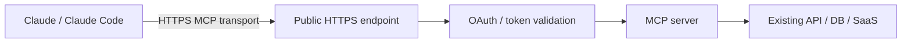

Production requirements:

- Expose the MCP endpoint over public HTTPS. Claude connects from Anthropic cloud infrastructure, even when the user is on Claude Desktop or Cowork.
- Private networks, VPN-only hosts, and firewalled internal services will not work unless access from Anthropic IP ranges is allowed or an approved gateway is used.
- For Claude custom connectors, OAuth is the preferred user-scoped authorization model. For Claude Code development, static headers can be useful, but they are not the best production default.
- Validate `Origin` where applicable, enforce auth on every request, rate limit, and log tool calls for audit.
- Keep server instructions and tool descriptions short and precise; Claude Code truncates server instructions and tool descriptions around a documented size limit.

Claude Code remote MCP example:

```bash
claude mcp add --transport http inventory https://mcp.example.com/mcp

claude mcp add --transport http inventory https://mcp.example.com/mcp \
  --header "Authorization: Bearer $MCP_TOKEN"

claude mcp list
claude mcp get inventory
```

Step-by-step registration checklist for Claude Code:

1. Prepare a reachable Remote MCP endpoint:
   - Recommended transport for remote services: HTTP / Streamable HTTP.
   - Example endpoint: `https://mcp.example.com/mcp`.
   - The endpoint must be reachable from the user's environment for Claude Code, and from Anthropic cloud infrastructure if the same server is used as a Claude.ai custom connector.
2. Decide configuration scope:
   - `--scope local`: available only to the current project/user; good for private experiments and credentials that should not be committed.
   - `--scope project`: stored in project `.mcp.json`; good for team-shared server definitions, but requires trust/approval before use.
   - `--scope user`: available across projects for the current user.
3. Register the server:
   - Basic remote HTTP:
     ```bash
     claude mcp add --transport http inventory https://mcp.example.com/mcp
     ```
   - User-wide:
     ```bash
     claude mcp add --transport http inventory --scope user https://mcp.example.com/mcp
     ```
   - Project-shared:
     ```bash
     claude mcp add --transport http inventory --scope project https://mcp.example.com/mcp
     ```
4. Add auth:
   - Static bearer token for development:
     ```bash
     claude mcp add --transport http inventory https://mcp.example.com/mcp \
       --header "Authorization: Bearer $INVENTORY_MCP_TOKEN"
     ```
   - OAuth-backed server:
     ```bash
     claude mcp add --transport http inventory https://mcp.example.com/mcp
     ```
     Then run `/mcp` inside Claude Code and complete the browser login flow.
5. Verify registration:
   - `claude mcp list`
   - `claude mcp get inventory`
   - `/mcp` inside Claude Code to inspect connection/auth state.
6. Test with a low-risk read-only prompt:
   - Example: "Use the inventory MCP server to list available tools and show the first 5 catalog items."
   - Confirm that tool names, descriptions, auth errors, and output sizes are reasonable.
7. Lock down production configuration:
   - Prefer OAuth over long-lived static bearer tokens.
   - Pin scopes where possible.
   - Keep write-capable tools behind explicit approval.
   - Use short output limits and pagination.
   - Review project-scoped `.mcp.json` before committing it.

Authenticate OAuth-backed servers from inside Claude Code:

```text
/mcp
```

OAuth-specific Claude Code notes:

- Some OAuth servers support Dynamic Client Registration; in that case, `claude mcp add --transport http <name> <url>` followed by `/mcp` is enough.
- If a server requires a pre-registered redirect URI, add a fixed callback port:
  ```bash
  claude mcp add --transport http \
    --callback-port 8080 \
    inventory https://mcp.example.com/mcp
  ```
- If the server requires a pre-created OAuth client, pass the client ID and enter the client secret securely:
  ```bash
  claude mcp add --transport http \
    --client-id "$MCP_CLIENT_ID" --client-secret --callback-port 8080 \
    inventory https://mcp.example.com/mcp
  ```
- If using JSON config, keep the secret outside the JSON and pass `--client-secret`:
  ```bash
  claude mcp add-json inventory \
    '{"type":"http","url":"https://mcp.example.com/mcp","oauth":{"clientId":"your-client-id","callbackPort":8080}}' \
    --client-secret
  ```
- Pin OAuth scopes in `.mcp.json` when security review requires a narrow scope set:
  ```json
  {
    "mcpServers": {
      "inventory": {
        "type": "http",
        "url": "https://mcp.example.com/mcp",
        "oauth": {
          "scopes": "inventory:read inventory:reserve"
        }
      }
    }
  }
  ```
- For internal SSO or short-lived non-OAuth tokens, use `headersHelper` to generate request headers at connection time. The helper must print a JSON object of string headers to stdout.

Project-shared `.mcp.json` example:

```json
{
  "mcpServers": {
    "inventory": {
      "type": "http",
      "url": "${INVENTORY_MCP_URL:-https://mcp.example.com/mcp}",
      "headers": {
        "Authorization": "Bearer ${INVENTORY_MCP_TOKEN}"
      },
      "timeout": 60000
    }
  }
}
```

Claude.ai custom connector usage:

- Pro/Max users can add a custom connector from Claude settings by entering the Remote MCP server URL and optional OAuth client information.
- Team/Enterprise owners add custom connectors from organization settings; members then connect individually.
- If the user is logged into Claude Code with a Claude.ai account, Claude.ai connectors can also appear in Claude Code. Use `/mcp` to inspect and authenticate them.
- If a connector does not appear in Claude Code, check `/status`; API-key, Bedrock, Vertex, or third-party auth modes can prevent Claude.ai connectors from loading.
- Treat every connector as a privileged integration. Review scopes, disable unnecessary tools, and be careful with "always allow" behavior for write-capable tools.

## Multi-agent MCP configuration strategy

When multiple agents or IDEs use the same MCP servers, the main design problem is not "where do I paste this JSON?". It is "which settings are shared as product policy, and which settings stay personal?" The practical rule is:

- Project config defines the shared capability: server name, URL/command, transport, allowed environment names, tool allowlists, and version pins.
- User config defines personal access: OAuth login state, API tokens, local paths, optional personal servers, and per-user deny decisions.
- Organization config defines policy: fixed approved server set, allowlists/denylists, sandbox rules, audit/telemetry expectations, and whether users can add arbitrary servers.
- Remote MCP or a gateway should be preferred for team-wide services. Local `stdio` is useful for local files, Git, and one-developer tools, but it is harder to govern consistently across machines.

The important detail is that MCP client configuration formats are not yet identical across tools. Claude Code and Cursor use `mcpServers`. VS Code uses `servers`. Codex CLI uses TOML. Microsoft APM exists partly to solve this by declaring dependencies once and writing runtime-specific config files.

### Project/user/org scope by client

| Client / runtime | Project scope | User scope | Organization / managed scope | Config key |
|---|---|---|---|---|
| Claude Code | `.mcp.json` at repo root; checked into VCS for team-shared servers | `~/.claude.json`; available across projects for that user | `managed-mcp.json`, `allowedMcpServers`, `deniedMcpServers`, managed settings | `mcpServers` |
| VS Code / GitHub Copilot | `.vscode/mcp.json`; share with project | user profile `mcp.json`; can sync via Settings Sync | `chat.mcp.access`, enterprise policies, sandbox, discovery controls | `servers` |
| Cursor | `.cursor/mcp.json`; project-specific | `~/.cursor/mcp.json`; global | extension API / enterprise automation can register dynamically | `mcpServers` |
| Codex CLI | project `.codex/config.toml` where supported | `~/.codex/config.toml` | distribute via repo policy or package manager | `[mcp_servers.*]` |
| Claude.ai custom connectors | not repo-file based | user connects/authenticates to connector | Team/Enterprise admin adds connector, users authenticate individually | connector settings |
| AWS AgentCore Gateway / Azure API Management | central remote endpoint registered by clients | user or agent authenticates to endpoint | gateway/API management policy, OAuth/OIDC, rate limit, audit | client-specific wrapper |

Decision guide:

- Use project scope when the server is part of the repo workflow, such as Playwright MCP for frontend testing, an internal API MCP for this service, or a docs MCP tied to the project.
- Use user scope when the server is personal or crosses many projects, such as Sentry, personal GitHub, browser automation, or a local note/search server.
- Use organization scope when the server touches production systems, customer data, source control at broad scope, billing, cloud infrastructure, or privileged write operations.
- Use Remote MCP for shared SaaS/internal APIs. Use `stdio` only when the server must run locally or access local files directly.

### Quick command and config snippets

Use these as slide-level examples. They are intentionally short; real production configs should add version pins, scopes, policy, observability, and secret handling.

Claude Code commands:

```bash
# Remote MCP, project-shared
claude mcp add --transport http inventory --scope project https://mcp.example.com/mcp

# Remote MCP, personal cross-project tool
claude mcp add --transport http sentry --scope user https://mcp.sentry.dev/mcp

# Local stdio MCP for a project-local tool
claude mcp add --transport stdio api-tools --scope project -- python tools/mcp_server.py

# OAuth-backed Remote MCP; complete login inside Claude Code
claude mcp add --transport http inventory https://mcp.example.com/mcp
claude
/mcp

# Inspect and remove
claude mcp list
claude mcp get inventory
claude mcp remove inventory
```

Claude Code project `.mcp.json`:

```json
{
  "mcpServers": {
    "inventory": {
      "type": "http",
      "url": "${INVENTORY_MCP_URL:-https://mcp.example.com/mcp}",
      "oauth": {
        "scopes": "inventory:read inventory:reserve"
      }
    },
    "api-tools": {
      "type": "stdio",
      "command": "python",
      "args": ["tools/mcp_server.py"]
    }
  }
}
```

VS Code workspace `.vscode/mcp.json`:

```json
{
  "inputs": [
    { "type": "promptString", "id": "token", "password": true }
  ],
  "servers": {
    "inventory": {
      "type": "http",
      "url": "https://mcp.example.com/mcp",
      "headers": { "Authorization": "Bearer ${input:token}" }
    },
    "playwright": {
      "command": "npx",
      "args": ["-y", "@playwright/mcp"],
      "sandboxEnabled": true
    }
  }
}
```

Cursor project `.cursor/mcp.json`:

```json
{
  "mcpServers": {
    "inventory": {
      "url": "https://mcp.example.com/mcp",
      "headers": {
        "Authorization": "Bearer ${env:INVENTORY_MCP_TOKEN}"
      }
    }
  }
}
```

Codex CLI project `.codex/config.toml` example:

```toml
[mcp_servers.inventory]
transport = "http"
url = "https://mcp.example.com/mcp"

[mcp_servers.playwright]
command = "npx"
args = ["-y", "@playwright/mcp"]
```

Microsoft APM `apm.yml`:

```yaml
name: internal-agent-context
dependencies:
  mcp:
    - io.github.microsoft/playwright-mcp
    - name: inventory
      registry: false
      transport: http
      url: https://mcp.example.com/mcp
```

APM commands:

```bash
apm install --mcp io.github.microsoft/playwright-mcp
apm install --mcp inventory --transport http --url https://mcp.example.com/mcp
apm install
apm mcp list
```

Claude Code managed policy snippets:

```json
{
  "mcpServers": {
    "inventory": {
      "type": "http",
      "url": "https://mcp.internal.example.com/mcp"
    }
  }
}
```

```json
{
  "allowManagedMcpServersOnly": true,
  "allowedMcpServers": [
    { "serverUrl": "https://mcp.internal.example.com/*" }
  ],
  "deniedMcpServers": [
    { "serverCommand": ["npx", "-y", "unapproved-package"] }
  ]
}
```

### Claude Code examples

Project-shared `.mcp.json` should avoid raw secrets and should use stable server names:

```json
{
  "mcpServers": {
    "inventory": {
      "type": "http",
      "url": "${INVENTORY_MCP_URL:-https://mcp.example.com/mcp}",
      "oauth": {
        "scopes": "inventory:read inventory:reserve"
      },
      "timeout": 60000
    },
    "playwright": {
      "type": "stdio",
      "command": "npx",
      "args": ["-y", "@playwright/mcp@0.0.41"]
    }
  }
}
```

Use scope intentionally:

```bash
# Team-shared repo definition
claude mcp add --transport http inventory --scope project https://mcp.example.com/mcp

# Personal server available across projects
claude mcp add --transport http sentry --scope user https://mcp.sentry.dev/mcp

# Private experiment for only this project path
claude mcp add --transport stdio scratch --scope local -- node tools/mcp-dev.js
```

Claude Code precedence matters. When the same server name appears in multiple scopes, Claude Code connects once and uses the highest-precedence entry: local, project, user, plugin-provided, then Claude.ai connector. Entries are not field-merged. This means "same name, partial override" is a bad pattern; define the complete server entry at the intended scope.

For managed organization control, Claude Code supports `managed-mcp.json` at system paths. It can force a fixed server set, disable MCP entirely, or combine fixed servers with allowlists/denylists. Do not store credentials in this file because system-level files are readable by users on the machine; use per-user OAuth, environment expansion, or a `headersHelper`.

Managed Claude Code example:

```json
{
  "mcpServers": {
    "github": {
      "type": "http",
      "url": "https://api.githubcopilot.com/mcp/"
    },
    "company-internal": {
      "type": "http",
      "url": "https://mcp.internal.example.com/mcp",
      "oauth": {
        "scopes": "tools:read tickets:write"
      }
    }
  }
}
```

Policy example:

```json
{
  "allowManagedMcpServersOnly": true,
  "allowedMcpServers": [
    { "serverUrl": "https://api.githubcopilot.com/*" },
    { "serverUrl": "https://mcp.internal.example.com/*" }
  ],
  "deniedMcpServers": [
    { "serverCommand": ["npx", "-y", "unapproved-package"] }
  ]
}
```

Use URL or command allowlist entries for enforcement. A server-name-only allowlist is weak because users choose the label.

### VS Code / GitHub Copilot configuration

VS Code stores MCP configuration in `mcp.json`, but its schema uses a top-level `servers` object rather than `mcpServers`.

Workspace example in `.vscode/mcp.json`:

```json
{
  "inputs": [
    {
      "type": "promptString",
      "id": "inventory-token",
      "description": "Inventory MCP token",
      "password": true
    }
  ],
  "servers": {
    "inventory": {
      "type": "http",
      "url": "https://mcp.example.com/mcp",
      "headers": {
        "Authorization": "Bearer ${input:inventory-token}"
      }
    },
    "playwright": {
      "type": "stdio",
      "command": "npx",
      "args": ["-y", "@playwright/mcp"],
      "sandboxEnabled": true
    }
  },
  "sandbox": {
    "filesystem": {
      "allowWrite": ["${workspaceFolder}"],
      "denyRead": ["${userHome}/.ssh"]
    },
    "network": {
      "allowedDomains": ["mcp.example.com"]
    }
  }
}
```

Operational notes from VS Code docs:

- `.vscode/mcp.json` is the right place for team-shared project servers.
- `MCP: Open User Configuration` opens the user profile `mcp.json`; use it for personal global servers.
- `MCP: Add Server` can write to Workspace or Global.
- Dev Containers can declare MCP servers through `customizations.vscode.mcp.servers`; this is useful when the server should run inside the container rather than on the host.
- VS Code can discover MCP config from other applications when `chat.mcp.discovery.enabled` is enabled.
- Sandbox is available on macOS/Linux for local stdio servers and can restrict file/network access; it is not available on Windows.
- Enable/disable state is stored separately from `mcp.json`, so a shared file can remain stable while each developer toggles tools locally.

### Cursor configuration

Cursor uses `.cursor/mcp.json` for project-specific tools and `~/.cursor/mcp.json` for global tools. Its JSON shape is closer to Claude Code:

```json
{
  "mcpServers": {
    "inventory": {
      "url": "https://mcp.example.com/mcp",
      "headers": {
        "Authorization": "Bearer ${env:INVENTORY_MCP_TOKEN}"
      }
    },
    "local-server": {
      "command": "python",
      "args": ["${workspaceFolder}/tools/mcp_server.py"],
      "env": {
        "API_KEY": "${env:API_KEY}"
      }
    }
  }
}
```

Cursor supports `stdio`, SSE, and Streamable HTTP. Its CLI can reuse the configured MCP servers, and `cursor-agent mcp list` shows configured servers and whether the source is project or global. Cursor also exposes an extension API for programmatic registration without directly editing `mcp.json`, which is useful for enterprise setup automation.

### Microsoft APM as a multi-agent config layer

Microsoft's Agent Package Manager (APM) is not an MCP client by itself. It is a dependency manager for agent context. The useful idea for this presentation is that `apm.yml` can become a single source of truth for skills, prompts, instructions, plugins, and MCP servers, then `apm install` writes runtime-specific files for GitHub Copilot, Claude Code, Cursor, Codex, Gemini, OpenCode, and Windsurf.

Minimal `apm.yml` pattern:

```yaml
name: internal-agent-context
version: 1.0.0

dependencies:
  mcp:
    - io.github.github/github-mcp-server
    - io.github.microsoft/playwright-mcp
    - name: inventory
      registry: false
      transport: http
      url: https://mcp.example.com/mcp
      headers:
        Authorization: "Bearer ${INVENTORY_MCP_TOKEN}"
```

APM writes different target files because each harness has a different schema:

| Harness | File | Shape |
|---|---|---|
| VS Code / Copilot | `.vscode/mcp.json` | JSON `servers` |
| Claude Code | `.mcp.json` or `~/.claude.json` | JSON `mcpServers` |
| Cursor | `.cursor/mcp.json` | JSON `mcpServers` |
| Codex CLI | `.codex/config.toml` or `~/.codex/config.toml` | TOML `[mcp_servers.*]` |
| Gemini CLI | `.gemini/settings.json` or `~/.gemini/settings.json` | JSON `mcpServers` |

This is a good fit when a team wants many agents to see the same curated server set but does not want to maintain five config syntaxes by hand. The tradeoff is that APM becomes another supply-chain dependency, so lockfiles, policy files, and CI checks should be part of adoption.

### Azure API Management / API Center angle

Microsoft Azure API Management (APIM) is a different concept from APM. APIM can expose REST APIs managed in API Management as remote MCP servers, and can also front existing MCP-compatible servers. It is useful for service-provider governance:

- Existing REST operations can become MCP tools.
- APIM can centralize authentication, authorization, rate limits, quotas, IP filtering, caching, and monitoring.
- Azure API Center can register and discover MCP servers as a private enterprise registry.
- Current Microsoft docs note that APIM MCP support focuses on tools and does not support MCP resources or prompts.

For an enterprise provider, this is the pattern:

```text
Agent/IDE -> Remote MCP endpoint in APIM -> policy/auth/rate limit/audit -> existing API or MCP backend
```

This is similar in spirit to AWS AgentCore Gateway: a governed remote endpoint is easier for many agents to consume than many local stdio processes.

### Maintenance checklist for shared MCP settings

- Keep an internal registry: server name, owner, purpose, transport, auth model, data classification, write capability, production impact, and approved clients.
- Pin package versions for `stdio` servers. Avoid `npx -y package` without a version in project-shared config.
- For remote servers, prefer stable HTTPS URLs and OAuth. Avoid committing bearer tokens.
- Review `tools/list` output when upgrading a server. Tool names, descriptions, and schemas are part of the contract seen by the model.
- Keep server descriptions short and front-load safety-critical constraints.
- Separate config from enablement. Let developers disable noisy tools locally without changing shared files where the client supports it.
- Use sandbox or containers for local stdio servers that run arbitrary packages.
- Log tool calls with user, server, tool, arguments class, result status, and correlation ID. Do not log secrets or full sensitive payloads.
- Treat MCP server updates like dependency updates: check release notes, CVEs, tool-surface diffs, auth changes, and approval UX.
- For organization rollout, start with read-only tools and a narrow allowlist, then add write tools with explicit user confirmation and audit.

## MCP server design rules for engineers

These are the rules worth putting into the slide deck:

- Tool surface is product design, not only API wrapping. The model sees names, descriptions, parameters, and results; design them intentionally.
- OpenAPI quality directly determines MCP quality. Poor `operationId`, weak schemas, vague descriptions, and huge response bodies become poor tools.
- Start from read-only, then add write actions with explicit confirmation, authorization, and audit.
- Never expose internal/admin endpoints by default.
- Return structured JSON results, not long prose.
- Separate tool execution errors from protocol errors. Business/API validation failures should come back as tool results or tool execution errors, not broken MCP sessions.
- Keep results bounded with pagination, filters, and summarizable fields.
- Treat prompts, tool descriptions, resource content, and API output as possible prompt-injection surfaces.
- For stdio servers, stdout is reserved for MCP messages.
- For remote servers, HTTPS, OAuth/token handling, rate limits, observability, and key rotation are part of the server, not optional extras.

## Recommended design for adapting an existing API server

For an existing API server, the recommended design is an adapter layer, not a rewrite. Keep the existing API as the source of truth, use OpenAPI as the contract, and publish only a curated MCP surface.

### Recommended layer structure

```text
app/
  api/
    main.py              # Existing FastAPI app
    routers/
      inventory.py       # HTTP routes, response_model, operation_id, tags
  domain/
    inventory_service.py # Business logic shared by API and jobs
  mcp/
    server.py            # MCP adapter
    route_policy.py      # OpenAPI route filtering / mapping
    descriptions.py      # Tool/server description text
  tests/
    test_openapi_contract.py
    test_mcp_tools.py
```

Recommended dependency direction:

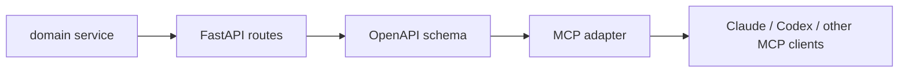

Do not let MCP become a second business-logic implementation. Either:

- call the existing public API through `httpx.AsyncClient`, which preserves auth, validation, rate limits, and observability; or
- call the shared domain/service layer directly if the MCP server runs in the same trusted service boundary.

For most teams, the first version should call the existing API over HTTP because it is easier to reason about and test. Direct service-layer calls are attractive later, but they bypass API middleware unless recreated carefully.

### Import policy

Use one MCP SDK style consistently per server:

```python
# Official MCP SDK quickstart style for hand-written tools.
from mcp.server.fastmcp import FastMCP
```

```python
# FastMCP v2 style for OpenAPI/FastAPI adaptation.
from fastmcp import FastMCP
```

For an existing FastAPI API, keep the imports explicit and boring:

```python
# app/mcp/server.py
import httpx
from fastmcp import FastMCP
from app.api.main import app as fastapi_app
from app.config import settings
from app.mcp.route_policy import route_map_fn

openapi_spec = fastapi_app.openapi()

api_client = httpx.AsyncClient(
    base_url="http://127.0.0.1:9000",
    timeout=30.0,
    headers={"Authorization": f"Bearer {settings.api_token}"},
)

mcp = FastMCP.from_openapi(
    openapi_spec=openapi_spec,
    client=api_client,
    name="Inventory MCP",
    route_map_fn=route_map_fn,
)
```

Design guidance:

- Import the FastAPI `app` only to obtain the OpenAPI schema.
- Keep the outbound API client as the integration boundary.
- Keep route filtering in a separate module so security review is easy.
- Do not scatter MCP decorators across existing HTTP route files unless the service is intentionally MCP-first.
- Do not import private route handlers and call them as normal functions. That often skips request validation, auth dependencies, middleware, tracing, and error handling.

### FastAPI route design for AI-ready OpenAPI

OpenAPI quality directly affects generated MCP tool quality. Design routes with explicit metadata:

```python
from fastapi import APIRouter, HTTPException
from pydantic import BaseModel, Field

router = APIRouter(prefix="/items", tags=["inventory"])

class ReserveRequest(BaseModel):
    quantity: int = Field(..., gt=0, description="Number of units to reserve.")

class ReserveResponse(BaseModel):
    item_id: str
    reserved: int
    remaining: int

@router.post(
    "/{item_id}/reserve",
    operation_id="reserve_inventory_item",
    summary="Reserve inventory for an item",
    description=(
        "Reserve stock for a known inventory item. "
        "This changes inventory state and should be called only after explicit user confirmation."
    ),
    response_model=ReserveResponse,
)
async def reserve_inventory_item(item_id: str, request: ReserveRequest) -> ReserveResponse:
    ...
```

Recommended route metadata:

- `operation_id`: stable, unique, verb-first, model-readable. Example: `reserve_inventory_item`, not `post_items_item_id_reserve`.
- `summary`: one-line action name.
- `description`: when to use it, side effects, constraints, and confirmation requirements.
- `tags`: route grouping used for MCP filtering.
- `response_model`: concrete structured output.
- Pydantic `Field(description=...)`: parameter semantics, units, allowed values, and examples.
- `include_in_schema=False`: hide internal routes from OpenAPI and therefore from generated MCP.

### Route publication policy

Use tags and path conventions to make MCP exposure reviewable:

```python
# app/mcp/route_policy.py
from fastmcp.server.providers.openapi import MCPType
from fastmcp.utilities.openapi import HTTPRoute

BLOCKED_TAGS = {"internal", "admin", "debug"}
WRITE_METHODS = {"POST", "PUT", "PATCH", "DELETE"}

def route_map_fn(route: HTTPRoute, default_type: MCPType) -> MCPType | None:
    tags = set(route.tags or [])
    if tags.intersection(BLOCKED_TAGS):
        return MCPType.EXCLUDE
    if route.path.startswith(("/admin", "/debug", "/internal")):
        return MCPType.EXCLUDE
    if route.method in WRITE_METHODS:
        return MCPType.TOOL
    if route.method == "GET" and "catalog" in tags:
        return MCPType.RESOURCE_TEMPLATE
    return MCPType.TOOL
```

Recommended policy:

- GET/search/list routes can become tools or resources depending on client support.
- Write routes should remain tools because they are explicit actions.
- Admin/debug/internal routes should be excluded twice: first from OpenAPI with `include_in_schema=False`, then from MCP route policy.
- Start with an allowlist for production if the API is large or sensitive.

### Description design policy

Descriptions are not normal API docs. They are model-facing decision aids. A good description answers:

1. What action does this tool perform?
2. When should the model use it?
3. What inputs are required, and what format/units do they use?
4. Does it read data or change state?
5. What user confirmation or permission is required?
6. What output shape should the model expect?
7. When should the model not use it?

Good read-only example:

```text
Read a single inventory item by exact SKU. Use when the user asks for current
stock, item name, or item status for a known SKU. No side effects. Returns
JSON with id, name, stock, and status.
```

Good write-action example:

```text
Reserve stock for an inventory item after explicit user confirmation. This
decreases available stock. Requires exact SKU and positive quantity. Returns
reserved quantity and remaining stock. Do not use for price quotes or order
creation.
```

Poor description:

```text
Inventory endpoint.
```

Reason: it does not explain action, timing, side effects, input expectations, or output.

Description rules:

- Put the most important instruction first. Claude Code truncates tool descriptions and server instructions at a documented limit, so late caveats may disappear.
- Prefer concrete verbs: `read`, `search`, `reserve`, `create`, `cancel`, `summarize`.
- State side effects explicitly: `No side effects`, `Creates a ticket`, `Deletes a draft`, `Sends an email`.
- Use business names users know, not only internal table/API names.
- Include disambiguation for similar tools: "Use this for current stock; use `search_inventory_items` when SKU is unknown."
- Keep auth and confirmation requirements in the description for write tools.
- Avoid vague promises such as "gets data", "handles inventory", or "does the operation".
- Avoid embedding secrets, internal URLs, or policy text that should live in server-side enforcement.

### Server instructions design

Server instructions help the client decide when to search or load tools, especially when tool search is enabled.

Recommended shape:

```text
This server provides inventory lookup and reservation tools for the internal
commerce platform. Use it when the user asks about item stock, SKU availability,
or reserving inventory. Prefer read-only lookup tools before reservation tools.
Reservation tools change inventory state and require explicit user confirmation.
```

Keep server instructions short and front-load:

- domain/category of tasks
- when to search these tools
- key capabilities
- safety rule for write tools

### Test plan for API-to-MCP adaptation

Minimum tests:

- OpenAPI contract test: every exposed route has `operationId`, `summary`, `description`, tags, and response schema.
- Route policy test: admin/internal/debug routes are excluded.
- Tool list smoke test: generated MCP server exposes expected tool names only.
- Tool execution test: representative GET and write endpoints call the API and return structured results.
- Auth test: unauthenticated remote calls fail.
- Output-size test: list/search tools paginate or cap results.

Example contract test:

```python
def test_mcp_exposed_routes_have_ai_ready_metadata():
    spec = fastapi_app.openapi()
    for path, methods in spec["paths"].items():
        for method, operation in methods.items():
            if "internal" in operation.get("tags", []):
                continue
            assert operation.get("operationId")
            assert operation.get("summary")
            assert operation.get("description")
            assert operation.get("responses")
```

## Connection protocols / transports

MCP has one protocol message format and multiple ways to carry those messages. The message format is JSON-RPC 2.0. The transport answers a different question: "how do the client and server physically exchange those JSON-RPC messages?"

Beginner framing:

- Protocol message: `initialize`, `tools/list`, `tools/call`, result, error, notification.
- Transport: stdio, HTTP, SSE stream, or another bidirectional channel.
- Lifecycle: every transport still follows the same MCP lifecycle: initialize -> initialized -> normal operation -> shutdown.

### Common lifecycle for all transports

The initialization phase is not optional. The client starts with `initialize`, the server returns protocol version, capabilities, and server info, then the client sends `notifications/initialized`.

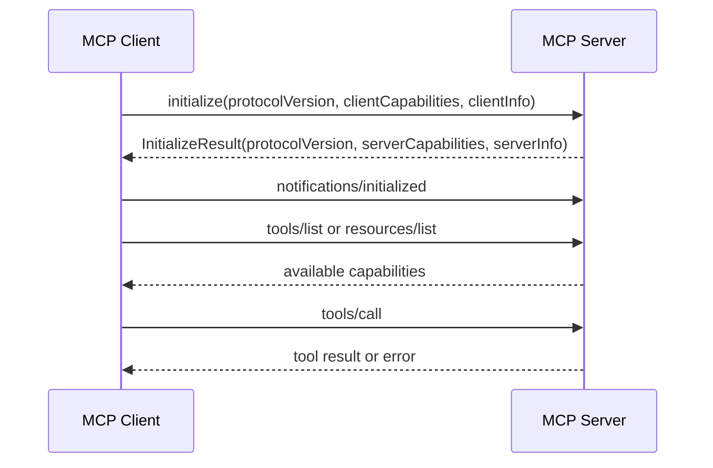

Key rule:

- Both sides must respect the negotiated protocol version and capabilities.
- A client should not call `tools/list` unless the server declared tool capability.
- A server should not use client-side features such as sampling unless the client declared support.

### Transport comparison

- stdio:
  - Client launches server as subprocess.
  - Good for local tools and developer workflows.
  - Credentials should usually come from environment/config, not OAuth flow.
  - stdout must contain only valid MCP messages; stderr is for logs.
  - Best for filesystem, local git, local browser, local scripts, and developer-only tools.

- Streamable HTTP:
  - Server exposes a single MCP endpoint using HTTP POST and GET.
  - Supports JSON response or SSE streaming.
  - Replaces the older HTTP+SSE transport from the 2024-11-05 spec.
  - Better for remote servers, hosted services, organization-wide deployment.
  - Best for SaaS, internal platform MCP, Claude custom connectors, and shared team servers.

- HTTP+SSE, legacy:
  - Older transport from protocol version 2024-11-05.
  - Deprecated for new servers, but clients may maintain backwards compatibility.
  - Uses a GET-established SSE stream plus a POST endpoint announced by the server.

- WebSocket / custom transports:
  - Not one of the two current standard transports in the MCP spec.
  - The spec allows custom transports if they preserve JSON-RPC message format and lifecycle requirements.
  - Claude Code supports remote WebSocket server configuration, but recommends HTTP for request/response style remote servers because HTTP has better OAuth support in the CLI flow.

| Transport | Standard status | Connection ownership | Best fit | Main caution |
|---|---|---|---|---|
| stdio | Current standard | Client starts local process | Local tools, dev workflows | stdout is protocol-only; local process privileges are powerful |
| Streamable HTTP | Current standard | Server exposes HTTP endpoint | Remote/shared servers | auth, Origin validation, session handling |
| HTTP+SSE | Deprecated legacy | SSE stream + POST endpoint | Older servers | use only for compatibility |
| WebSocket/custom | Implementation-specific | Persistent bidirectional socket | event-heavy custom clients | less portable; document handshake and auth clearly |

### stdio overview and connection flow

stdio is the simplest local transport. The host launches the MCP server command as a subprocess, then talks to it through stdin/stdout. Each JSON-RPC message is newline-delimited. The server may log to stderr, but must not write non-protocol text to stdout.

Typical config shape:

```json
{
  "mcpServers": {
    "filesystem": {
      "command": "npx",
      "args": ["-y", "@modelcontextprotocol/server-filesystem", "/path/to/project"]
    }
  }
}
```

Flow:

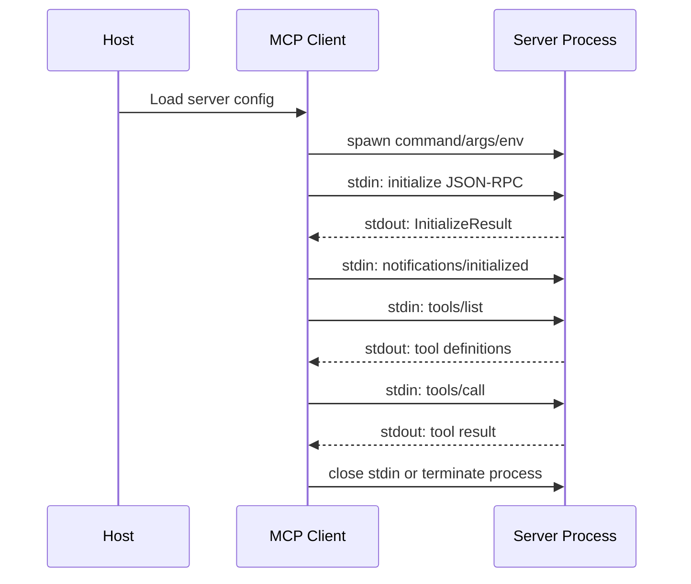

Good fit:

- Local filesystem and git access.
- Browser automation that needs local Chrome.
- Small custom scripts.
- Developer-only tools where remote hosting would add overhead.

Avoid:

- Shared enterprise services.
- Multi-user SaaS connectors.
- Long-lived org-wide tools needing OAuth, audit, rate limiting, and centralized lifecycle.

Security notes:

- Treat the command exactly like running a local program.
- Review package source and command arguments.
- Use env vars or secret managers for credentials; do not commit secrets into `.mcp.json`.
- For stdio, `print()` / `console.log()` can break the protocol if they write to stdout.

### Streamable HTTP overview and connection flow

Streamable HTTP is the current remote-friendly standard. The server exposes a single MCP endpoint, commonly like `https://example.com/mcp`, that supports POST and optionally GET. POST carries JSON-RPC messages from client to server. A request can return a normal JSON response or open an SSE stream for streaming responses. GET can be used to open a server-to-client SSE stream for notifications or server-initiated messages.

Typical Claude Code config:

```bash
claude mcp add --transport http inventory https://mcp.example.com/mcp
```

Typical JSON config:

```json
{
  "mcpServers": {
    "inventory": {
      "type": "http",
      "url": "https://mcp.example.com/mcp",
      "headers": {
        "Authorization": "Bearer ${INVENTORY_MCP_TOKEN}"
      }
    }
  }
}
```

Basic request/response flow:

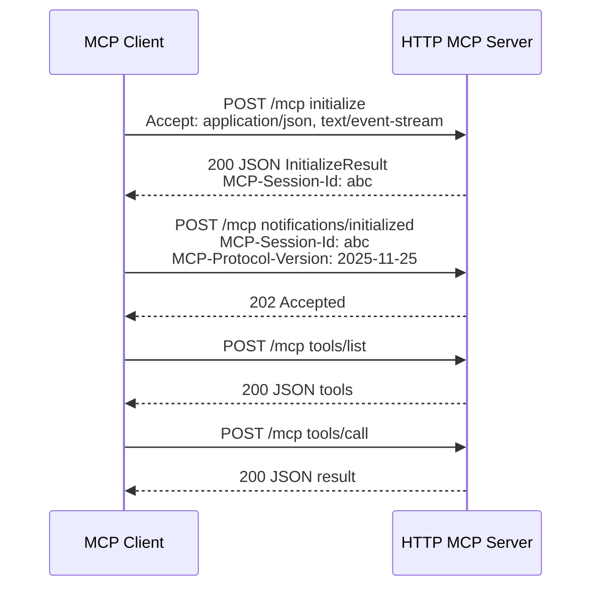

Streaming flow:

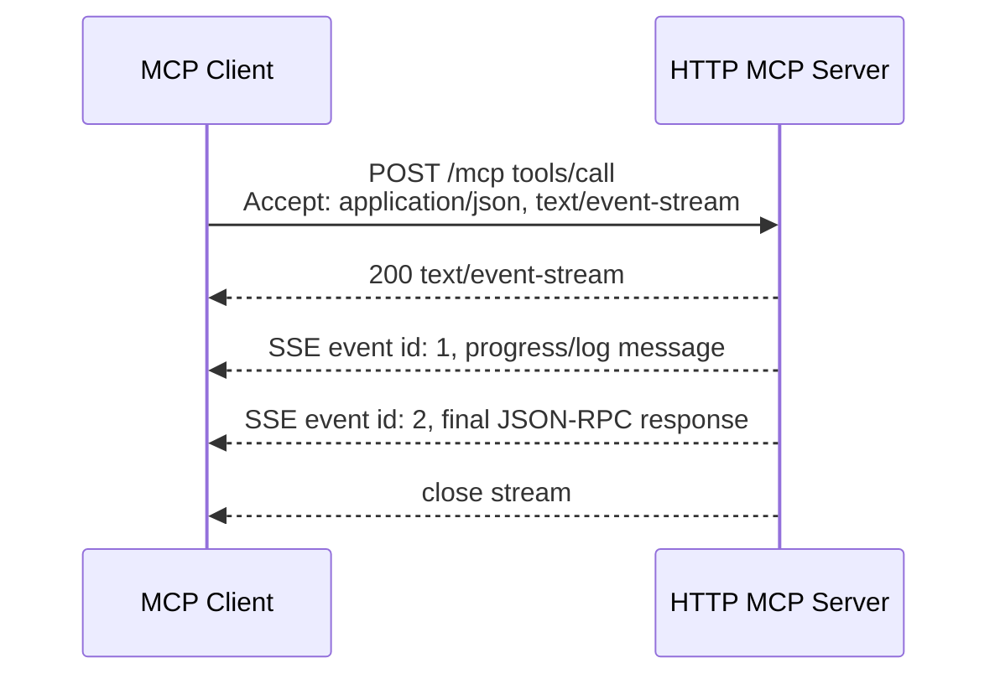

Optional server-to-client stream:

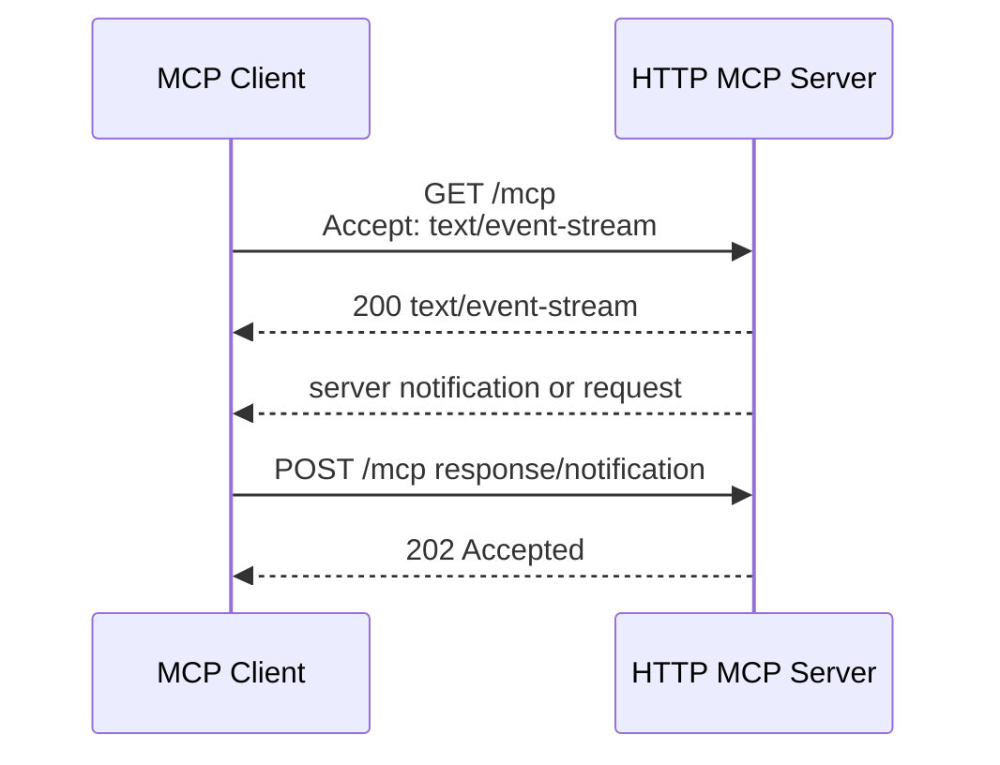

Session and recovery details:

- Server may return `MCP-Session-Id` during initialization.
- Client must include `MCP-Session-Id` on later HTTP requests when the server gave one.
- Client must include `MCP-Protocol-Version` on subsequent HTTP requests.
- SSE events may include IDs; client can use `Last-Event-ID` to resume after disconnection.
- Client can send HTTP DELETE with `MCP-Session-Id` to explicitly terminate a session if the server supports it.

Security notes:

- Validate `Origin` on incoming HTTP connections to reduce DNS rebinding risk.
- Local HTTP MCP servers should bind to `127.0.0.1`, not `0.0.0.0`, unless they are intentionally exposed.
- Remote servers should implement authentication and authorization.
- For production, prefer OAuth 2.1-compatible flows and audience-bound tokens over static shared tokens.

### HTTP+SSE legacy overview and flow

HTTP+SSE was the older remote transport used by the 2024-11-05 protocol. It is deprecated for new work, but compatibility matters because existing servers and clients may still use it.

High-level difference:

- Old HTTP+SSE: client first opens an SSE stream and receives an `endpoint` event; client sends JSON-RPC messages to the announced POST endpoint; server replies over the SSE stream.
- Streamable HTTP: client sends JSON-RPC messages to one MCP endpoint via POST; the server may respond with JSON or SSE; GET to the same endpoint is optional for server-to-client streaming.

Legacy flow:

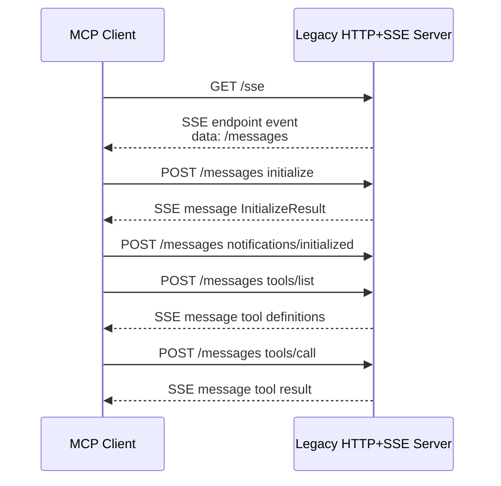

Compatibility detection:

- A client can try POST initialize to the supplied server URL.
- If it fails with expected status codes such as 400, 404, or 405, the client can try GET and look for the old SSE `endpoint` event.
- New servers should prefer Streamable HTTP; old servers may host both old and new endpoints during migration.

### WebSocket and custom transports

The latest MCP specification is transport-agnostic beyond the two standard transports. Custom transports are allowed if they preserve JSON-RPC message format and MCP lifecycle. WebSocket is one common custom option because it gives a persistent bidirectional channel.

Claude Code supports remote WebSocket configuration through JSON, for example:

```json
{
  "mcpServers": {
    "events-server": {
      "type": "ws",
      "url": "wss://mcp.example.com/socket",
      "headers": {
        "Authorization": "Bearer ${EVENTS_TOKEN}"
      }
    }
  }
}
```

Generic custom WebSocket flow:

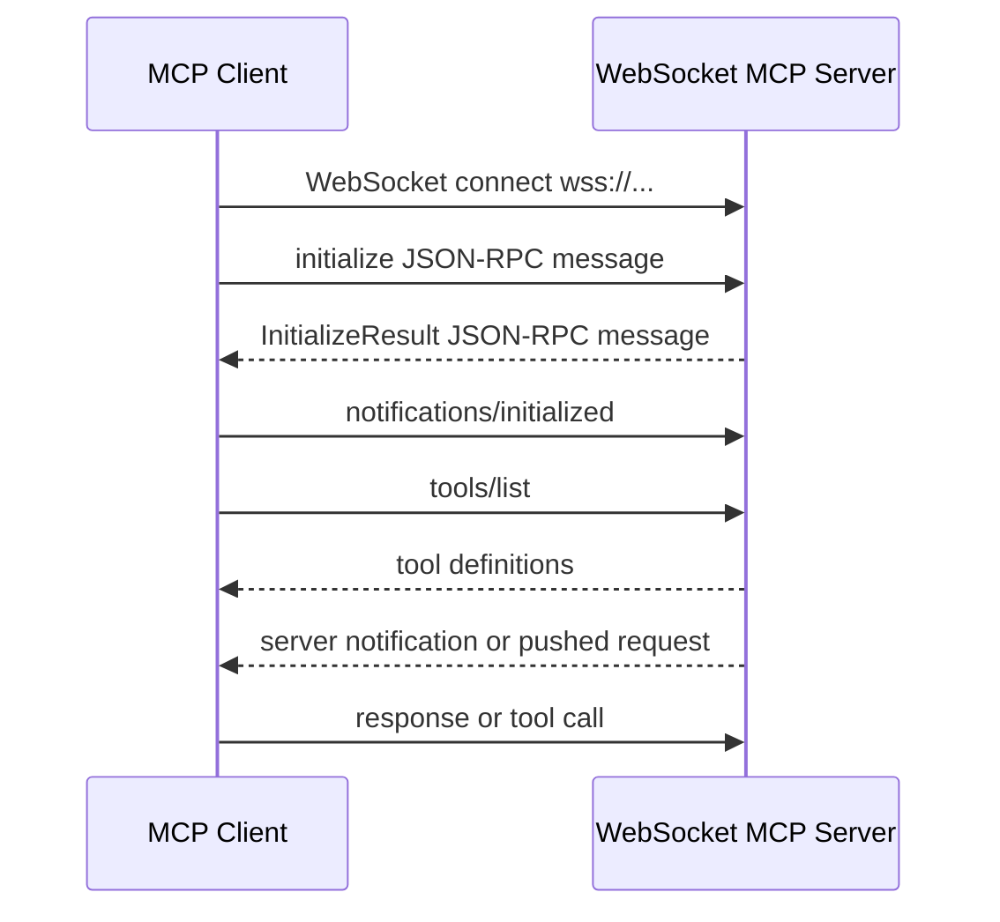

When to consider:

- Server needs continuous push events.
- Client explicitly supports the custom transport.
- You control both client and server or can document the connection contract clearly.

When not to choose it:

- You want broad MCP client compatibility.
- You need standard OAuth setup through existing MCP client commands.
- Request/response HTTP is enough.

### WebMCP is not an MCP transport

WebMCP should not be grouped with stdio, Streamable HTTP, or WebSocket. WebMCP is a browser-side API proposal for exposing web page capabilities to browser-based agents. It is inspired by MCP, but it is not a direct JavaScript implementation of MCP and not a transport for MCP JSON-RPC messages.

Practical mental model:

- MCP transport: how an MCP client talks to an MCP server.
- WebMCP: how a live web page declares frontend capabilities to a browser agent.
- Browser-operation MCPs such as Playwright MCP and Chrome DevTools MCP: MCP servers that let an agent inspect/control a browser during development.

Security points for HTTP:

- Validate Origin headers to reduce DNS rebinding risk.
- Local HTTP servers should bind to localhost, not 0.0.0.0.
- Use authentication for remote or sensitive servers.
- Include MCP-Protocol-Version on subsequent HTTP requests after negotiation.

## Auth specification

MCP authorization is optional overall, but HTTP-based protected servers should follow the MCP authorization spec.

Current direction:

- OAuth 2.1 based flow.
- MCP server acts as OAuth resource server.
- MCP client acts as OAuth client.
- Authorization server issues access tokens.
- Protected Resource Metadata (RFC 9728) is required for server authorization discovery.
- Authorization Server Metadata (RFC 8414) or OpenID Connect Discovery 1.0 is required on the auth server side.
- Resource Indicators (RFC 8707) bind tokens to the intended MCP server.
- PKCE is required for authorization code protection.
- Client ID Metadata Documents were added/recommended in 2025-11-25 for no-prior-relationship client registration.
- Dynamic Client Registration remains possible but is no longer the main recommended path in the latest spec.

Rules to emphasize:

- Send bearer tokens in Authorization headers, not query strings.
- Include authorization on every HTTP request.
- Do not accept or forward tokens that were not issued for the MCP server.
- Token passthrough is forbidden.
- Treat scopes as least-privilege and support incremental/step-up authorization where possible.

## Maintenance and specification governance

MCP is not maintained as an IETF RFC. The normative source is the Model Context Protocol specification and schema in the `modelcontextprotocol/modelcontextprotocol` GitHub organization and the published documentation at `modelcontextprotocol.io`.

Current governance picture:

- MCP has been established as "Model Context Protocol, a Series of LF Projects, LLC".
- Anthropic announced on 2025-12-09 that it was donating MCP to the Agentic AI Foundation (AAIF), a directed fund under the Linux Foundation, co-founded by Anthropic, Block, and OpenAI, with support from Google, Microsoft, AWS, Cloudflare, and Bloomberg.
- The governance document says governance changes approved by the project must also be approved by LF Projects, LLC.
- Technical governance is individual-maintainer based, not company-seat based.
- Lead Maintainers, Core Maintainers, and Maintainers together form the MCP Steering Group.
- Core Maintainers steer the MCP specification and overall project direction. Lead Maintainers have final decision authority.
- Proposed major specification changes use Specification Enhancement Proposals (SEPs).
- Working Groups produce concrete deliverables such as SEPs, reference implementations, SDK work, registry work, or tooling. Interest Groups collect problems, use cases, and recommendations.

What is "RFC" and what is not:

- MCP itself is not an RFC. It is an open protocol specification maintained by the MCP project.
- MCP uses JSON-RPC 2.0 for message envelopes. JSON-RPC 2.0 is a standalone specification, not an IETF RFC.
- The MCP specification uses RFC 2119 / RFC 8174 terminology (`MUST`, `SHOULD`, `MAY`) to express requirement levels.
- MCP authorization builds on standard OAuth/OIDC and RFC documents, including RFC 9728 Protected Resource Metadata, RFC 8414 Authorization Server Metadata, RFC 8707 Resource Indicators, PKCE, and OIDC Discovery.
- Therefore the accurate phrasing is: "MCP is governed by the MCP project under LF Projects/AAIF, while parts of its auth/security design reference established RFC/OIDC standards."

Maintenance responsibilities for a team adopting MCP:

- Track the spec version your servers target. The current docs expose versioned specs such as `2025-06-18` and `2025-11-25`, plus `latest` and `draft`.
- Treat schema changes as protocol changes. The official repo states that the TypeScript schema is the source of truth and JSON Schema is generated for compatibility.
- Subscribe to spec changelogs and SEP activity for features that affect operations, especially authorization, transports, server identity, tool filtering, tasks, and registry metadata.
- Keep SDK versions aligned with the protocol revision you support. Do not assume every client has implemented the newest optional feature.
- Build compatibility tests around `initialize`, `tools/list`, `tools/call`, auth challenge handling, and cancellation/error behavior.
- Document which features your server supports: tools, resources, prompts, elicitation, sampling, roots, and transport/auth combinations.

## History

- 2024-11-25: Anthropic announced and open-sourced MCP, including the spec/SDKs, local MCP support in Claude Desktop, and a repository of prebuilt servers.
- Early examples included Google Drive, Slack, GitHub, Git, Postgres, and Puppeteer.
- Early adopters/participants named by Anthropic included Block, Apollo, Zed, Replit, Codeium, and Sourcegraph.
- The initial transport included HTTP+SSE.
- Later specs introduced Streamable HTTP, stronger auth, better security guidance, and richer capabilities.
- 2025-11-25 latest spec changes include OIDC discovery support, Client ID Metadata Documents, incremental scope consent, icon metadata, URL elicitation, tool calling support in sampling, experimental tasks, SDK tiering, governance, and working/interest groups.
- 2025-12-09: Anthropic announced the donation of MCP to the Linux Foundation's Agentic AI Foundation while keeping the MCP governance model community-driven.
- The old third-party server list in `modelcontextprotocol/servers` has been retired in favor of the MCP Registry.
- The MCP Registry preview launched 2025-09-08; its v0.1 API entered a freeze on 2025-10-24 according to the registry repo.

## Main use cases

Engineering:

- Repo/issue/PR operations through GitHub MCP.
- Local file and Git context through Filesystem/Git reference servers.
- Browser/web fetch automation through Fetch/Puppeteer-like servers.
- Documentation lookup through docs MCPs such as OpenAI docs, Context7, or DeepWiki.
- Design-to-code workflows through Figma MCP.
- Observability triage through Sentry MCP.

Enterprise knowledge:

- Search and fetch private docs from Google Drive, Notion, SharePoint, Slack, Gmail, etc.
- Bring database schemas, project artifacts, and customer-support context into agents.
- Use MCP as a controlled context layer rather than copying data manually into prompts.

Business operations:

- Payments/billing operations via Stripe MCP.
- Calendar/email workflows via Google/Microsoft connectors.
- CRM/BI/internal tool workflows through company-owned MCP servers.

Agent platform:

- Standardize how agents discover external tools.
- Enable cross-client reuse.
- Move from prompt-only automation to governed action execution.

Frontend / browser agents:

- WebMCP is a Chrome proposal for exposing frontend capabilities to browser-based agents.
- WebMCP is not a replacement for MCP. Chrome positions MCP as the backend/service-layer integration and WebMCP as the frontend/live-tab integration.
- WebMCP is tab-bound and ephemeral, while MCP servers are persistent local or remote services.
- Browser automation MCPs such as Playwright MCP and Chrome DevTools MCP bridge the gap today: they let agents inspect DOM, click, navigate, collect screenshots, inspect network/console logs, and generate tests.
- Chrome DevTools MCP also exposes WebMCP-related tools in its tool catalog, making it relevant for debugging pages that adopt WebMCP.

## Well-known MCP servers / surfaces

Official or high-signal examples:

- GitHub MCP Server: official GitHub server for repositories, issues, PRs, search, security alerts, Copilot-related tools.
- Stripe MCP: public preview remote MCP server for Stripe API operations and Stripe knowledge search.
- OpenAI connectors / remote MCP: Responses API supports `type: "mcp"` for remote servers and built-in connectors.
- MCP reference servers: Everything, Fetch, Filesystem, Git, Memory, Sequential Thinking, Time.
- MCP Registry: emerging "app store"-like server discovery/publishing infrastructure.

OpenAI connector examples:

- Dropbox
- Gmail
- Google Calendar
- Google Drive
- Microsoft Teams
- Outlook Calendar
- Outlook Email
- SharePoint

Developer-useful MCPs in this Codex environment:

- GitHub: repos, issues, PRs, CI/PR workflows.
- Figma: design context, screenshots, design-to-code and deck/diagram workflows.
- Google Drive/Docs/Sheets/Slides: private docs and collaborative artifacts.
- Slack: message/thread/channel context and drafting.
- Notion: knowledge base, specs, docs, task/project context.
- Sentry: issue/error context.
- Firecrawl: web search/scraping/crawling.
- Context7: current library/framework docs.
- OpenAI Developer Docs: current official OpenAI API/Codex docs.
- 1Password: environment/secrets workflows.
- Node REPL: runtime-backed JS execution.
- AWS knowledge / AWS plugins: cloud/agent infrastructure guidance.

Developer-useful MCPs from GitHub/community signals:

Star counts below were fetched from GitHub API on 2026-06-07. They should be treated as popularity signals, not quality guarantees.

| MCP / repo | Stars | Practical development value |
|---|---:|---|
| `mendableai/firecrawl` | 129,668 | Web search/scrape/crawl for research and docs ingestion. This is the product repo, not only the MCP server repo. |
| `modelcontextprotocol/servers` | 86,854 | Reference filesystem, git, memory, fetch, time, and protocol example servers. |
| `upstash/context7` | 56,903 | Current library/framework docs for coding agents. |
| `ChromeDevTools/chrome-devtools-mcp` | 43,029 | Browser debugging, performance trace, network/console inspection, screenshots, Lighthouse, WebMCP tools. |
| `microsoft/playwright-mcp` | 33,574 | Browser operation and E2E test generation from live DOM/app state. |
| `github/github-mcp-server` | 30,495 | Repository, issue, PR, code search, and workflow operations. |
| `oraios/serena` | 25,034 | Semantic code retrieval and editing for large codebases. |
| `awslabs/mcp` | 9,224 | AWS service-specific open-source MCP servers; Agent Toolkit for AWS is now the recommended managed path. |
| `mendableai/firecrawl-mcp-server` | 6,509 | Official Firecrawl MCP server package. |
| `modelcontextprotocol/registry` | 6,896 | MCP server discovery and publishing infrastructure. |
| `browserbase/mcp-server-browserbase` | 3,365 | Managed browser automation with Browserbase/Stagehand. |
| `supabase-community/supabase-mcp` | 2,723 | Supabase database/project access for AI assistants. |
| `figma/mcp-server-guide` | 1,554 | Official Figma MCP usage guide; Figma also provides hosted/desktop MCP options. |
| `getsentry/sentry-mcp` | 720 | Sentry issue/error context for coding assistants. |

Recommended adoption order for development teams:

1. GitHub MCP for repository operations.
2. Context7 for current docs.
3. Playwright MCP for UI operation and E2E test generation.
4. Chrome DevTools MCP for frontend debugging, network, console, performance, screenshots, and WebMCP inspection.
5. Serena for semantic code understanding/editing.
6. Firecrawl MCP for web research and documentation ingestion.
7. AWS MCP / Agent Toolkit for AWS for cloud documentation, API calls, metrics, and audit-friendly operations.
8. Figma and Sentry MCPs when design-to-code or runtime triage are central to the workflow.

## Frontend: WebMCP and browser-operation MCPs

Chrome's WebMCP documentation frames WebMCP and MCP as complementary:

- MCP is for backend/service logic: agents can use data/actions from anywhere.
- WebMCP is for frontend/live web UI: browser agents understand capabilities in the user's current tab.
- MCP has persistent local/remote server lifecycle; WebMCP is ephemeral and tied to page visits.
- MCP discovery is through agent/client configuration; WebMCP discovery occurs when the user visits a page that declares tools.

Design implication:

- Use MCP for core API actions and data retrieval.
- Use WebMCP to declare frontend actions and page-specific affordances.
- Use Playwright MCP and Chrome DevTools MCP during development to inspect, test, and debug the actual UI.

Playwright MCP:

- Official Microsoft server at `microsoft/playwright-mcp`.
- Gives AI coding assistants direct access to a live browser session.
- Useful for DOM inspection, clicking, navigation, test generation, and reproducing user flows.
- Typical configuration:

```json
{
  "mcpServers": {
    "playwright": {
      "command": "npx",
      "args": ["@playwright/mcp@latest"]
    }
  }
}
```

Chrome DevTools MCP:

- Official Chrome DevTools server at `ChromeDevTools/chrome-devtools-mcp`.
- Tool categories include input automation, navigation, emulation, performance, network, debugging, memory, extensions, third-party developer tools, and WebMCP tools.
- Useful for console/network inspection, Lighthouse, performance traces, screenshots, heap snapshots, and connecting to running Chrome.
- Typical configuration:

```json
{
  "mcpServers": {
    "chrome-devtools": {
      "command": "npx",
      "args": [
        "chrome-devtools-mcp@latest",
        "--headless=true",
        "--isolated=true"
      ]
    }
  }
}
```

Important Chrome DevTools MCP options:

- `--autoConnect`: connect to a local Chrome instance with remote debugging enabled.
- `--browserUrl=http://127.0.0.1:9222`: connect to a running debuggable Chrome instance.
- `--isolated=true`: use a temporary Chrome profile per session.
- `--slim`: expose only a small navigation/script/screenshot tool set.
- `--category-experimental-webmcp`: enable WebMCP debugging tools; Chrome flags are required.

## AWS MCP and Agent Toolkit for AWS

AWS announced the AWS MCP Server general availability on 2026-05-06. It is now part of Agent Toolkit for AWS.

Key points:

- Managed remote MCP server.
- Supports secure authenticated access to AWS services through a small fixed tool set.
- `call_aws` can execute AWS API operations using IAM credentials.
- `search_documentation` and `read_documentation` retrieve current AWS documentation.
- `run_script` executes Python server-side in a sandboxed environment.
- CloudWatch metrics are published under the `AWS-MCP` namespace.
- CloudTrail captures API calls for audit.
- IAM context keys can distinguish agent-initiated actions and support read-only or blocked action policies.
- Agent Toolkit for AWS is the recommended successor to AWS Labs MCP servers, plugins, and skills, while AWS Labs continues to work and accept contributions.

Claude Code setup example from AWS:

```bash
claude mcp add-json aws-mcp --scope user \
  '{"command":"uvx","args":["mcp-proxy-for-aws@latest","https://aws-mcp.us-east-1.api.aws/mcp","--metadata","AWS_REGION=us-west-2"]}'
```

Generic MCP configuration:

```json
{
  "mcpServers": {
    "aws-mcp": {
      "command": "uvx",
      "timeout": 100000,
      "transport": "stdio",
      "args": [
        "mcp-proxy-for-aws@latest",
        "https://aws-mcp.us-east-1.api.aws/mcp",
        "--metadata", "AWS_REGION=us-west-2"
      ]
    }
  }
}
```

Management recommendations:

- Start read-only.
- Separate human permissions from agent permissions.
- Use IAM/SCP controls and AWS MCP context keys where available.
- Monitor `AWS-MCP` CloudWatch metrics.
- Review CloudTrail for agent-initiated changes.
- Prefer Agent Toolkit for AWS for managed enterprise rollout; keep AWS Labs MCPs for service-specific local workflows and experimentation.

## Building Remote MCP on AWS with AgentCore Gateway and Identity

This section is about building a Remote MCP surface on AWS for internal or product APIs. It is different from using the AWS MCP Server. The AWS MCP Server gives agents access to AWS APIs and AWS documentation. AgentCore Gateway lets a team expose its own tools and APIs through a managed MCP-compatible gateway.

### Mental model

AgentCore Gateway is an agent-to-tool connectivity layer:

```text
Claude / Codex / app agent
  -> AgentCore Gateway MCP endpoint
  -> Gateway targets
  -> existing APIs, Lambda functions, external MCP servers, AWS services, SaaS
```

The direction matters:

- If "my agent needs to call my API", use AgentCore Gateway as a tool gateway.
- If "my app needs to invoke my agent", invoke AgentCore Runtime directly, not Gateway.
- If "my agent needs to call an existing MCP server", add that MCP server as a Gateway target.

AWS documentation describes Gateway as a single access point where agents discover and interact with tools and services. In aggregation mode, Gateway acts as a virtual MCP server and combines capabilities from multiple MCP targets into one consolidated catalog.

### What Gateway can expose as MCP tools

Target options:

| Target type | When to use | Notes |
|---|---|---|
| OpenAPI specification | Existing REST/FastAPI service | Gateway translates MCP calls to REST calls. Good for existing API servers. |
| Lambda function | Custom tool logic | Good when the tool is small or when you want IAM execution role control. |
| MCP server | Third-party or internal Remote MCP server | Gateway discovers tools/prompts/resources and exposes them through the unified catalog. |
| API Gateway REST API | Existing API Gateway-backed service | Useful when the API is already fronted by AWS API Gateway. |
| Smithy model | AWS/custom service model | Useful for strongly described service interfaces. |
| Built-in integration provider templates | Standard SaaS/tool integrations | Use where AWS provides a managed template. |

For existing FastAPI/OpenAPI APIs, this gives a managed alternative to writing and operating a custom FastMCP adapter. The trade-off is that Gateway becomes the central policy/auth/catalog layer, while the existing API remains the business-logic source of truth.

### Gateway and MCP protocol behavior

Gateway has two broad target categories:

- MCP targets:
  - Operate in aggregation mode.
  - Gateway combines capabilities into a single virtual MCP server.
  - Clients see one `tools/list` response.
  - Supports capability synchronization, semantic tool search, and target-level 3-legged OAuth.
- HTTP targets:
  - Gateway proxies requests directly.
  - No MCP aggregation/protocol translation.
  - Used for HTTP services such as AgentCore Runtime agents.

For MCP server targets, AWS docs call out:

- Tools are required; prompts and resources are optional.
- Supported MCP protocol versions include `2025-06-18`, `2025-03-26`, and `2025-11-25`.
- DEFAULT listing mode discovers capabilities through `SynchronizeGatewayTargets` and caches/indexes the catalog.
- DYNAMIC listing mode discovers capabilities at invocation time, but is not currently interoperable with semantic search or outbound 3-legged OAuth.
- When tools, prompts, or resources change for DEFAULT targets, call `SynchronizeGatewayTargets`.
- If the target MCP server is hosted on AgentCore Runtime, enabling MCP sessions or allowing `Mcp-Session-Id` request/response headers avoids repeated initialization and can reduce latency.

### AgentCore Identity's role

AgentCore Identity complements Gateway by handling identity and credential management for agents and tool access:

- Workload identity:
  - Gives each agent/workload a distinct identity.
  - Lets Gateway and tools reason about "which agent is acting".
- Token vault:
  - Stores OAuth access/refresh tokens, API keys, and OAuth client secrets.
  - Uses AWS KMS encryption and access controls.
- OAuth flow orchestration:
  - Supports OAuth 2.0 Client Credentials (2LO) and Authorization Code (3LO).
  - Integrates with existing identity providers rather than forcing user migration.
- OIDC/user context:
  - Can validate inbound user tokens and pass user context to the agent/workload.
  - If the access token lacks full user context, the agent can call the OIDC userinfo endpoint.
- On-Behalf-Of token exchange:
  - Exchanges an inbound user access token for a new downstream-scoped token.
  - Preserves both agent identity and original user identity so downstream systems can enforce fine-grained authorization.

### Inbound and outbound authorization

A useful way to explain AgentCore Gateway is "two auth boundaries":

1. Inbound authorization: who can call the Gateway MCP endpoint?
2. Outbound authorization: how does Gateway call the target service?

Inbound options described by AWS include:

- OAuth JWT: validates tokens from Cognito, Auth0, or other OIDC-compatible providers.
- IAM SigV4: AWS identity-based access.
- Authenticate-only: validate token but delegate authorization to the downstream target.
- No authorization: development/testing only.

Outbound options vary by target type, but include:

- IAM-based outbound authorization with Gateway service role.
- Caller IAM credentials for use cases where the downstream target authorizes based on the original caller.
- OAuth client credentials grant (2LO).
- OAuth authorization code grant (3LO).
- OAuth token exchange / On-Behalf-Of (OBO).
- Token passthrough, only when inbound authorization is authenticate-only.
- API key.
- No authorization, not recommended.

### OAuth/OIDC patterns to explain in the slide deck

Pattern 1: Machine-to-machine API

```text
Agent -> Gateway -> target API
Gateway outbound auth: OAuth client credentials or IAM service role
Identity stores client secret / manages provider
```

Use when the agent acts as the application rather than a specific human user.

Pattern 2: User-delegated SaaS or MCP server

```text
Agent user -> Gateway
Gateway target -> OAuth authorization code flow
Identity token vault stores user-scoped access/refresh token
Gateway calls target on behalf of that user
```

Use when the tool must access GitHub, Slack, Google, or another user-scoped service.

Pattern 3: On-Behalf-Of / zero-trust downstream

```text
Inbound OIDC user token
  -> AgentCore Identity OBO token exchange
  -> downstream-scoped access token
  -> target API validates user + agent context
```

Use when the downstream service needs a token whose audience is that service, not the Gateway, while preserving the original user identity.

Pattern 4: Token passthrough

```text
Inbound token validated by Gateway authenticate-only
  -> same token forwarded to target
  -> target validates and authorizes
```

Use carefully. It is simple, but shifts authorization responsibility to the target and is not the same as OBO token exchange.

### OAuth-protected MCP server targets

When Gateway connects to an OAuth-protected MCP server target, AWS documents two target creation approaches for Authorization Code flow:

1. Implicit sync during target creation/update/synchronization:
   - Admin completes Authorization Code flow.
   - Gateway uses the resulting access token to list tools from the MCP server.
   - Returned tool definitions are cached and indexed.
2. Provide schema upfront during target creation/update:
   - Admin provides tool schema directly.
   - Gateway does not need to fetch tools dynamically at creation time.
   - This avoids human intervention during create/update and lets teams expose a curated subset of tools.
   - Static schema targets cannot be synchronized until the static schema is removed.

At invocation time, a Gateway user invoking a protected tool may trigger Authorization Code flow for that specific MCP server. AgentCore Identity uses URL session binding to verify that the user who started the auth flow is the same user who completed consent. The session URI and authorization URL have a short validity window.

### Recommended AWS build patterns

Pattern A: Existing FastAPI/OpenAPI service

```text
FastAPI /openapi.json
  -> AgentCore Gateway OpenAPI target
  -> inbound OAuth JWT or IAM
  -> outbound OAuth/API key/IAM depending on API auth
  -> Claude/Codex registers Gateway MCP endpoint
```

Design guidance:

- Keep OpenAPI operation IDs stable and agent-readable.
- Use response schemas and pagination.
- Exclude admin/debug/internal endpoints before publishing the target.
- Prefer OAuth/OIDC for user-scoped operations.

Pattern B: Custom internal tool with Lambda

```text
Lambda function
  -> AgentCore Gateway Lambda target
  -> IAM service role outbound auth
  -> Gateway exposes Lambda as MCP-compatible tool
```

Design guidance:

- Good for small, strongly scoped tools.
- Use IAM execution role and CloudWatch/CloudTrail for operations.
- Return compact structured results.

Pattern C: Existing MCP server

```text
Remote MCP server
  -> AgentCore Gateway MCP server target
  -> capability sync / semantic search
  -> Gateway virtual MCP server
```

Design guidance:

- Use DEFAULT listing mode plus `SynchronizeGatewayTargets` for stable catalogs.
- Use DYNAMIC mode only when live discovery is worth losing semantic search/3LO compatibility.
- For MCP server targets, prefer OAuth or IAM where supported; avoid no-auth for production.
- If a third-party MCP server only supports API-key style auth, confirm current Gateway support before choosing this path; otherwise wrap the call in OpenAPI/Lambda or handle it outside Gateway.

Pattern D: Enterprise OIDC/OAuth delegation

```text
Enterprise IdP / OIDC user token
  -> Gateway inbound OAuth JWT
  -> AgentCore Identity workload token
  -> OBO or 3LO downstream token
  -> target API / SaaS / MCP server
```

Design guidance:

- Use OBO when downstream service requires its own audience-specific token.
- Use Authorization Code when explicit user consent is required.
- Keep scope sets narrow and auditable.

### Operational controls

For production Remote MCP on AWS:

- Require inbound auth on the Gateway endpoint.
- Treat Gateway target definitions as production integration contracts.
- Keep Gateway execution roles least-privileged.
- Store API keys/OAuth credentials in AgentCore Identity/Secrets Manager, not code.
- Use CloudTrail for API-level audit and CloudWatch for operational metrics.
- Enable semantic tool search when Gateway has a large catalog.
- Keep tool outputs bounded and paginated.
- Re-synchronize Gateway targets when MCP server tools/prompts/resources change.
- For write tools, combine user approval in the AI client with IAM/OAuth scope enforcement at Gateway/target.
- Explicitly document who owns each auth boundary: client -> Gateway, Gateway -> target, target -> backend.

## Important MCP rules

## CLI / MCP / browser operation comparison

This section explains why an engineering team should prefer MCP when a suitable MCP server exists, while still keeping CLI and browser automation in the toolbox.

### What is being compared

The comparison is not "which interface is always best". It is "which interface gives an AI coding agent the most reliable, least wasteful path to an external system".

- CLI:
  - The agent writes shell commands and reads stdout/stderr.
  - Examples: `gh pr view`, `aws logs filter-log-events`, `curl`, `jq`, `grep`, `npm test`.
  - Strength: deterministic local execution, scriptability, mature ecosystem.
  - Weakness: flags and output formats are human/terminal-oriented; output can be very large; auth and environment vary by machine.
- Browser operation:
  - The agent navigates a UI using screenshots, accessibility trees, DOM snapshots, selectors, DevTools, or Playwright-style control.
  - Examples: opening GitHub checks page, clicking a SaaS admin screen, inspecting console/network in a live app.
  - Strength: best when the UI itself is the product or when the only available interface is a web UI.
  - Weakness: layout, selectors, viewport, loading state, auth state, modals, and animations make the flow brittle and token-heavy.
- MCP:
  - The agent calls typed tools/resources/prompts exposed by a server through JSON-RPC and a supported transport.
  - Examples: GitHub issue/PR tools, Sentry error tools, Context7 docs lookup, Playwright MCP, AWS MCP, internal API MCP.
  - Strength: schema-based discovery, bounded inputs/outputs, service-side validation, auth boundary, and explicit capability metadata.
  - Weakness: requires a server to exist and be operated correctly; poorly designed tools can still leak data or return oversized results.

### Token-count model

Exact token counts depend on the model, client, tool result, and prompt history. The numbers below should be presented as engineering estimates, not benchmark results. A useful mental model is: every command, page snapshot, tool schema, raw log, JSON response, retry, and explanatory message consumes context.

| Task | CLI typical context cost | Browser typical context cost | MCP typical context cost |
|---|---:|---:|---:|
| Check PR status and inspect failing CI | 3k-20k tokens | 5k-30k tokens | 800-4k tokens |
| Search current library/API docs | 2k-15k tokens | 5k-25k tokens | 500-3k tokens |
| Create or update an issue/PR | 1k-8k tokens | 5k-20k tokens | 500-2k tokens |
| Inspect UI console/network/performance | 3k-20k tokens | 4k-25k tokens | 1k-8k tokens with Chrome DevTools MCP |
| Query operational data with filters | 2k-30k tokens | 5k-30k tokens | 800-5k tokens |

Why CLI can be expensive:

- Raw stdout/stderr is usually optimized for humans, not agents.
- Logs and test output often include repeated context, stack traces, progress bars, and unrelated lines.
- The agent spends tokens deciding and correcting flags, parsing text, and issuing follow-up grep/jq commands.
- A command failure often requires another command to inspect auth, config, region, profile, or path state.

Why browser operation can be expensive:

- Browser agents need page state: accessibility tree, DOM structure, screenshot context, network logs, console logs, or all of them.
- UI actions are sequential and stateful: navigate, wait, inspect, click, wait, inspect again.
- The same semantic action may require many low-level operations because the UI is not a stable machine contract.
- Screenshots are useful for visual verification, but they do not replace structured data when the task is data/action-oriented.

Why MCP can be cheaper:

- Tool search can defer full tool definitions until needed. Claude Code's current docs state that only tool names and server instructions load at session start when tool search is enabled; tools are discovered on demand.
- Tool descriptions and input schemas make the correct call easier to select.
- Results can be structured, summarized, paginated, and capped by the server.
- The server can expose task-level operations, such as `get_failing_check_log(pr_number)`, instead of forcing the agent to navigate or parse raw logs.

### Flow stability comparison

| Dimension | CLI | Browser operation | MCP |
|---|---|---|---|
| Interface contract | Command syntax and text output | UI layout, DOM, visual state | Tool/resource schema |
| Auth boundary | Local env, credential files, CLI login | Browser session/cookies | Server auth/OAuth/scopes |
| Failure mode | Wrong flags, env drift, huge output | Selector drift, modal/loading/viewport issues | Schema error, permission error, server error |
| Human approval | External to protocol unless client wraps it | Usually manual or client-specific | Expected in host UX for tool calls |
| Output control | Caller must pipe/filter | Snapshot size varies | Server can paginate/summarize/cap |
| Best use | Local build/test/devops commands | UI and visual validation | Repeatable data/action workflows |

The practical distinction is that MCP moves intent from "infer the right low-level action" to "call a declared capability". This reduces two common failure classes:

1. The agent invents or misremembers a CLI flag, selector, URL path, or page flow.
2. The agent receives too much undifferentiated output and spends additional turns summarizing or filtering it.

### Same task example: failing CI investigation

CLI flow:

```text
gh pr view --json statusCheckRollup
gh run list --branch <branch>
gh run view <run-id> --log-failed
grep/sed/awk/jq to narrow logs
possibly rerun with different flags
```

This is powerful and often the right local choice, but raw failed logs can dominate the context window.

Browser flow:

```text
Open PR page
Inspect checks area
Click failing check
Wait for log page
Search within UI
Possibly switch tabs/views
```

This is useful when the UI state matters, but it is usually the least stable path for pure data extraction.

MCP flow:

```text
github.get_pull_request(owner, repo, number)
github.list_check_runs(ref)
github.get_failed_check_log(run_id, max_lines=200)
```

If the MCP server provides focused tools, the agent receives the data shape it needs with less navigation and less raw output.

### Why prefer MCP when available

Use MCP first when the task is a repeatable interaction with a service, API, repository, database, or operational system.

- The model sees a typed capability instead of guessing a command or UI path.
- The host can show users what tool is being invoked and ask for approval on sensitive operations.
- The server can enforce least privilege, rate limits, tenant boundaries, and audit logging.
- The service provider can update implementation details without requiring agents to relearn CLI flags or UI flows.
- The response can be bounded and structured, which reduces token waste and makes follow-up automation safer.

### When CLI is still better

- Local filesystem work, package scripts, compilation, tests, one-off shell inspection, and low-level debugging.
- Operations where the CLI is already the canonical interface and output can be constrained with flags.
- Tasks that need arbitrary shell composition or direct access to local process state.
- Cases where no trustworthy MCP server exists.

### When browser operation is still better

- Visual QA, layout inspection, screenshot verification, accessibility checks, performance tracing, and live UI debugging.
- Workflows where no API or MCP surface exists.
- Tasks that depend on a user's active browser session, cookies, or tab-specific state.
- Frontend agent experiences where WebMCP can declare page-level capabilities tied to the live site.

### Service provider perspective

For service providers, the question is not "should we publish a CLI, API, browser UI, or MCP?" Mature products often need all of them. The question is which interface should be agent-native.

| Provider surface | Primary audience | Agent effectiveness | Provider control |
|---|---|---|---|
| Browser UI | Humans | Low to medium; high friction for agents | High visual control, low machine predictability |
| CLI | Developers/operators | Medium; strong for local automation | Medium; hard to constrain arbitrary output/use |
| REST/OpenAPI | Applications | High for software, medium for agents | High, but agents need descriptions and workflows |
| MCP | AI clients/agents | High when tools are curated | High: scopes, audit, consent, output caps, task-level tools |

MCP is especially effective for a provider when:

- The product has many workflows that agents can perform on behalf of users.
- The public API is broad, but the agent-safe surface should be narrower.
- The provider wants to preserve auth, policy, and audit boundaries.
- The provider wants to reduce agent-driven screen scraping or brittle browser automation.
- The provider can expose higher-level tools such as `summarize_incident`, `create_release_note`, or `get_customer_health_snapshot`, not just raw CRUD.

### Token-aware MCP server design

The best MCP server is not the one with the most tools. It is the one that lets the agent find the right tool and receive the smallest sufficient result.

- Provide a search/list tool first, then a detail/read tool second.
- Return summaries plus stable IDs, not entire logs or documents by default.
- Use pagination, cursors, `limit`, `since`, `severity`, `status`, and `fields` parameters.
- Include `structuredContent` or schema-shaped JSON for data the agent must reason over.
- Use resources for large read-only context and tools for actions.
- Keep tool descriptions concise; put critical rules at the beginning because some clients truncate long descriptions.
- Separate dangerous writes from safe reads and require explicit confirmation for state changes.
- Avoid one mega-tool such as `call_api(method, path, body)` unless it is gated by a strict allowlist.
- Add provider-side defaults such as max lines, max rows, max bytes, and safe timeouts.
- Make error messages actionable: include missing scope, invalid parameter, rate limit, or retry guidance.

### Recommended interface choice

Use this decision rule in the presentation:

1. If the task is a repeatable service/API/data action and a trusted MCP exists, use MCP.
2. If the task is local build/test/debugging or shell-native, use CLI.
3. If the task is visual, UI-stateful, or browser-session-specific, use browser operation or WebMCP.
4. If the provider owns the service and wants agent adoption, build MCP on top of the API and keep the browser UI for humans.

Security and trust:

- Treat MCP servers as code/data trust boundaries.
- Prefer official servers hosted by the service provider.
- Require approval for sensitive tool calls.
- Use `allowed_tools` or equivalent filtering to reduce tool surface.
- Log/review data sent to third-party MCP servers where policy permits.
- Consider prompt injection especially when tools can read sensitive data or take actions.
- Do not embed or fetch arbitrary URLs from MCP outputs without domain trust checks.
- Do not use broad all-access scopes by default.
- Avoid token passthrough and enforce audience validation.
- For local MCP, show exact commands before execution and sandbox where possible.

Protocol/design:

- Keep servers focused and composable.
- Declare capabilities accurately.
- Do not assume another client supports a capability until negotiated.
- Validate inputs and outputs.
- Separate protocol errors from tool execution errors.
- Use structured output/schema when downstream automation matters.
- Use timeouts, cancellation, and progress for long-running operations.

Operational:

- Remote servers need auth, lifecycle, rate limits, and auditability.
- Local stdio servers are powerful but inherit local process privileges.
- Large tool catalogs increase cost/latency; defer or filter tool loading.
- Server descriptions/tool metadata are model inputs and should be curated.

## Future important points

## Current state, roadmap, controversy, and non-developer expansion, 2026-06-08

### Executive synthesis

MCP is no longer just a developer tool protocol. The credible current picture is:

- **High confidence**: MCP has moved from Anthropic-originated experiment to multi-vendor infrastructure. Anthropic launched MCP on 2024-11-25 as an open standard for connecting AI assistants to data systems and tools. On 2025-12-09 Anthropic donated MCP to the Agentic AI Foundation under the Linux Foundation, with backing from Anthropic, Block, OpenAI, Google, Microsoft, AWS, Cloudflare, and Bloomberg. Official roadmap and governance pages now describe WGs, IGs, SEPs, maintainers, and enterprise-readiness work.
- **High confidence**: Current production pressure is not "how to send JSON-RPC" but **trust, authorization, discovery, observability, and enterprise administration**. The official roadmap lists transport/session work, agent communication, governance maturation, enterprise readiness, triggers, streamed/reference results, security/authorization, extension ecosystem, conformance tests, SDK tiers, and reference implementations.
- **High confidence**: Authentication has converged around HTTP-based OAuth/OIDC patterns, but implementation maturity remains uneven. The latest authorization spec says authorization is optional overall, HTTP transports should follow the spec, stdio should retrieve credentials from the environment, and HTTP authorization is based on OAuth 2.1, RFC 8414 authorization server metadata, RFC 7591 dynamic client registration, RFC 9728 protected resource metadata, RFC 8707 resource indicators, PKCE, audience validation, and no token passthrough.
- **Medium to high confidence**: The biggest controversy is security semantics, not syntax. Public security research and guidance focus on tool poisoning/line jumping, prompt injection through tool descriptions/resources/results, malicious or compromised MCP servers, overly broad scopes, token passthrough, confused deputy, registry/marketplace trust, local stdio command execution, and weak user approval UX.
- **High confidence**: Non-developer use cases are expanding into CRM, finance, sales, service, enterprise knowledge, calendar/email/docs, analytics, and industry data. Examples include Salesforce hosted MCP servers exposing org data/flows/Apex/actions to AI clients, Claude finance connectors for FactSet/MSCI/LSEG/S&P Global, OpenAI connectors for Gmail/Calendar/Drive/Teams/Outlook/SharePoint/Dropbox, and NetSuite MCP/AI Connector workflows for finance, inventory, analytics, and role-based business access.

### Timeline and controversy history


| Period | What happened | Why it matters |
|---|---|---|
| 2024-11 | Anthropic announced MCP as an open standard for connecting AI assistants to content repositories, business tools, and development environments. | Framed MCP as the answer to fragmented, custom AI integrations. |
| Early 2025 | Local stdio servers and developer tools drove adoption. | MCP proved useful quickly, but inherited local process privileges and tool-description trust issues. |
| 2025-04 | Invariant Labs and Trail of Bits popularized tool poisoning / line jumping concerns. | The dispute shifted from "MCP is convenient" to "tool metadata is model input and can be adversarial before any tool call." |
| 2025-03 to 2025-06 | Remote MCP and Streamable HTTP matured; OAuth-based authorization became central. | Production deployments needed internet-reachable servers, sessions, auth, and enterprise policy. |
| 2025-11 | One-year spec release added/clarified major capabilities such as tasks, authorization improvements, extensions, and enterprise/security features. | MCP moved from local connector protocol toward production agent infrastructure. |
| 2025-12 | Anthropic donated MCP to AAIF under the Linux Foundation. | Addressed vendor-neutrality concerns and formalized a multi-company governance direction. |
| 2026 | NSA and other security groups published MCP security guidance; enterprise vendors expanded MCP support. | Current state is "adopt, but govern aggressively." |

The debate has two legitimate sides:

- Pro-MCP argument: A common protocol is better than every AI product inventing its own connector, screen scraping, plugin format, or tool schema. Provider-owned MCP servers can enforce scope, audit, consent, output caps, and domain-specific workflows.
- Skeptical argument: MCP can collapse trust boundaries if hosts blindly inject tool descriptions into model context, users connect untrusted servers, local stdio commands run with broad privileges, or remote servers implement OAuth incorrectly. The protocol cannot by itself prove tool intent or sanitize downstream content.

The balanced position for this deck:

> MCP is becoming the standard integration layer for agentic systems, but production use is security engineering, not just connector installation.

### Authentication and authorization methods

| Method | Where it fits | Main risk / design point |
|---|---|---|
| stdio + environment credentials | local developer tools, local filesystem/git/browser servers | inherits local user privileges; secrets must not leak to stdout/logs |
| HTTP Bearer token | simple remote/internal server | acceptable for controlled systems, but weak if no audience/scope validation |
| OAuth 2.1 authorization code + PKCE | user-delegated Remote MCP | best general pattern for user consent and public clients |
| Dynamic Client Registration | unknown MCP clients connecting to new auth servers | reduces manual registration friction but needs policy and validation |
| Protected Resource Metadata / Authorization Server Metadata | client discovers auth server for protected MCP resource | prevents hardcoded auth assumptions |
| Resource Indicators / audience binding | token is minted for a specific MCP server | critical to prevent token replay across services |
| Step-up authorization / incremental scopes | request stronger scope only when needed | aligns least privilege with actual tool call |
| Token exchange / OBO | gateway or agent invokes downstream APIs as user/agent | avoids forbidden token passthrough and preserves delegation chain |
| Workload identity / DPoP / mTLS-like sender constraints | server-to-server and enterprise environments | roadmap/extension area for stronger proof-of-possession and machine identity |

Implementation rule:

- The MCP server should validate inbound tokens for itself.
- The MCP server should obtain separate downstream credentials for backend APIs.
- The MCP server should not forward the MCP client's token as-is to a downstream API.
- Hosts should show approvals for sensitive calls and log what data is sent to remote servers.

### Main future disputes

| Dispute | Question | Likely direction |
|---|---|---|
| Trust and attestation | How does a host know a server/tool is the one it claims to be? | registry metadata, server cards, signatures, enterprise allowlists, conformance tests |
| Tool metadata as prompt | Are descriptions executable influence over the model? | tool-description review, pinning, diff alerts, tool annotations, policy scanners |
| Auth boundary | Is the user, client, host, server, or downstream API the principal? | resource indicators, OBO token exchange, workload identity, enterprise SSO |
| Local stdio power | Should local MCP be treated like running arbitrary code? | explicit command display, sandboxing, trusted project config, org policy |
| Marketplace/registry safety | Who vets public MCP servers? | official provider servers, trust tiers, vulnerability disclosure, private registries |
| Large tool catalogs | How does a model select from thousands of tools? | tool search, programmatic tool calling, deferred loading, semantic routing |
| UI-bearing MCP | Should MCP return interactive UI, not just text/data? | MCP Apps/extensions, sandboxed iframes, auditable postMessage JSON-RPC |
| Event-driven agents | How do servers push changes or long-running results safely? | triggers, tasks, streamed/reference results, resumption protocols |

### Non-developer use-case expansion

MCP's early adoption was developer-heavy because GitHub, filesystem, browser, database, and cloud operations are easy to demonstrate. The current enterprise expansion is broader:

| Domain | MCP value | Examples from public sources |
|---|---|---|
| Sales / CRM | pull account history, opportunities, case activity, stakeholders inside an AI assistant | Salesforce hosted MCP servers |
| Finance | trusted market data, index data, DCF/morning notes, accounting workflows | Claude finance connectors for FactSet/MSCI/LSEG/S&P Global; NetSuite AI Connector |
| Customer support | connect agents to tickets, CRM, order status, external systems | Salesforce Agentforce and Zendesk-style agent interoperability |
| Enterprise knowledge | query Drive, SharePoint, Teams, Outlook, Dropbox, docs, internal knowledge | OpenAI connectors and Claude connectors |
| Operations / analytics | discover trends, generate dashboards, query data warehouse, summarize incidents | NetSuite analytics workflow, internal ops MCP servers |
| Life sciences / healthcare | connect research platforms and regulated data contexts | Claude connector directory categories such as life sciences/healthcare |
| Retail / inventory | multimodal intake, inventory logging, sales order creation | NetSuite inventory and MCP Apps examples |
| Low-code agents | business users attach external tools without building custom integrations | Copilot Studio MCP GA, Agentforce MCP client/server support |

The pattern is not "everyone becomes a developer." It is "business users stay inside an assistant, while providers expose governed workflows through MCP."

### Roadmap interpretation

Official roadmap language is intentionally non-committal: items are priorities, not promises. Still, the direction is clear:

1. **Transport scalability**: simplify HTTP/session/resumption and avoid proliferating official transports.
2. **Agent communication**: tasks, retry, expiry, long-running operations, call-now/fetch-later semantics.
3. **Governance maturation**: contributor ladder, WG delegation, public charters, SEP process.
4. **Enterprise readiness**: audit trails, observability, SSO-integrated auth, gateway/proxy behavior, config portability.
5. **On the horizon**: triggers, event-driven updates, streamed/reference results, security/authorization extensions, MCP Apps, skills-like composed capabilities, registry extension support.
6. **Validation**: conformance tests, SDK tiers, reference implementations.

For internal adoption, read the roadmap as an operating checklist:

- Prefer official/provider-hosted Remote MCP where possible.
- Treat local stdio as trusted code execution.
- Require OAuth/OIDC, audience validation, scope minimization, and no token passthrough for remote servers.
- Keep an approved server catalog.
- Monitor tool changes and tool-call audit logs.
- Separate read-only, write, and destructive tools.
- Budget for security review; do not treat MCP as "just an API wrapper."

### Source credibility notes

- Official MCP docs/spec/roadmap/governance: primary source for normative requirements and roadmap intent.
- Anthropic launch/donation posts: primary source for history, origin, and governance transition, but naturally pro-MCP.
- Microsoft/Google/Salesforce/OpenAI/Claude/Cloudflare docs/blogs: strong evidence of ecosystem adoption; product-specific and promotional, so use for "what vendors are doing," not neutral risk assessment.
- NSA, OWASP, Trail of Bits, Semgrep, Invariant/Snyk, academic/security papers: stronger evidence for threat categories; some claims are attack-lab or measurement-specific and should not be generalized without context.

## Future important points

Likely strategic points:

- Remote MCP will matter more than local-only MCP as organizations standardize agent access to SaaS/internal tools.
- Auth and consent will be the hardest part of production MCP, not JSON-RPC.
- Tool registry/discovery and trust/reputation will become critical.
- Enterprise policy will need to distinguish:
  - approved official MCP servers
  - internally developed MCP servers
  - experimental/community servers
  - blocked/untrusted servers
- MCP Apps and UI-bearing resources may turn MCP from "tools only" into app-like agent interfaces.
- Durable tasks are important for long-running workflows, async operations, and agent handoff.
- Governance/SDK tiering suggests MCP is moving from experimental ecosystem to more formal infrastructure.

## Roadmap themes

Based on current official materials, present roadmap as "direction of travel", not guaranteed product promises:

- Standardization: governance, working groups, SDK tiering, formal registry.
- Remote production deployment: Streamable HTTP, OAuth/OIDC discovery, protected resource metadata.
- Better trust UX: approvals, incremental scopes, least privilege, explicit consent.
- Larger tool ecosystems: registry and connectors.
- Richer agent workflows: elicitation, sampling with tool calling, task/durable execution.
- MCP Apps / UI resources: interactive components inside AI clients.
- Enterprise controls: policy, audit logs, server allowlists, ZDR/data-residency boundary awareness.

## Recommended slide structure

The deck should not be pure Q&A. Use a normal explanatory story for the core concepts, then insert Q&A slides where engineers are likely to object or need a decision rule.

1. Title: MCP: AI agents and external systems need a protocol
2. Why now: agents need live data, tools, workflows, and governance
3. What MCP is: open protocol + JSON-RPC + capability negotiation
4. Architecture: Host / Client / Server
5. Core primitives: Resources / Prompts / Tools
6. Runtime flow: initialize -> discover -> approve -> call -> return
7. Transports: stdio vs Streamable HTTP
8. Auth: OAuth 2.1, Protected Resource Metadata, Resource Indicators, PKCE
9. Multi-agent configuration: project/user/org settings, client schema differences, APM
10. Governance: LF/AAIF, Steering Group, SEPs, RFC boundary
11. History: Anthropic launch to current spec/registry
12. Use cases: engineering, enterprise knowledge, business operations, agent platforms
13. Ecosystem: GitHub, Stripe, OpenAI connectors, registry, reference servers
14. Developer MCPs we use: GitHub, Figma, Drive, Slack, Notion, Sentry, Firecrawl, Context7, OpenAI Docs
15. Security rules: approval, least privilege, no token passthrough, trusted servers
16. What changes for us: build once, connect many clients; but operate like production integrations
17. Future points: registry, remote MCP, auth maturity, MCP Apps, durable tasks
18. Summary: MCP is the integration layer for governed agentic work

## Marp slide production method

Current recommended Marp practice is to keep slide content in Markdown and move visual identity into plain CSS:

- Use Marp front matter for deck-wide metadata such as `theme`, `paginate`, `size`, `title`, and `footer`.
- Use a custom Marpit theme CSS file with an `/* @theme ... */` meta comment when the deck needs reusable visual design.
- Use local class directives such as `_class: lead`, `_class: section`, `_class: dense`, or `_class: rank` to vary layouts per slide.
- Prefer CSS Grid/Flexbox, design tokens, `text-wrap: balance/pretty`, bounded typography, and restrained shadows/borders.
- Keep generated HTML/PDF out of the source repo unless the repo explicitly wants built artifacts; document repeatable `marp-cli` commands instead.
- Verify the deck by exporting HTML and representative PNG slides.

Applied design decisions in this deck:

- Added `contents/themes/mcp-modern.css` as a reusable custom Marp theme.
- Kept the Markdown source as the primary artifact.
- Added section-divider slides for Frontend, Cloud, and Developer MCPs.
- Mixed narrative explanation slides with targeted Q&A slides instead of making every slide a question.
- Added `compact`, `dense`, `split`, `cards`, and `rank` classes to control information density per slide.
- Used a calm technical palette with teal, vermilion, and violet accents rather than a single-hue theme.
- Verified with `marp-cli` HTML export and PNG export for visual inspection.

## Slide essence

If the presentation must be short, compress to 6 messages:

1. MCP standardizes how agents connect to external context and actions.
2. The architecture is Host -> isolated Client -> Server.
3. The core primitives are Resources, Prompts, and Tools.
4. Transports split into local stdio and remote Streamable HTTP.
5. Production MCP is mostly about trust: OAuth, consent, scopes, auditing, and server allowlists.
6. The future is registry + remote servers + MCP Apps + durable agent tasks.

## Open questions for final deck

- Audience level: general internal audience or engineer-heavy?
- Length: 10 minutes, 20 minutes, or 45 minutes?
- Should examples focus on Codex workflow, Claude/Cursor workflow, or company-wide agent platform?
- Should we include a live demo, such as GitHub/Figma/Sentry/Firecrawl MCP usage?
