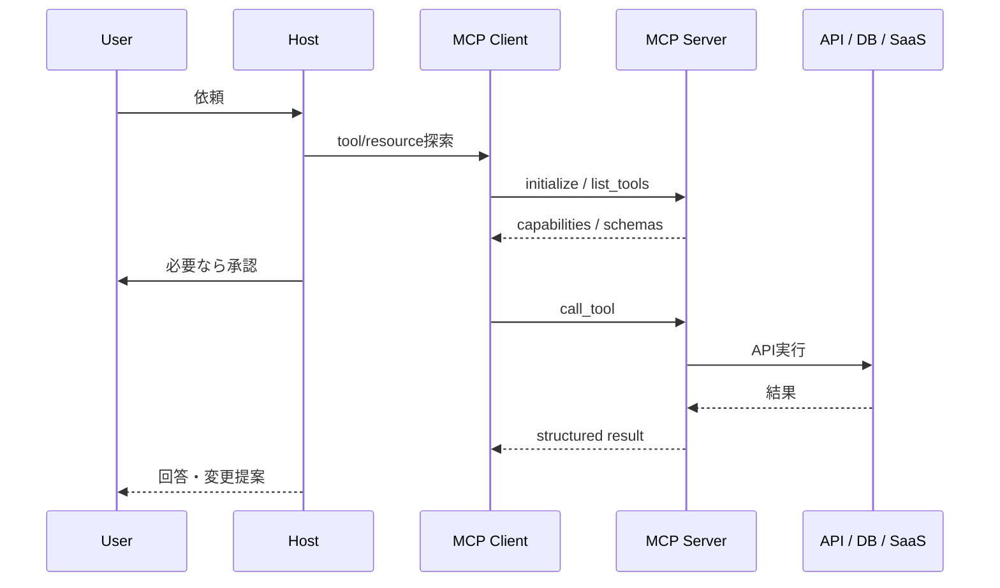
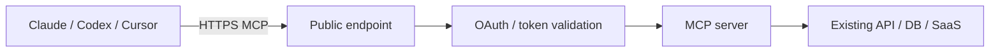

<!--
_class: lead
-->

# MCPを開発基盤として使う

既存APIのMCP化、Remote MCP、WebMCP、開発向けMCPを実装目線で整理する。

2026-06-07

---

<!--
_class: compact
-->

## 今日の結論

MCPは単なる「AIにツールを足す仕組み」ではない。AIエージェントと社内外システムをつなぐ標準インターフェース層。

開発チームにとって重要なのは3点。

- 既存APIをMCP serverとして安全に公開する
- Claude/Codex/CursorなどからRemote MCPとして使える形にする
- フロントエンド、ブラウザ、クラウド、コード理解をMCPで開発ループへ組み込む

---

<!--
_class: compact
-->

## MCPの基本

MCPはLLMアプリケーションと外部システムをつなぐオープンプロトコル。

- Host: Claude Desktop、Claude Code、Codex、Cursor、VS Codeなど
- Client: Host内で1つのMCP serverと接続するセッション
- Server: ツール、リソース、プロンプトを公開するローカルプロセスまたはRemoteサービス
- Transport: stdio、Streamable HTTPなど
- Protocol: JSON-RPC 2.0、capability negotiation、stateful session

---

<!--
_class: compact cards
-->

## MCPの3つのプリミティブ

- Resources
  - 読み取り可能なコンテキスト
  - ファイル、DB schema、issue、docs、API responseなど
- Tools
  - モデルが呼び出せる操作
  - search、create issue、query DB、browser操作、AWS API callなど
- Prompts
  - ユーザーが選ぶ再利用可能な作業テンプレート

発表では「Resourcesは文脈、Toolsは行動、Promptsはワークフロー」と説明すると伝わりやすい。

---

<!--
_class: dense
-->

## 実行フロー



---

<!--
_class: compact
-->

## 既存APIをMCP化する推奨設計

既存APIを直接書き換えるより、MCP adapter layerを追加する。

```text
app/
  api/
    main.py              # existing FastAPI app
    routers/
      inventory.py       # operation_id, tags, response_model
  domain/
    inventory_service.py # business logic
  mcp/
    server.py            # MCP adapter
    route_policy.py      # expose / exclude policy
    descriptions.py      # model-facing descriptions
```

OpenAPIを契約として使い、MCPでは公開面を絞る。

---

<!--
_class: dense
-->

## FastAPI + OpenAPI + FastMCP

```python
# app/mcp/server.py
import httpx
from fastmcp import FastMCP
from app.api.main import app as fastapi_app
from app.config import settings
from app.mcp.route_policy import route_map_fn

openapi_spec = fastapi_app.openapi()

api_client = httpx.AsyncClient(
    base_url="http://127.0.0.1:9000",
    timeout=30.0,
    headers={"Authorization": f"Bearer {settings.api_token}"},
)

mcp = FastMCP.from_openapi(
    openapi_spec=openapi_spec,
    client=api_client,
    name="Inventory MCP",
    route_map_fn=route_map_fn,
)
```

---

<!--
_class: dense
-->

## route policyで公開面を絞る

```python
from fastmcp.server.providers.openapi import MCPType
from fastmcp.utilities.openapi import HTTPRoute

BLOCKED_TAGS = {"internal", "admin", "debug"}
WRITE_METHODS = {"POST", "PUT", "PATCH", "DELETE"}

def route_map_fn(route: HTTPRoute, default_type: MCPType) -> MCPType | None:
    tags = set(route.tags or [])
    if tags.intersection(BLOCKED_TAGS):
        return MCPType.EXCLUDE
    if route.path.startswith(("/admin", "/debug", "/internal")):
        return MCPType.EXCLUDE
    if route.method in WRITE_METHODS:
        return MCPType.TOOL
    if route.method == "GET" and "catalog" in tags:
        return MCPType.RESOURCE_TEMPLATE
    return MCPType.TOOL
```

---

<!--
_class: dense
-->

## OpenAPI設計がMCP品質を決める

```python
@router.post(
    "/{item_id}/reserve",
    operation_id="reserve_inventory_item",
    summary="Reserve inventory for an item",
    description=(
        "Reserve stock for a known inventory item. "
        "This changes inventory state and should be called only after explicit user confirmation."
    ),
    response_model=ReserveResponse,
)
async def reserve_inventory_item(
    item_id: str,
    request: ReserveRequest,
) -> ReserveResponse:
    ...
```

`operation_id`、`summary`、`description`、`tags`、`response_model`、`Field(description=...)` をAI向けの契約として扱う。

---

<!--
_class: compact
-->

## descriptionの設計方針

descriptionは通常のAPI説明ではなく、モデルの意思決定補助。

入れるべき情報:

- 何をするToolか
- いつ使うべきか
- 入力形式、単位、制約
- read-onlyか、状態変更があるか
- user confirmationや権限が必要か
- 返すJSONの形
- 似たToolとどう使い分けるか
- 使ってはいけない場面

---

<!--
_class: dense
-->

## 良いdescription / 悪いdescription

良いread-only例:

```text
Read a single inventory item by exact SKU. Use when the user asks for current
stock, item name, or item status for a known SKU. No side effects. Returns
JSON with id, name, stock, and status.
```

良いwrite例:

```text
Reserve stock for an inventory item after explicit user confirmation. This
decreases available stock. Requires exact SKU and positive quantity. Returns
reserved quantity and remaining stock. Do not use for price quotes or order
creation.
```

悪い例:

```text
Inventory endpoint.
```

---

<!--
_class: dense
-->

## ClaudeでRemote MCPとして使う

Remote MCPは公開HTTPS endpointとしてMCP serverを提供する構成。

```bash
claude mcp add --transport http inventory https://mcp.example.com/mcp

claude mcp add --transport http inventory https://mcp.example.com/mcp \
  --header "Authorization: Bearer $MCP_TOKEN"

claude mcp list
claude mcp get inventory
```

OAuthがある場合はClaude Code内で認証する。

```text
/mcp
```

---

<!--
_class: compact
-->

## Remote MCPの運用ポイント



- Claude custom connectorsはAnthropic cloudから接続される
- private networkやVPN-only endpointはそのままでは使えない
- OAuth 2.1、audience validation、PKCE、scope設計が重要
- Cloud/remoteではrate limit、audit log、key rotationが必須
- write toolはapproval、least privilege、server-side enforcementが前提

---

<!--
_class: section
-->

# Frontend

WebMCP、Playwright MCP、Chrome DevTools MCP

---

<!--
_class: compact
-->

## WebMCP: フロントエンドをエージェント対応にする

ChromeのWebMCPはMCPの置き換えではない。ブラウザ内エージェントがWeb UIを理解し、より確実に操作するための提案中API。

Chrome docsの整理:

- MCP: backend / service layer向け
- WebMCP: frontend / tab-bound UI向け
- MCPは永続的、WebMCPはユーザーが開いているページに紐づく
- MCPはAPIやDB操作、WebMCPはDOMを理解したブラウザ統合操作

結論: コアロジックはMCP、ライブUI上の操作はWebMCPで補完する。

---

<!--
_class: dense
-->

## MCPとWebMCPの使い分け

| 観点 | MCP | WebMCP |
|---|---|---|
| 主戦場 | backend / API / SaaS | frontend / live web UI |
| 接続 | local / remote / cloud | browser tab |
| lifecycle | persistent server | ephemeral, tab-bound |
| 操作対象 | API、DB、workflow | DOM、UI、ページ状態 |
| 発見 | MCP client config / registry | page visit時 |
| 例 | 既存APIをMCP server化 | サイト機能をブラウザAIに宣言 |

Webアプリは「MCPだけ」ではなく「MCP + WebMCP」の二層で設計すると自然。

---

<!--
_class: compact split
-->

## フロントエンド開発で効くMCP

Playwright MCP:

- live browser sessionをAI coding assistantに渡す
- DOM、click、navigation、test generationに強い
- E2Eテスト作成、UI回帰調査、フォーム操作に向く

Chrome DevTools MCP:

- Chrome DevTools Protocol / Puppeteerベース
- performance trace、network、console、screenshot、Lighthouse、heap snapshotまで扱える
- WebMCP toolsの検出・実行もサポート

使い分け:

- UI操作とテスト生成: Playwright MCP
- パフォーマンス、console/network、Chrome固有debug: Chrome DevTools MCP

---

<!--
_class: dense
-->

## Playwright MCPの設定例

```json
{
  "mcpServers": {
    "playwright": {
      "command": "npx",
      "args": ["@playwright/mcp@latest"]
    }
  }
}
```

典型プロンプト:

```text
Open http://localhost:3000, inspect the signup form,
and generate a Playwright test that verifies validation errors.
```

注意:

- browser contextが大きくなりやすい
- CIやDockerではhost/port制限、allowed hosts、headless設定を明示する
- 生成されたテストは必ず実行して検証する

---

<!--
_class: dense
-->

## Chrome DevTools MCPの設定例

```json
{
  "mcpServers": {
    "chrome-devtools": {
      "command": "npx",
      "args": [
        "chrome-devtools-mcp@latest",
        "--headless=true",
        "--isolated=true"
      ]
    }
  }
}
```

よく使う用途:

- `list_console_messages`
- `list_network_requests`
- `take_screenshot`
- `performance_start_trace` / `performance_stop_trace`
- `lighthouse_audit`
- `evaluate_script`

既存Chromeへ接続する場合は `--autoConnect` または `--browserUrl=http://127.0.0.1:9222`。

---

<!--
_class: section
-->

# Cloud

AWS MCP Server / Agent Toolkit for AWS

---

<!--
_class: compact
-->

## AWS MCP Server / Agent Toolkit for AWS

AWS MCP Serverは2026-05-06にGA。Agent Toolkit for AWSの一部。

特徴:

- managed remote MCP server
- 300+ AWS services、15,000+ API actionsを小さなTool surfaceで扱う
- `call_aws`、`search_documentation`、`read_documentation`、`run_script`
- IAM context keysでagent経由の操作を制御
- CloudWatch metrics、CloudTrail audit logging
- sandboxed Python script execution
- Claude Code、Kiro、Cursor、CodexなどMCP互換agentで利用可能

---

<!--
_class: dense
-->

## AWS MCPの設定例

Claude Code:

```bash
claude mcp add-json aws-mcp --scope user \
  '{"command":"uvx","args":["mcp-proxy-for-aws@latest","https://aws-mcp.us-east-1.api.aws/mcp","--metadata","AWS_REGION=us-west-2"]}'
```

汎用MCP config:

```json
{
  "mcpServers": {
    "aws-mcp": {
      "command": "uvx",
      "timeout": 100000,
      "transport": "stdio",
      "args": [
        "mcp-proxy-for-aws@latest",
        "https://aws-mcp.us-east-1.api.aws/mcp",
        "--metadata", "AWS_REGION=us-west-2"
      ]
    }
  }
}
```

---

<!--
_class: compact
-->

## AWS MCPの管理方針

導入時に決めること:

- どのAWS account / roleをagentに許可するか
- read-onlyから始めるか、writeを許可するか
- `aws:CalledViaAWSMCP` などIAM context keyで制御するか
- CloudWatch `AWS-MCP` metricsを誰が監視するか
- CloudTrailでagent操作をどうレビューするか
- 既存AWS Labs MCPからAgent Toolkitへいつ移行するか

社内ルール:

> agentには人間と同じ権限を渡さない。agent経由の操作はIAMと監査ログで別扱いにする。

---

<!--
_class: section
-->

# Developer MCPs

開発で効果を発揮するMCPの選び方

---

<!--
_class: rank
-->

## 開発向けMCPランキング

GitHub APIで取得したstar数。2026-06-07時点。

| Rank | MCP / repo | stars | 開発で効く場面 |
|---:|---|---:|---|
| 1 | Firecrawl `mendableai/firecrawl` | 129,668 | web調査、scrape、crawl |
| 2 | Reference servers `modelcontextprotocol/servers` | 86,854 | filesystem/git/memory/fetchの標準例 |
| 3 | Context7 `upstash/context7` | 56,903 | 最新ライブラリdocs |
| 4 | Chrome DevTools MCP | 43,029 | frontend debug/perf/network |
| 5 | Playwright MCP | 33,574 | browser操作、E2E生成 |
| 6 | GitHub MCP Server | 30,495 | issue/PR/code search |
| 7 | Serena | 25,034 | semantic code retrieval/editing |
| 8 | AWS Labs MCP | 9,224 | AWS service別MCP群 |

注: FirecrawlはMCP server単体ではなくプロダクトrepo。MCP専用repoのstarとは分けて読む。

---

<!--
_class: compact cards
-->

## 開発で効果を発揮するMCP選定

まず入れる候補:

- GitHub MCP: PR、issue、code search、CI調査
- Context7: ライブラリ仕様の最新確認
- Playwright MCP: UI操作、E2E生成
- Chrome DevTools MCP: console/network/perf/Lighthouse
- Serena: repository-level semantic retrieval / editing
- Firecrawl MCP: web調査、公式docs取得
- AWS MCP / Agent Toolkit: AWS docs/API/CloudWatch/CloudTrail
- Figma MCP: design-to-code、design context
- Sentry MCP: runtime error / issue調査

---

<!--
_class: compact
-->

## Serena MCP

Serenaはcoding agent向けのsemantic retrieval / editing toolkit。

開発での価値:

- repository全体を全文読みせず、symbol単位で理解する
- 関数、class、参照関係をたどる
- 大きなコードベースでcontext使用量を抑える
- 変更範囲を狭く保ちやすい

向く場面:

- 複数ファイルにまたがる修正
- 既存設計を壊したくない修正
- 「どこを直すべきか」から始まる調査

---

<!--
_class: compact
-->

## MCP導入時の重要ルール

- 公式serverまたはvendor-maintained serverを優先
- npm/pip packageはsupply chain riskとして扱う
- tool surfaceは最小にする
- write toolは明示的承認とaudit logを必須にする
- API tokenはquery stringに入れない
- remote MCPはOAuth 2.1、audience validation、PKCEを確認
- tool resultはbounded JSONにする
- prompt injectionを前提にする
- local stdioではstdoutにログを書かない

---

<!--
_class: compact
-->

## 最小導入ロードマップ

1. 開発者個人
   - GitHub、Context7、Playwright、Chrome DevTools、Serenaを導入
2. チーム
   - 推奨MCP config、allowed tools、secret管理、audit ruleを標準化
3. 既存API
   - OpenAPI品質を整備し、FastMCP adapterでread-only公開
4. 社内Remote MCP
   - OAuth、rate limit、audit log、least privilegeを実装
5. Webアプリ
   - MCPでbackend、WebMCPでfrontend capabilityを補完
6. AWS
   - Agent Toolkit for AWSをread-onlyから導入し、IAM context keyで制御

---

<!--
_class: lead
-->

## まとめ

MCPの価値は、AIが外部システムを「安全に、構造化された形で、再利用可能に」扱えること。

社内で進めるなら:

- 既存APIはOpenAPIを整えてMCP adapterで公開する
- Tool descriptionはモデル向けの設計対象にする
- Claude/CodexなどからRemote MCPとして使える運用設計にする
- frontendはWebMCP、Playwright MCP、Chrome DevTools MCPで開発ループに入れる
- AWSはAgent Toolkit / AWS MCPで権限と監査を分離する
- MCPは便利な反面、権限・認証・supply chainの管理が本体

---

<!--
_class: dense
-->

## 主な参照元

- MCP official docs/spec: https://modelcontextprotocol.io/
- Chrome WebMCP: https://developer.chrome.com/docs/ai/webmcp/compare-mcp?hl=ja
- FastMCP OpenAPI: https://gofastmcp.com/v2/integrations/openapi
- Claude Code MCP: https://code.claude.com/docs/en/mcp
- AWS MCP GA: https://aws.amazon.com/blogs/aws/the-aws-mcp-server-is-now-generally-available/
- Agent Toolkit for AWS: https://aws.amazon.com/products/developer-tools/agent-toolkit-for-aws/
- Playwright MCP: https://github.com/microsoft/playwright-mcp
- Chrome DevTools MCP: https://github.com/ChromeDevTools/chrome-devtools-mcp
- GitHub API star counts: fetched 2026-06-07
